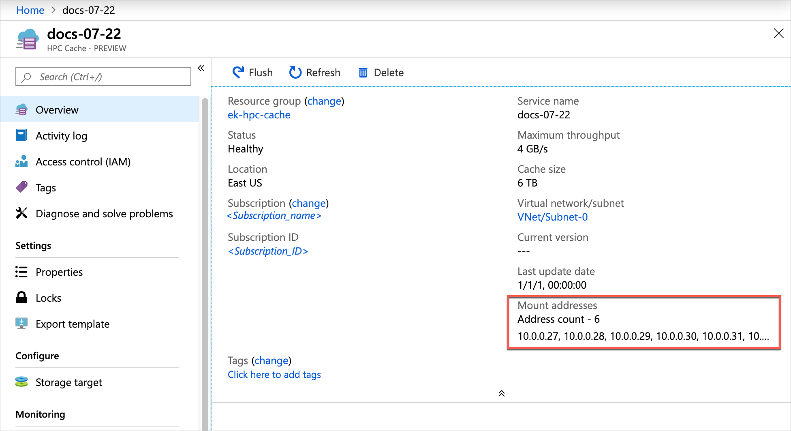
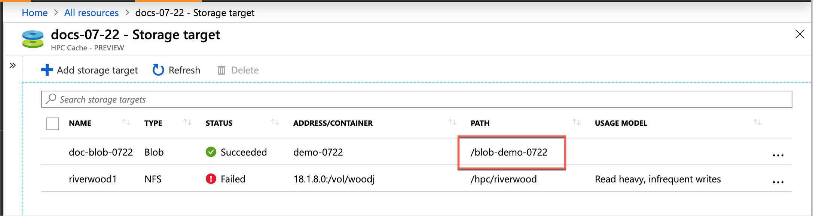

# Access the Azure HPC Cache system

After the cache is created, NFS clients can access it with a simple mount command. 

Use the mount addresses listed on the cache overview page and the virtual namespace path that you set when you created the storage target. 



> [!NOTE] 
> The cache mount addresses correspond to network interfaces inside the cache's subnet. These NICs appear in the resource group with names ending in `-cluster-nic-` and a number. Do not alter or delete these interfaces, or the cache will become unavailable. 

The storage targets paths are shown in the Storage Targets page. 


Use a mount command like the following:

> sudo mount *cache_mount_address*:/*storage_target_path* *local_path*

Example: 

```
root@test-client:/tmp# mkdir hpccache
root@test-client:/tmp# sudo mount 10.0.0.28:/blob-demo-0722 ./hpccache/
root@test-client:/tmp# 
```

After this command succeeds, the contents of the storage export should be visible in the ``hpccache`` directory on the client. 

> [!NOTE] 
> Your clients must be able to access the secure virtual network and subnet that houses your cache. For example, create client VMs within the same virtual network, or use a jump host in the virtual network for access from outside. (Remember that nothing else can be hosted inside the cache's subnet.)

## Next steps

* If you need to move data to the cache's storage targets, read [Populate new Azure Blob storage](hpc-cache-ingest.md). 
