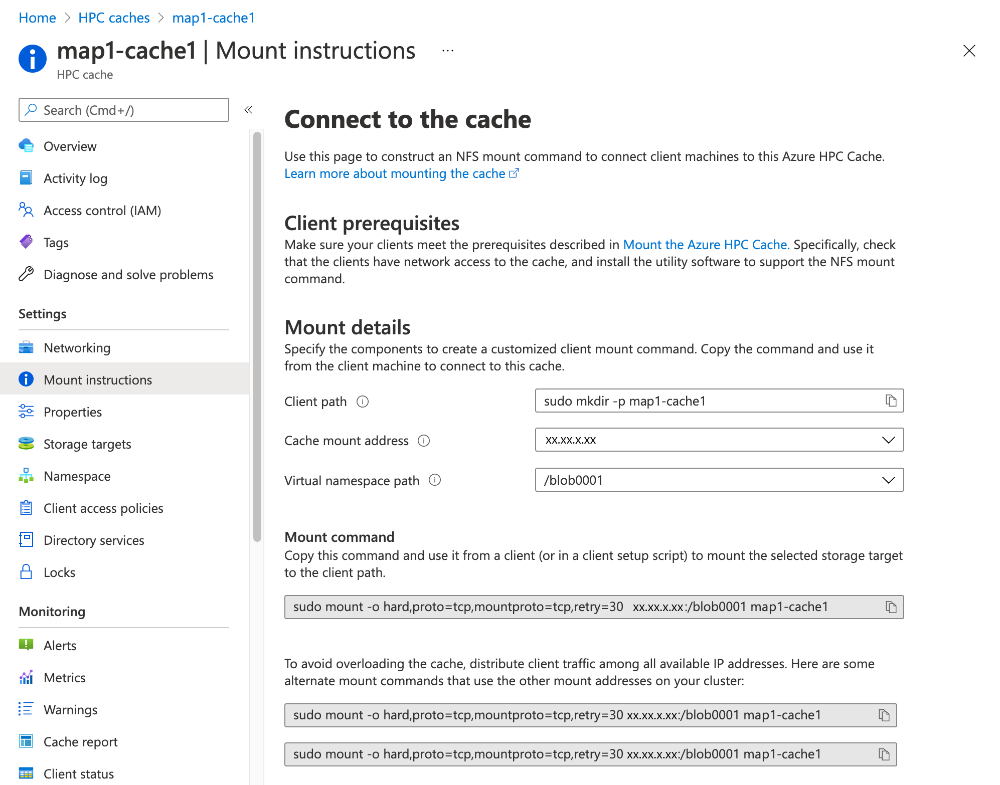
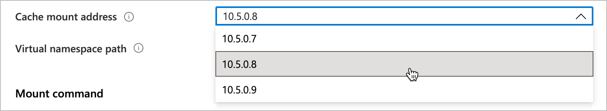
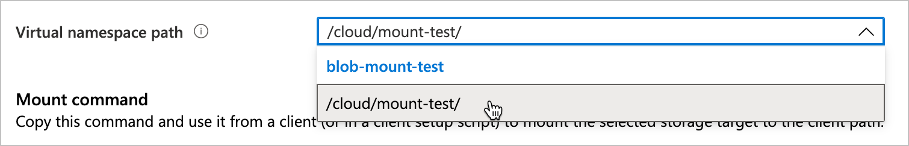
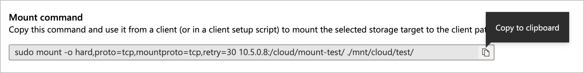
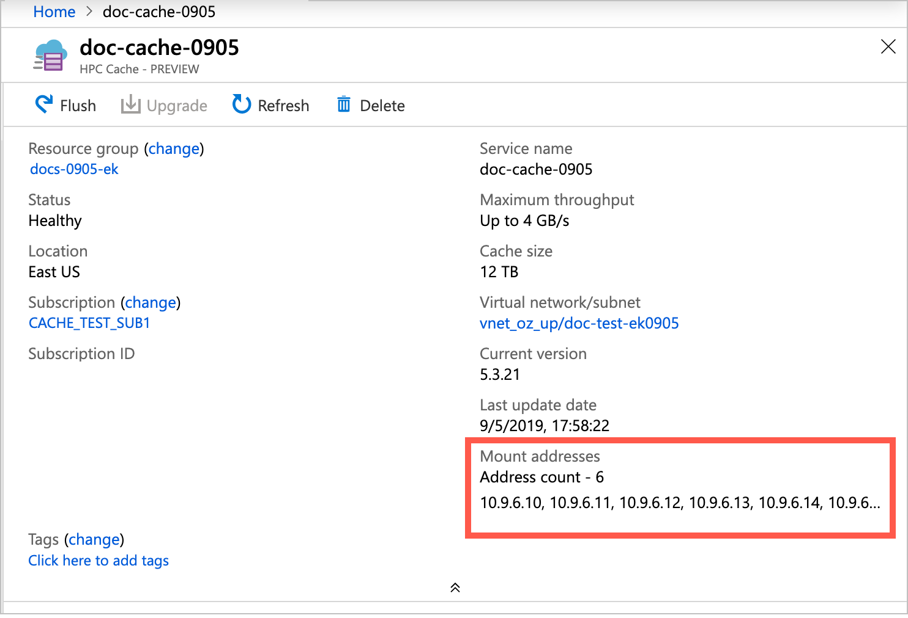
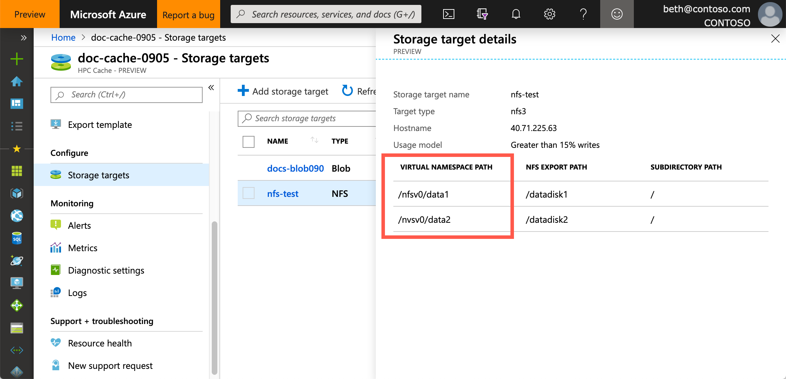

# Mount the Azure HPC Cache

After the cache is created, NFS clients can access it with a simple `mount` command. The command connects a specific storage target path on the Azure HPC Cache to a local directory on the client machine.

The mount command is made up of these elements:

* One of the cache's mount addresses (listed on the cache overview page)
* The virtual namespace path that you set when you created the storage target
* The local path to use on the client
* Command parameters that optimize the success of this kind of NFS mount

The **Mount instructions** page for your cache collects the information and the recommended options for you, and creates a prototype mount command that you can copy. Read [Use the mount instructions utility](#use-the-mount-instructions-utility) for details.

## Prepare clients

Make sure your clients are able to mount the Azure HPC Cache by following the guidelines in this section.

### Provide network access

The client machines must have network access to the cache's virtual network and private subnet.

For example, create client VMs within the same virtual network, or use an endpoint, gateway, or other solution in the virtual network for access from outside. (Remember that nothing other than the cache itself should be hosted inside the cache's subnet.)

### Install utilities

Install the appropriate Linux utility software to support the NFS mount command:

* For Red Hat Enterprise Linux or SuSE: `sudo yum install -y nfs-utils`
* For Ubuntu or Debian: `sudo apt-get install nfs-common`

### Create a local path

Create a local directory path on each client to connect to the cache. Create a path for each namespace path that you want to mount.

Example: `sudo mkdir -p /mnt/hpc-cache-1/target3`

The [Mount instructions](#use-the-mount-instructions-utility) page in the Azure portal includes a prototype command that you can copy.

When you connect the client machine to the cache, you will associate this path with a virtual namespace path that represents a storage target export. Create directories for each of the virtual namespace paths the client will use.

## Use the mount instructions utility

You can use the **Mount instructions** page in the Azure portal to create a copyable mount command. Open the page from the **Configure** section of the cache view in the portal.

Before using the command on a client, make sure the client meets the prerequisites and has the software needed to use the NFS `mount` command as described above in [Prepare clients](#prepare-clients).



Follow this procedure to create the mount command.

1. Customize the **Client path** field. This field gives an example command that you can use to create a local path on the client. The client accesses the content from the Azure HPC Cache locally in this directory.

   Click the field and edit the command to contain the directory name you want. The name appears at the end of the string after `sudo mkdir -p`

   

   After you finish editing the field, the mount command at the bottom of the page updates with the new client path.

1. Choose the **Cache mount address** from the list. This menu lists all of the cache's [client mount points](#find-mount-command-components).

   Balance client load across all of the available mount addresses for better cache performance.

   

1. Choose the **Virtual namespace path** to use for the client. These paths link to exports on the back-end storage system.

   

   You can view and change virtual namespace paths on the Storage targets portal page. Read [Add storage targets](hpc-cache-add-storage.md) to see how.

   To learn more about Azure HPC Cache's aggregated namespace feature, read [Plan the aggregated namespace](hpc-cache-namespace.md).

1. The **Mount command** field in step three automatically populates with a customized mount command that uses the mount address, virtual namespace path, and client path that you set in the previous fields.

   Click the copy symbol at the right side of the field to automatically copy it to your clipboard.

   

1. Use the copied mount command on the client machine to connect it to the Azure HPC Cache. You can issue the command directly from the client command line, or include the mount command in a client setup script or template.

## Understand mount command syntax

The mount command has the following form:

> sudo mount {*options*} *cache_mount_address*:/*namespace_path* *local_path*

Example:

```bash
root@test-client:/tmp# mkdir hpccache
root@test-client:/tmp# sudo mount -o hard,proto=tcp,mountproto=tcp,retry=30 10.0.0.28:/blob-demo-0722 hpccache
root@test-client:/tmp#
```

After this command succeeds, the contents of the storage export will be visible in the ``hpccache`` directory on the client.

### Mount command options

For a robust client mount, pass these settings and arguments in your mount command:

> mount -o hard,proto=tcp,mountproto=tcp,retry=30 ${CACHE_IP_ADDRESS}:/${NAMESPACE_PATH} ${LOCAL_FILESYSTEM_MOUNT_POINT}

| Recommended mount command settings | |
--- | ---
``hard`` | Soft mounts to Azure HPC Cache are associated with application failures and possible data loss.
``proto=tcp`` | This option supports appropriate handling of NFS network errors.
``mountproto=tcp`` | This option supports appropriate handling of network errors for mount operations.
``retry=<value>`` | Set ``retry=30`` to avoid transient mount failures. (A different value is recommended in foreground mounts.)

### Find mount command components

If you want to create a mount command without using the **Mount instructions** page, you can find the mount addresses on the cache **Overview** page and the virtual namespace paths on the **Storage target** page.



> [!NOTE]
> The cache mount addresses correspond to network interfaces inside the cache's subnet. In a resource group, these NICs are listed with names ending in `-cluster-nic-` and a number. Do not alter or delete these interfaces, or the cache will become unavailable.

The virtual namespace paths are shown on each storage target's details page. Click an individual storage target name to see its details, including aggregated namespace paths associated with it.



## Next steps

* To move data to the cache's storage targets, read [Populate new Azure Blob storage](hpc-cache-ingest.md).
