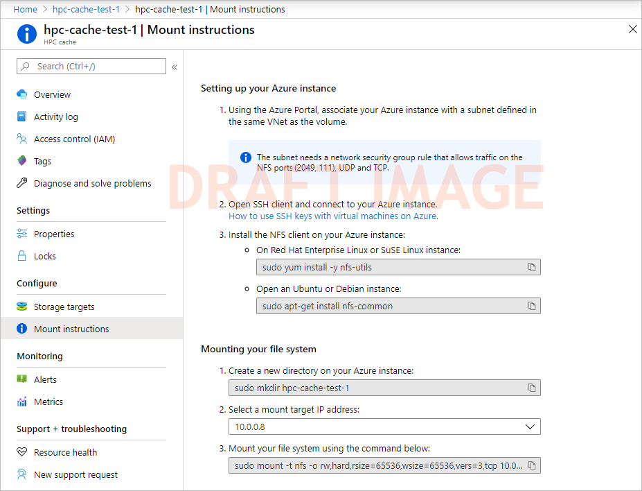

# Mount the Azure HPC Cache

After the cache is created, NFS clients can access it with a simple mount command.

The mount command is made up of two elements:

* One of the cache's mount addresses (listed on the cache overview page)
* The virtual namespace path that you set when you created the storage target

The **Mount instructions** page for your cache collects the information and the recommended options for you. Read [Use the mount instructions](#use-the-mount-instructions-utility), below, for details.

## Prepare clients

Make sure your clients are able to mount the Azure HPC Cache.

### Provide network access

The client machines must have SSL access to the cache's virtual network and private subnet. 

For example, create client VMs within the same virtual network, or use an endpoint, gateway, or other solution in the virtual network for access from outside. Remember that nothing else can be hosted inside the cache's subnet.

### Install utilities

Install the appropriate Linux utility software to support the mount command:

* For Red Hat Enterprise Linux or SuSE: `sudo yum install -y nfs-utils`
* For Ubuntu or Debian: `sudo apt-get install nfs-common`

### Create a local path

Create a local directory path on each client to connect to the cache. Create a path for each storage target that you want to mount.

Example: `sudo mkdir hpc-cache-1\target3`

## Use the mount instructions utility

Open the **Mount instructions** page from the **Configure** section of the cache view in the Azure Portal.



## Understand mount command syntax

The mount command has the following form:

> sudo mount *cache_mount_address*:/*namespace_path* *local_path* {*options*}

Example:

```
root@test-client:/tmp# mkdir hpccache
root@test-client:/tmp# sudo mount 10.0.0.28:/blob-demo-0722 ./hpccache/ -orw,tcp,mountproto=tcp,vers3,hard
root@test-client:/tmp#
```

After this command succeeds, the contents of the storage export will be visible in the ``hpccache`` directory on the client.

### Mount command options

For a robust client mount, pass these settings and arguments in your mount command:

``mount -o hard,proto=tcp,mountproto=tcp,retry=30 ${CACHE_IP_ADDRESS}:/${NAMESPACE_PATH} ${LOCAL_FILESYSTEM_MOUNT_POINT}``

| Recommended mount command settings | |
--- | ---
``hard`` | Soft mounts to Azure HPC Cache are associated with application failures and possible data loss.
``proto=netid`` | This option supports appropriate handling of NFS network errors.
``mountproto=netid`` | This option supports appropriate handling of network errors for mount operations.
``retry=n`` | Set ``retry=30`` to avoid transient mount failures. (A different value is recommended in foreground mounts.)

### Find mount command components

If you want to create a mount command without using the **Mount instructions** page, you can find the mount addresses on the cache Overview page and the virtual namespace paths on the **Storage targets** page.


> [!NOTE]
> The cache mount addresses correspond to network interfaces inside the cache's subnet. In a resource group, these NICs are listed with names ending in `-cluster-nic-` and a number. Do not alter or delete these interfaces, or the cache will become unavailable.

The virtual namespace paths are shown in the **Storage targets** page. Click an individual storage target name to see its details, including aggregated namespace paths associated with it.


## Next steps

* To move data to the cache's storage targets, read [Populate new Azure Blob storage](hpc-cache-ingest.md).
