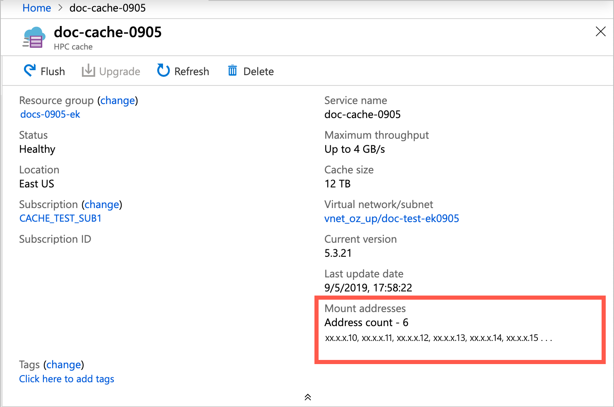

# Mount the Azure HPC Cache

After the cache is created, NFS clients can access it with a simple mount command.

Use the mount addresses listed on the cache overview page and the virtual namespace path that you set when you created the storage target. 



> [!NOTE] 
> The cache mount addresses correspond to network interfaces inside the cache's subnet. These NICs appear in the resource group with names ending in `-cluster-nic-` and a number. Do not alter or delete these interfaces, or the cache will become unavailable.

The virtual namespace paths are shown in the **Storage targets** page. Click the target name to see details, including the aggregated namespace path (or paths) associated with it. 


## Mount command syntax

Use a mount command like the following:

> sudo mount *cache_mount_address*:/*namespace_path* *local_path* {*options*}

Example: 

```
root@test-client:/tmp# mkdir hpccache
root@test-client:/tmp# sudo mount 10.0.0.28:/blob-demo-0722 ./hpccache/ -orw,tcp,mountproto=tcp,vers3,hard,intr
root@test-client:/tmp# 
```

After this command succeeds, the contents of the storage export should be visible in the ``hpccache`` directory on the client. 

> [!NOTE] 
> Your clients must be able to access the virtual network and subnet that houses your cache. For example, create client VMs within the same virtual network, or use an endpoint, gateway, or other solution in the virtual network for access from outside. Remember that nothing else can be hosted inside the cache's subnet.

### Mount command options

For a robust client mount, pass these settings and arguments in your mount command: 

``mount -o hard,nointr,proto=tcp,mountproto=tcp,retry=30 ${CACHE_IP_ADDRESS}:/${NAMESPACE_PATH} ${LOCAL_FILESYSTEM_MOUNT_POINT}``

| Recommended mount command settings | |
--- | --- 
``hard`` | Soft mounts to the vFXT cluster are associated with application failures and possible data loss. 
``proto=netid`` | This option supports appropriate handling of NFS network errors.
``mountproto=netid`` | This option supports appropriate handling of network errors for mount operations.
``retry=n`` | Set ``retry=30`` to avoid transient mount failures. (A different value is recommended in foreground mounts.)

## Next steps

* To move data to the cache's storage targets, read [Populate new Azure Blob storage](hpc-cache-ingest.md).
