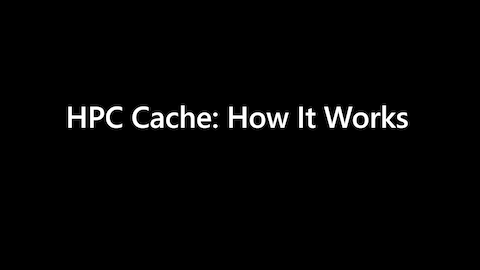
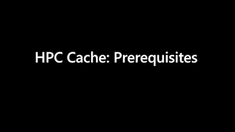

# Prerequisites for Azure HPC Cache

Before creating a new Azure HPC Cache, make sure your environment meets these requirements.

<!-- ## Video overviews

Watch these videos for a quick overview of the system's components and what they need to work together.

(Click the video image or the link to watch.)

* [How it works](https://azure.microsoft.com/resources/videos/how-hpc-cache-works/) - Explains how Azure HPC Cache interacts with storage and clients

  [](https://azure.microsoft.com/resources/videos/how-hpc-cache-works/)  

* [Prerequisites](https://azure.microsoft.com/resources/videos/hpc-cache-prerequisites/) - Describes requirements for NAS storage, Azure Blob storage, network access, and client access

  [](https://azure.microsoft.com/resources/videos/hpc-cache-prerequisites/)

Read the rest of this article for specific recommendations. -->

## Azure subscription

A paid subscription is recommended.

## Network infrastructure

These network-related prerequisites need to be set up before you can use your cache:

* A dedicated subnet for the Azure HPC Cache instance
* DNS support so that the cache can access storage and other resources
* Access from the subnet to additional Microsoft Azure infrastructure services, including NTP servers and the Azure Queue Storage service.

### Cache subnet

The Azure HPC Cache needs a dedicated subnet with these qualities:

* The subnet must have at least 64 IP addresses available.
* Communication inside the subnet must be unrestricted. If you use a network security group for the cache subnet, make sure that it permits all services between internal IP addresses.
* The subnet can't host any other VMs, even for related services like client machines.
* If you use multiple Azure HPC Cache instances, each one needs its own subnet.

The best practice is to create a new subnet for each cache. You can create a new virtual network and subnet as part of creating the cache.

When creating this subnet, be careful that its security settings allow access to the necessary infrastructure services mentioned later in this section. You can restrict outbound internet connectivity, but make sure that there are exceptions for the items documented here.

### DNS access

The cache needs DNS to access resources outside of its virtual network. Depending on which resources you're using, you might need to set up a customized DNS server and configure forwarding between that server and Azure DNS servers:

* To access Azure Blob storage endpoints and other internal resources, you need the Azure-based DNS server.
* To access on-premises storage, you need to configure a custom DNS server that can resolve your storage hostnames. You must do this before you create the cache.

If you only use Blob storage, you can use the default Azure-provided DNS server for your cache. However, if you need access to storage or other resources outside of Azure, you should create a custom DNS server and configure it to forward any Azure-specific resolution requests to the Azure DNS server.

To use a custom DNS server, you need to do these setup steps before you create your cache:

* Create the virtual network that will host the Azure HPC Cache.
* Create the DNS server.
* Add the DNS server to the cache's virtual network.

  Follow these steps to add the DNS server to the virtual network in the Azure portal:

  1. Open the virtual network in the Azure portal.
  1. Choose DNS servers from the Settings menu in the sidebar.
  1. Select Custom
  1. Enter the DNS server's IP address in the field.

A simple DNS server also can be used to load balance client connections among all the available cache mount points.

Learn more about Azure virtual networks and DNS server configurations in [Name resolution for resources in Azure virtual networks](../virtual-network/virtual-networks-name-resolution-for-vms-and-role-instances.md).

### NTP access

The HPC Cache needs access to an NTP server for regular operation. If you restrict outbound traffic from your virtual networks, make sure to allow traffic to at least one NTP server. The default server is time.windows.com, and the cache contacts this server on UDP port 123.

Create a rule in your cache network's [network security group](../virtual-network/network-security-groups-overview.md) that allows outbound traffic to your NTP server. The rule can simply allow all outbound traffic on UDP port 123, or have more restrictions.

This example explicitly opens outbound traffic to the IP address 168.61.215.74, which is the address used by time.windows.com.

| Priority | Name | Port | Protocol | Source | Destination   | Action |
|----------|------|------|----------|--------|---------------|--------|
| 200      | NTP  | Any  | UDP      | Any    | 168.61.215.74 | Allow  |

Make sure that the NTP rule has a higher priority than any rules that broadly deny outbound access.

More tips for NTP access:

* If you have firewalls between your HPC Cache and the NTP server, make sure these firewalls also allow NTP access.

* You can configure which NTP server your HPC Cache uses on the **Networking** page. Read [Configure additional settings](configuration.md#customize-ntp) for more information.

### Azure Queue Storage access

The cache must be able to securely access the [Azure Queue Storage service](../storage/queues/storage-queues-introduction.md) from inside its dedicated subnet. Azure HPC Cache uses the queues service when communicating configuration and state information.

If the cache can't access the queue service, you might see a CacheConnectivityError message when creating the cache.

There are two ways to provide access:

* Create an Azure Storage service endpoint in your cache subnet.
  Read [Add a virtual network subnet](../virtual-network/virtual-network-manage-subnet.md#add-a-subnet) for instructions to add the **Microsoft.Storage** service endpoint.

* Individually configure access to the Azure storage queue service domain in your network security group or other firewalls.

  Add rules to permit access on these ports:

  * TCP port 443 for secure traffic to any host in the domain queue.core.windows.net (`*.queue.core.windows.net`).

  * TCP port 80 - used for verification of the server-side certificate. This is sometimes referred to as certificate revocation list (CRL) checking and online certificate status protocol (OCSP) communications. All of *.queue.core.windows.net uses the same certificate, and thus the same CRL/OCSP servers. The hostname is stored in the server-side SSL certificate.

  Refer to the security rule tips in [NTP access](#ntp-access) for more information.

  This command lists the CRL and OSCP servers that need to be permitted access. These servers must be resolvable by DNS and reachable on port 80 from the cache subnet.

  ```bash

  openssl s_client -connect azure.queue.core.windows.net:443 2>&1 < /dev/null | sed -n '/-----BEGIN/,/-----END/p' | openssl x509 -noout -text -in /dev/stdin |egrep -i crl\|ocsp|grep URI

  ```

  The output looks something like this, and can change if the SSL certificate updates:

  ```bash
  OCSP - URI:http://ocsp.msocsp.com
  CRL - URI:http://mscrl.microsoft.com/pki/mscorp/crl/Microsoft%20RSA%20TLS%20CA%2002.crl
  CRL - URI:http://crl.microsoft.com/pki/mscorp/crl/Microsoft%20RSA%20TLS%20CA%2002.crl
  ```

You can check the subnet's connectivity by using this command from a test VM inside the subnet:

```bash
openssl s_client -connect azure.queue.core.windows.net:443 -status 2>&1 < /dev/null |grep "OCSP Response Status"
```

A successful connection gives this response:

```bash
OCSP Response Status: successful (0x0)
```

### Event server access

Azure HPC Cache uses Azure event server endpoints to monitor cache health and send diagnostic information.

Make sure that the cache can securely access hosts in the domain events.data.microsoft.com - that is, open TCP port 443 for traffic to `*.events.data.microsoft.com`.

## Permissions

Check these permission-related prerequisites before starting to create your cache.

* The cache instance needs to be able to create virtual network interfaces (NICs). The user who creates the cache must have sufficient privileges in the subscription to create NICs.

* If using Blob storage, Azure HPC Cache needs authorization to access your storage account. Use Azure role-based access control (Azure RBAC) to give the cache access to your Blob storage. Two roles are required: Storage Account Contributor and Storage Blob Data Contributor.

  Follow the instructions in [Add storage targets](hpc-cache-add-storage.md#add-the-access-control-roles-to-your-account) to add the roles.

## Storage infrastructure
<!-- heading is linked in create storage target GUI as aka.ms/hpc-cache-prereq#storage-infrastructure - fix that if you change the wording of this heading -->

The cache supports Azure Blob containers, NFS hardware storage exports, and NFS-mounted ADLS blob containers. Add storage targets after you create the cache.

Each storage type has specific prerequisites.

### Blob storage requirements

If you want to use Azure Blob storage with your cache, you need a compatible storage account and either an empty Blob container or a container that is populated with Azure HPC Cache formatted data as described in [Move data to Azure Blob storage](hpc-cache-ingest.md).

> [!NOTE]
> Different requirements apply to NFS-mounted blob storage. Read [ADLS-NFS storage requirements](#nfs-mounted-blob-adls-nfs-storage-requirements) for details.

Create the account before attempting to add a storage target. You can create a new container when you add the target.

To create a compatible storage account, use one of these combinations:

| Performance | Type | Replication | Access tier |
|--|--|--|--|
| Standard | StorageV2 (general purpose v2)| Locally redundant storage (LRS) or Zone-redundant storage (ZRS) | Hot |
| Premium | Block blobs | Locally redundant storage (LRS) | Hot |

The storage account must be accessible from your cache's private subnet. If your account uses a private endpoint or a public endpoint that is restricted to specific virtual networks, make sure to enable access from the cache's subnet. (An open public endpoint is **not** recommended.)

Read [Work with private endpoints](#work-with-private-endpoints) for tips about using private endpoints with HPC Cache storage targets.

It's a good practice to use a storage account in the same Azure region as your cache.

You also must give the cache application access to your Azure storage account as mentioned in [Permissions](#permissions), above. Follow the procedure in [Add storage targets](hpc-cache-add-storage.md#add-the-access-control-roles-to-your-account) to give the cache the required access roles. If you're not the storage account owner, have the owner do this step.

### NFS storage requirements
<!-- linked from configuration.md and add storage -->

If using an NFS storage system (for example, an on-premises hardware NAS system), make sure it meets these requirements. You might need to work with the network administrators or firewall managers for your storage system (or data center) to verify these settings.

> [!NOTE]
> Storage target creation will fail if the cache has insufficient access to the NFS storage system.

More information is included in [Troubleshoot NAS configuration and NFS storage target issues](troubleshoot-nas.md).

* Network connectivity: The Azure HPC Cache needs high-bandwidth network access between the cache subnet and the NFS system's data center. [ExpressRoute](../expressroute/index.yml) or similar access is recommended. If using a VPN, you might need to configure it to clamp TCP MSS at 1350 to make sure large packets are not blocked. Read [VPN packet size restrictions](troubleshoot-nas.md#adjust-vpn-packet-size-restrictions) for more help troubleshooting VPN settings.

* Port access: The cache needs access to specific TCP/UDP ports on your storage system. Different types of storage have different port requirements.

  To check your storage system's settings, follow this procedure.

  * Issue an `rpcinfo` command to your storage system to check the needed ports. The command below lists the ports and formats the relevant results in a table. (Use your system's IP address in place of the *<storage_IP>* term.)

    You can issue this command from any Linux client that has NFS infrastructure installed. If you use a client inside the cluster subnet, it also can help verify connectivity between the subnet and the storage system.

    ```bash
    rpcinfo -p <storage_IP> |egrep "100000\s+4\s+tcp|100005\s+3\s+tcp|100003\s+3\s+tcp|100024\s+1\s+tcp|100021\s+4\s+tcp"| awk '{print $4 "/" $3 " " $5}'|column -t
    ```

  Make sure that all of the ports returned by the ``rpcinfo`` query allow unrestricted traffic from the Azure HPC Cache's subnet.

  * If you can't use the `rpcinfo` command, make sure that these commonly used ports allow inbound and outbound traffic:

    | Protocol | Port  | Service  |
    |----------|-------|----------|
    | TCP/UDP  | 111   | rpcbind  |
    | TCP/UDP  | 2049  | NFS      |
    | TCP/UDP  | 4045  | nlockmgr |
    | TCP/UDP  | 4046  | mountd   |
    | TCP/UDP  | 4047  | status   |

    Some systems use different port numbers for these services - consult your storage system's documentation to be sure.

  * Check firewall settings to be sure that they allow traffic on all of these required ports. Be sure to check firewalls used in Azure as well as on-premises firewalls in your data center.

* NFS back-end storage must be a compatible hardware/software platform. The storage must support NFS Version 3 (NFSv3). Contact the Azure HPC Cache team for details.

### NFS-mounted blob (ADLS-NFS) storage requirements

Azure HPC Cache also can use a blob container mounted with the NFS protocol as a storage target.

Read more about this feature in [NFS 3.0 protocol support in Azure Blob storage](../storage/blobs/network-file-system-protocol-support.md).

The storage account requirements are different for an ADLS-NFS blob storage target and for a standard blob storage target. Follow the instructions in [Mount Blob storage by using the Network File System (NFS) 3.0 protocol](../storage/blobs/network-file-system-protocol-support-how-to.md) carefully to create and configure the NFS-enabled storage account.

This is a general overview of the steps. These steps might change, so always refer to the [ADLS-NFS instructions](../storage/blobs/network-file-system-protocol-support-how-to.md) for current details.

1. Make sure that the features you need are available in the regions where you plan to work.

1. Enable the NFS protocol feature for your subscription. Do this *before* you create the storage account.

1. Create a secure virtual network (VNet) for the storage account. You should use the same virtual network for your NFS-enabled storage account and for your Azure HPC Cache. (Do not use the same subnet as the cache.)

1. Create the storage account.

   * Instead of the using the storage account settings for a standard blob storage account, follow the instructions in the [how-to document](../storage/blobs/network-file-system-protocol-support-how-to.md). The type of storage account supported might vary by Azure region.

   * In the Networking section, choose a private endpoint in the secure virtual network you created (recommended), or choose a public endpoint with restricted access from the secure VNet.
  
     Read [Work with private endpoints](#work-with-private-endpoints) for tips about using private endpoints with HPC Cache storage targets.

   * Don't forget to complete the Advanced section, where you enable NFS access.

   * Give the cache application access to your Azure storage account as mentioned in [Permissions](#permissions), above. You can do this the first time you create a storage target. Follow the procedure in [Add storage targets](hpc-cache-add-storage.md#add-the-access-control-roles-to-your-account) to give the cache the required access roles.

     If you aren't the storage account owner, have the owner do this step.

Learn more about using ADLS-NFS storage targets with Azure HPC Cache in [Use NFS-mounted blob storage with Azure HPC Cache](nfs-blob-considerations.md).

### Work with private endpoints
<!-- linked from other articles, update links if you change this header  -->

Azure Storage supports private endpoints to allow secure data access. You can use private endpoints with Azure Blob or NFS-mounted blob storage targets.

[Learn more about private endpoints](../storage/common/storage-private-endpoints.md)

A private endpoint provides a specific IP address that the HPC Cache uses to communicate with your back-end storage system. If that IP address changes, the cache can't automatically re-establish a connection with the storage.

If you need to change a private endpoint's configuration, follow this procedure to avoid communication problems between the storage and the HPC Cache:

  1. Suspend the storage target (or all of the storage targets that use this private endpoint).
  1. Make changes to the private endpoint, and save those changes.
  1. Put the storage target back into service with the "resume" command.
  1. Refresh the storage target's DNS setting.

  Read [View and manage storage targets](manage-storage-targets.md) to learn how to suspend, resume, and refresh DNS for storage targets.

## Set up Azure CLI access (optional)

If you want to create or manage Azure HPC Cache from the Azure CLI, you need to install Azure CLI and the hpc-cache extension. Follow the instructions in [Set up Azure CLI for Azure HPC Cache](az-cli-prerequisites.md).

## Next steps

* [Create an Azure HPC Cache instance](hpc-cache-create.md) from the Azure portal
