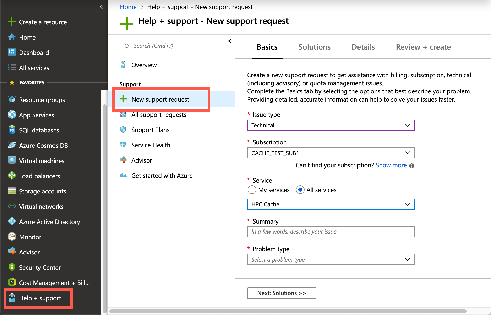

# Contact support for help with Azure HPC Cache

The best way to get help with Azure HPC Cache is to use the Azure portal to open a support ticket.

Navigate to your cache instance, then click the **New support request** link that appears at the bottom of the sidebar.

To open a ticket when you do not have an active cache, use the main Help + support page from the Azure portal. Open the portal menu from the control at the top left of the screen, then scroll to the bottom and click **Help + support**.

Support requests are also used to make quota requests. Follow the instructions in [Request an HPC Cache quota increase](increase-quota.md).

After you choose either **New support request** from your cache or **Create a support request** from the main Help + support page, a form appears. 

1. On the support request form, select **Technical** as the **Issue type**.

1. Select your subscription from the list.

1. Select the service type **HPC Cache**. If you can't find the Azure HPC Cache service, click the **All services** button and search for HPC.

1. Fill in the **Resource** name (if applicable), write a **Summary** of the problem, and select the most appropriate **Problem type**.

After you select a **Problem type**, the form might display tips or system information that can help you troubleshoot that issue.

If you can't resolve the issue with the suggested solution, fill out the rest of the fields with your information and preferences. Submit the ticket when you are ready.

After you submit the request, you will receive a confirmation email with a ticket number. A support staff member will contact you about the request.
