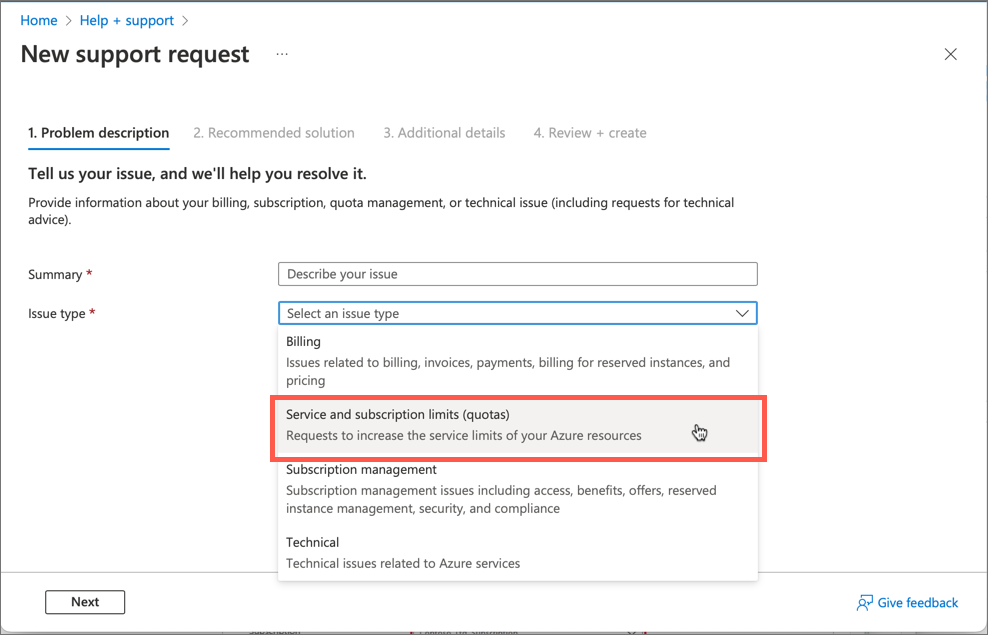
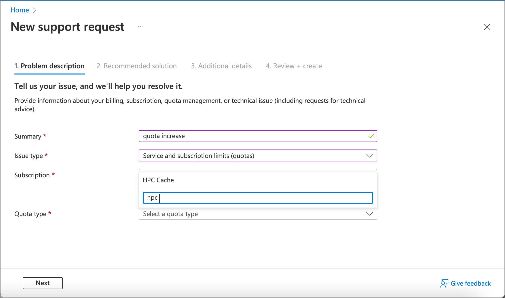
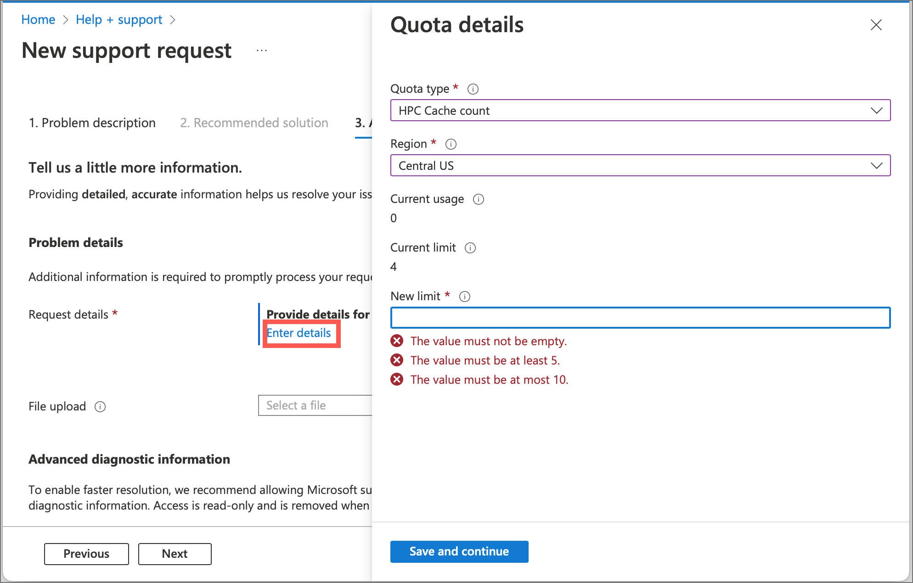

# Request an HPC Cache quota increase

If you want to host more HPC Caches than your subscription currently allows, use the support request form in the Azure portal to request a quota increase.

You also can use the [quotas page](https://portal.azure.com/#view/Microsoft_Azure_Capacity/QuotaMenuBlade/~/overview) in the Azure portal to check your current quotas and request increases.

## Quota information

The default quota for Azure HPC Cache is four caches per subscription. If you want to create more than six caches in the same subscription, support approval is needed.

Each HPC Cache uses multiple virtual machines, network resources, storage containers, and other Azure services, so it's unlikely that the number of caches per subscription will be the limiting factor in how many you can have. Quotas for those other services are handled separately from HPC Cache quotas, so you must open different tickets to increase those quotas.

## Request a quota increase

Navigate to your cache instance, then click the **New support request** link that appears at the bottom of the sidebar.

To open a ticket when you do not have an active cache, use the main Help + support page from the Azure portal. Open the portal menu from the control at the top left of the screen, then scroll to the bottom and click **Help + support**.

Choose **Create a support request**.

Select your subscription from the list.

If you can't find the Azure HPC Cache service, click the **All services** button and search for HPC.

* For **Issue type**, select **Service and subscription limits (quotas)**.

  

* Select the **Subscription** for the quota increase.

* Select the **Quota type** "HPC Cache".

  

  Click **Next** to go to the **Additional details** page.

* In **Request details**, click the link that says **Enter details**. An additional form opens to the right.

  

* For **Quota type** select **HPC Cache count**.

* Select the **Region** where your cache is located.

  The form shows your HPC Cache limit and current usage in this region.

* Type the limit you're requesting in the **New limit** field. Click **Save and continue**.

  Fill in the additional details required and create the request.

After you submit the request, you will receive a confirmation email with a ticket number. A support staff member will contact you about the request.

Support requests are also used to [request technical support](hpc-cache-support-ticket.md).
