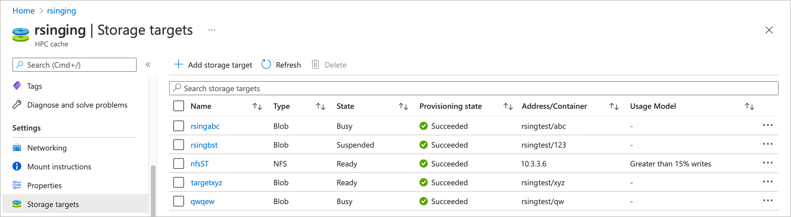
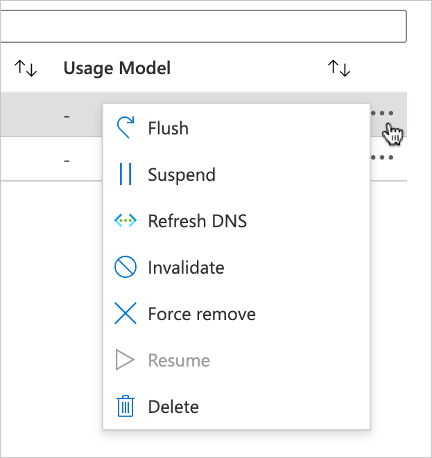
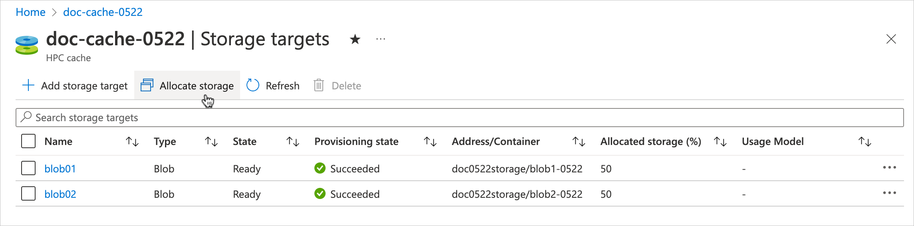

# View and manage storage targets

The storage targets settings page shows information about each storage target for your HPC Cache, and gives options to manage individual storage targets.

This page also has a utility for customizing the amount of cache space allocated to each individual storage target. Read [Allocate cache storage](#allocate-cache-storage) for details.

> [!TIP]
> Instructions for listing storage targets using Azure CLI are included in the [Add storage targets](hpc-cache-add-storage.md#view-storage-targets) article. Other actions listed here might not yet be available in Azure CLI.



<!-- to do: update all storage target list screenshots -->

## Manage storage targets

You can perform management actions on individual storage targets. These actions supplement the cache-level options discussed in [Manage your cache](hpc-cache-manage.md).

These controls can help you recover from an unexpected situation (like an unresponsive storage target), and also give you the ability to override some automatic cache actions (like writing changed files back to the long-term storage system).

Open the **Storage targets** page in the Azure portal. Click the **...** image on the far right of the storage target list to open the list of tasks.



These options are available:

* **Flush** - Write all cached changes to the back-end storage
* **Suspend** - Temporarily stop the storage target from serving requests
* **Refresh DNS** - Update the storage target IP address from a custom DNS server or from an Azure Storage private endpoint
* **Invalidate** - Discards cached files from this storage target (**Invalidate can cause data loss**)
* **Force remove** - Delete a storage target, skipping some safety steps (**Force remove can cause data loss**)
* **Resume** - Put a suspended storage target back into service
* **Delete** - Permanently remove a storage target

Read the rest of this article for more detail about these options.

### Write cached files to the storage target

The **Flush** option tells the cache to immediately copy any changed files stored in the cache to the back-end storage system. For example, if your client machines are updating a particular file repeatedly, it's held in the cache for quicker access. File changes aren't written to the long-term storage system for a period ranging from several minutes to more than an hour.

The **Flush** action tells the cache to write all files to the storage system.

The cache won't accept requests from clients for files on this storage target until after the flush is complete.

You could use this option to make sure that the back-end storage is populated before doing a backup, or for any situation where you want to make sure the back-end storage has recent updates.

This option mainly applies to usage models that include write caching. Read [Understand cache usage models](cache-usage-models.md) to learn more about read and write caching.

> [!TIP]
> If you need to write specific individual files back to a storage target without writing its entire cache contents, consider the flush_file.py script contained in the HPC Cache NFSv3 client library distribution. Learn more in [Customize file write-back in Azure HPC Cache](custom-flush-script.md).


### Suspend a storage target

The suspend feature disables client access to a storage target, but doesn't permanently remove the storage target from your cache. You can use this option if you need to disable a back-end storage system for maintenance, repair, or replacement.

### Put a suspended storage target back in service

Use **Resume** to un-suspend a storage target.

### Update IP address

In some situations, you might need to update your storage target's IP address. This can happen in two scenarios:

* Your cache uses a custom DNS system instead of the default setup, and the network infrastructure has changed.

* Your storage target uses a private endpoint to access Azure Blob or NFS-mounted blob storage, and you have updated the endpoint's configuration. (You should suspend storage targets before modifying their private endpoints, as described in the [prerequisites article](hpc-cache-prerequisites.md#work-with-private-endpoints).)

With a custom DNS system, it's possible for your NFS storage target's IP address to change because of back-end DNS changes. If your DNS server changes the back-end storage system's IP address, Azure HPC Cache can lose access to the storage system. Ideally, you should work with the manager of your cache's custom DNS system to plan for any updates, because these changes make storage unavailable.

If you use a private endpoint for secure storage access, the endpoint's IP addresses can change if you modify its configuration. If you need to change your private endpoint configuration, you should suspend the storage target (or targets) that use the endpoint, then refresh their IP addresses when you re-activate them. Read [Work with private endpoints](hpc-cache-prerequisites.md#work-with-private-endpoints) for additional information.

To update a storage target's IP address, use the **Refresh DNS** option. The cache queries the custom DNS server or private endpoint for a new IP address.

If successful, the update should take less than two minutes. You can only refresh one storage target at a time; wait for the previous operation to complete before trying another.

> [!NOTE]
> The "Refresh DNS" option is disabled for NFS storage targets that use IP addresses instead of a DNS hostname.

### Invalidate cache contents for a storage target

The **Invalidate** option tells the HPC Cache to mark all cached files from this storage target as out of date. The next time a client requests these files, they will be fetched from the back-end storage system.

You could use this option if you update files on the back-end storage system directly and want to make those changes immediately available to the clients connected to the HPC Cache.

> [!NOTE]
> If you use ***write caching*** for this storage target, invalidating its cache can possibly cause data loss. If a client has written a change to the cache, but it has not yet been copied to the back-end storage system, that change will be discarded.

The amount of time between when a client write is saved to the cache and the time that file is written to the long-term storage system is variable. There's no way for HPC Cache to determine whether or not one particular file has been written back to its storage system before invalidating the cache.

If you need to make sure all cached changes are saved to the back-end storage system, use a **Flush** command.

Learn more about write caching and file write-back delay in [Understand cache usage models](cache-usage-models.md).

### Force remove a storage target

> [!NOTE]
> This option can cause data loss for the affected storage target.

If a storage target can't be removed with a normal delete action, you can use the **Force remove** option to delete it from the Azure HPC Cache.

This action skips the step that synchronizes files in the cache with the files in the back-end storage system. There is no guarantee that any changes written to the HPC Cache will be written to the back-end storage system, so changes can be lost if you use this option.

There also is no guarantee that the back-end storage system will be accessible after it is removed from the cache.

Usually, force remove is used only when a storage target has become unresponsive or otherwise is in a bad state. This option lets you remove the bad storage target instead of having to take more drastic action.

### Delete a storage target

You can use the Azure portal or the AZ CLI to delete a storage target.

The regular delete option permanently removes the storage target from the HPC Cache, but first it synchronizes the cache contents with the back-end storage system. It's different from the force delete option, which does not synchronize data.

Deleting a storage target removes the storage system's association with this Azure HPC Cache, but it doesn't change the back-end storage system. For example, if you used an Azure Blob storage container, the container and its contents still exist after you delete it from the cache. You can add the container to a different Azure HPC Cache, re-add it to this cache, or delete it with the Azure portal.

If there's a large amount of changed data stored in the cache, deleting a storage target can take several minutes to complete. Wait for the action to finish to be sure that the data is safely stored in your long-term storage system.

#### [Portal](#tab/azure-portal)

To remove a storage target, open the **Storage targets** page. Click the '...' next to the storage target and choose **Delete** from the menu.

#### [Azure CLI](#tab/azure-cli)

[Set up Azure CLI for Azure HPC Cache](./az-cli-prerequisites.md).

Use [az hpc-cache storage-target remove](/cli/azure/hpc-cache/storage-target#az-hpc-cache-storage-target-remove) to delete a storage target from the cache.

```azurecli
$ az hpc-cache storage-target remove --resource-group cache-rg --cache-name doc-cache0629 --name blob1

{- Finished ..
  "endTime": "2020-07-09T21:45:06.1631571+00:00",
  "name": "2f95eac1-aded-4860-b19c-3f089531a7ec",
  "startTime": "2020-07-09T21:43:38.5461495+00:00",
  "status": "Succeeded"
}
```

---

## Understand storage target state

The storage target list shows two types of status: **State** and **Provisioning state**.

* **State** indicates the operational state of the storage target. This value updates regularly and helps you understand whether the storage target is available for client requests, and which of the management options are available.
* **Provisioning state** tells you whether the last action to add or edit the storage target was successful. This value is only updated when you edit the storage target.

The **State** value affects which management options you can use. Here's a short explanation of the values and their effects.

* **Ready** - The storage target is operating normally and available to clients. You can use any of the management options on this storage target (except for **Resume**, which only is valid for suspended storage targets).
* **Busy** - The storage target is processing another operation. You can delete or force remove the storage target.
* **Suspended** - The storage target has been taken offline. You can still flush, delete, or force remove this storage target. Choose **Resume** to put the target back in service.
* **Flushing** - The storage target is writing data to the back-end storage. The target can't process client requests while flushing, but it will automatically go back to its previous state after it finishes writing data.

## Allocate cache storage

Optionally, you can configure the amount of cache storage that can be used by each storage target. This feature lets you plan ahead so that space is available to store a particular storage system's files.

If you do not customize the storage allocation, each storage target receives an equal share of the available cache space.

Click the **Allocate storage** button to customize the cache allocation.



On the **Allocate storage** blade, enter the percentage of cache space you want to assign to each storage target. The storage allocations must total 100%.

Remember that some cache space is used for overhead, so the total amount of space available for cached files is not exactly the same as the capacity you chose when you created your HPC Cache.


Click **Save** to complete the allocation.

## Next steps

* Learn about [cache-level management actions](hpc-cache-manage.md)
* [Edit a storage target](hpc-cache-edit-storage.md)
