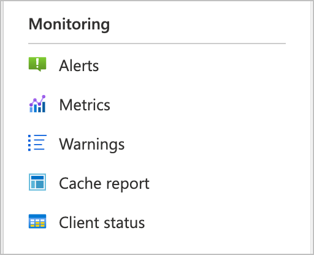
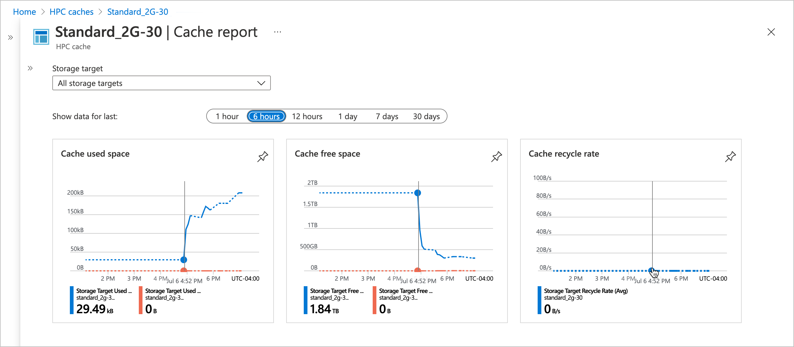
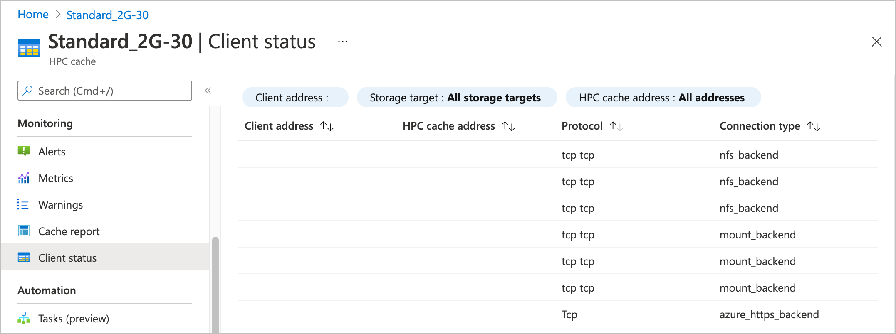

# Cache metrics and monitoring

The Azure portal has several built-in visualizations that you can use to monitor the performance of your Azure HPC Cache.

This article explains where to find the visualizations, and what they show.

There are four HPC Cache portal pages that show cache performance data:

* **Overview**
* **Metrics**
* **Cache report**
* **Client status**

Open the **Metrics**, **Cache report**, and **Client status** pages from the **Monitoring** menu in the sidebar. The cache's **Overview** page is the top item on the sidebar menu.

## Overview page

The cache's **Overview** page shows graphs for some basic cache statistics - cache throughput, operations per second, and latency. The graphs are at the bottom of the page, underneath the **Essentials** section.

These charts are part of Azure's built-in monitoring and analytics tools. Learn more about these capabilities from the [Azure Monitor documentation](../azure-monitor/essentials/monitor-azure-resource.md).

## Metrics page

The HPC Cache **Metrics** page is another standard Azure feature. Follow the tips on the page to create your own charts and to learn more about the features.

## Cache report

The **Cache report** is a customized set of charts that show your cache's used space, free space, and cache recycle rate.

By default, the page shows aggregated data for all of the cache's storage targets, but you can use the **Storage target** control to show the cache consumption data for one particular storage target instead. You also can customize the time range to show.

* **Cache used space** is the amount of space in your cache storage that's in use storing files that client machines have requested. If you select a single storage target, it shows only the space used for files from that back-end storage system.

* **Cache free space** is the available capacity remaining in cache storage.

* **Cache recycle rate** represents the rate at which old files are being removed from the cache to make room for newly requested files. For a single storage target, this calculation only includes files stored on that target.

## Client status

The **Client status** page lists the client machines that are connected to your Azure HPC Cache.

You can customize the table with filters to show a specific client address or address range, a specific storage target, or an individual cache mount address.

The connection types shown in the table have to do with the client connections to the storage target:

* `azure_https_backend` is a secure client connection to a standard Azure Blob storage system.
* `mount_backend` is an NFS connection to either a hardware NFS system or an NFS-enabled blob container.
* `nfs_backend` is similar to the `mount_backend` connection, but represents a separate connection used by an NFS-internal remote procedure call instead of one initiated by the client mount operation.

These values can be useful when debugging connection issues between clients and the HPC Cache.

## Next steps

* Learn more about [Azure metrics and statistics tools](../azure-monitor/index.yml)
* [Manage the cache](hpc-cache-manage.md)
