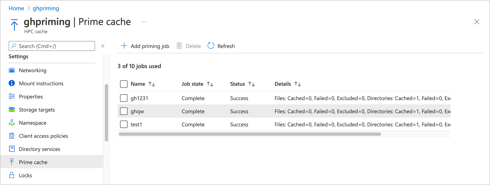

# Pre-load files in Azure HPC Cache (Preview)

> [!NOTE]
> This feature is currently in public preview.

<!-- better disclaimer adapted from azure-docs/includes/machine-learning-preview-generic-disclaimer:
 
> [!NOTE]
> This feature is currently in public preview.
> This preview version is provided without a service-level agreement, and it's not recommended for production workloads. It might not support all options, and capabilities might be constrained.
> For more information, see [Supplemental Terms of Use for Microsoft Azure Previews](https://azure.microsoft.com/support/legal/preview-supplemental-terms/).  -->

Azure HPC Cache’s priming feature (preview) allows customers to pre-load files in the cache.

This feature can be used to fetch your expected working set of files and populate the cache before beginning work. This technique is sometimes called cache warming.

Priming the cache improves performance by increasing cache hits. If a client machine requests a resource that must be read from the back-end storage, the response can have significant latency - especially if the storage system is an on-premises NAS. If you prime the cache with the needed files before you start a compute task, requests can be served more efficiently during the job.

This feature uses a JSON manifest file to specify which files to load. Each priming job takes one manifest file.

Create cache priming jobs by using the Azure Portal, or with the [Azure REST API endpoints](#azure-rest-apis) mentioned at the end of this document.

You can create up to 10 priming jobs. Depending on the size of the cache, between three and 10 priming jobs can run at the same time; others are queued until resources free up.

## Setup and prerequisites

Before you can create a priming job, take these steps:

1. Create an Azure HPC Cache. (Refer to [Create an Azure HPC Cache](hpc-cache-create.md) for help.)
1. Define at least one storage target, including creating its aggregated namespace path (or paths). [Storage target documentation](hpc-cache-add-storage.md)
1. Create the priming job manifest (instructions [below](#create-a-priming-manifest-file)) and store it in a Blob container that is accessible to the HPC Cache. Or, if using Azure REST APIs to create your priming jobs, you can store the manifest at any URL that your HPC Cache can access.

## Create a priming manifest file

The priming manifest is a JSON file that defines what content will be preloaded in the cache when the priming job runs.

In the manifest, specify the namespace path to the directories or files that you want to pre-load.

### Sample priming manifest

```json

{
    "config": {
        "cache_mode": "0",
        "maxreadsize": "0",
        "resolve_symlink": "0"
    },
    
    "files": [
        "/bin/tool.py",
        "/bin/othertool.py"
    ],
    
    "directories": [
        {"path": "/lib/toollib"},
        {
            "path": "/lib/otherlib", 
            "include": ["\\.py$"]
        },
        {
            "path": "/lib/xsupport", 
            "include": ["\\.py$"], 
            "exclude": ["\\.elc$", "\\.pyc$"]
        }
    ],
    
    "include": ["\\.txt$"],
    "exclude": ["~$", "\\.bak$"]
}
```

There are three sections to the priming manifest file:

* `config` - settings for the priming job
* `files` - individual files that will be pre-loaded
* `directories` - file paths that will be pre-loaded
* `include` and `exclude` - regular expression strings that modify the directory priming task

### Configuration settings

There are three settings in the `config` section of the manifest file:

* Cache mode - Sets the behavior of the priming job. Options are:

  * 0 - Data - Load all specified file data and attributes in the cache. This is the default.
  * 1 - Metadata - Load only the file attributes.
  * 2 - Estimate - Load the file attributes, and also return an estimated number of the files, directories, and total data size (in bytes) that would be primed if the content in this manifest was run in Data mode.

* `maxreadsize` - Sets the maximum number of bytes that will be pre-loaded per file. Leave this set to 0 (the default) to always load the entire file regardless of size.

* `resolve_symlink` - Set this to true (`1`) if you want to resolve symbolic links when priming. If `resolve_symlink` is enabled, symbolic link targets are pre-loaded entirely, regardless of include and exclude rules.

### File and directory paths

The `files` and `directories` sections of the manifest specify which files are pre-loaded during the priming job.

Specify files and directories by their cache namespace paths. These are the same paths that clients use to access the files through the HPC Cache, and they do not need to be the same as the storage system paths or export names. Read [Plan the aggregated namespace](hpc-cache-namespace.md) to learn more.

Start paths from the root of the cache namespace.

Items listed in `files` are included even if they match later exclude rules.

The `directories` value holds a list of paths that are assessed for content to pre-load in the cache. All subtrees are included in the priming job unless they’re specifically excluded.

Directory path values can have their own include and exclude statements, which apply only to the path they’re defined with. For example, the line `"directories": [{"path": "/cache/library1", "exclude": "\\.bak$"}]` would pre-load all files under the namespace path /cache/library1/ except for files in that path that end in `.bak`.

> [!NOTE]
> Because of the way the manifest file is parsed, two escape characters are needed to protect a problematic string character in include and exclude statements. For example, use the expression `\\.txt` to match .txt files. <!-- double-check the \\.txt formatting, some interpretations might drop a \ -->

### Include and exclude statements

The global `include` and `exclude` settings apply to all directories. They do not apply to files that were specified in a `files` statement.

When scanning directories, the priming job ignores any files that **do not match** the regular expressions in the `include` setting.

When scanning directories, the priming job ignores any file that **matches** the regular expressions in the `exclude` setting. Here is how these global exclude rules interact with other include and exclude rules:

* Global exclude rules override global include rules. That is, if a file name matches both a global *include* expression and a global *exclude* expression, it will **not** be pre-loaded by the priming job.

* Directory-level include rules override global exclude rules.

  A file name that matches both a *directory-level* ***include*** expression and a *global* ***exclude*** expression **will** be pre-loaded by the priming job.

* File statements override all exclude rules.

You can omit include and exclude statements to prime all files in the directories.

More information about include/exclude rules and how they match file names:

* If a name matches an entry in the per-directory exclude list, it is skipped.

* If there is a per-directory include list, the name is included or excluded depending on whether or not it appears in that list.

* If a name matches an entry in the global exclude list, it is skipped.

* If there is a global include list, the name is included if it appears on that list or excluded if it does not appear on that list.

* If there is a per-directory include list, the name is excluded. Otherwise, it is included.

* If a directory and an ancestor of that directory both appear in the directories list, the specific rules for the directory are applied along with the global rules and the rules for the ancestor directory are ignored.

* Names and rules are case sensitive. Case-insensitive sources are not supported in the private preview version. <!-- how about public preview??? -->

* The total number of file rules plus directory rules may not exceed 4000. The number of regular expression rules for any include/exclude list may not exceed 5.

* When one directory specification overlaps another, the one with the more explicit path takes precedence.

* It is an error for a manifest to specify the same path more than once in the explicit list or directory list.

### Upload the priming manifest file

When your manifest file is ready, upload it to an Azure blob container in a storage account accessible from your HPC Cache. If using APIs instead of the portal to create your priming jobs, you have the option to store it on another webserver, but you need to take different steps to make sure the cache can access it.

* If you create a priming job from the Azure portal, select the manifest file in the HPC Cache **Prime cache** settings page as described below. Selecting it from the cache settings automatically creates a [Shared Access Signature (SAS)](../storage/common/storage-sas-overview.md) that gives the cache limited access to the priming file.

* If you use APIs to create the priming job instead of using the portal, you need to take make sure that the cache is authorized to access that file. Either store the file in an accessible location (for example, on a webserver you control that is inside your cache or storage network), or manually create a SAS URL for your priming file.

  Read [Grant limited access to Azure Storage resources using shared access signatures (SAS)](../storage/common/storage-sas-overview.md) to learn how to create an Account SAS URL for your priming manifest file. The manifest file must be accessible with HTTPS.

The cache accesses the manifest file once when the priming job starts. The SAS URL generated for the cache is not exposed.

## Create a priming job

Use the Azure portal to create a priming job. View your Azure HPC Cache in the portal and click the **Prime cache** page under the **Settings** heading.

<!-- >> [!TIP]
> If you do not see the **Prime cache** option, make sure that your cache used the subscription that was authorized for the private preview. -->


<!-- to do: screenshot with 'preview' on GUI heading, screenshot with more diverse jobs and statuses -->

Click the **Add priming job** text at the top of the table to define a new job.

In the **Job name** field, type a unique name for the priming job.

Use the **Priming file** field to select your priming manifest file. Select the storage account, container, and file where your priming manifest is stored. If you can’t find the manifest file, your cache might not have the correct permissions to access the manifest file.

<!-- to do: add screenshots of the create UI -->

<!-- to do: more about managing priming jobs, deleting and such -->

## Azure REST APIs

You can use these REST API endpoints to create an HPC Cache priming job. These are part of the `2021-10-01-preview` version of the REST API, so make sure you use that string in the *api_version* term.

Read the [Azure REST API reference](/rest/api/azure/)to learn how to use this interface.

### Add a priming job

```rest

URL: POST

     https://MY-ARM-HOST/subscriptions/MY-SUBSCRIPTION-ID/resourceGroups/MY-RESOURCE-GROUP-NAME/providers/Microsoft.StorageCache/caches/MY-CACHE-NAME/addPrimingJob?api-version=2021-10-01-preview

     BODY:
     {
         "primingJobName": "MY-PRIMING-JOB",
         "primingManifestUrl": "MY-JSON-MANIFEST-FILE-URL"
     }

```

For the `primingManifestUrl` value, pass the file’s SAS URL or other HTTPS URL that is accessible to the cache. Read [Upload the priming manifest file](#upload-the-priming-manifest-file) to learn more.

### Remove a priming job

```rest

URL: POST 
     https://MY-ARM-HOST/subscriptions/MY-SUBSCRIPTION-ID/resourceGroups/MY-RESOURCE-GROUP-NAME/providers/Microsoft.StorageCache/caches/MY-CACHE-NAME/removePrimingJob/MY-JOB-ID-TO-REMOVE?api-version=2021-10-01-preview

BODY:
```

### Get priming jobs

Use the `Get cache` API to list a cache’s priming jobs. This API returns a lot of information about the cache; look for priming job information in the "cache properties" section.

Priming job names and IDs are returned, along with other information.

```rest

URL: GET 
     https://MY-ARM-HOST/subscriptions/MY-SUBSCRIPTION-ID/resourceGroups/MY-RESOURCE-GROUP-NAME/providers/Microsoft.StorageCache/caches/MY-CACHE-NAME?api-version=2021-10-01-preview

BODY:

```

## Frequently asked questions

* Can I reuse a priming job?

  Not exactly, because each priming job in the list must have a unique name. After you delete a priming job from the list, you can create a new job with the same name.

  You **can** create multiple priming jobs that reference the same manifest file.

* How long does a failed or completed priming job stay in the list?

  Priming jobs persist in the list until you delete them. On the portal **Prime cache** page, check the checkbox next to the job and click the **Delete** control at the top of the list.

* What happens if the content I’m pre-loading is larger than my cache storage?

  If the cache becomes full, files fetched later will overwrite files that were primed earlier. <!-- research ongoing - can overwrite files within one priming job; also cache storage is allocated per storage target and that might affect the overwriting if there are a lot of storage targets added to the cache. -->

## Next steps

* For help with HPC Cache priming (preview) or to report a problem, contact **???** <!-- to do: find out -->
