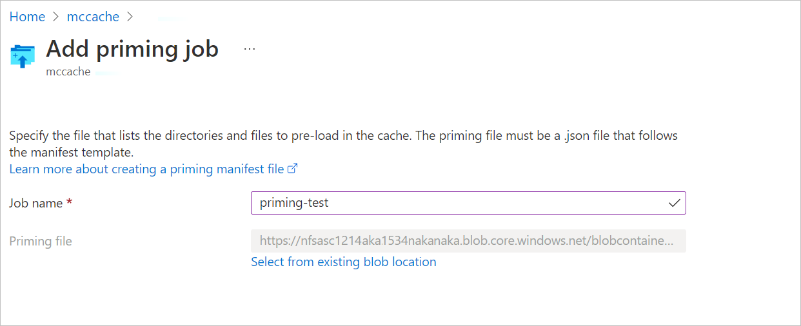
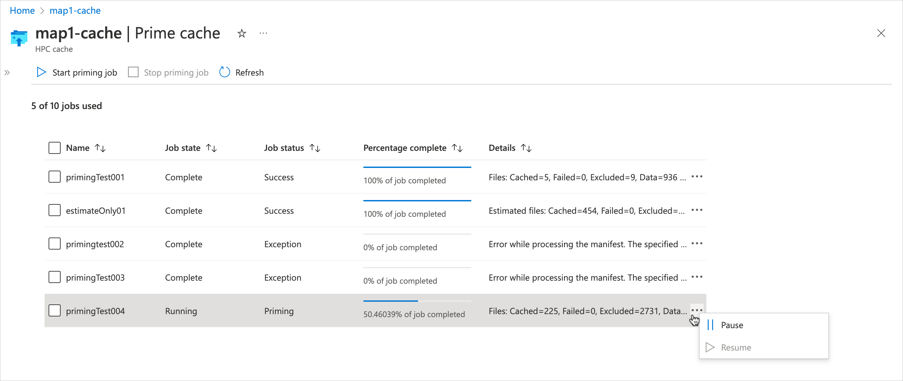

# Pre-load files in Azure HPC Cache

Azure HPC Cache’s priming feature allows customers to pre-load files in the cache.

You can use this feature to fetch your expected working set of files and populate the cache before work begins. This technique is sometimes called cache warming.

Priming the cache improves performance by increasing cache "hits". If a client machine requests a resource that must be read from the back-end storage, the latency for fetching and returning that file can be significant - especially if the storage system is an on-premises NAS. If you prime the cache with the files it will need before you start a compute task, file requests will be more efficient during the job.

This feature uses a JSON manifest file to specify which files to load. Each priming job takes one manifest file.

Create cache priming jobs by using the Azure portal, or with the [Azure REST API endpoints](#azure-rest-apis) mentioned at the end of this document.

You can create up to 10 priming jobs. Depending on the size of the cache, between three and 10 priming jobs can run at the same time; others are queued until resources free up.

## Setup and prerequisites

Before you can create a priming job, take these steps:

1. Create an Azure HPC Cache. (Refer to [Create an Azure HPC Cache](hpc-cache-create.md) for help.)
1. Define at least one storage target, including creating its aggregated namespace path (or paths). [Storage target documentation](hpc-cache-add-storage.md)
1. Create the priming job manifest (instructions [below](#create-a-priming-manifest-file)) and store it in a Blob container that is accessible to the HPC Cache. Or, if using Azure REST APIs to create your priming jobs, you can store the manifest at any URL that your HPC Cache can access.

## Create a priming manifest file

The priming manifest is a JSON file that defines what content will be preloaded in the cache when the priming job runs.

In the manifest, specify the namespace path to the directories or files that you want to pre-load. You also can configure include and exclude rules to customize which content is loaded.

### Sample priming manifest

```json

{
    "config": {
        "cache_mode": "0",
        "maxreadsize": "0",
        "resolve_symlink": "0",
        "threads":"8",
        "skip_estimation":"0"
    },
    
    "files": [
        "/bin/tool.py",
        "/bin/othertool.py"
    ],
    
    "directories": [
        {"path": "/lib/toollib"},
        {
            "path": "/lib/otherlib", 
            "include": ["\\.py$"]
        },
        {
            "path": "/lib/xsupport", 
            "include": ["\\.py$"], 
            "exclude": ["\\.elc$", "\\.pyc$"]
        }
    ],
    
    "include": ["\\.txt$"],
    "exclude": ["~$", "\\.bak$"]
}
```

There are three sections to the priming manifest file:

* Configuration (`config`) - settings for the priming job
* File and directory statements:

  * `files` - individual files that will be pre-loaded
  * `directories` - file paths that will be pre-loaded

* Global include and exclude statements (`include` and `exclude`) - regular expression strings that modify the directory priming task

### Configuration settings

The `config` section of the manifest file sets these parameters:

* Cache mode - Sets the behavior of the priming job. Options are:

  * 0 - Data - Load all specified file data and attributes in the cache. This is the default.
  * 1 - Metadata - Load only the file attributes.
  * 2 - Estimate - Load the file attributes, and also return an estimated number of the files, directories, and total data size (in bytes) that would be primed if the content in this manifest was run in Data mode.

* `maxreadsize` - Sets the maximum number of bytes that will be pre-loaded per file. Leave this set to 0 (the default) to always load the entire file regardless of size.

* `resolve_symlink` - Set this to true (1) if you want to resolve symbolic links when priming. If `resolve_symlink` is enabled, symbolic link targets are pre-loaded entirely, regardless of include and exclude rules.

* `threads` - The number of priming threads to use. Valid values are 1 to 128. The default value is 8, to balance between priming and servicing client requests.

* `skip_estimation` - Before it starts copying files, the priming job runs an estimate of the amount of data to be primed. Set the `skip_estimation` flag to true (1) if you want to move directly to the file priming phase. If you skip the estimation phase, the progress report might be less accurate. The default value is 0, to include the estimation phase.

### File and directory paths

The `files` and `directories` sections of the manifest specify which files are pre-loaded during the priming job.

Specify files and directories by their cache namespace paths. These are the same paths that clients use to access the files through the HPC Cache, and they do not need to be the same as the storage system paths or export names. Read [Plan the aggregated namespace](hpc-cache-namespace.md) to learn more.

Start paths from the root of the cache namespace.

> [!NOTE]
> Items listed in `files` are included even if they match later exclude rules.

The `directories` value holds a list of paths that are assessed for content to pre-load in the cache. All subtrees are included in the priming job unless they’re specifically excluded.

Directory path values can have their own include and exclude statements, which apply only to the path they’re defined with. For example, the line `"directories": [{"path": "/cache/library1", "exclude": "\\.bak$"}]` would pre-load all files under the namespace path /cache/library1/ except for files in that path that end in `.bak`.

Directory-level include/exclude statements are not the same as the global include and exclude statements described [below](#include-and-exclude-statements). Be careful to read the details about how directory-level statements interact with global include and exclude statements.

> [!NOTE]
> Because of the way the manifest file is parsed, two escape characters are needed to protect a problematic string character in include and exclude statements. For example, use the expression `\\.txt` to match .txt files. <!-- double-check the \\.txt formatting, some interpretations might drop a \ -->

### Include and exclude statements

After the files and directories, you can specify global `include` and `exclude` statements. These global settings apply to all directories. They do not apply to files that were specified in a `files` statement.

In general, rules are matched in order, so statements that appear earlier in the manifest file are applied before later ones. The descriptions in this article also assume that earlier rules have already been applied and not matched.

* **Include** statements - When scanning directories, the priming job ignores any files that **do not match** the regular expressions in the `include` setting.

* **Exclude** statements - When scanning directories, the priming job ignores any file that **matches** the regular expressions in the `exclude` setting.

  More about how global exclude rules interact with other rules:

  * Global exclude rules override global include rules. That is, if a file name matches both a global *include* expression and a global *exclude* expression, it will **not** be pre-loaded by the priming job.

  * Directory-level include rules override global exclude rules.

    A file name that matches both a *directory-level* ***include*** expression and a *global* ***exclude*** expression **will** be pre-loaded by the priming job.

  * File statements override all exclude rules.

You can omit include and exclude statements to prime all files in the directories.

More information about include/exclude rules and how they match file names:

* If a name matches an entry in the per-directory exclude list, it is skipped.

* If there is a per-directory include list, the name is included or excluded depending on whether or not it appears in that list.

* If a name matches an entry in the global exclude list, it is skipped.

* If there is a global include list, the name is included if it appears on that list, or excluded if it does not appear on that list.

* If there is a per-directory include list, the name is excluded. Otherwise, it is included.

* If a directory and an ancestor of that directory both appear in the directories list, the specific rules for the directory are applied along with the global rules and the rules for the ancestor directory are ignored.

* Names and rules are case sensitive. Case-insensitive sources are not supported. <!-- this might change in future? -->

* The total number of file rules plus directory rules may not exceed 4000. The number of regular expression rules for any include/exclude list may not exceed 5.

* If one directory specification overlaps another, the one with the more explicit path takes precedence.

* It is an error for a manifest to specify the same path more than once in the file list or directory list.

### Upload the priming manifest file

When your manifest file is ready, upload it to an Azure blob container in a storage account accessible from your HPC Cache. If using APIs instead of the portal to create your priming jobs, you have the option to store it on another webserver, but you need to take different steps to make sure the cache can access it.

* If you create a priming job from the Azure portal, select the manifest file in the HPC Cache **Prime cache** settings page as described below. Selecting it from the cache settings automatically creates a [Shared Access Signature (SAS)](../storage/common/storage-sas-overview.md) that gives the cache limited access to the priming file.

* If you use APIs to create the priming job instead of using the portal, make sure that the cache is authorized to access that file. Either store the file in an accessible location (for example, on a webserver you control that is inside your cache or storage network), or manually create a SAS URL for your priming file.

  Read [Grant limited access to Azure Storage resources using shared access signatures (SAS)](../storage/common/storage-sas-overview.md) to learn how to create an Account SAS URL for your priming manifest file. The manifest file must be accessible with HTTPS.

The cache accesses the manifest file once when the priming job starts. The SAS URL generated for the cache is not exposed.

## Create a priming job

Use the Azure portal to create a priming job. View your Azure HPC Cache in the portal and select the **Prime cache** page under the **Settings** heading.


Click the **Start priming job** text at the top of the table to define a new job.

In the **Job name** field, type a unique name for the priming job.

Use the **Priming file** field to select your priming manifest file. Select the storage account, container, and file where your priming manifest is stored.



To select the priming manifest file, click the link to select a storage target. Then select the container where your .json manifest file is stored.

If you can’t find the manifest file, your cache might not be able to access the file's container. Make sure that the cache has network connectivity to the storage account and is able to read data from the container.

## Manage priming jobs

Priming jobs are listed in the **Prime cache** page in the Azure portal.

This page shows each job's name, its state, its current status, and summary statistics about the priming progress. The summary in the **Details** column updates periodically as the job progresses. The **Job status** field is populated when a priming job starts; this field also gives basic error information like **Invalid manifest** if a problem occurs.

While a job is running, the **Percentage complete** column shows an estimate of the progress.

Before a priming job starts, it has the state **Queued**. Its **Job status**, **Percentage complete**, and **Details** fields are empty.



Click the **...** section at the right of the table to pause or resume a priming job. (It might take a few minutes for the status to update.)

To delete a priming job, select it in the list and use the **Stop** control at the top of the table. You can use the **Stop** control to delete a job in any state.

## Azure REST APIs

You can use these REST API endpoints to create and manage HPC Cache priming jobs. These are part of the `2022-05-01` version of the REST API, so make sure you use that string in the *api_version* term.

Read the [Azure REST API reference](/rest/api/azure/) to learn how to use these tools.

### Add a new priming job

The `startPrimingJob` interface creates and queues a priming job. The job starts automatically when resources are available.

```rest

URL: POST

     https://MY-ARM-HOST/subscriptions/MY-SUBSCRIPTION-ID/resourceGroups/MY-RESOURCE-GROUP-NAME/providers/Microsoft.StorageCache/caches/MY-CACHE-NAME/startPrimingJob?api-version=2022-05-01

     BODY:
     {
         "primingJobName": "MY-PRIMING-JOB",
         "primingManifestUrl": "MY-JSON-MANIFEST-FILE-URL"
     }

```

For the `primingManifestUrl` value, pass the file’s SAS URL or other HTTPS URL that is accessible to the cache. Read [Upload the priming manifest file](#upload-the-priming-manifest-file) to learn more.

### Stop a priming job

The `stopPrimingJob` interface cancels a job (if it is running) and removes it from the job list. Use this interface to delete a priming job in any state.

```rest

URL: POST 
     https://MY-ARM-HOST/subscriptions/MY-SUBSCRIPTION-ID/resourceGroups/MY-RESOURCE-GROUP-NAME/providers/Microsoft.StorageCache/caches/MY-CACHE-NAME/stopPrimingJob?api-version=2022-05-01

BODY:
     {
         "primingJobId": "MY-JOB-ID-TO-REMOVE"
     }

```

### Get priming jobs

Use the `Get cache` API to list a cache’s priming jobs. This API returns a lot of information about the cache; look for priming job information in the "cache properties" section.

Priming job names and IDs are returned, along with other information.

```rest

URL: GET 
     https://MY-ARM-HOST/subscriptions/MY-SUBSCRIPTION-ID/resourceGroups/MY-RESOURCE-GROUP-NAME/providers/Microsoft.StorageCache/caches/MY-CACHE-NAME?api-version=2022-05-01

BODY:

```

### Pause a priming job

The `pausePrimingJob` interface suspends a running job.

```rest

URL: POST 
     https://MY-ARM-HOST/subscriptions/MY-SUBSCRIPTION-ID/resourceGroups/MY-RESOURCE-GROUP-NAME/providers/Microsoft.StorageCache/caches/MY-CACHE-NAME/pausePrimingJob?api-version=2022-05-01

BODY:
     {
         "primingJobId": "MY-JOB-ID-TO-PAUSE"
     }

```

### Resume a priming job

Use the `resumePrimingJob` interface to reactivate a suspended priming job.

```rest

URL: POST 
     https://MY-ARM-HOST/subscriptions/MY-SUBSCRIPTION-ID/resourceGroups/MY-RESOURCE-GROUP-NAME/providers/Microsoft.StorageCache/caches/MY-CACHE-NAME/resumePrimingJob?api-version=2022-05-01

BODY:
     {
         "primingJobId": "MY-JOB-ID-TO-RESUME"
     }

```

## Frequently asked questions

* Can I reuse a priming job?

  Not exactly, because each priming job in the list must have a unique name. After you delete a priming job from the list, you can create a new job with the same name.

  You **can** create multiple priming jobs that reference the same manifest file.

* How long does a failed or completed priming job stay in the list?

  Priming jobs persist in the list until you delete them. On the portal **Prime cache** page, check the checkbox next to the job and select the **Stop** control at the top of the list to delete the job.

* What happens if the content I’m pre-loading is larger than my cache storage?

  If the cache becomes full, files fetched later will overwrite files that were primed earlier.

## Next steps

* For more help with HPC Cache priming, follow the process in [Get help with Azure HPC Cache](hpc-cache-support-ticket.md).
* Learn more about [Azure REST APIs](/rest/api/azure/)
