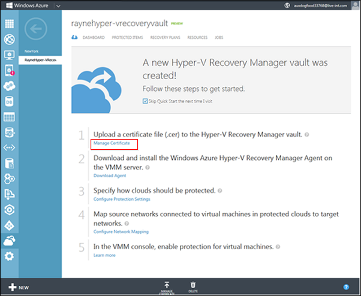
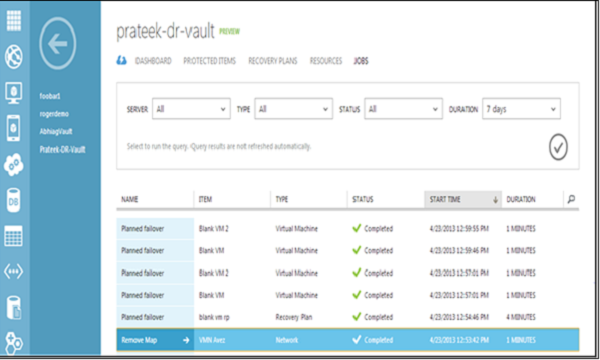

<properties linkid="configure-hyper-v-recovery-vault" urlDisplayName="configure-Azure-Site-Recovery" pageTitle="Configure Azure Site Recovery to protect virtual machines on Hyper-V server located in VMM clouds" metaKeywords="Azure Site Recovery, VMM, clouds, disaster recovery" description="Azure Site Recovery coordinates the replication, failover and recovery of Hyper-V virtual machines located in VMM clouds from one on-premises site to another. Azure Site Recovery can also replicate, failover, and recover Hyper-V virtual machine data between in VMM clouds and Microsoft Azure." metaCanonical="" umbracoNaviHide="0" disqusComments="1" title="Getting Started with Azure Site Recovery: On-Premises to Azure Protection" editor="jimbe" manager="cfreeman" authors="" />

# Getting Started with Azure Site Recovery: On-Premises to Azure Protection

 

Use Azure Site Recovery to protect virtual machines running on Hyper-V hosts located in System Center Virtual Machine Manager (VMM) clouds. You can configure:

<ul>
<li><b>On-premises to Azure protection</b>—Replicate on-premise virtual machines located on Hyper-V host servers in VMM clouds to Azure. You configure and enable protection settings in Azure Site Recovery vaults. Virtual machine data is replicated from the on-premises Hyper-V server to Azure storage.</li>

<li><b>On-premises to on-premises protection</b>—Replicate virtual machines located on Hyper-V host servers in VMM clouds from one on-premises site to another. You configure and enable protection settings in Azure Site Recovery vaults. Virtual machine data is replicated from one on-premises Hyper-V server to another. Azure Site Recovery simply orchestrates the process.
Learn about this scenario in <a href="http://go.microsoft.com/fwlink/?LinkId=398765">Getting Started with Azure Site Recovery: On-Premises to On-Premises Protection</a>.</li>

</ul>
 
<h2>About this tutorial</h2>

This tutorial is intended to help you deploy Azure Site Recovery for a quick proof-of-concept. It uses the quickest path and default settings where possible. Including steps to:
<ul>
<li>Set up an Azure Site Recovery vault—Get a certificate uploaded to the vault and set up on the source VMM server, and  generate a vault key. </li>
<li>Set up the source VMM server and Hyper-V host servers—Install the Azure Site Recovery Provider on the source VMM server, and install the Azure Recovery Services Agent on Hyper-V host servers.</li>
<li>Configure the VMM clouds—Configure protection settings for clouds on the source VMM server.</li>
<li>Enable virtual machines—Enable protection for virtual machines</li>
<li>Run a failover—Create a recovery plan and run a test failover.</li>
</ul>

For information about a full deployment see:

<UL>
<LI><a href="http://go.microsoft.com/fwlink/?LinkId=321294">Plan for Azure Site Recovery Deployment</a>—Describes the planning steps you should complete before a starting a full deployment.</LI>
<LI><a href="http://go.microsoft.com/fwlink/?LinkId=402679">Deploy Azure Site Recovery: On-Premises to Azure Protection</a>—Provides step-by-step instructions for a full deployment.</LI>
<LI><a href="http://go.microsoft.com/fwlink/?LinkId=378272">Administer and Monitor Azure Site Recovery</a>—Describes how to run failovers, and to manage and monitor your deployment.</LI>
</UL>

If you run into problems during this tutorial, review the wiki article <a href="http://go.microsoft.com/fwlink/?LinkId=389879">Azure Site Recovery: Common Error Scenarios and Resolutions</a>, or post your questions on the <a href="http://go.microsoft.com/fwlink/?LinkId=313628">Azure Recovery Services Forum</a>.

<h2>Before you begin</h2> 

 

Before you start this tutorial check the prerequisites.

<h3>Azure prerequisites</h3>

<UL>
<LI><b>Azure account</b>—You'll need an Azure account. If you don't have one, see <a href="http://aka.ms/try-azure">Azure free trial</a>. Get pricing information at <a href="http://go.microsoft.com/fwlink/?LinkId=378268">Azure Site Recovery Manager Pricing Details</a>.</LI>
<LI><b>Certificate</b>—You'll need to upload a management certificate (.cer) with a public key to the vault. You'll export this certificate as a .pfx file (with private key) and import it on each VMM server you want to register in the vault. For this tutorial you'll use a self-signed certificate. For a full deployment you can use a valid SSL certificate that complies with the <a href="http://go.microsoft.com/fwlink/?LinkId=321294">certificate requirements</a> described in the planning guide</a>. </LI>

</LI>

<LI><b>Azure storage account</b>—You'll need an Azure storage account to store data replicated to Azure. The account needs geo-replication enabled. It should be in the same region as the Azure Site Recovery service, and be associated with the same subscription. To learn more about setting up Azure storage, see <a href="http://go.microsoft.com/fwlink/?LinkId=398704">Introduction to Microsoft Azure Storage</a>.</LI>
</UL>

<h3>VMM prerequisites</h3>

<UL>
<LI><b>VMM server</b>—A VMM server running on System Center 2012 R2.</LI>
<LI><b>VMM clouds</b>—At least one cloud on the VMM server.The cloud should contain:
	<UL>
	<LI>One or more VMM host groups</LI>
	<LI>One or more Hyper-V host servers or clusters in each host group.</LI>
	<li>One or more virtual machines located on the source Hyper-V server in the cloud. The virtual machines should be generation 1.</li>
		</UL></LI>	
</UL>

<h3>Virtual machine prerequisites</h3>

<UL>
<LI><b>Generation</b>—Azure only supports generation 1 virtual machines.</LI>
<LI>For a full list of virtual machine support requirements for failover to Azure, read <a href="http://go.microsoft.com/fwlink/?LinkId=402602">Prerequisites and support</a> in the Planning guide. </LI>	
</UL>

<h2>Tutorial steps</h2> 

After verifying the prerequisites, do the following:
<UL>
<LI><a href="#createcert">Step 1: Obtain and configure certificates</a>—Obtain a .cer certificate, export it as a .pfx file, and import the .pfx file to VMM servers.</LI>
<LI><a href="#vault">Step 2: Create a vault</a>—Create an Azure Site Recovery vault.</LI>
<LI><a href="#upload">Step 3: Configure the vault</a>—Upload a management certificate to the vault, and generate a key for the vault. The key is used to ensure that the Provider located on the VMM server only runs commands sent by Azure Site Recovery.</LI>
<LI><a href="#download">Step 4: Install the Provider application</a>—Run the Microsoft Azure Site Recovery Provider application on the VMM server. This installs the Provider and registers the VMM server in the vault.</LI>
<LI><a href="#agent">Step 5: Install the Agent application</a>—Install the Microsoft Azure Recovery Services agent on each Hyper-V host.</LI>
<LI><a href="#clouds">Step 6: Configure cloud protection</a>—Configure protection settings for VMM clouds.</LI>
<LI><a href="#NetworkMapping">Step 7: Configure network mapping</a>—You can optionally configure network mapping to map source VM networks to target Azure networks.</LI>
<LI><a href="#virtualmachines">Step 8: Enable protection for virtual machines</a>—Enable protection for virtual machines located in protected VMM clouds.</LI>
<LI><a href="#recovery plans">Step 9: Configure and run recovery plans</a>—Create a recovery plan and run a test failover for the plan.</LI>
</UL>

 <h2>Step 1: Obtain and configure certificates</h2>

Obtain and configure certificates as follows:
<OL>
<LI><a href="#obtaincert">Obtain a self-signed certificate for the walkthrough</a>—Obtain a certificate using the MakeCert tool.</LI>
<LI><a href="#exportcert">Export the certificate in .pfx format</a>—On the server on which you created the certificate, export the .cer file as a .pfx file (with the private key). </LI>
<LI><a href="#importcert">Import the .pfx certificate to the VMM server</a>—After export, import the .pfx file into the Personal folder of the Local Computer store on the VMM server that you want to register with the vault.</LI>
</OL>

<h3>Obtain a self-signed certificate (.cer)</h3>

Create a .cer x.509 certificate that complies with all certificate requirements:

<ol>
<LI>
On the computer on which you want to run MakeCert, download the latest version of the <a href="http://go.microsoft.com/fwlink/?LinkId=378269">Windows SDK</a>. You won't need to install the entire SDK.</LI>
<LI>On the Specify Location page, select **Install the Windows Software Development Kit for Windows 8.1 to this computer**.</LI>
<LI>On the Select the Features you Want to Install page, clear all options except **Windows Software Development Kit**.</LI>
<LI>After the installation is complete, verify that makecert.exe appears in the folder C:\ProgramFiles (x86)\Windows Kits\<i>WindowsVersion</i>\bin\x64.</LI>
<LI>Open a command prompt (cmd.exe) with Administrator privileges and navigate to the makecert.exe folder.</LI> 
<LI>Run the following command to create your self-signed certificate. Replace CertificateName with the name you want to use for the certificate, and specify the actual expiration date of your certificate after -e:</LI>
<code>
makecert.exe -r -pe -n CN=CertificateName -ss my -sr localmachine -eku 1.3.6.1.5.5.7.3.2 -len 2048 -e 01/01/2016 CertificateName.cer</code>
</ol>

A succeeded status indicates that the certificate has been created. It's stored in the same folder as makecert.exe. You might want to move it to a more accessible location for export.

<h3>Export the certificate in .pfx format</h3>

Complete the steps in this procedure to export the .cer file in .pfx format.

<ol>
<li>A succeeded status indicates that the certificate has been created. It's stored in the same folder as makecert.exe. You might want to move it to a more accessible location for export.</li>
<li>In the details pane, click the certificate you want to manage.</li>
<li>On the <b>Action</b> menu, point to <b>All Tasks</b>, and then click <b>Export</b>. The Certificate Export Wizard appears. Click <b>Next</b>.</li>
<li>On the <b>Export Private Key</b> page, click <b>Yes</b> to export the private key. Click <b>Next</b>. Note that this is only required if you want to export the private key to other servers after the installation.</li>
<li>On the Export File Format page, select <b>Personal Information Exchange – PKCS #12 (.PFX)</b>. Click <b>Next</b>.</li>
<li>On the <b>Password</b> page, type and confirm the password that is used to encrypt the private key. Click <b>Next</b>.</li>
<li>Follow the pages of the wizard to export the certificate in .pfx format.</li>
</ol>

<h3>Import the .pfx certificate to VMM servers</h3>

After export copy the .pfx to the VMM server, and then import it. Note that if you ran MakeCert.exe on the VMM server, you don't need to import the certificate on that server.

 
<ol>
<li>Copy the private-key (.pfx) certificate files to a location on the local server.</li>
<li>In the Certificates MMC snap-in select <b>Computer account</b> and then click <b>Next</b>.</li>
<li>Select <b>Local Computer</b>, and click <b>Finish</b>.</li>
<li>In the MMC, expand <b>Certificates</b>, right-click <b>Personal</b>, point to <b>All Tasks</b>, and then click <b>Import</b> to start the Certificate Import Wizard.</li>
<li>On the File to Import page, click <b>Browse</b> and locate the folder that contains the .pfx certificate file that contains the certificate that you want to import. Select the appropriate file, and then click <b>Open</b>.</li>
<li>On the Password page, in the <b>Password</b> box, type the password for the private key .pfx file and click <b>Next</b>.</li>
<li>On the Certificate Store page, select <b>Place all certificates in the following store</b>, click <b>Browse</b>, select the <b>Personal</b> store, click <b>OK</b>, and then click <b>Next</b>. Complete the wizard</li>
</ol>

After you complete these steps, you'll be able to choose the .cer certificate for upload when you configure the vault, and to select the .pfx certificate when you register a VMM server during Provider installation.

 <h2>Step 2: Create a vault</h2>

1. Sign in to the [Management Portal](https://manage.windowsazure.com).

2. Expand <b>Data Services</b>, expand <b>Recovery Services</b>, and click <b>Site Recovery Vault</b>.

	

3. Click <b>Create New</b> and then click <b>Quick Create</b>.
	

3. In <b>Name</b>, enter a friendly name to identify the vault.

4. In <b>Region</b>, select the geographic region for the vault. Available geographic regions include East Asia, West Europe, West US, East US, North Europe, Southeast Asia.
5. Click <b>Create vault</b>. 

	

Check the status bar to confirm that the vault was successfully created. The vault will be listed as <b>Active</b> on the main Recovery Services page.

 <h2>Step 3: Configure the vault</h2>

1. In the <b>Recovery Services</b> page, click the vault to open the Quick Start page. Quick Start can also be opened at any time using the icon.

	

2. In the <b>Setup Recovery</b> dropdown list, select <b>Between an on-premises site and Microsoft Azure</b>.
3. To upload the certificate (.cer) to the vault, click <b>Manage Certificate</b>.

	

3. In the <b>Manage Certificate</b> dialog box, click <b>Browse for file</b> and select the .cer file.

	

4. To generate a key for the vault, click **Get a vault key**. The key is generated automatically. If you regenerate a key it overwrites the previous key. Note  that you'll need this key later when you install the Azure Site Recovery Provider on the VMM server.

	

  <h2>Step 4: Install the Azure Site Recovery Provider</h2>
 

1. On the <b>Quick Start</b> page, click <b>Download Provider</b> to obtain the latest version of the Provider installation file.

	

2. Run this file on the source VMM server.

	

3. After the Provider is installed, continue Setup to register the server in the vault.

	

4. On the Internet Connection page specify how the Provider running on the VMM server connects to the Internet. Click  <b>Next</b> to use the default Internet connection settings configured on the server.

	

5. On the Vault Registration page, do the following:
	<ul>
	<li>Select the private key (.pfx) that you imported to the VMM server.</li>
	<li>Select the vault in which you want to register the server.</li>
	<li>Specify the vault key. This is the vault key you generated earlier. Cut and paste the key value from the Quick Start page.</li>
	</ul>
	
	

6. On the Data Encryption page, you specify whether you want to allow the option to encrypt data during replication for a specific cloud. If you select this option, an SSL certificate will be automatically generated. When you run a failover, you’ll need to select this certificate. After you enable this setting, you can enable or disable data encryption for a cloud in the Azure Site Recovery portal. For this tutorial leave the default setting and click <b>Next</b>.

	

7. On the VMM Server page, do the following:

	- Specify a friendly name for the VMM server. This name is used to identify the server in the Azure Site Recovery console.
	- Select <b>Synchronize cloud metadata with the vault</b> to synchronize information about VMM clouds with Azure Site Recovery vault. This action only needs to happen once on each server. If you don't want to synchronize all clouds, you can publish each cloud individually to synchronize it, before you configure cloud protection settings. 
 
8. Click <b>Register</b> to complete the process. 

	

After a server has been successfully registered its friendly name will be displayed on the <b>Resources</b> tab on the Servers page in the vault.

<h2>Step 5: Install the Azure Recovery Services Agent</h2>

Install the Azure Recovery Services agent on each Hyper-V host server located in the VMM clouds you want to protect.

1. On the Quick Start page, click <b>Download Azure Site Recovery Services Agent and install on hosts</b>, to obtain the latest version of the agent installation file.

	

2. Run the installation file on each Hyper-V host server that's located in VMM clouds you want to protect.
3. On the Prerequisites Check page click <b>Next</b>. Any missing prerequisites will be automatically installed.

4. On the Installation Settings page, specify where you want to install the Agent and select the cache location in which backup metadata will be installed. Then click <b>Install</b>.
	
On the Internet Connection page specify how the Provider running on the VMM server connects to the Internet. Click  <b>Next</b> to use the default Internet connection settings configured on the server

<h2>Step 6: Configure cloud protection settings</h2>

After VMM servers are registered, you can configure cloud protection settings. You enabled the option **Synchronize cloud data with the vault** when you installed the Provider so all clouds on the VMM server will appear in the <b>Protected Items</b> tab in the vault.

Configure protection settings as follows:

1. On the Quick Start page, click **Set up protection for VMM clouds**.

2. On the **Protected Items** tab, click on the cloud you want to configure and go to the **Configuration** tab.
3. In <b>Target</b>, select <b>Microsoft Azure</b>.
4. In <b>Storage Account</b>, select the Azure storage you want to use to store Azure virtual machines.
5. Set <b>Encrypt stored data</b> to <b>Off</b>. This setting specifies that data should be encrypted replicated between the on-premises site and Azure.
6. In <b>Copy frequency</b> leave the default setting. This value specifies how frequently data should be synchronized between source and target locations.  
7. In <b>Retain recovery points for</b>, leave the default setting. With a default value of zero only the latest recovery point for a primary virtual machine is stored on a replica host server. 
8. In <b>Frequency of application-consistent snapshots</b>, leave the default setting. This value specifies how often to create snapshots. Snapshots use Volume Shadow Copy Service (VSS) to ensure that applications are in a consistent state when the snapshot is taken.  If you do set a value, make sure it's less than the number of additional recovery points you configure.

	

9. In <b>Replication start time</b>, specify when initial replication of data to Azure should start. The timezone on the Hyper-V host server will be used. We recommend that you schedule the initial replication during off-peak hours. 

	

After you save the settings a job will be created and can be monitored on the <b>Jobs</b> tab. All Hyper-V host servers in the VMM source cloud will be configured for replication.

After saving, cloud settings can be modified on the <b>Configure</b> tab. To modify the target location or target storage you'll need to remove the cloud configuration, and then reconfigure the cloud. Note that if you change the storage account the change is only applied for virtual machines that are enabled for protection after the storage account has been modified. Existing virtual machines are not migrated to the new storage account.

<h2>Step 7: Configure network mapping</h2>

You can optionally enable network mapping to map source VM networks to target Azure virtual networks. If you don’t create network mappings then only virtual machines that fail over in the same recovery plan can connect to each other in Azure. If you create a network mapping then all virtual machines that fail over on the same network can connect to each other, irrespective of which recovery plan they belong to. In addition if a network gateway is setup on the target Azure network then virtual machines can connect to onpremises virtual machines. If you want to configure network mapping as part of this tutorial, see <a href="http://go.microsoft.com/fwlink/?LinkId=402533">Configure network mapping</a> in the deployment guide.

<h2>Step 8: Enable protection for virtual machines</h2>

After servers, clouds, and networks are configured correctly, you can enable protection for virtual machines in the cloud.

<OL>
<li>On the <b>Virtual Machines</b> tab in the cloud in which the virtual machine is located, click <b>Enable protection</b> and then select <b>Add virtual machines</b>. </li>
<li>From the list of virtual machines in the cloud, select the one you want to protect.</li> 
</OL>

After protection is enabled two jobs are created. The Enable Protection job runs. Then after the initial replication is completed the Finalize Protection job runs. The virtual machine is only ready for failover after these jobs have finished successfully. You can monitor progress on the <b>Jobs</b> tab.

<h2>Step 9: Configure and run a recovery plan</h2>
A recovery plan gathers virtual machines into groups so that they can fail over as a single unit. To create a recovery plan, do the following: 

1. On the <b>Recovery Plans</b> tab, click <b>Create</b>.
2. On the Specify the Recovery Page Name and Target page, select the source VMM server and  Azure as the target. 

	

3. On the Select Virtual Machines page, select virtual machines to add to the recovery plan.  Only virtual machines with protection enabled are shown. The virtual machines are added to the recovery plan in default group (Group 1).
4. Click the check mark to create the recovery plan. 

	

<h3>Test a failover</h3>
Recovery plans can run as part of a proactive test or planned failover, or during an unplanned failover. This walkthrough describes how to run a test failover from VMM to Azure to verify that your  failover strategy is working as expected.  Test failover simulates your failover and recovery mechanism in an isolated network. Note the following:
<UL>
<li>If you want to connect to the virtual machine in Azure using Remote Desktop after the failover, enable Remote Desktop Connection on the virtual machine before you run the test failover.</li>
<li>After failover you'll use a public IP address to connect to the virtual machine in Azure using Remote Desktop. If you want to do this, ensure you don't have any domain policies that prevent you from connecting to a virtual machine using a public address.</li>
</UL>

<h4>Run the failover</h5>
Run a test failover for a recovery plan as follows:

1. Before you run the recovery plan you should validate the settings of virtual machines in the plan. To do this, On the properties page for the cloud, click the virtual machine. On the Source and Target Properties for Failover page, verify the settings. In particular verify that the suggested size for the target virtual machine in Azure is correct, and that network settings are accurate. For a full list of virtual machine prerequirements, see <href="http://go.microsoft.com/fwlink/?LinkId=402676">Prerequisites and support</a>. 

2. On the **Recovery Plans** tab, select the required recovery plan.
3. To initiate the failover, click the **Test Failover** button.
4. On the Confirm Test Failover page, select the Azure network to which your virtual machines will be connected after failover. Optionally you can select <b>No Network</b>. With this setting selected the virtual machines won't be connected to a network after failover.

You can follow the progress of test failover jobs on the <b>Jobs</b> tab. After the test failover is complete, do the following:

<OL>
<LI>Verify that the virtual machines start successfully in Azure.</LI>
<LI>Click **Notes** to record and save any observations associated with the test failover.</LI>
<LI>In addition to details on the **Jobs** tab, when you run a test failover for a recovery plan the  process is displayed on the recovery plan details page. You can view failover steps and status, and view or create notes for the test failover. </LI>

</OL>

<h4>Monitor activity</h5>

You can use the **Jobs** tab and **Dashboard** to view and monitor the main jobs performed by the Azure Site Recovery vault, including configuring protection for a cloud, enabling and disabling protection for a virtual machine, running a failover (planned, unplanned, or test), and committing an unplanned failover.

From the **Jobs** tab you view jobs, drill down into job details and errors, run job queries to retrieve jobs that match specific criteria, export jobs to Excel, and restart failed jobs.

From the **Dashboard** you can download the latest versions of Provider and Agent installation files, get configuration information for the vault, see the number of virtual machines that have protection managed by the vault, see recent jobs, manage the vault certificate, and resynchronize virtual machines.

For more information about interacting with jobs and the dashboard, see the <a href="http://go.microsoft.com/fwlink/?LinkId=398534">Operations and Monitoring Guide</a>.

<h2>Next steps</h2>
<UL>
<LI>To plan and deploy Azure Site Recovery in a full production environment, see <a href="http://go.microsoft.com/fwlink/?LinkId=321294">Planning Guide for Azure Site Recovery</a> and <a href="http://go.microsoft.com/fwlink/?LinkId=321295">Deployment Guide for Azure Site Recovery</a>.</LI>

<LI>For questions, visit the <a href="http://go.microsoft.com/fwlink/?LinkId=313628">Azure Recovery Services Forum</a>.</LI> 
</UL>
