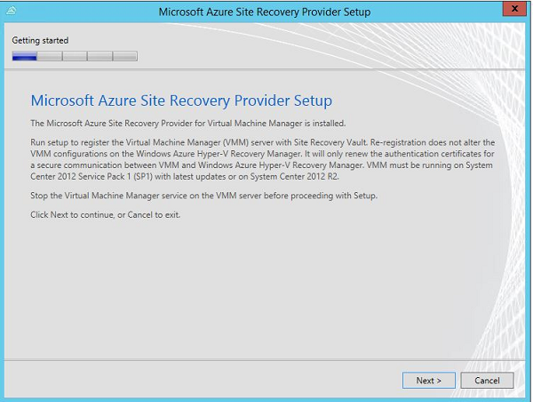
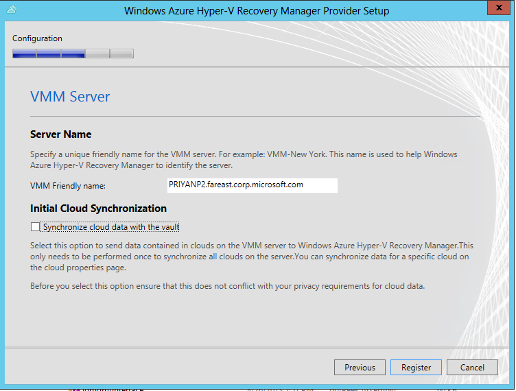
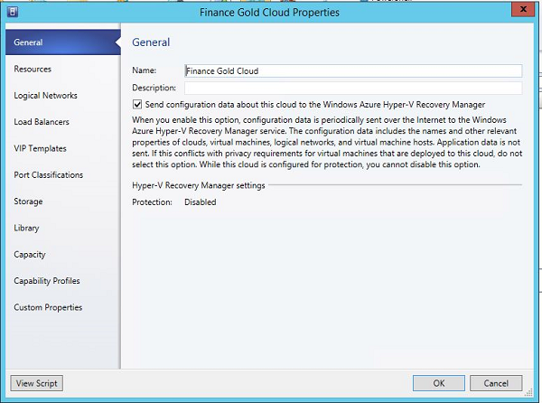
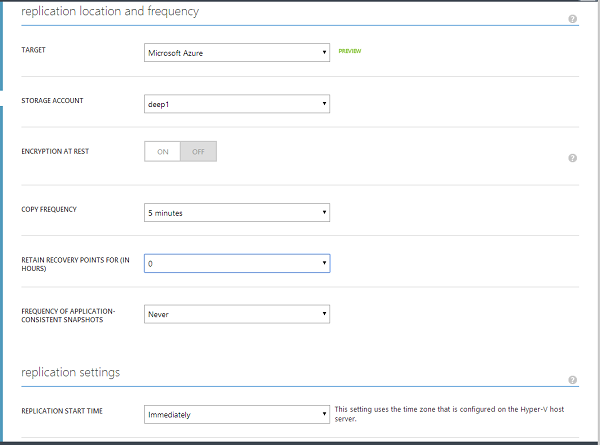
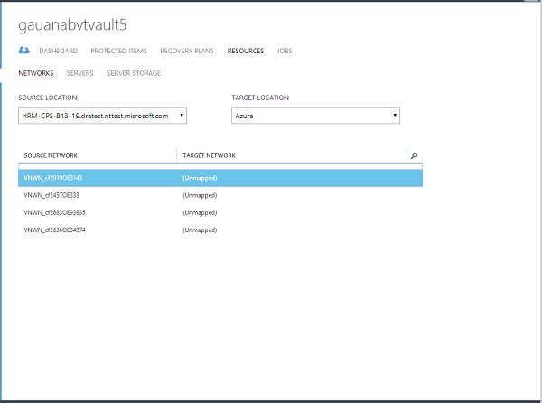
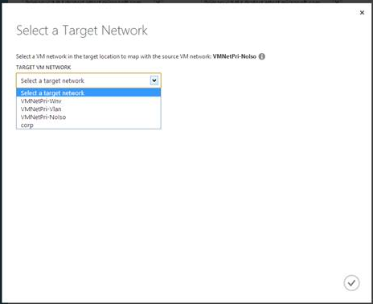
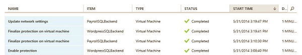
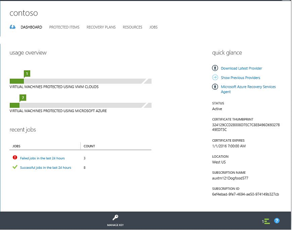

<properties linkid="configure-hyper-v-recovery-vault" urlDisplayName="configure-hyper-v-recovery-vault" pageTitle="Configure Hyper-V Recovery Manager to protect virtual machines in VMM clouds" metaKeywords="hyper-v recovery, VMM, clouds, disaster recovery" description="Windows Azure Hyper-V Recovery Manager can help you protect applications and services by coordinating the replication and recovery of virtual machines located in System Center 2012 VMM private clouds." metaCanonical="" umbracoNaviHide="0" disqusComments="1" title="Configure Windows Azure Hyper-V Recovery Manager" writer="raynew" editor="jimbe" manager="cfreeman" />

# Configure Windows Azure Hyper-V Recovery Manager

 

Windows Azure Hyper-V Recovery Manager coordinates and manages the protection of Hyper-V virtual machines located in private clouds on Virtual Machine Manager (VMM) servers in System Center 2012 Service Pack 1 (SP1), or System Center 2012 R2. Hyper-V Recovery Manager orchestrates failover of these virtual machines from one on-premise Hyper-V host server to another. Hyper-V Recovery Manager vaults in Windows Azure are used to store your protection configuration.

<h2>About this tutorial</h2>

This tutorial provides a quick walkthrough for Hyper-V Recovery Manager deployment. For more detailed information read the following:

<UL>
<LI><a href="http://go.microsoft.com/fwlink/?LinkId=321294">Planning Guide for Hyper-V Recovery Manager</a>—Provides detailed information about the planning steps you should complete before a starting a full deployment.</LI>
<LI><a href="http://go.microsoft.com/fwlink/?LinkId=321295">Deployment Guide for Hyper-V Recovery Manager</a>—Provides step-by-step instructions for a full deployment.</LI>
<LI>If you run into problems during this tutorial, take a look at <a href="http://go.microsoft.com/fwlink/?LinkId=389879">Hyper-V Recovery Manager: Common Error Scenarios and Resolutions</a> or post your questions on the <a href="http://go.microsoft.com/fwlink/?LinkId=313628">Windows Azure Recovery Services Forum</a></LI>
</UL>

<h2>Before you begin</h2> 

 

Before you start this tutorial verify the prerequisites.

<h3>Hyper-V Recovery Manager prerequisites</h3>

<UL>
<LI>**Azure account**—You'll need an Azure account with the Windows Azure Recovery Services feature enabled. If you don't have an account or the feature isn't registered, see the <a href="http://aka.ms/try-azure">Windows Azure free trial</a> and <a href="http://go.microsoft.com/fwlink/?LinkId=378268">Hyper-V Recovery Manager Pricing Details</a>.</LI>
<LI>**Certificate (.cer)**—To register VMM servers in a Hyper-V Recovery Manager vault you'll need to upload a management certificate (.cer) containing the public key to the vault. Note the following:<UL>
	<LI>For tutorial purposes you can use a self-signed certificate that you create using the Makecert.exe tool. For a full deployment you can use any valid SSL certificate that complies with the certificate prerequisites described in <a href=" http://go.microsoft.com/fwlink/?LinkId=386485">Prerequisites and Support</a> in the Planning Guide.</LI>
	<LI>Each vault has only a single .cer certificate associated with it at any time. You can upload a new certificate to overwrite an existing one as required.</LI>
</UL></LI>
<LI>**Certificate (.pfx file)**—The .cer certificate must be exported as a .pfx file (containing the private key) You import this file on each VMM server that contains virtual machines you want to protect. Then during deployment, when you install the Hyper-V Recovery Manager Provider agent on each VMM server, you select the .pfx file in order to register the VMM server with the vault.</LI>

</UL>

<h3>VMM prerequisites</h3>

<UL>
<LI>At least one VMM server running on System Center 2012 SP1 or System Center 2012 R2.</LI>
<LI>VMM private clouds. If you're running one VMM server it'll need two clouds configured. For two or more VMM servers, you'll need at least one cloud on the source VMM server you want to protect, and one cloud on the destination VMM server that you'll use for recovery. The primary cloud you want to protect must contain the following:<UL>
	<LI>One or more VMM host groups</LI>
	<LI>One or more Hyper-V host servers in each host group.</LI>
		</UL></LI>
<LI>If you want virtual machines be connected to a VM network after failover, you configure network mapping in Hyper-V Recovery Manager. Before beginning deployment verify the following:<UL>
	<LI>The virtual machine in the cloud on the source VMM server is connected to a VM network. That VM network should be linked to a logical network that is associated with the cloud.</LI>
	<LI>The target cloud on the destination VMM server has a corresponding VM network. That VM network should be linked to a corresponding logical network that is associated with the target cloud.</LI>
	</UL></LI>
	
	
To learn more about network mapping read <a href="http://go.microsoft.com/fwlink/?LinkId=324817">Prepare for network mapping</a> in the Planning Guide.

</UL>

<h2>Tutorial steps</h2> 

After verifying the prerequisites, do the following:
<UL>
<LI><a href="#createcert">Obtain and configure certificates</a>—Obtain a .cer certificate, export it as a .pfx file, and import the .pfx file to VMM servers.</LI>
<LI><a href="#vault">Step 1: Create a vault</a>—Create a Hyper-V Recovery Manager vault in Windows Azure.</LI>
<LI><a href="#upload">Step 2: Upload the certificate</a>—Upload the management certificate to the vault.</LI>
<LI><a href="#download">Step 3: Download and install the Provider</a>—Download and install the Hyper-V Recovery Manager Provider on VMM servers you want to protect. Then register the VMM servers with the vault.</LI>
<LI><a href="#clouds">Step 4: Configure cloud protection</a>—Configure protection settings for VMM clouds.</LI>
<LI><a href="#networks">Step 5: Configure network mapping</a>—Map VM networks from source VMM servers to target VMM servers.</LI>
<LI><a href="#virtualmachines">Step 6: Enable protection for virtual machines</a>—Enable protection for Hyper-V virtual machines located in the VMM clouds.</LI>
<LI><a href="#recovery plans">Step 7: Configure and run recovery plans</a>—Create and customize recovery plans that group together virtual machines for failover. Then run the recovery plan.</LI>
<LI><a href="#jobs">Step 8: Monitor</a>—Monitor settings, status, and progress using the **Jobs** and **Dashboard** tabs.</LI>
</UL>

 <h2>Obtain and configure certificates</h2>

Obtain and configure certificates as follows:
<OL>
<LI><a href="#obtaincert">Obtain a certificate for the walkthrough</a>—Obtain a certificate using the MakeCert tool, or use an existing certificate that complies with the <a href="http://go.microsoft.com/fwlink/?LinkId=321294">certificate requirements</a>.</LI>
<LI><a href="#exportcert">Export the certificate in .pfx format</a>—On the server on which the certificate resides or was created, export the .cer file as a .pfx file (with the private key). </LI>
<LI><a href="#importcert">Import the .pfx certificate to VMM servers</a>—After export of the .pfx file is complete, import it to the Personal certificate store on each VMM server that you want to register with the vault.</LI>
</OL>

<h3>Obtain a self-signed certificate (.cer)</h3>

Use the MakeCert tool to create a .cer x.509 certificate that complies with all certificate requirements, as follows:

<ol>
<LI>
On the computer on which you want to run MakeCert, download the latest version of the <a href="http://go.microsoft.com/fwlink/?LinkId=378269">Windows SDK</a>. Note that the makecert.exe command is part of the core Windows Software Development Kit so you don't need to download and install the entire SDK.</LI>
<LI>On the Specify Location page, select **Install the Windows Software Development Kit for Windows 8.1 to this computer**.</LI>
<LI>On the Join the Customer Experience Improvement Program (CEIP) page, select your preferred setting.</LI>
<LI>On the License Agreement page, click **Accept** to accept the terms.</LI>
<LI>On the Select the features you want to install page, clear all options except **Windows Software Development Kit**.</LI>
<LI>After the installation is complete, verify that makecert.exe appears in the folder C:\ProgramFiles (x86)\Windows Kits\<i>WindowsVersion</i>\bin\x64.</LI>
<LI>Open a command prompt(cmd.exe) with Administrator privileges and navigate to the makecert.exe folder.</LI> 
<LI>>Run the following command to create your self-signed certificate. Replace CertificateName with the name you want to use for the certificate, and specify the actual expiration date of your certificate after -e:</LI>
<code>
makecert.exe -r -pe -n CN=CertificateName -ss my -sr localmachine -eku 1.3.6.1.5.5.7.3.2 -len 2048 -e 01/01/2016 CertificateName.cer</code>
</ol>

The certificate will be created and stored in the same folder. You might want to move it to a more accessible location, in order to export it during the next step.

<h3>Export the certificate in .pfx format</h3>

Complete the steps in this procedure to export the .cer file in .pfx format.

<ol>
<li>From the Start screen type **mmc.exe** to start the Microsoft Management Console (MMC).</li>
<li>On the **File** menu, click **Add/Remove Snap-in**. The **Add or Remove Snap-ins** dialog box appears.</li>
<li>In **Available snap-ins**, click **Certificates**, and then click **Add**.</li>
<li>Select **Computer account**, and then click **Next**.</li>
<li>Select **Local computer**, and then click **Finish**.</li>
<li>In the MMC, in the console tree, expand **Certificates**, and then expand **Personal**.</li>
<li>In the details pane, click the certificate you want to manage.</li>
<li>On the **Action** menu, point to **All Tasks**, and then click **Export**. The Certificate Export Wizard appears. Click **Next**.</li>
<li>On the **Export Private Key** page, click **Yes** to export the private key. Click **Next**. Note that this is only required if you want to export the private key to other servers after the installation.</li>
<li>On the Export File Format page, select **Personal Information Exchange – PKCS #12 (.PFX)**. Click **Next**.</li>
<li>On the **Password** page, type and confirm the password that is used to encrypt the private key. Click **Next**.</li>
<li>Follow the pages of the wizard to export the certificate in .pfx format.</li>
</ol>

<h3>Import the .pfx certificate to VMM servers</h3>

After exporting the server, copy it to each VMM server you want to register in the vault, and then import it as follows. Note that if you ran MakeCert.exe on a VMM server, you don't need to import the certificate on that server.

 
<ol>
<li>Copy the private-key (.pfx) certificate files to a location on the local server.</li>
<li>In the Certificates MMC snap-in select** Computer account** and then click Next.</li>
<li>Select Local Computer, and click **Finish**. In the **Add/Remove Snap-ins** dialog box, click **OK**. </li>
<li>In the MMC, expand **Certificates**, right-click **Personal**, point to All Tasks, and then click **Import** to start the Certificate Import Wizard.</li>
<li>On the Certificate Import Wizard Welcome page, click **Next**.</li>
<li>On the File to Import page, click **Browse** and locate the folder that contains the .pfx certificate file that contains the certificate that you want to import. Select the appropriate file, and then click **Open**.</li>
<li>On the Password page, in the **Password** box, type the password for the private-key file that you specified in the previous procedure and then click **Next**.</li>
<li>On the Certificate Store page, select **Place all certificates in the following store**, click **Browse**, select the **Personal** store, click **OK**, and then click Next.</li>
<li>On the Completing the Certificate Import Wizard page, click **Finish**.</li>
</ol>

After you complete these steps, you'll be able to choose the .cer certificate for upload to the vault, and to select the .pfx certificate when you register a VMM server during Provider installation.

 <h2>Step 1: Create a vault</h2>

1. Sign in to the [Management Portal](https://manage.windowsazure.com).

2. Click **Data Services**, and then click **Recovery Services**.  

	

3. Click **Recovery Services**, click **Create New**,  point to **Hyper-V Recovery Manager Vault**, and then click **Quick Create**.
	
	

3. In **Name**, enter a friendly name to identify the vault.

4. In **Region**, select the geographic region for the vault. Available geographic regions include Asia Pacific Southeast, Europe North, and US East.****

5. In **Subscription**, type in your subscription details.

5. Click **Create vault**. 

Check vault status in the notifications at the bottom of the portal. A message will confirm that the vault has been successfully created. It will be listed as **Online** in the Recovery Services page.

 <h2>Step 2: Upload a certificate (.cer)</h2>

2. In the **Recovery Services** page, open the required vault.
3. Click the Quick Start icon to open the Quick Start page.

	

2. Click **Manage Certificate**.

	

3. In the **Manage Certificate** dialog box, click **Browse For File** to locate the .cer file you want to upload to the vault.

	

 <h2>Step 3: Download and install the Provider</h2>
Install the Hyper-V Recovery Manager Provider on each VMM server you want to register in the vault. The latest version of the Provider installation file is stored in the Windows Azure Download Center. When you run the file on a VMM server the Provider is installed, and the VMM server is registered with the vault.

1. On the **Quick Start** page, click **Download Provider** to obtain the Provider installation .exe file. Run this file on the VMM server to begin Provider Setup.

	

2. Follow the steps to complete the Provider installation.

	

3. After the Provider installation is complete, follow the wizard steps to register the VMM server with the vault.
4. On the Internet Connection page, specify how the Provider running on the VMM server connects to the Internet. The Provider can use the default Internet connection settings on the server, or click **Use a proxy server for Internet requests** to use custom settings.
	
	

	If you want to use custom settings during this walkthrough, read the information in <a href="http://go.microsoft.com/fwlink/?LinkId=378266">Step 2: Install the Provider and register the VMM servers</a> of the Deployment guide.

5. On the Certificate Registration page, select the .pfx file that corresponds to the .cer you uploaded to the vault. 

	

	

1. On the VMM Server page, specify a friendly name for the VMM server. This name is used to identify the server in the Hyper-V Recovery Manager console.
2. Select **Synchronize cloud data with the vault** to synchronize the data on all private clouds located on the VMM server with the Hyper-V Recovery Manager vault. This action only needs to happen once on each server. If you don't want to synchronize all clouds, you can publish each cloud individually to synchronize it, before you configure cloud protection settings.  
3. Click **Register** to complete the process. 

	

At this stage, metadata from the VMM server is retrieved by Hyper-V Recovery Manager, in order to orchestrate failover and recovery. After a server has been successfully registered its friendly name will be displayed on the **Resources** tab of the Servers page in the vault.

<h2>Step 4: Configure cloud protection settings</h2>

After VMM servers are registered, you can configure cloud protection settings. If you didn't enable the option **Synchronize cloud data with the vault** when you installed the Provider on the VMM server, you'll need to publish the cloud to Hyper-V Recovery Manager from the VMM console. After clouds are detected by Hyper-V Recovery Manager you can configure protection settings. 

<h3>Publish a cloud</h3>

1. In the VMM console, open the **VMs and Services** workspace.
2. in the **VMs and Services** pane, open the cloud you want to publish.
3. On the **General** page of the cloud properties, to publish the cloud, select **Send configuration data about this cloud to the Windows Azure Hyper-V Recovery Manager**. After the cloud is published it's displayed in the vault.

	

	

<h3>Configure clouds</h3>

To configure clouds for protection, do the following: 

1. On the Quick Start page, click **Configure Protection Settings**.
2. On the **Protected Items** tab, select the cloud that you want to configure and go to the **Configuration** tab.

	

3. In **Target Location**, specify the VMM server that manages the cloud you want to use for recovery.
4. In **Target Cloud**, specify the target cloud you want to use for failover of virtual machines in the source cloud.
5. In **Copy Frequency** leave the default setting. This value specifies how frequently data should be synchronized between source and target locations. It's only relevant when the Hyper-V host is running Windows Server 2012 R2. For other servers a default setting of five minutes is used.
6. In **Additional Recovery Points**, leave the default setting. This value specify whether you want to create addition recovery points. With a default value of zero only the latest recovery point for a primary virtual machine is stored on a replica host server. 
7. In **Application-Consistent Snapshot Frequency**, leave the default setting. This value specifies how often to create snapshots. Snapshots use Volume Shadow Copy Service (VSS) to ensure that applications are in a consistent state when the snapshot is taken.  If you do want to set this value for the tutorial walkthrough, ensure that it is set to less than the number of additional recovery points you configure.
8. In **Data Transfer Compression**, specify whether replicated data that is transferred should be compressed. 
9. In **Authentication**, specify how traffic is authenticated between the primary and recovery Hyper-V host servers. Unless you have a working Kerberos environment configured, we recommend you select HTTPS for the purpose of this walkthrough. With HTTPS selected the host servers will authenticate each other using a server certificate, and traffic will be encrypted. Hyper-V Recovery Manager configures certificates to be used for HTTPS authentication automatically. No manual configuration is required. Note that this setting is only relevant for Hyper-V host servers running on Windows Server 2012 R2.
10. In **Port**, leave the default setting. This value sets the port number on which the source and target Hyper-V host computers listen for replication traffic. 
11. In **Initial Replication Settings**, specify how the initial replication of data from source to target locations will be handled, before regular replication starts. 
	- **Over the network**—Copying data over the network can be time-consuming and resource-intensive. We recommend that you use this option if the cloud contains virtual machines with relatively small virtual hard disks, and if the primary VMM server is connected to the secondary VMM server over a connection with wide bandwidth. You can specify that the copy should start immediately, or select a time. If you use network replication, we recommend that you schedule it during off-peak hours.
	- **Offline**—This method specifies that the initial replication will be performed using external media. It's useful if you want to avoid degradation in network performance, or for geographically remote locations. To use this method you specify the export location on the source cloud, and the import location on the target cloud. When you enable protection for a virtual machine, the virtual hard disk is copied to the specified export location. You send it to the target site, and copy it to the import location. The system copies the imported information to the replica virtual machines. For a complete list of offline replication prerequisites, see <a href="http://go.microsoft.com/fwlink/?LinkId=323469">Step 3: Configure protection settings for VMM clouds</a> in the Deployment Guide.

<h4>Settings after configuring protection</h4>
After you configure a cloud, all clusters and host servers that are configured in the source and target clouds are configured for replication. Specifically, the following are configured:

- Firewall rules used by Hyper-V Replica so that ports for replication traffic are opened. 
- Certificates required for replication are installed.
- Hyper-V Replica settings are configured.

Cloud settings can be modified on the **Configure** tab. Note that:

- We recommend that you select a target cloud that meets recovery requirements for the virtual machines you'll protect. 
- A cloud can only belong to a single cloud pair — either as a primary or a target cloud.
- After saving the cloud configuration, a job will be created, and can be monitored on the **Jobs** tab. After saving the configuration, to modify the target location or target cloud you must remove the cloud configuration, and then reconfigure the cloud.

<h2>Step 5: Configure network mapping</h2>

On the **Networks** tab you configure mapping between VM networks on source and target VMM servers. Network mapping ensures that after failover replica virtual machines are connected to appropriate networks, and to ensure that replica virtual machines are placed on hosts that can access the VM networks. Verify VMM network requirements in <a href=" http://go.microsoft.com/fwlink/?LinkId=386485">Prerequisites and Support</a> in the Planning Guide. We recommend you map networks as follows: 

- Map networks used by each cloud that is configured for protection.
- Perform network mapping before enabling virtual machines for protection, because mapping is used during placement of replica virtual machines. Mapping will work correctly if you configure it after enabling protection, but you might need to migrate some replica virtual machines.  

To map networks, do the following:

1. On the Quick Start page, click **Configure Network Mapping**.
4. In **Source Location**, select the source VMM server. 
5. In **Target Location**, select the target VMM server. If you are deploying Hyper-V Recovery Manager with a single VMM server then the source and target will be the same.
The list of source VM networks and their associated target VM networks is displayed. A blank value is shown for networks that are not mapped.
6. Select an unmapped entry in the source and target list,  and click **Map**. The service detects the VM networks on the target server and displays them.  

	

7. On the Select a Target Network page, select the target VM network you want to use on the target VMM server.
	 

8. Click the information icons next to the source and target network names to view the subnets and type for each network.

	When you select a target network, the protected clouds that use the source network are displayed, and the availability of the target VM networks associated with the clouds is also displayed. We recommend that you select a target network that is available to all clouds used for protection.

8. Click the check mark to complete the mapping process. A job starts to track the mapping progress. This can be viewed on the **Jobs** tab.

	This will connect any existing replica virtual machines corresponding to the virtual machines connected to the source VM network to the target VM network. This will also connect new replica virtual machines that are created after enabling replication on the virtual machines connected to the source VM network to the target VM network.

<h3>Modify network mappings</h3>
Network mappings can be modified or removed on the **Networks** tab. Note the following:
<UL>
<LI>If you unmap a selected mapping, the mapping is removed and the replica virtual machines are disconnected from the network they were connected to at the time of mapping.</LI>
<LI>When you modify a selected mapping, changes are updated, and the replica virtual machines are connected to the new network settings provided.</LI>
</UL>

<h2>Step 6: Enable protection for virtual machines</h2>

After servers, clouds, and networks are configured correctly, you can enable protection for virtual machines in the cloud. You enable protection in the VMM console, by right-clicking each virtual machine you want to protect and selecting **Enable Recovery**.

After protection is enabled, you can see the virtual machine in the virtual machines list of the cloud. You can view progress of the enable protection action in the **Jobs** tab.

Three jobs are created when you enable protection of virtual machines. The Enable Protection job runs. Then after the initial replication completes two more Finalize Protection jobs run. The virtual machine is ready for failover only after these three jobs have completed successfully.

<h2>Step 7: Configure and run recovery plans</h2>
A recovery plan gathers virtual machines together into groups so that they can be processed as a single unit, and specifies the order in which groups should fail over. In addition to defining groups of virtual machines, you can customize recovery plans to run automatic scripts, or to wait for confirmation of manual actions. To create a recovery plan, do the following: 

1. On the Quick Start page, click **Create Recovery Plan**.
2. On the Specify the Recovery Page Name and Target page, type in a name and the source and target VMM servers. If you are deploying Hyper-V Recovery Manager on a single VMM server then the source and target server will be the same. The source VMM server must contain virtual machines with protection enabled.

	
3. In the Select Virtual Machines page, select virtual machines to add to the recovery plan. These are added to the recovery plan default group (Group 1).
4. Click the check mark to create the recovery plan. Recovery plans you create can be deleted on the **Recovery Plans** tab.

	

After creating a recovery plan, you can perform the following actions:

- Customize the plan. You can add new groups to a recovery plan, or add virtual machines to a group. You can define custom actions in the form of scripts and manual actions that are completed before and after specified groups. Group names are incremental. After the default recovery plan Group 1, you create Group 2, and then Group 3, and so on. Virtual machines fail over according to group order. For more information about customizing recovery plans, see <a href="http://go.microsoft.com/fwlink/?LinkId=378271">Step 6: Create and customize recovery plans</a> in the Deployment Guide.
- Run a test failover.

<h3>Run recovery plans</h3>
Recovery plans can run as part of a proactive test or planned failover, or during an unplanned failover. This walkthrough describes how to run a test failover. For information about the other types of failover, read the <a href="hhttp://go.microsoft.com/fwlink/?LinkId=378272">Operations and monitoring guide</a>.

<h3>Run the plan.</h3>

Run a test failover to verify your recovery plan in a test environment. A test failover is useful to verify that your recovery plan and virtual machine failover strategy are working as expected.  Test failover simulates your failover and recovery mechanism in an isolated network. 

<h5>Before you start</h5>
When a test failover is triggered, you are requested to specify how test virtual machines should be connected to networks after the failover. 
<UL>
<LI>If you want to use an existing network we recommend that you create a separate logical network  that is not used in production for this purpose.</LI>
<LI>If you select the option to automatically create a test VM network, the temporary networks and test virtual machines are cleaned up automatically after the test failover is complete.</LI>
<LI>If you are using a virtual LAN (VLAN) based logical network, ensure that the network sites you add to the logical network are isolated. </LI>
<LI>If you are using a Windows Network Virtualization-based logical network, Hyper-V Recovery Manager will automatically create isolated VM networks.</LI>
</UL>

<h5>Run a test failover</h5>
Run a test failover for a recovery plan as follows:

<OL>
<LI>On the **Recovery Plans** tab, select the required recovery plan.</LI>
<LI>To initiate the failover, click the **Test Failover** button.</LI>
<LI>On the Confirm Test Failover page, specify how virtual machines should be connected to networks after the test failover, as follows:</LI>
<UL>
<LI>**None**—Select this setting to specify that VM networks should not be used in the test failover. Use this option if you want to test individual virtual machines rather than your network configuration. It also provides a quick glance of how test failover functionality works. Test virtual machines will not be connected to networks after a failover.</LI>
<LI>**Use existing**—Use this option if you have already created and isolated a VM network to use for test failover. After the failover all test virtual machines used in the test failover will be connected to the network specified in **VM Network**.</LI>
<LI>**Create automatically**—Select this setting to specify that Hyper-V Recovery Manager should automatically create a VM network based on the setting you specify in Logical Network, and its related network sites. Use this option if the recovery plan uses more than one VM network. In the case of Windows Network Virtualization networks, this option can be used to automatically create VM networks with the same settings (subnets and IP address pools) of those in the network of the replica virtual machine. These VM networks are cleaned up automatically after the test failover is complete.</LI>
</UL>
</OL>

After the test failover is complete, do the following:

<OL>
<LI>Verify that the virtual machines start successfully.</LI>
<LI>After verifying that virtual machines start successfully, complete the test failover to clean up the isolated environment. If you selected to automatically create VM networks, clean up deletes all the test virtual machines and test networks.</LI>
<LI>Click **Notes** to record and save any observations associated with the test failover.</LI>
<LI>When a test failover is initiated for a recovery plan, the failover process is displayed on the details page of the recovery plan. You can see individual test failover steps and their status, and view or create notes associated with the test failover. In addition, details of failover jobs can be viewed by looking at the failover job on the **Jobs** tab. The details display each job associated with the failover, its status, when it was started, and its duration. You can export a job in the failover list into an Excel spreadsheet.</LI>
</OL>

Note the following:

- On the Confirm Test Failover page, details of the VMM server on which the test virtual machines will be created are displayed.  
- You can follow the progress of test failover jobs on the **Jobs** tab. 

<h2>Step 8:Monitoring</h2>
<h3>Using the Jobs tab and Dashboard</h3>

<h4>Jobs</h4>
The **Jobs** tab displays the main tasks performed by the Hyper-V Recovery Manager vault, including configuring protection for a cloud; enabling and disabling protection for a virtual machine; running a failover (planned, unplanned, or test); committing an unplanned failover; and configuring reverse replication. 

On the **Jobs** tab, you can do the following tasks:

- **Run a job query**— You can run a query to retrieve jobs that match specified criteria. You can filter for jobs using the following parameters:

- 	Find jobs that ran on a specific VMM server.
- 	Find jobs that were performed on a cloud, virtual machine, network, recovery plan in a cloud, or on all of these.
- 	Identify jobs that happened during a specific date and time range.

Note that a query can return a maximum of 200 jobs, so we recommend you narrow query parameters to return less than the maximum.

- **Get job details**—You can click on a job in the **Jobs** list in order to get more details. The details include the job name, its status, when it started and how long it lasted. On the Job details tab you can export the job details to an Excel spreadsheet, or attempt to restart a failed, skipped, or cancelled job. 
- **Export Jobs**—You can export the results of a job query to an Excel spreadsheet.
- **Restart**—You can restart jobs that failed to attempt to run them again.
- **Error Details**—For failed jobs you can click **Error Details** to get a list of errors for the job. Possible causes and recommendations are displayed for each error. The error description can be copied to the clipboard for troubleshooting.

>The **Jobs** tab provides the following information:
<UL>
<LI>**Name**—The job name</LI>
<LI>**Item**—The name of the cloud, recovery plan, VMM server, or virtual machine on which the job ran.</LI>
<LI>**Status**—Job status - completed, canceled, failed, or other</LI>
<LI>**Type**—Job type</LI>
<LI>**Started At**—When the job started</LI>
<LI>**Task Time**—The job duration</LI>
</UL>

<h4>Run a job query</h4>

You can run queries to retrieve jobs that match specified criteria, including:
<UL>
	<LI>Jobs that ran on a specific VMM server.</LI>
	<LI>Jobs that were performed on a specific cloud, virtual machine, network, recovery plan, or all of these.</LI>
	<LI>Jobs that happened during a specific time range.</LI>
</UL>
	

To run a job query do the following:
<OL>
<LI>Open the **Jobs** tab</LI>
<LI>In **Server**, specify the VMM server on which the job ran</LI>
<LI>In **Type**, specify whether the job was performed on a cloud, virtual machine, network, or recovery plan in a cloud.</LI>
<LI>In **Status**, specify the job status.</LI>
<LI>In **Duration**, specify the time range in which the job occurred.</LI>
</OL>

<h4>Dashboard</h4>

The **Dashboard** tab provides a quick overview of Hyper-V Recovery Manager usage in your organization.  It provides a centralized gateway to view virtual machines protected by Hyper-V Recovery Manager vaults. The Dashboard provided the following functionality:

On the **Dashboard** tab you can do the following tasks:

- **Download Provider**—Download the Hyper-V Recovery Manager provider for installation on a VMM server.
- **Manage Certificate**—Modify settings for the certificate associated with the vault.
- **Delete—**Delete a vault.
- **Resynchronize virtual machines**—If Hyper-V Recovery Manager detects that any primary and recovery virtual machines are not synchronized as expected, you can view a list of the relevant virtual machines and select any that you want to attempt to resynchronize from the Dashboard. 

The **Dashboard** tab provides the following information:
<UL>
<LI**>Usage Overview**—Shows the number of virtual machines that have protection managed by Hyper-V Recovery Manager.</LI>
<LI>**Quick Glance**—Displays crucial configuration information for recovery services and the Hyper-V Recovery Manager vault. It tells you whether the vault is online, which certificate is assigned to it, when the certificate expires, and subscription details for the service.</LI>
<LI>**Recent Jobs**—Shows jobs that have succeeded or failed in the last 24 hours, or jobs that are in progress or waiting for action.</LI>
<LI>**Issues**—The dashboard shows information about issues with VMM server connections, and issues with cloud configuration settings or synchronization of virtual machine replication. You can get more details of an issue, view jobs associated with the issue, or try to resynchronize virtual machines.</LI>
</UL>

<h2>Next steps</h2>
<UL>
<LI>To plan and deploy Hyper-V Recovery Manager in a full production environment, see <a href="http://go.microsoft.com/fwlink/?LinkId=321294">Planning Guide for Hyper-V Recovery Manager</a> and <a href="http://go.microsoft.com/fwlink/?LinkId=321295">Deployment Guide for Hyper-V Recovery Manager</a>.</LI>
<LI>For questions, visit the <a href="http://go.microsoft.com/fwlink/?LinkId=313628">Windows Azure Recovery Services Forum</a>.</LI> 
</UL>
