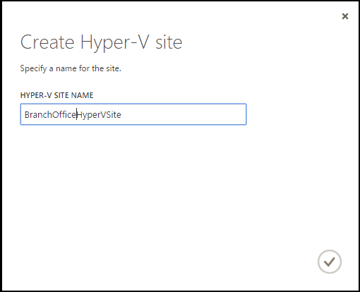
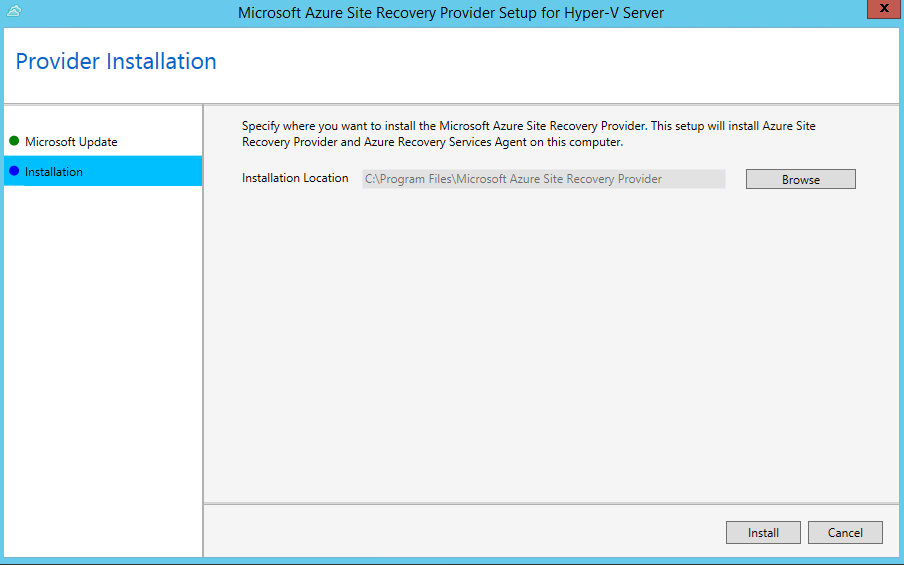
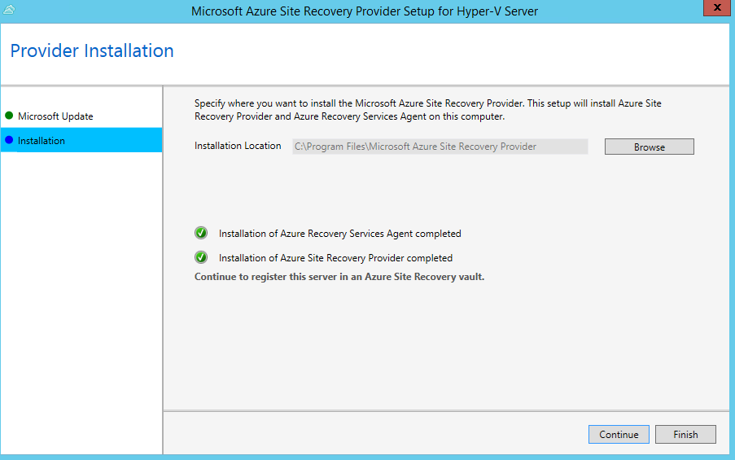
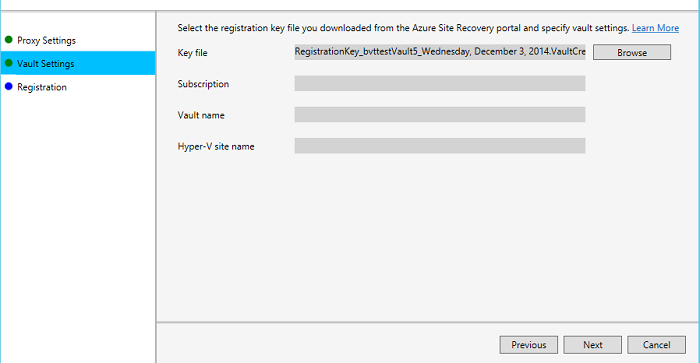
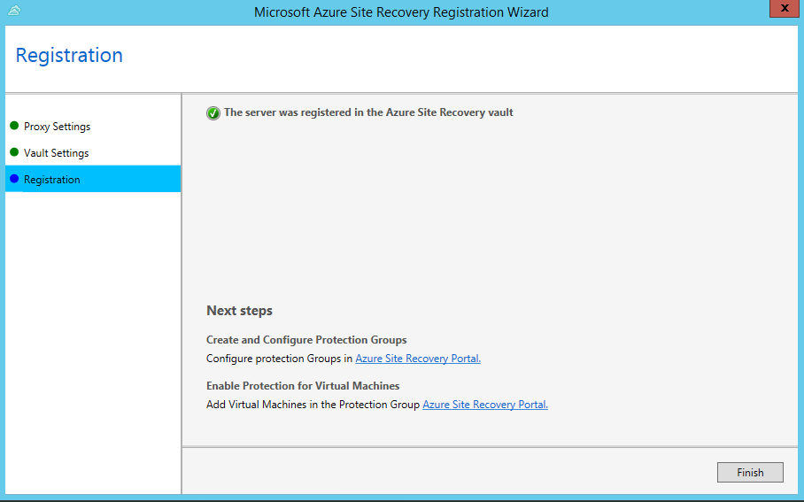
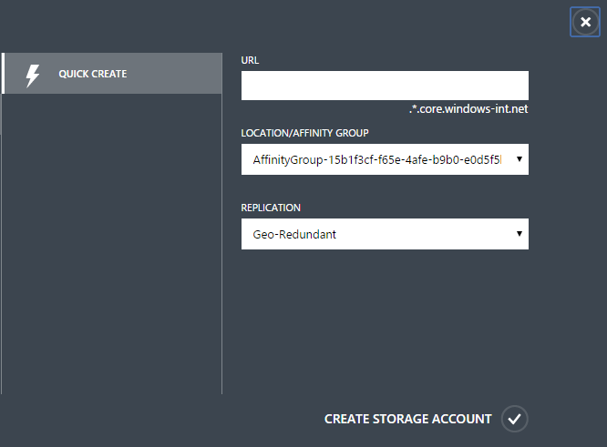
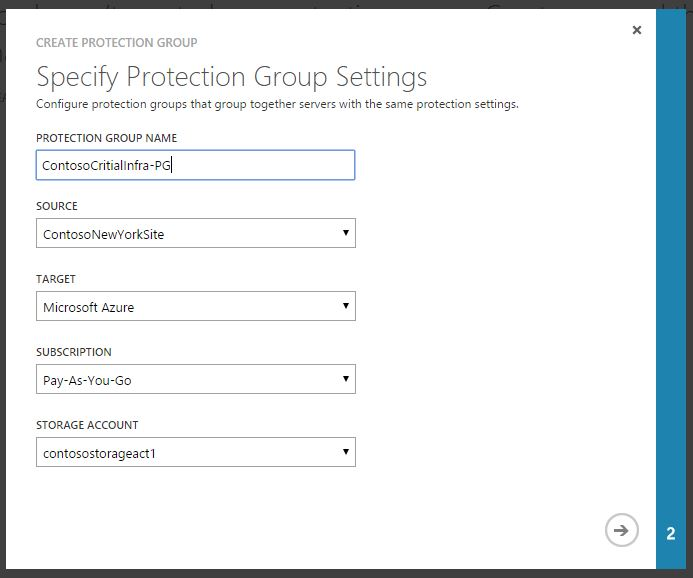
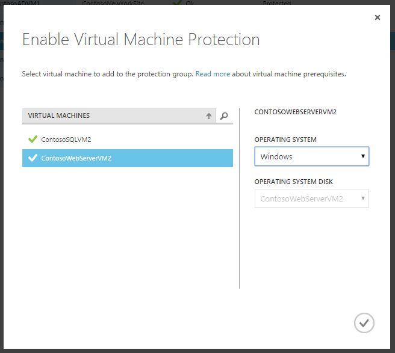
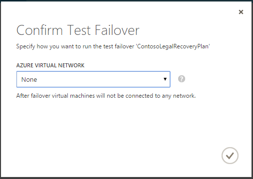

<properties 
	pageTitle="Tutorial: Set up Protection Between an On-Premises Hyper-V Site and Azure" 
	description="Azure Site Recovery coordinates the replication, failover and recovery of virtual machines between an on-premises Hyper-V site and Azure." 
	services="site-recovery" 
	documentationCenter="" 
	authors="rayne-wiselman" 
	manager="jwhit" 
	editor="tysonn"/>

<tags 
	ms.service="site-recovery" 
	ms.workload="backup-recovery" 
	ms.tgt_pltfrm="na" 
	ms.devlang="na" 
	ms.topic="article" 
	ms.date="04/17/2015" 
	ms.author="raynew"/>

# Tutorial: Set up Protection Between an On-Premises Hyper-V Site and Azure

## Overview

Azure Site Recovery contributes to your business and workload continuity strategy by orchestrating replication, failover and recovery of virtual machines in a number of deployment scenarios.

This tutorial describes how to deploy Azure Site Recovery to protect workloads running on a Hyper-V server with Windows Server 2012 R2 in an on-premises site. Virtual machines on the Hyper-V server replicate to Azure using Hyper-V replication. This deployment is particularly useful if you have Hyper-V servers in your office or branch office but System Center VMM isn't deployed.

- This tutorial uses the quickest deployment path with minimum and default settings. You can read full deployment instructions in the <a href="http://go.microsoft.com/fwlink/?LinkId=522087">Planning</a> and <a href=" http://go.microsoft.com/fwlink/?LinkId=522088">Deployment</a> guides.

- You can read about additional Azure Site Recovery deployment scenarios in <a href="http://go.microsoft.com/fwlink/?LinkId=518690">Azure Site Recovery Overview</a>.

- If you run into problems during this tutorial, review the wiki article <a href="http://go.microsoft.com/fwlink/?LinkId=389879">Azure Site Recovery: Common Error Scenarios and Resolutions</a>, or post your questions to the <a href="http://go.microsoft.com/fwlink/?LinkId=313628">Azure Recovery Services Forum</a>.

## Prerequisites

Make sure you have everything in place before you begin.

- **Azure account** — You'll need an Azure account. If you don't have one, see <a href="http://aka.ms/try-azure">Azure free trial</a>. Get pricing information at <a href="http://go.microsoft.com/fwlink/?LinkId=378268">Azure Site Recovery Manager Pricing Details</a>.
- **Hyper-V** — In the source on-premises site you'll need at least one server running Windows Server 2012 R2 with the Hyper-V role. The Hyper-V server should contain one or more virtual machines. The Hyper-V servers should be connected to the Internet, either directly or via a proxy.
- **Virtual machines** — Virtual machines you want to protect should conform with Azure prerequisites for virtual machines. See <a href="http://go.microsoft.com/fwlink/?LinkId=522287">Virtual machine support</a>.

## Tutorial steps
After verifying the prerequisites, do the following:
<UL>
<LI><a href="#vault">Step 1: Create a vault</a>—Create an Azure Site Recovery vault.</LI>
<LI><a href="#site">Step 2: Create a Hyper-V site</a>—Create a Hyper-V site as a logical container for all the Hyper-V servers that contain virtual machines you want to protect.</LI>
<LI><a href="#download">Step 3: Prepare Hyper-V servers</a>—Generate a registration key and download the Provider setup file. You run the file on each Hyper-V server in the site and select the key to register the server in the vault.</LI>
<LI><a href="#resources">Step 4: Prepare resources</a>—Create an Azure storage account to store replicated virtual machines.</LI>
<LI><a href="#protectiongroup">Step 5: Create and configure protection groups</a>—Create a protection group and apply protection settings to it. The protection settings will be applied to every virtual machine you add to the group.</LI>
<LI><a href="#enablevirtual">Step 6: Enable protection for virtual machines</a>—Enable protection for virtual machines by adding them to a protection group.</LI>
<LI><a href="#recovery plans">Step 7: Test the deployment</a>—Run a test failover for a virtual machine.</LI>

</UL>

 
### Step 1: Create a vault

1. Sign in to the [Management Portal](https://manage.windowsazure.com).

2. Expand <b>Data Services</b>, expand <b>Recovery Services</b>, and click <b>Site Recovery Vault</b>.

3. Click <b>Create New</b> and then click <b>Quick Create</b>.
	
4. In <b>Name</b>, enter a friendly name to identify the vault.

5. In <b>Region</b>, select the geographic region for the vault. To check supported regions see Geographic Availability in <a href="http://go.microsoft.com/fwlink/?LinkId=389880">Azure Site Recovery Pricing Details</a>.

6. Click <b>Create vault</b>. 

	

Check the status bar to confirm that the vault was successfully created. The vault will be listed as <b>Active</b> on the main Recovery Services page.

### Step 2: Create a Hyper-V site

1. In the Recovery Services page, click the vault to open the Quick Start page. Quick Start can also be opened at any time using the icon.

	

2. In the dropdown list, select **Between an on-premises Hyper-V site and Azure**.

	

3. In **Create a Hyper-V Site** click **Create Hyper-V site**. Specify a site name and save.

	

### Step 3: Prepare Hyper-V servers
	

1. In **Prepare Hyper-V servers**, click **Download a registration key** file.
2. On the **Download Registration Key** page, click **Download** next to the site. Download the key to a safe location that can be easily accessed by the Hyper-V server. The key is valid for 5 days after it's generated.

	

4. Click <b>Download the Provider</b> to obtain the latest version.
5. Run the file on each Hyper-V server you want to register in the vault. The file installs two components:
	- **Azure Site Recovery Provider**—Handles communication and orchestration between the Hyper-V server and the Azure Site Recovery portal. 
	- **Azure Recovery Services Agent**—Handles data transport between virtual machines running on the source Hyper-V server and Azure storage. 
6. In **Microsoft Update** you can opt in for updates. With this setting enabled, Provider and Agent updates will be installed according to your Microsoft Update policy.

	

7. In **Installation** specify where you want to install the Provider and Agent on the Hyper-V server.

	

8. After installation is complete continue setup to register the server in the vault.

	

9. On the **Internet Connection** page you specify how the Provider connects to Azure Site Recovery. Select <b>Use default system proxy settings</b> to use the default Internet connection settings configured on the server. 

	

9. On the **Vault Settings** page, click **Browse** to select the key file. Specify the Azure Site Recovery subscription, the vault name, and the Hyper-V site to which the Hyper-V server belongs.

	

11. Registration starts to register the server in the vault.

	

11. After registration finishes metadata from the Hyper-V server is retrieved by Azure Site Recovery and the server is displayed on the **Hyper-V Sites** tab on the **Servers** page in the vault.

	
**Note** For a **Hyper-V** Cluster, you need to perform steps 5-11 on each node of the **Failover Cluster**. Once all the nodes of the cluster is registered to Azure Site Recovery, protection of virtual machines will continue even if they migrate between the nodes of the **Failover Cluster** 

### Step 4: Prepare resources

1. On the Quick Start page, in **Prepare resources** select **Create Storage Account**  to create an Azure storage account if you don't have one. The account should have geo-replication enabled. It must in the same region as the Azure Site Recovery vault, and be associated with the same subscription.

	

### Step 5: Create and configure protection groups

Protection groups group together virtual machines that have the same protection settings. You apply protection settings to a protection group, and those settings are applied to all virtual machines that you add to the group.

1. In **Create and configure protection groups** click **Create a protection group**. If any prerequisites aren't in place a message is issued and you can click **View details** for more information.

2. In the **Protection Groups** tab, add a protection group. Specify a name, the source Hyper-V site, the target **Azure**, your Azure Site Recovery subscription name, and the Azure storage account.

	

2. In **Replication settings**, leave the default settings.

	

### Step 6: Enable virtual machine protection

You enable protection for virtual machines by adding them to a protection group.

1. On the <b>Machines</b> tab for the protection group, click <b>Add virtual machines to protection groups to enable protection</b>.
2. On the **Enable Virtual Machine Protection** page select the virtual machines you want to protect. 

	

	The Enable Protection jobs begins. You can track progress on the **Jobs** tab. After the Finalize Protection job runs the virtual machine is ready for failover. After protection is enabled and initial replication is complete, you can view virtual machines under the **Protected Items** > **Protection Groups** > *protectiongroup_name* > **Virtual Machines**. 
3. You can configure a virtual machines's failover properties by going to the **Protected Items** > **Protection Groups** > *protectiongroup_name* > **Virtual Machines** *virtual_machine_name* > **Configure**.
4. Configure the **Role Size** and the **Target network** settings for the virtual machine. On the **Configure** page the following properties can be modified:

	- The target size of the virtual machine when a fail-over is triggered.
     
	- The number of network adapters of the target virtual machine - Number of network adapters on a target virtual machine depends on the target size of the virtual machine chosen. The number of network adapters of target virtual machine is minimum of the number of network adapters on the source virtual machine and maximum of network adapters supported by the target size of the virtual machine chosen.  
	- Network of the target virtual machine - In case source virtual machine has more than one network adapters, then all the network adapters need to be connected to the same azure virtual network.
	- Subnet of each of the network adapters - For each network adapter the user can choose the subnet to which the failed over virtual machine would connect to.
	- Target IP - If the network adapter of source virtual machine is configured to use static IP then the user can provide the IP for the target virtual machine. User can use this capability to retain the IP of the source virtual machine after a fail-over. If no IP is provided any available IP would be given to network adapter at the time of fail-over. In case the target IP provided by user is already used by some other virtual machine that is already running in Azure then the fail-over would fail.
	
	
	

### Step 7: Test the deployment

Test your deployment to simulate your failover and recovery mechanism in an isolated network without affecting your production environment. To do this you'll run a test failover for a protected virtual machine.

1. **Protected Items** > **Protection Groups** > *protectiongroup_name* > **Virtual Machines** select the virtual machine you want to fail over, and click **Test Failover**.
2. On the **Confirm Test Failover** page select **None**. 

	

3. You can track failover progress and status on the **Job** tab.
4. When the failover reaches the **Complete testing** phase , complete the verification as follows:
	- After failover view the replica virtual machine in the Azure portal. Verify that the virtual machine starts successfully.
	- If you’re set up to access virtual machines from your on-premises network you can initiate a Remote Desktop connection to the virtual machine.
	- Click **Complete the test** to finish it.
	- Click **Notes** to record and save any observations associated with the test failover.
	- Click **The test failover is complete**. Clean up the test environment to automatically power off and delete the test virtual machine.

## Monitor activity

You can use the <b>Jobs</b> tab and <b>Dashboard</b> to view and monitor the main jobs performed by the Azure Site Recovery vault, including configuring protection for a cloud, enabling and disabling protection for a virtual machine, running a failover (planned, unplanned, or test), and committing an unplanned failover.

From the <b>Jobs</b> tab you view jobs, drill down into job details and errors, run job queries to retrieve jobs that match specific criteria, export jobs to Excel, and restart failed jobs.

From the <b>Dashboard</b> you can download the latest versions of Provider and Agent installation files, get configuration information for the vault, see the number of virtual machines that have protection managed by the vault, see recent jobs, manage the vault certificate, and resynchronize virtual machines.

For more information about interacting with jobs and the dashboard, see the <a href="http://go.microsoft.com/fwlink/?LinkId=398534">Operations and Monitoring Guide</a>.

## Next steps
<UL>
<LI>To plan and deploy Azure Site Recovery in a full production environment, see <a href="http://go.microsoft.com/fwlink/?LinkId=522087">Planning Guide for Azure Site Recovery</a> and <a href=" http://go.microsoft.com/fwlink/?LinkId=522088">Deployment Guide for Azure Site Recovery</a>.</LI>
<LI>For questions, visit the <a href="http://go.microsoft.com/fwlink/?LinkId=313628">Azure Recovery Services Forum</a>.</LI> 
</UL>
