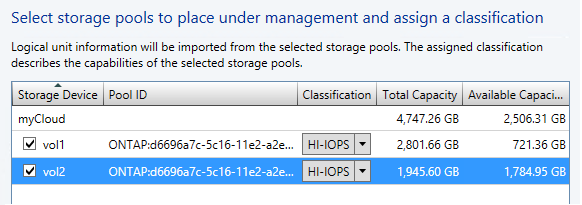
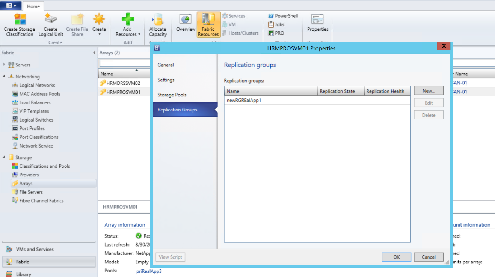

<properties linkid="configure-hyper-v-recovery-vault" urlDisplayName="configure-Azure-Site-Recovery" pageTitle="Getting Started with Azure Site Recovery: On-Premises to On-Premises VMM Site Protection with SAN" metaKeywords="Azure Site Recovery, VMM, clouds, disaster recovery, SAN" description="Azure Site Recovery coordinates the replication, failover and recovery of Hyper-V virtual machines between on-premises sites using SAN replication." metaCanonical="" umbracoNaviHide="0" disqusComments="1" title="Getting Started with Azure Site Recovery: On-Premises to On-Premises VMM Site Protection with SAN replication" editor="jimbe" manager="johndaw" authors="raynew" />

<tags ms.service="site-recovery" ms.workload="backup-recovery" ms.tgt_pltfrm="na" ms.devlang="na" ms.topic="article" ms.date="11/19/2014" ms.author="raynew" />

# Getting Started with Azure Site Recovery:  On-Premises to On-Premises VMM Site Protection with SAN replication

 

Azure Site Recovery contributes to your business and workload continuity strategy by orchestrating replication, failover and recovery of virtual machines in a number of deployment scenarios.

This tutorial describes how to deploy Azure Site Recovery to orchestrate and automate protection for workloads running on a Hyper-V server managed by System Center VMM in an on-premises site to another VMM on-premises site, using storage array-based (SAN) replication. The tutorial uses the quickest deployment path and default settings where possible. In this scenario:

<ul>
	<li>You leverage your existing SAN infrastructure to protect mission-critical applications deployed in Hyper-V clusters.</li>
	<li>SAN replication provides support for guest clusters, and ensures replication consistency across different tiers of an application with synchronized and asynchronized replication, depending on storage array capabilities.</li>
	<li>You configure and enable replication in VMM and the Azure Site Recovery vault. You'll discover and classify SAN storage in VMM, provision LUNs, and allocate storage to Hyper-V clusters. Azure Site Recovery automates replication and orchestrates failover. </li>
	</ul>

<UL>
<LI>You can read full deployment instructions in the <a href="http://go.microsoft.com/fwlink/?LinkId=321294">Planning</a> and <a href="http://go.microsoft.com/fwlink/?LinkId=519251">Deployment</a> guides.</LI>
<LI>You can read about additional Azure Site Recovery deployment scenarios in <a href="http://go.microsoft.com/fwlink/?LinkId=518690">Azure Site Recovery Overview</a>.</LI>
<LI>If you run into problems during this tutorial, review the wiki article <a href="http://go.microsoft.com/fwlink/?LinkId=389879">Azure Site Recovery: Common Error Scenarios and Resolutions</a>, or post your questions on the <a href="http://go.microsoft.com/fwlink/?LinkId=313628">Azure Recovery Services Forum</a>.</LI>
</UL>

<h2>Prerequisites</h2> 

 

Make sure you have everything in place before you begin the walkthrough.

<UL>
<LI><b>Azure account</b>—You'll need an Azure account. If you don't have one, see <a href="http://aka.ms/try-azure">Azure free trial</a>. Get pricing information at <a href="http://go.microsoft.com/fwlink/?LinkId=378268">Azure Site Recovery Manager Pricing Details</a>.</LI>
<LI>If you want to know what information is collected, processed, or transmitted during Azure Site Recovery operations, read <a href="http://go.microsoft.com/fwlink/?LinkId=513016">Privacy Requirements</a> on MSDN.</LI>
<LI><b>VMM server</b>—You'll need a VMM server in each on-premises site, deployed as a physical or virtual standalone server, or as a virtual cluster, running on System Center 2012 R2 with <a href="http://go.microsoft.com/fwlink/?LinkId=517707">VMM update rollup 5.0 preview.</a>.</LI>
<LI>You'll need a Hyper-V host cluster deployed in the primary and secondary sites, running at least Windows Server 2012 with the latest updates.</LI>
<LI><b>VMM clouds</b>—You should have at least one cloud on the primary VMM server you want to protect, and one on the secondary VMM server. The primary cloud you want to protect must contain the following:<UL>
	<LI>One or more VMM host groups</LI>
	<LI>One or more Hyper-V clusters in each host group.</LI>
	<li>One or more virtual machines located on the source Hyper-V server in the cloud.</li>
		</UL>To learn more about setting up VMM clouds, see <a href="http://go.microsoft.com/fwlink/?LinkId=513015">Plan the VMM infrastructure</a> in the Planning guide.</LI>
<LI><b>SAN storage</b>—Using SAN replication you can replicate guest-clustered virtual machines with iSCSI or fibre channel storage, or using shared virtual hard disks (vhdx). SAN prerequisites are as follows:</LI>
	<UL>
	<LI>You’ll need two SAN arrays set up, one in the primary site and one in the secondary.</LI>
	<LI>Network infrastructure should be set up between the arrays. Peering and replication should be configured. Replication licenses should be set up in accordance with the storage array requirements.</LI>
	<LI>Networking should be set up between the Hyper-V host servers and the storage array so that hosts can communicate with storage LUNs using ISCSI or Fibre Channel.</LI>
	<LI>See a list of supported storage arrays in <a href="http://go.microsoft.com/fwlink/?LinkId=518669">Deploying Azure Site Recovery with VMM and SAN - supported storage arrays</a>.</LI>
	
	<LI>SMI-S Providers, provided by EMC and NetApp should be installed, and the SAN arrays should be managed by the provider. Set up the provider in accordance with their documentation.</LI>
	<LI>Ensure that the SMI-S provider for the array is on a server that the VMM server can access over the network by IP address or FQDN.</LI>
	<LI>Each SAN array should have one or more storage pools available to use in this deployment.</LI>
	<LI>The VMM server at the primary site will need to manage the primary array and the secondary VMM server will manage the secondary array.</LI>
	</UL>
<LI><b>Networks</b>You can optionally configure network mapping to ensure that replica virtual machines are optimally placed on Hyper-V host servers after failover, and that they can connect to appropriate VM networks. When network mapping is enabled, a virtual machine at the primary location will be connected to a network and its replica at the target location will be connected to its mapped network. If you don’t configure network mapping virtual machines won’t be connected to VM networks after failover. This tutorial describes the simplest walkthrough settings and doesn't include network mapping but you can read more at:</LI>
	<UL>
	<LI><a href="http://go.microsoft.com/fwlink/?LinkId=522289">Network mapping</a> in the Planning guide.</LI>
	<LI><a href="http://go.microsoft.com/fwlink/?LinkId=522290">Enable network mapping</a> in the SAN deployment guide.</LI>
	</UL>
</UL>

<h2>Tutorial steps</h2> 

After verifying the prerequisites, do the following:

1. <a href="#VMM">Step 1: Prepare the VMM infrastructure</a>
	- Integrate and classify SAN storage in VMM
	- Provision logical units (LUNs) and storage pools and allocate storage to Hyper-V clusters.
	- Create replication groups for LUNs that should replicate together. 
2. <a href="#vault">Step 2: Create a vault</a>
3. <a href="#download">Step 3: Install the Provider on the VMM servers</a>—Generate a registration key in the vault, and download the Provider setup file. You run setup on the VMM servers to install the Provider and register the servers in the vault.
4. <a href="#storage">Step 4: Map storage arrays and pools</a>—Map arrays to specify which secondary storage pool receives replication data from the primary pool. Map storage before you configure cloud protection because the mapping information is used when  you enable protection for replication groups.
5. <a href="#clouds">Step 5: Configure cloud protection</a>—Configure protection settings for VMM clouds.
7. <a href="#replication">Step 6: Enable replication groups</a>—Before you can enable protection for virtual machines you’ll need to enable replication for storage replication groups.
8. <a href="#enablevirtual">Step 7: Enable protection for virtual machines</a>—After replication groups are replicating, enable protection for virtual machines.
9. <a href="#recovery plans">Step 8: Test the deployment</a>—You can test that virtual machines and data fail over as expected by running a test failover. 

 <h2>Step 1: Prepare the VMM infrastructure</h2>

 <h3>Integrate and classify SAN storage in VMM</h3>

1. In the **Fabric** workspace click **Storage**. Click **Home** > **Add Resources** > **Storage Devices** to start the Add Storage Devices Wizard.
2. In **Select a storage provider type** page, select **SAN and NAS devices discovered and managed by an SMI-S provider**.

	

3. On the **Specify Protocol and Address of the Storage SMI-S Provider** page select **SMI-S CIMXML** and specify the settings for connecting to the provider.
4. In **Provider IP address or FQDN** and **TCP/IP port**, specify the settings for connecting to the provider. You can use an SSL connection for SMI-S CIMXML only.

	

5. In **Run as account** specify a VMM Run As account that can access the provider, or create a new account.
6. On the **Gather Information** page, VMM automatically tries to discover and import the storage device information. To retry discovery, click **Scan Provider**. If the discovery process succeeds, the discovered storage arrays, storage pools, manufacturer, model, and capacity are listed on the page.

	

7. In **Select storage pools to place under management and assign a classification**, select the storage pools that VMM will manage and assign them a classification. LUN information will be imported from the storage pools. Create LUNs based on the applications you need to protect, their capacity requirements and your requirement for what needs to replicate together.

	

 <h3>Create LUNs and allocate storage</h3>

1. After SAN storage is integrated into VMM you'll create (provision) LUNs. For details see:
	
	- <a href="http://go.microsoft.com/fwlink/?LinkId=518490">How to select a method for creating logical units in VMM</a>
	- <a href="http://go.microsoft.com/fwlink/?LinkId=518491">How to provision storage logical units in VMM</a>	
2. Then allocate storage capacity to the Hyper-V host cluster so that VMM can deploy virtual machine data to the provisioned storage: 
	- Before allocating storage to the cluster you'll need to allocate storage to the VMM host group on which the cluster resides. See <a href="http://go.microsoft.com/fwlink/?LinkId=518493">How to allocate storage logical units to a host group</a> and <a href="http://go.microsoft.com/fwlink/?LinkId=518492">How to allocate storage pools to a host group</a>.
	- Allocate storage capacity to the cluster as described in <a href="http://go.microsoft.com/fwlink/?LinkId=513017">How to configure storage on a Hyper-V host cluster in VMM</a>.
	

 <h3>Create replication groups</h3>

1. Create a replication group which includes all the LUNs that will need to replicate together.
2. In the VMM console open the **Replication Groups** tab of the storage array properties, and click **New**.
	

 <h2>Step 2: Create a vault</h2>
After you validate the deployment prerequisites, create an Azure Site Recovery vault. Alternatively you can use an existing vault and configure SAN replication.

1. Sign in to the [Management Portal](https://manage.windowsazure.com).

2. Expand <b>Data Services</b>, expand <b>Recovery Services</b>, and click <b>Site Recovery Vault</b>.

3. Click <b>Create New</b> and then click <b>Quick Create</b>.
	
4. In <b>Name</b>, enter a friendly name to identify the vault.

5. In <b>Region</b>, select the geographic region for the vault. To check supported regions see Geographic Availability in <a href="http://go.microsoft.com/fwlink/?LinkId=389880">Azure Site Recovery Pricing Details</a>

6. Click <b>Create vault</b>. 

	

Check the status bar to confirm that the vault was successfully created. The vault will be listed as <b>Active</b> on the main Recovery Services page.

 <h2>Step 2: Configure the vault</h2>

1. In the <b>Recovery Services</b> page, click the vault to open the Quick Start page. Quick Start can also be opened at any time using the icon.

	

2. In the dropdown list, select **Between Hyper-V on-premises site using array replication**.

 <h2>Step 3: Install the Azure Site Recovery Provider</h2>
After you’ve created the vault, generate a registration file that includes a registration key. You select this file when you install the Azure Site Recovery Provider. 

1. On the <b>Quick Start</b> page, in **Prepare VMM servers**, click **Generate registration key** file. The key is valid for 5 days after it's generated. You should download the file to a safe location that VMM servers can access. For example a share. You'll need to select this file when you set up the Provider.

	

2. On the <b>Quick Start</b> page, in **Prepare VMM servers**, click <b>Download Microsoft Azure Site Recovery Provider for installation on VMM servers</b> to obtain the latest version of the Provider installation file.
3. Run this file on the source and target VMM servers.
4. In **Pre-requirements Check** select to stop the VMM service to begin Provider setup. The service stops and will restart automatically when setup finishes. 

	

5. In **Microsoft Update** you can opt in for updates. With this setting enabled Provider updates will be installed according to your Microsoft Update policy.

After the Provider is installed continue setup to register the server in the vault.

6. On the Internet Connection page specify how the Provider running on the VMM server connects to the Internet. select <b>Use default system proxy settings</b> to use the default Internet connection settings configured on the server.

	

7. In **Registration Key**, select that you downloaded from Azure Site Recovery and copied to the VMM server.
8. In **Server name**, specify a friendly name to identify the VMM server in the vault.

	

9. In **Initial cloud metadata** sync select whether you want to synchronize metadata for all clouds on the VMM server with the vault. This action only needs to happen once on each server. If you don't want to synchronize all clouds, you can leave this setting unchecked and synchronize each cloud individually in the cloud properties in the VMM console.

10. The **Data Encryption** option isn’t relevant in this scenario. 

	

11. Click <b>Register</b> to complete the process. After registration, metadata from the VMM server is retrieved by Azure Site Recovery. The server is displayed on the <b>Resources</b> tab on the **Servers** page in the vault. After Provider installation you modify Provider settings in the VMM console.

 
<h2>Step 4: Map storage arrays and pools</h2>

You'll need to create mapping between storage arrays and pools in the primary and secondary sites.

Before you start check that clouds appear in the vault. Clouds are detected either by selecting to synchronize all clouds when you install the Provider, or by selecting to synchronize a specific cloud on the **General** tab of the cloud properties in the VMM console. Then map storage arrays as follows:

1. Click **Resources** > **Server Storage** > **Map Source and Target Arrays**.
	
2. Select the storage arrays on the primary site and map them to storage arrays on the secondary site.
3.  Map source and target storage pools within the arrays. To do this, in **Storage Pools** select a source and target storage pool to map.

	

<h2>Step 5: Configure cloud protection settings</h2>

After VMM servers are registered, you can configure cloud protection settings. You enabled the option **Synchronize cloud data with the vault** when you installed the Provider so all clouds on the VMM server will appear in the <b>Protected Items</b> tab in the vault.

1. On the Quick Start page, click **Set up protection for VMM clouds**.
2. On the **Protected Items** tab, select the cloud that you want to configure and go to the **Configuration** tab. Note that:
3. In <b>Target</b>, select <b>VMM</b>.
4. In <b>Target location</b>, select the on-site VMM server that manages the cloud you want to use for recovery.
5. In <b>Target cloud</b>, select the target cloud you want to use for failover of virtual machines in the source cloud. Note that:
	- We recommend that you select a target cloud that meets recovery requirements for the virtual machines you'll protect.
	- A cloud can only belong to a single cloud pair — either as a primary or a target cloud.
6. Azure Site Recovery verifies that clouds have access to SAN replication capable storage, and that the storage arrays are peered. Participating array peers are displayed.
7. If verification is successful, in **Replication type**, select **SAN**.

After you save the settings a job will be created and can be monitored on the <b>Jobs</b> tab. Cloud settings can be modified on the <b>Configure</b> tab. If you want to modify the target location or target cloud you must remove the cloud configuration, and then reconfigure the cloud.

<h2>Step 6: Enable replication for replication groups</h2>

Before you can enable protection for virtual machines you’ll need to enable replication for storage replication groups. 

1. In the Azure Site Recovery portal, in the properties page of the primary cloud open the **Virtual Machines** tab. Click **Add Replication Group**.
2. Select one or more VMM replication groups that are associated with the cloud, verify the source and target arrays, and specify the replication frequency.

When this operation is complete, Azure Site Recovery, together with VMM and the SMI-S providers provision the target site storage LUNs and enable storage replication. If the replication group is already replicated, Azure Site Recovery reuses the existing replication relationship and updates the information in Azure Site Recovery.

<h2>Step 7: Enable virtual machine protection</h2>

After a storage group is replicating, enable protection for virtual machines in the VMM console using either of the following methods:

- **New virtual machine**—In the VMM console when you create a new virtual machine you enable Azure Site Recovery protection and associate the virtual machine with the replication group.
With this option VMM uses intelligent placement to optimally place the virtual machine storage on the LUNs of the replication group. Azure Site Recovery orchestrates the creation of a shadow virtual machine on the secondary site, and allocates capacity so that replica virtual machines can be started after failover.
- **Existing virtual machine**—If a virtual machine is already deployed in VMM, you can enable Azure Site Recovery protection, and do a storage migration to a replication group. After completion, VMM and Azure Site Recovery detect the new virtual machine and start managing it in Azure Site Recovery for protection. A shadow virtual machine is created on the secondary site, and allocated capacity so that the replica virtual machine can be started after failover.

	
	

After virtual machines are enabled for protection they appear in the Azure Site Recovery console. You can view virtual machine properties, track status, and fail over replication groups that contain multiple virtual machines. Note that in SAN replication all virtual machines associated with a replication group must fail over together. This is because failover occurs at the storage layer first. It’s important to group your replication groups properly and place only associated virtual machines together.

Track progress of the Enable Protection action in the **Jobs** tab, including the initial replication. After the Finalize Protection job runs the virtual machine is ready for failover. 
	

<h2>Step 8: Test the deployment</h2>

Test your deployment to make sure virtual machines and data fail over as expected. To do this you'll create a recovery plan by selecting replication groups.Then run a test failover on the plan.

1. On the **Recovery Plans** tab, click **Create Recovery Plan**.
2. Specify a name for the recovery plan, and source and target VMM servers. The source server must have virtual machines that are enabled for failover and recovery. Select **SAN** to view only clouds that are configured for SAN replication.
3.
	

4. In **Select Virtual Machine**, select replication groups. All virtual machines associated with the replication group will be selected and added to the recovery plan. These virtual machines are added to the recovery plan default group—Group 1. you can add more groups if required. Note that after replication virtual machines will start up in accordance with the order of the recovery plan groups.

		
5. After a recovery plan has been created, it appears in the list on the **Recovery Plans** tab. 
6. On the **Recovery Plans** tab, select the plan and click **Test Failover**.
7. On the **Confirm Test Failover** page, select **None**. Note that with this option enabled the failed over replica virtual machines won't be connected to any network. This will test that the virtual machine fails over as expected but does not test your replication network environment. If you want to run a more comprehensive test failover see <a href="http://go.microsoft.com/fwlink/?LinkId=522291">Test an on-premises deployment on MSDN</a>.

	

8. The test virtual machine will be created on the same host as the host on which the replica virtual machine exists. It isn’t added to the cloud in which the replica virtual machine is located.
9. After replication the replica virtual machine will have an IP address that isn’t the same as the IP address of the primary virtual machine. If you're issuing addresses from DHCP then will be updated automatically. If you're  not using DHCP and you want to make sure the addresses are the same you'll need to run a couple of scripts.
10. Run this sample script to retrieve the IP address.
    **$vm = Get-SCVirtualMachine -Name <VM_NAME>
	$na = $vm[0].VirtualNetworkAdapters>
	$ip = Get-SCIPAddress -GrantToObjectID $na[0].id
	$ip.address**  
11. Run this sample script to update DNS, specifying the IP address you retrieved using the previous sample script.

	**[string]$Zone,
	[string]$name,
	[string]$IP
	)
	$Record = Get-DnsServerResourceRecord -ZoneName $zone -Name $name
	$newrecord = $record.clone()
	$newrecord.RecordData[0].IPv4Address  =  $IP
	Set-DnsServerResourceRecord -zonename com -OldInputObject $record -NewInputObject $Newrecord**

<h3>Monitor activity</h3>

You can use the <b>Jobs</b> tab and <b>Dashboard</b> to view and monitor the main jobs performed by the Azure Site Recovery vault, including configuring protection for a cloud, enabling and disabling protection for a virtual machine, running a failover (planned, unplanned, or test), and committing an unplanned failover.

From the <b>Jobs</b> tab you view jobs, drill down into job details and errors, run job queries to retrieve jobs that match specific criteria, export jobs to Excel, and restart failed jobs.

From the <b>Dashboard</b> you can download the latest versions of Provider and Agent installation files, get configuration information for the vault, see the number of virtual machines that have protection managed by the vault, see recent jobs, manage the vault certificate, and resynchronize virtual machines.

For more information about interacting with jobs and the dashboard, see the <a href="http://go.microsoft.com/fwlink/?LinkId=398534">Operations and Monitoring Guide</a>.

	
<h2>Next steps</h2>
<UL>
<LI>To plan and deploy Azure Site Recovery in a full production environment, see <a href="http://go.microsoft.com/fwlink/?LinkId=321294">Planning Guide for Azure Site Recovery</a> and <a href="http://go.microsoft.com/fwlink/?LinkId=321295">Deployment Guide for Azure Site Recovery</a>.</LI>
<LI>For questions, visit the <a href="http://go.microsoft.com/fwlink/?LinkId=313628">Azure Recovery Services Forum</a>.</LI> 
</UL>
