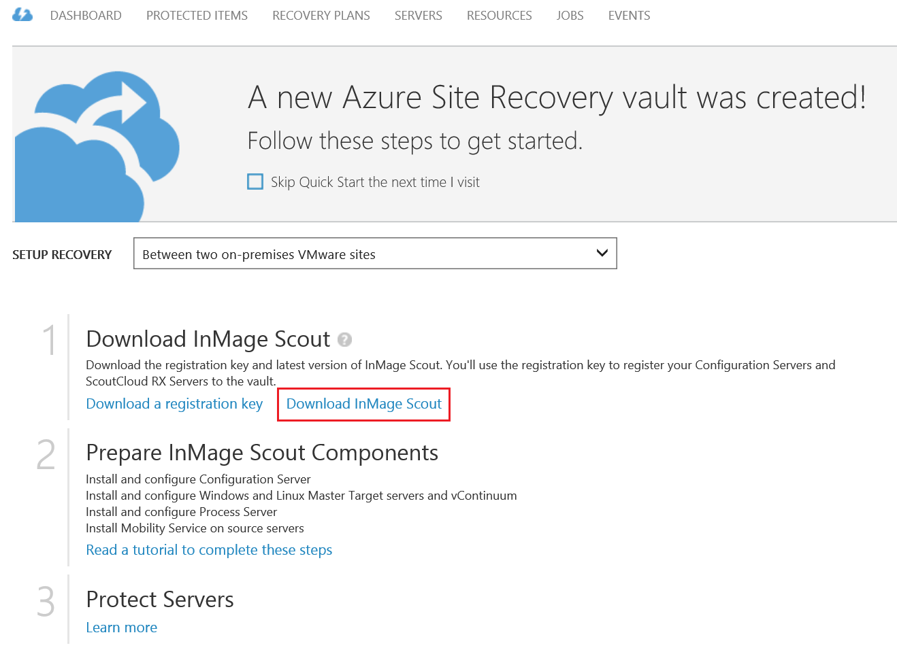

<properties 
	pageTitle="Tutorial: Set up Protection Between On-Premises VMWare Sites" 
	description="InMage Scout in Azure Site Recovery handles the replication, failover and recovery between on-premises VMWare sites." 
	services="site-recovery" 
	documentationCenter="" 
	authors="rayne-wiselman" 
	manager="jwhit" 
	editor="tysonn"/>

<tags 
	ms.service="site-recovery" 
	ms.workload="backup-recovery" 
	ms.tgt_pltfrm="na" 
	ms.devlang="na" 
	ms.topic="article" 
	ms.date="02/18/2015" 
	ms.author="raynew"/>

# Tutorial: Set up Protection Between On-Premises VMWare Sites

##Overview

InMage Scout in Azure Site Recovery provides real-time replication between on-premises VMWare sites . InMage Scout is included in subscriptions to the Azure Site Recovery service.

##Prerequisites

* <b>Azure account</b>—You'll need an Azure account. If you don't have one, see <a href="http://aka.ms/try-azure">Azure free trial</a>. Get subscription pricing information at <a href="http://go.microsoft.com/fwlink/?LinkId=378268">Azure Site Recovery Manager Pricing Details</a>.

##Tutorial steps
### Step 1: Create a vault and download InMage Scout

1. Sign in to the [Management Portal](https://manage.windowsazure.com).

2. Expand <b>Data Services</b>, expand <b>Recovery Services</b>, and click <b>Site Recovery Vault</b>.

3. Click <b>Create New</b> and then click <b>Quick Create</b>.
	
4. In <b>Name</b>, enter a friendly name to identify the vault.

5. In <b>Region</b>, select the geographic region for the vault. To check supported regions see Geographic Availability in <a href="http://go.microsoft.com/fwlink/?LinkId=389880">Azure Site Recovery Pricing Details</a>

6. Click <b>Create vault</b>. 

	

Check the status bar to confirm that the vault was successfully created. The vault will be listed as <b>Active</b> on the main Recovery Services page.

### Step 2: Configure the vault

1. In the <b>Recovery Services</b> page, click the vault to open the Quick Start page. Quick Start can also be opened at any time using the icon.

	

2. In the dropdown list, select **Between two on-premises VMWare sites**.
3. Download InMage Scout.
	
	

4. Set up replication between two VMWare sites using the InMage Scout documentation that's downloaded with the product.

##Next steps

* For questions, visit the <a href="http://go.microsoft.com/fwlink/?LinkId=313628">Azure Recovery Services Forum</a>.
