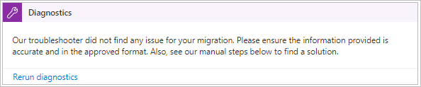
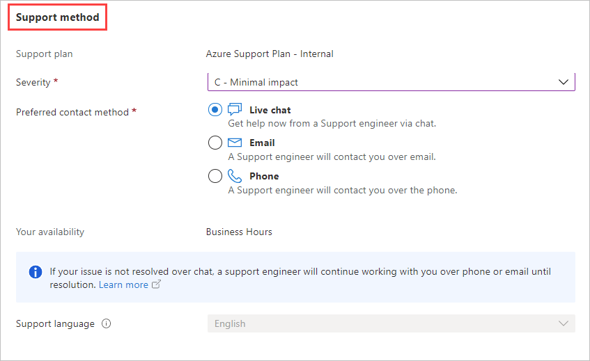
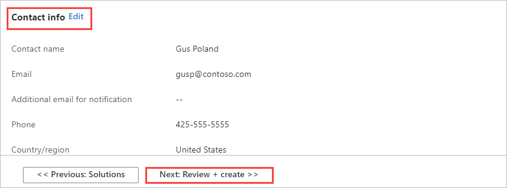
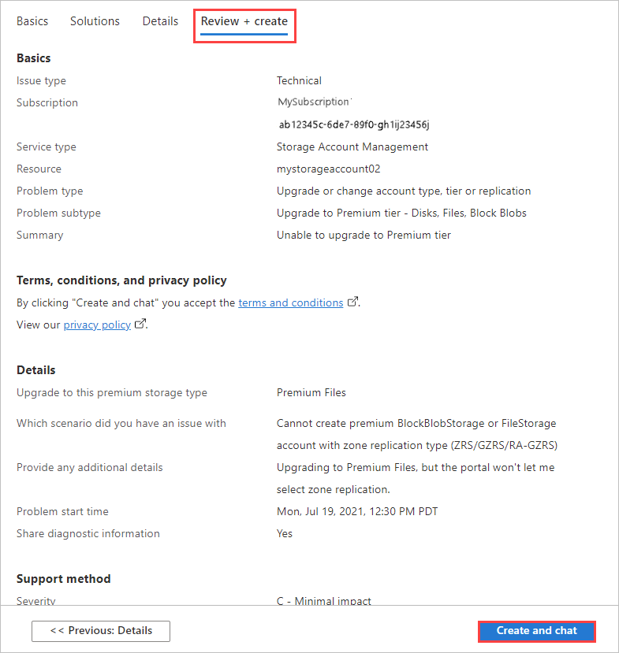

# Open a support ticket for an Import/Export job

If you encounter any issues with your Import/Export service, you can create a service request for technical support.  

This article walks you through:

* How to create a support request
* How to manage a support request lifecycle from within the portal

## Create a support request

Perform the following steps to create a support request:

1. Go to your import/export job. Under **Support + Troubleshooting**, select **New support request**.
     
    
   
1. In **Basics** for **New support request**:

   1. Enter required basic information:

      |Option|Description|
      |------|-----------|
      |**Summary** | Briefly describe your issue. |
      |**Issue type**|Select **Technical**.|
      |**Subscription**|Choose the subscription used for the resource.|
      |**Service**|Select **My services**. Then select the **Service type** from the dropdown list. For an import/export order, you'll select **Storage Account Management**, **Blob Storage**, or **File Storage**.|
      |**Resource**|Select the resource.|
 
   1. You'll see a new **Problem type** field. Select the problem type. Then select a problem subtype in the **Problem subtype** field that appears.

   

   Select **Next: Solutions>>** to proceed.

1. Use the **Solutions** tab to get expert solutions, provided by Azure engineers, without needing a support ticket.

   1. Use the **Diagnostics** fields to provide more info about your problem.
   1. Enter the **Problem start time**.
   1. Then select **Submit** to get insights into the problem you described.

       

       Review the insights, which are displayed beneath the **Submit** option. Each insight gives more info about the issue, potential solutions, and links to resources.

       

      If you don't find the solution to your problem, select **Next: Details>>** to proceed with a support request.

1. Use the **Details** pane to provide info for a support ticket:<!--This seems like too much detail. I went to the level of detail that were required to include the fields noted in the current article. In a Q&A form with no real "gotcha's," this seems like overkill.-->

   - **Problem details**: Describe the problem for Microsoft support.  
   
       You can attach a file if needed. In **File upload**, select the folder icon to browse to any files you want to upload. To get help with your upload, select the **i** icon by **File upload**.

      

   - **Share diagnostic information?** Select **Yes** if you'd like to allow Microsoft support to review diagnostic data from your services. Having access to these diagnostics can help the support representative investigate more quickly.

     

 
   - **Support method**: Indicate the severity of the problem, and tell Microsoft support when and how you'd like to be contacted:
      - For **Severity**, accept **C - Minimal impact**. Support will increase the severity if needed.
      - If you select **Live chat** as your **Preferred contact method**, the support engineer will continue working with you over the phone or email until your problem is resolved.

     

   - **Contact info**: Edit the contact information for your support plan if needed.

     
   
   When you finish, select **Next: Review + create >>** to proceed.

1. Review your support request on the **Review + create** tab. If you need to make changes, open **Details** again. 
 
   Select **Create** when you're ready to submit your support request. If your preferred contact method was **Live chat**, select **Create and chat** to immediately start a chat session.

    

## Manage a support request

After creating a support ticket, you can manage the lifecycle of the ticket from within the portal.

#### To manage your support requests

1. To get to the help and support page, navigate to **Browse > Help + support**.

    

2. A tabular listing of **Recent support requests** is displayed in **Help + support**.

     

3. Select and click a support request. You can view the status and the details for this request. Select **+ New message** if you want to follow up on this request.

    <!--Crop this down?-->

## Next steps

Learn how to [Use the Azure Import/Export to transfer data to and from Azure Storage](storage-import-export-service.md).
