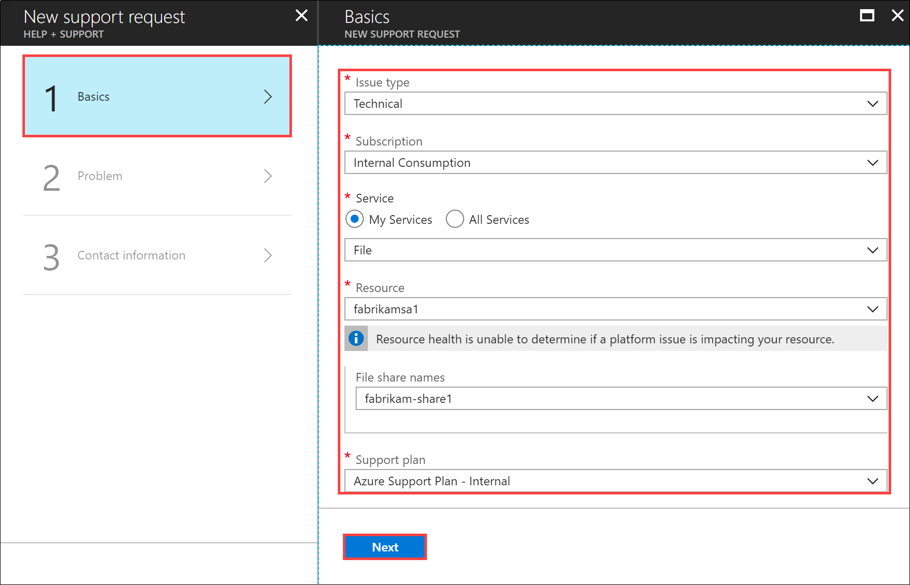
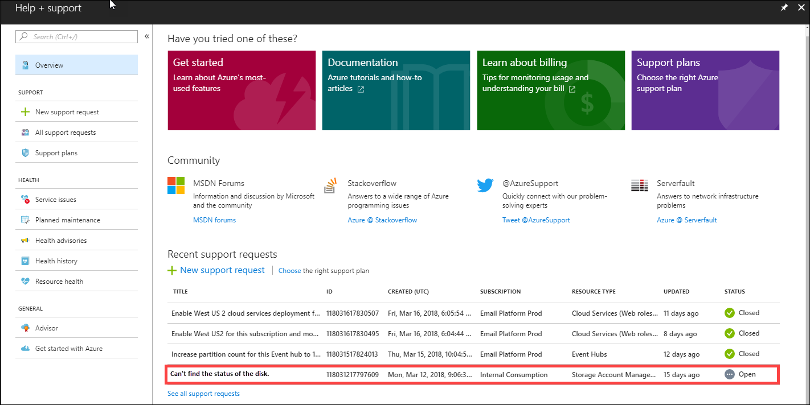

# Open a support ticket for an Import/Export job

If you encounter any issues with your Import/Export service, you can create a service request for technical support. This article walks you through:

* How to create a support request
* How to manage a support request lifecycle from within the portal

## Create a support request

Perform the following steps to create a support request:

1. Go to your import/export job. Under **Support + Troubleshooting**, select **New support request**.
     
    
   
2. In **Basics** for **New support request**, do the following steps to enter required basic information for the support request:
    
   1. From the **Issue type** dropdown list, select **Technical**.
   1. Choose your **Subscription**.
   1. Under **Service**, select **My services**. In the **Service type** dropdown list, you can select one of the options - **Storage Account Management**, **Blob Storage**, or **File Storage**.     
   1. Select the **Resource**.
   1. In **Summary**, enter a brief summary of the issue. 
   1. Two additional options are displayed. You must select a **Problem type** and **Problem subtype** before you can proceed.
   1. After you complete the basic information, select **Next: Solutions>>** to proceed.

   

3. Use the **Solutions** screen to help you fix common issues for the problem you described.

   - Use the **Troubleshooter** tool to help guide you to a specific action for the issue you encountered. Each choice presents more questions to help you drill down to a specific solution.

      

      When you've answered all questions, select **Submit** to run diagnostics and get a suggested solution.<!--Clocking through, I can't get actual solution text. Can someone tell me a sequence of options that will produce actual KB?-->

       

   - Use the **Recommended solution** section to find resources that may give you more insight into your issue.
   
   If you haven't found the solution in **Solutions**, select **Next: Details>>** to proceed with the support request.

4. In **Details**, select **Step 2 Problem**. In **Problem**, do the following steps:
    
    1. Choose the **Severity** as **C - Minimal impact**. Support will update it if needed.
    2. Select the **Problem type** as **Data Migration**.<!--Too many substeps.Economize.-->
    3. Choose the **Category** as **Import - Export**.
    4. Provide a **Title** for the issue and more **Details**.
    5. Provide the start date and time for the problem.
    6. In the **File upload**, select the folder icon to browse any other files you want to upload.
    7. Check **Share diagnostic information**.
    8. Select **Next**.

       

STOPPING HERE. 03/10

4. In **Details**, enter details about the support issue.<!--Bullets moved in as is from Step 1 to capture level of detail. Rework per Details screen!-->
   - If you choose **Storage Account Management**, select **Resource**, and **Support plan**.
    
   - If you choose **Blob**, select **Resource**, **Container names** (optional), and **Support plan**.
     
    - If you choose **File**, select **Resource**, **File share names** (optional), and **Support plan**
      -->

4. In **New support request**, select **Step 3 Contact information**. In **Contact information**, do the following steps:

   1. In the **Contact options**, provide your preferred contact method (phone or email) and the language. The response time is automatically selected based on your subscription plan.
   2. In the Contact information, provide your name, email, optional contact, country/region. Select the **Save contact changes for future support requests** checkbox.
   3. Select **Create**.
   
          

      Microsoft Support will use this information to reach out to you for further information, diagnosis, and resolution.
      After you've submitted your request, a Support engineer will contact you to continue with your request.

## Manage a support request

After creating a support ticket, you can manage the lifecycle of the ticket from within the portal.

#### To manage your support requests

1. To get to the help and support page, navigate to **Browse > Help + support**.

       

2. A tabular listing of **Recent support requests** is displayed in **Help + support**.

     

3. Select and click a support request. You can view the status and the details for this request. Select **+ New message** if you want to follow up on this request.

     

## Next steps

Learn how to [Use the Azure Import/Export to transfer data to and from Azure Storage](storage-import-export-service.md).
