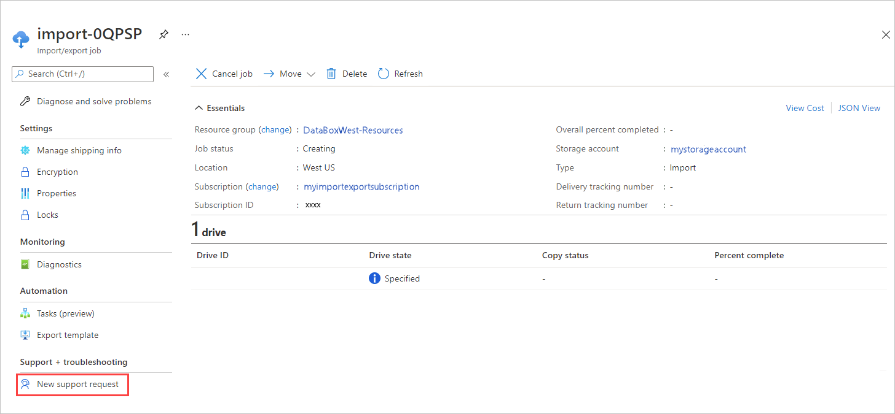
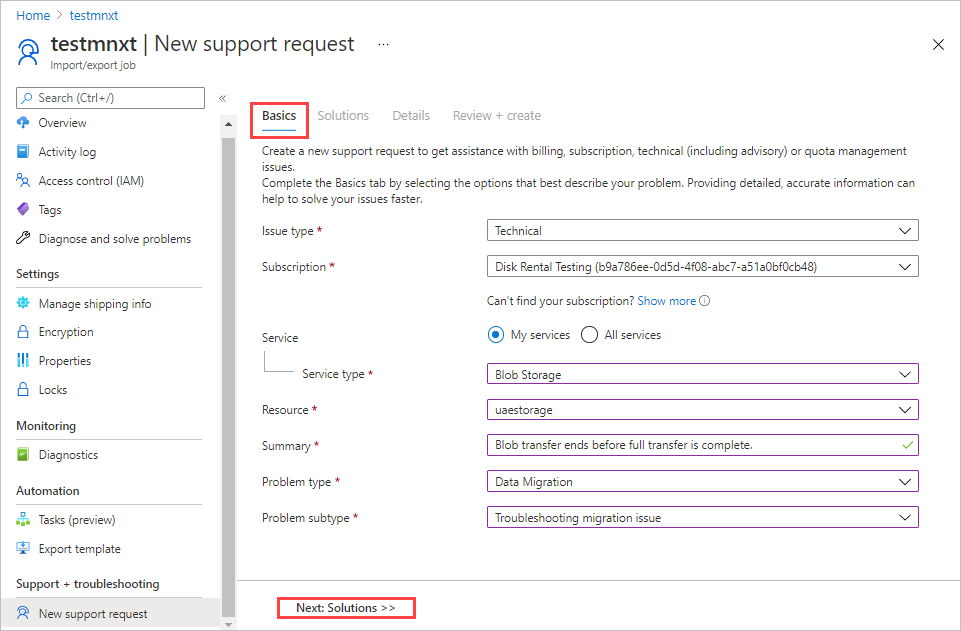
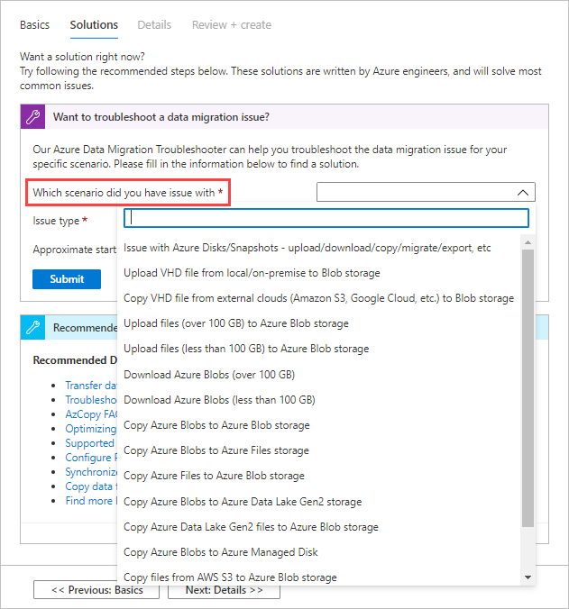
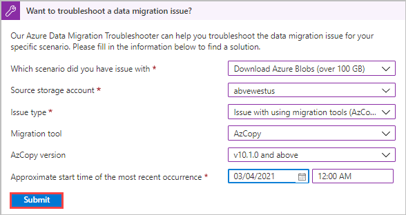
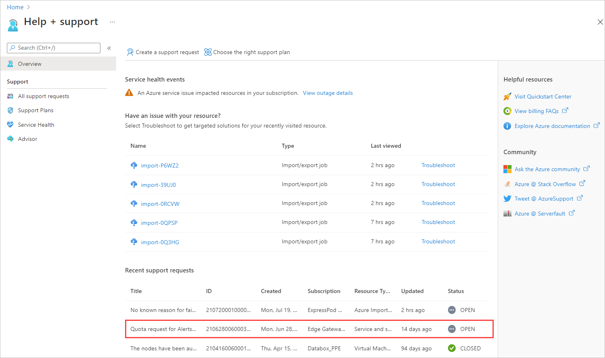
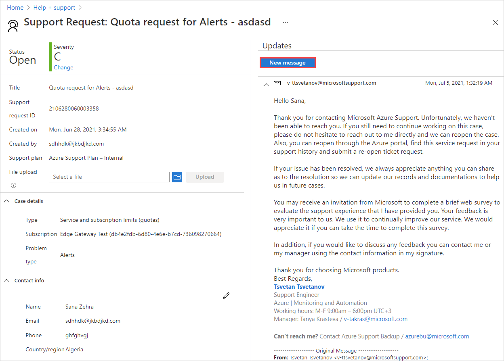

# Open a support ticket for an Import/Export job

If you come across any issues with your Import/Export service, you can create a service request for technical support.  

This article walks you through:

* How to create a support request 
* How to manage a support request lifecycle from within the portal

## Create a support request

Do the following steps to create a support request:

1. Go to your Import/Export job. Under **Support + Troubleshooting**, select **New support request**.
     
    
   
1. On the **Basics** tab, enter required basic information. Basic info about your Import/Export order is already filled in.

     |Option|Description|
     |------|-----------|
     |**Summary** | Briefly describe your issue.|
     |**Issue type**|Select **Technical**.|
     |**Subscription**|Select the subscription for the Import/Export order. |
     |**Service**|Select **My services**.|
     | **Service type**| Select **Azure Import/Export Service**.|
     |**Resource**|Select the Import/Export order.|
     |**Problem type**|Select a problem type from among the problem types for Import/Export orders.|
     |**Problem subtype**|Select the appropriate subtype for the problem type.|
 
     

   Select **Next: Solutions>>** to continue.

1. The **Solutions** tab shows expert solutions for the problem you described. If you don't find the solution to your problem, select **Next: Details>>** to proceed with a support request.

    

1. Use the **Details** tab to provide info for a support ticket.

    |Grouping|Options|
    |--------|-------------------|
    |**Problem details**|<ul><li>**When did the problem start?** Using your local time, enter the data and time when the problem started.</li><li>**Details**: Describe the problem you're experiencing.</li><li>**File upload**: You can attach one or more files if needed. Select the folder icon. Then browse to any files you want to upload.</li></ul>|
    |**Share diagnostic information**|<ul><li>Select **No**. Azure support will ask you for more information if they need it.</li></ul>|
    |**Support method**|<ul><li>Leave the **Severity** at **C - Minimal Impact**. Azure support will adjust the severity level based on the information you provided.</li><li>Otherwise, tell how you'd like to be contacted - by email or by phone, and in what language?</li></ul>|
    |**Contact info**|<ul><li>You can edit your contact information if needed.</li></ul>|

    

    Select **Next: Review + create >>** to continue.

1. Review your support request on the **Review + create** tab. Make any changes that are needed. Then select **Create**. 

    

## Manage a support request

After creating a support ticket, you can manage the lifecycle of the ticket from within the portal.

#### To manage your support requests

1. To get to the help and support page, navigate to **Browse > Help + support**.

    

2. A tabular listing of **Recent support requests** is displayed in **Help + support**.

     

3. Select and click a support request. You can view the status and the details for this request. Select **+ New message** if you want to follow up on this request.

    

## Next steps

Learn how to [Use the Azure Import/Export to transfer data to and from Azure Storage](storage-import-export-service.md).
