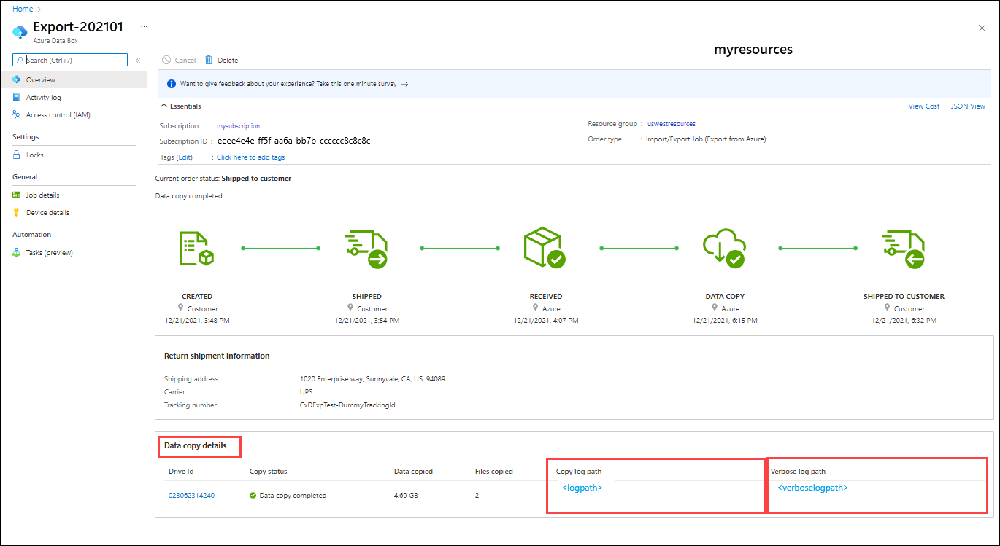

# Tutorial: Export data from Azure Blob storage with Azure Import/Export

This article provides step-by-step instructions on how to use the Azure Import/Export service to securely export large amounts of data from Azure Blob storage. The service requires you to ship empty drives to the Azure datacenter. The service exports data from your storage account to the drives and then ships the drives back.

In this tutorial, you learn how to:

> [!div class="checklist"]
> * Prerequisites to export data from Azure Blob storage with Azure Import/Export
> * Step 1: Create an export job
> * Step 2: Ship the drives
> * Step 3: Update the job with tracking information
> * Step 4: Receive the disks
> * Step 5: Unlock the disks

## Prerequisites

Before you create an export job to transfer data out of Azure Blob Storage, carefully review and complete the following list of prerequisites for this service.
You must:

- Have an active Azure subscription that can be used for the Import/Export service.

- Have at least one Azure Storage account. See the list of [Supported storage accounts and storage types for Import/Export service](storage-import-export-requirements.md). For information on creating a new storage account, see [How to Create a Storage Account](../storage/common/storage-account-create.md).

- Have adequate number of disks of [Supported types](storage-import-export-requirements.md#supported-disks). You can use the Azure Import/Export tool to determine how many disks to provide. For steps, see [Determine drives to use](storage-import-export-determine-drives-for-export.md#determine-how-many-drives-you-need).

- [!INCLUDE [storage-import-export-shipping-prerequisites.md](../../includes/storage-import-export-shipping-prerequisites.md)]


## Step 1: Create an export job


# [Portal](#tab/azure-portal-preview)

Perform the following steps to order an import job in Azure Import/Export. The Azure Import/Export service creates a job of the type "Data Box."

1. Use your Microsoft Azure credentials to sign in at this URL: [https://portal.azure.com](https://portal.azure.com).
1. Select **+ Create a resource** and search for *Azure Data Box*. Select **Azure Data Box**.

   

1. Select **Create**.  

   

1. To get started with the import order, select the following options:
 
    1. Select the **Export from Azure** transfer type.
    1. Select the subscription to use for the Import/Export job.
    1. Select a resource group.
    1. Select the **Source Azure region** for the job.
    1. Select the **Destination country/region** for the job.
    1. Then select **Apply**.

    [](./media/storage-import-export-data-from-blobs/import-export-order-preview-03-export-job.png#lightbox)

1. Choose the **Select** button for **Import/Export Job**.

    

1. In **Basics**:

    - Enter a descriptive name for the job. Use the name to track the progress of your job.
      * The name must have from 3 to 24 characters.
      * The name must include only letters, numbers, and hyphens.
      * The name must start and end with a letter or number.

    

    Select **Next: Job details >** to proceed.

5. In **Job Details**:

   1. Select the **Source Azure region** where your data currently is.
   1. Select the storage account from which you want to export data. Use a storage account close to your location.

      The drop-off location is automatically populated based on the region of the storage account that you select.

   1. Specify the blob data to export from your storage account to your blank drive or drives. For **Blobs to export**, choose one of the three following methods.

      - Choose to export **All objects** in the storage account.

        

      - Choose **Selected containers and blobs**, and specify containers and blobs to export. You can use more than one of the selection methods. Selecting an **Add** option opens a panel on the right where you can add your selection strings.

        |Option|Description|
        |------|-----------|
        |**Add containers**|Export all blobs in a container.<br>Select **Add containers**, and enter each container name.|
        |**Add blobs**|Specify individual blobs to export.<br>Select **Add blobs**. Then specify the relative path to the blob, beginning with the container name. Use *$root* to specify the root container.<br>You must provide the blob paths in valid format, as shown in this screenshot, to avoid errors during processing. For more information, see [Examples of valid blob paths](storage-import-export-determine-drives-for-export.md#examples-of-valid-blob-paths).|
        |**Add prefixes**|Use a prefix to select a set of similarly named containers or similarly named blobs in a container. The prefix may be the prefix of the container name, the complete container name, or a complete container name followed by the prefix of the blob name. |

        :::image type="complex" source="./media/storage-import-export-data-from-blobs/import-export-order-preview-06-b-export-job.png" alt-text="Screenshot showing selected containers and blobs for a new Azure Import/Export export job in the portal.":::
        <Blob selections include a container, a blob, and blob prefixes that work like wildcards. The Add Prefixes pane on the right is used to add prefixes that select blobs based on common text in the blob path or name.>
:::image-end:::

    - Choose **Export from blob list file (XML format)**, and select an XML file that contains a list of paths and prefixes for the blobs to be exported from the storage account. You must construct the XML file and store it in a container for the storage account. The file can't be empty.

      > [!IMPORTANT]
      > If you use an XML file to select the blobs to export, make sure that the XML contains valid paths and/or prefixes. If the file is invalid or no data matches the paths specified, the order terminates with partial data or no data exported.

      To see how to add an XML file to a container, go to [Export order using XML file](../databox/data-box-deploy-export-ordered.md#export-order-using-xml-file).

      

   > [!NOTE]
   > If a blob to be exported is in use during data copy, the Azure Import/Export service takes a snapshot of the blob and copies the snapshot.

   Select **Next: Return shipping >** to proceed.

1. In **Return shipping**:

   1. Select a shipping carrier from the drop-down list for **Carrier**. The location of the Microsoft datacenter for the selected region determines which carriers are available.
   1. Enter a **Carrier account number**. The account number for a valid carrier account is required.
   1. In the **Return address** area, use **+ Add Address** to add the address to ship to.

      

      On the **Add Address** blade, you can add an address or use an existing one. When you finish entering address information, select **Add shipping address**.

      

   1. In the **Notification** area, enter email addresses for the people you want to notify of the job's progress.
   
      > [!TIP]
      > Instead of specifying an email address for a single user, provide a group email to ensure that you receive notifications even if an admin leaves.

   

   Select **Review + Create** to proceed.

1. In **Review + Create**:

   1. Review the **Terms**, and then select "I acknowledge that all the information provided is correct and agree to the terms and conditions above." Validation is then performed.
   1. Review the job information. Make a note of the job name and the Azure datacenter shipping address to ship disks back to. This information is used later on the shipping label.
   1. Select **Create**.

   

1. After the job is created, you'll see the following message.

    

     You can select **Go to resource** to open the **Overview** of the job.

     [](./media/storage-import-export-data-from-blobs/import-export-order-preview-12-export-job.png#lightbox)

# [Azure CLI](#tab/azure-cli)

Use the following steps to create an export job in the Azure portal. Azure CLI and Azure PowerShell create jobs in the classic Azure Import/Export service and hence create an Azure resource of the type "Import/Export job."

[!INCLUDE [azure-cli-prepare-your-environment-h3.md](~/articles/reusable-content/azure-cli/azure-cli-prepare-your-environment-h3.md)]

### Create a job

1. Use the [az extension add](/cli/azure/extension#az-extension-add) command to add the [az import-export](/cli/azure/import-export) extension:

    ```azurecli
    az extension add --name import-export
    ```

1. To get a list of the locations from which you can receive disks, use the [az import-export location list](/cli/azure/import-export/location#az-import-export-location-list) command:

    ```azurecli
    az import-export location list
    ```

1. Run the following [az import-export create](/cli/azure/import-export#az-import-export-create) command to create an export job that uses your existing storage account:

    ```azurecli
    az import-export create \
        --resource-group myierg \
        --name Myexportjob1 \
        --location "West US" \
        --backup-drive-manifest true \
        --diagnostics-path waimportexport \
        --export blob-path=/ \
        --type Export \
        --log-level Verbose \
        --shipping-information recipient-name="Microsoft Azure Import/Export Service" \
            street-address1="3020 Coronado" city="Santa Clara" state-or-province=CA postal-code=98054 \
            country-or-region=USA phone=4083527600 \
        --return-address recipient-name="Gus Poland" street-address1="1020 Enterprise way" \
            city=Sunnyvale country-or-region=USA state-or-province=CA postal-code=94089 \
            email=gus@contoso.com phone=4085555555" \
        --storage-account myssdocsstorage
    ```

    > [!TIP]
    > Instead of specifying an email address for a single user, provide a group email to ensure that you receive notifications even if an admin leaves.

   This job exports all the blobs in your storage account. You can specify a blob for export by replacing this value for **--export**:

    ```azurecli
    --export blob-path=$root/logo.bmp
    ```

   This parameter value exports the blob named *logo.bmp* in the root container.

   You also have the option of selecting all the blobs in a container by using a prefix. Replace this value for **--export**:

    ```azurecli
    blob-path-prefix=/myiecontainer
    ```

   For more information, see [Examples of valid blob paths](storage-import-export-determine-drives-for-export.md#examples-of-valid-blob-paths).

   > [!NOTE]
   > If the blob to be exported is in use during data copy, Azure Import/Export service takes a snapshot of the blob and copies the snapshot.

1. Use the [az import-export list](/cli/azure/import-export#az-import-export-list) command to see all the jobs for the resource group myierg:

    ```azurecli
    az import-export list --resource-group myierg
    ```

1. To update your job or cancel your job, run the [az import-export update](/cli/azure/import-export#az-import-export-update) command:

    ```azurecli
    az import-export update --resource-group myierg --name MyIEjob1 --cancel-requested true
    ```

# [Azure PowerShell](#tab/azure-powershell)

Use the following steps to create an export job in Azure PowerShell. Azure CLI and Azure PowerShell create jobs in the classic Azure Import/Export service and hence create an Azure resource of the type "Import/Export job." 

[!INCLUDE [azure-powershell-requirements-h3.md](../../includes/azure-powershell-requirements-h3.md)]

> [!IMPORTANT]
> While the **Az.ImportExport** PowerShell module is in preview, you must install it separately
> using the `Install-Module` cmdlet. After this PowerShell module becomes generally available, it
> will be part of future Az PowerShell module releases and available by default from within Azure
> Cloud Shell.

```azurepowershell-interactive
Install-Module -Name Az.ImportExport
```

### Create a job

1. To get a list of the locations from which you can receive disks, use the [Get-AzImportExportLocation](/powershell/module/az.importexport/get-azimportexportlocation) cmdlet:

   ```azurepowershell-interactive
   Get-AzImportExportLocation
   ```

1. Run the following [New-AzImportExport](/powershell/module/az.importexport/new-azimportexport) example to create an export job that uses your existing storage account:

   ```azurepowershell-interactive
   $Params = @{
      ResourceGroupName = 'myierg'
      Name = 'Myexportjob1'
      Location = 'westus'
      BackupDriveManifest = $true
      DiagnosticsPath = 'waimportexport'
      ExportBlobListblobPath = '\'
      JobType = 'Export'
      LogLevel = 'Verbose'
      ShippingInformationRecipientName = 'Microsoft Azure Import/Export Service'
      ShippingInformationStreetAddress1 = '3020 Coronado'
      ShippingInformationCity = 'Santa Clara'
      ShippingInformationStateOrProvince = 'CA'
      ShippingInformationPostalCode = '98054'
      ShippingInformationCountryOrRegion = 'USA'
      ShippingInformationPhone = '4083527600'
      ReturnAddressRecipientName = 'Gus Poland'
      ReturnAddressStreetAddress1 = '1020 Enterprise way'
      ReturnAddressCity = 'Sunnyvale'
      ReturnAddressStateOrProvince = 'CA'
      ReturnAddressPostalCode = '94089'
      ReturnAddressCountryOrRegion = 'USA'
      ReturnAddressPhone = '4085555555'
      ReturnAddressEmail = 'gus@contoso.com'
      StorageAccountId = '/subscriptions/<SubscriptionId>/resourceGroups/myierg/providers/Microsoft.Storage/storageAccounts/myssdocsstorage'
   }
   New-AzImportExport @Params
   ```

    > [!TIP]
    > Instead of specifying an email address for a single user, provide a group email to ensure that you receive notifications even if an admin leaves.

   This job exports all the blobs in your storage account. You can specify a blob for export by replacing this value for **-ExportBlobListblobPath**:

   ```azurepowershell-interactive
   -ExportBlobListblobPath $root\logo.bmp
   ```

   This parameter value exports the blob named *logo.bmp* in the root container.

   You also have the option of selecting all the blobs in a container by using a prefix. Replace this value for **-ExportBlobListblobPath**:

   ```azurepowershell-interactive
   -ExportBlobListblobPath '/myiecontainer'
   ```

   For more information, see [Examples of valid blob paths](storage-import-export-determine-drives-for-export.md#examples-of-valid-blob-paths).

   > [!NOTE]
   > If the blob to be exported is in use during data copy, Azure Import/Export service takes a snapshot of the blob and copies the snapshot.

1. Use the [Get-AzImportExport](/powershell/module/az.importexport/get-azimportexport) cmdlet to see all the jobs for the resource group myierg:

   ```azurepowershell-interactive
   Get-AzImportExport -ResourceGroupName myierg
   ```

1. To update your job or cancel your job, run the [Update-AzImportExport](/powershell/module/az.importexport/update-azimportexport) cmdlet:

   ```azurepowershell-interactive
   Update-AzImportExport -Name MyIEjob1 -ResourceGroupName myierg -CancelRequested
   ```

---

## Step 2: Ship the drives

If you don't know the number of drives you need, see [Determine how many drives you need](storage-import-export-determine-drives-for-export.md#determine-how-many-drives-you-need). If you know the number of drives, proceed to ship the drives.

[!INCLUDE [storage-import-export-ship-drives](../../includes/storage-import-export-ship-drives.md)]

## Step 3: Update the job with tracking information

[!INCLUDE [storage-import-export-update-job-tracking](../../includes/storage-import-export-update-job-tracking.md)]

## Step 4: Receive the disks

When the dashboard reports the job is complete, the disks are shipped to you and the tracking number for the shipment is available in the portal.

1. After you receive the drives with exported data, you need to get the BitLocker keys to unlock the drives. Go to the export job in the Azure portal. Select **Import/Export** tab.
2. Select your export job from the list. Go to **Encryption** and copy the keys.

   

3. Use the BitLocker keys to unlock the disks.

The export is complete.

## Step 5: Unlock the disks

Use the following command to unlock the drive:

   `WAImportExport Unlock /bk:<BitLocker key (base 64 string) copied from Encryption blade in Azure portal> /driveLetter:<Drive letter>`

Here's an example of the sample input.

   `WAImportExport.exe Unlock /bk:CAAcwBoAG8AdQBsAGQAIABiAGUAIABoAGkAZABkAGUAbgA= /driveLetter:e`

You can use the copy logs from the job to verify that all data transferred successfully:

- Use the *verbose log* to verify each successfully transferred file.
- Use the *copy log* to find the source of each failed data copy.

To find the log locations, open the job in the [Azure portal/](https://portal.azure.com/). The **Data copy details** show the **Copy log path** and **Verbose log path** for each drive that was included in the order.

[](./media/storage-import-export-data-from-blobs/import-export-status-export-order-completed.png#lightbox)

At this time, you can delete the job or leave it. Jobs automatically get deleted after 90 days.

## Next steps

* [View the job and drive status](storage-import-export-view-drive-status.md)
* [Review Import/Export copy logs](storage-import-export-tool-reviewing-job-status-v1.md)
