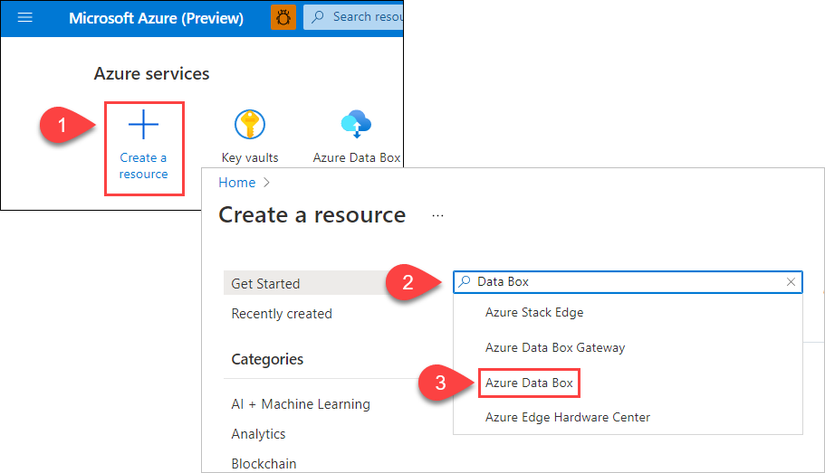
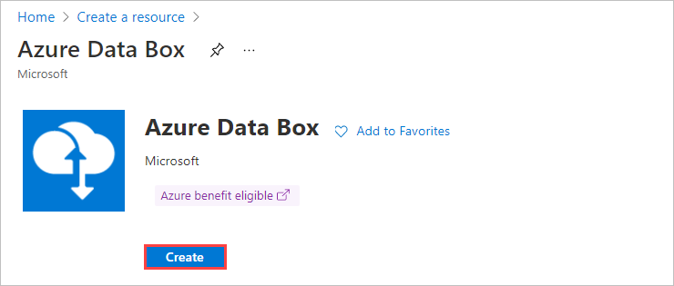
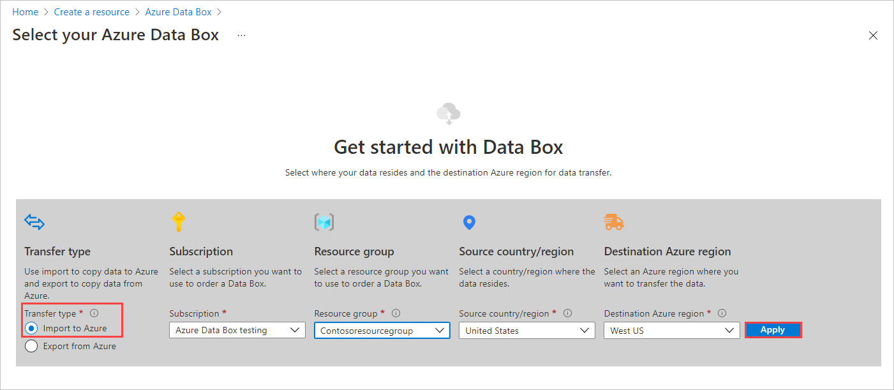
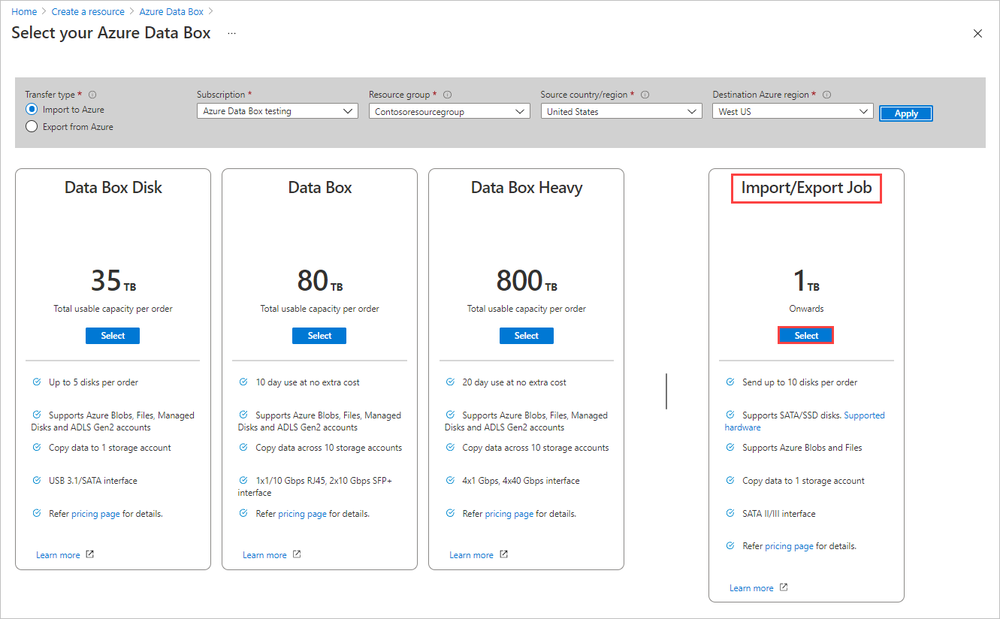
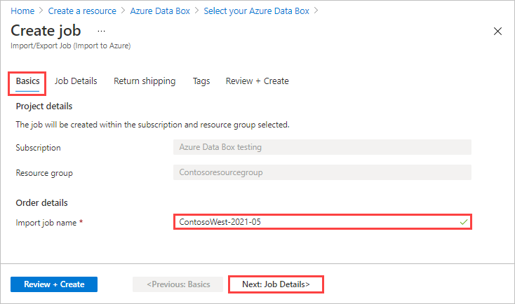
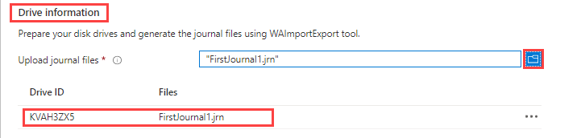
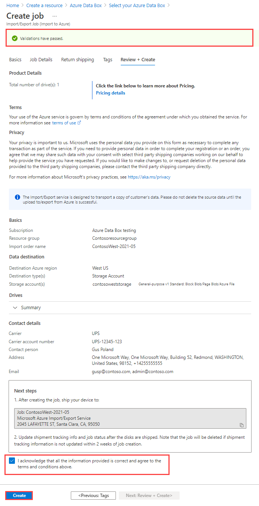
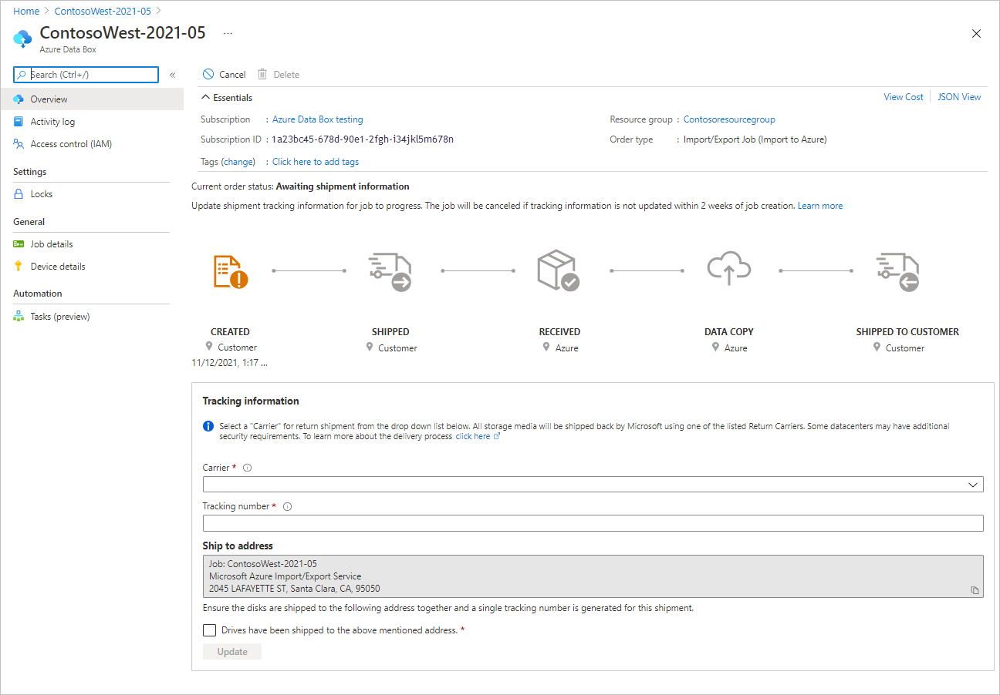

# Tutorial: Import data to Blob Storage with Azure Import/Export service (Preview)

Temporary file to develop Preview steps, which will coexist with the **Classic** experience. 

The steps for orderinig an Import/Export job through Azure Data Box will be on a **Preview** tab in the Import/Export "Order" tutorials. A second tab, **Classic**, will have existing instructions for starting an Import/Export job directly through Import/Export.

## Step 1: Prepare the drives

*INCLUDING SECTION FRAMEWORK TO PRESERVE INTERNAL LINK.* This step generates a journal file. The journal file stores basic information such as drive serial number, encryption key, and storage account details.

## Step 2: Create an import job

### [Portal (Preview)](#tab/azure-portal-preview)

TK: Elevator pitch for Import/Export convergence with Azure Data Box.

Perform the following steps to order an Azure Import/Export job through Azure Data Box.

1. Use your Microsoft Azure credentials to sign in at this URL: [https://portal.azure.com](https://portal.azure.com).
1. Select **+ Create a resource** and search for *Azure Data Box*. Select **Azure Data Box**.

   <!--Make this smaller. Will have to reshoot and reconstruct. Didn't save the components.-->

1. Select **Create**.  

   <!--Smaller also?-->

1. To get started with the import order, select the following options:
 
    1. Select the **Import to Azure** transfer type.
    1. Select the subscription to use for the Import/Export job.
    1. Select a resource group.
    1. Select the **Source country/region** for the job.
    1. Select the **Destination Azure region** for the job.
    1. Then select **Apply**.
   
    


1. Choose the **Select** button for **Import/Export Job**.

    [  ](media/storage-import-export-data-to-blobs-preview/import-export-order-converge-04.png#lightbox)

1. In **Basics**:

    - Enter a descriptive name for the import job. Use the name to track the progress of your jobs.
      <!-- OUT OF DATE - Test restrictions during next shoot. - * The name may contain only lowercase letters, numbers, and hyphens.
      * The name must start with a letter, and may not contain spaces.-->

    

    Select **Next: Job details >** to proceed.

1. In **Job Details**:

   1. Before you go further, make sure you're using the latest WAImportExport tool. The tool will be used behind the scenes when you upload the journal file, later on this screen. You can use the download link to update the tool.
   
      

   1. You can change the destination Azure region for the job if needed.
   1. Select one or more storage accounts to use for the job. You can create a new storage account if needed.
   1. Under **Drive information**, use the **Copy** button to upload the journal files that you created during the preceding [Step 1: Prepare the drives](#step-1-prepare-the-drives). If `waimportexport.exe version1` was used, upload one file for each drive that you prepared. If the journal file size exceeds 2 MB, then you can use the `<Journal file name>_DriveInfo_<Drive serial ID>.xml`, also created with the journal file.
      When you upload a journal file, the Drive ID is displayed.

      

   1. If you don't want to save a verbose log, clear the **Save verbose log in the 'waimportexport' blob container** option. The verbose log is an optional log that lists all files that were successfully imported, with details like the file size and checksum. It's uploaded to a container or share in the storage account. For more information, see LINK TO COME.

   

1. In **Return shipping**:

   1. Select a shipping carrier from the drop-down list for **Carrier**. The location of the Microsoft datacenter for the selected region determines which carriers are available.
   1. Enter a **Carrier account number**. The account number for an valid carrier account is required.
   1. In **Return address**, use **+ Address** to add the address to ship [WHAT?] to.

      

      On the Add address blade, you can add an address or use an existing one.

      

   1. In **Notification**, enter email addresses for the people you want to notify of the job's progress.
   
      > [!TIP]
      > Instead of specifying an email address for a single user, provide a group email to ensure that you receive notifications even if an admin leaves.

   

   Select **Review + Create** to proceed.

1. In **Review + Create**:

   1. Review the **Terms**, and then select "I acknowledge that all the information provided is correct and agree to the terms and conditions." Validation is then performed.
   1. Review the job information provided in the summary. Make a note of the job name and the Azure datacenter shipping address to ship disks back to Azure. This information is used later on the shipping label.
   1. Select **Create**.

     <!--Verify border.-->

1. After the job is created, you'll see the following message.

    

     Select **Go to resource** to open the job overview.

     [  ](media/storage-import-export-data-to-blobs-preview/import-export-order-converge-12.png#lightbox)


### [Portal (classic)](#tab/azure-portal)

*DO NOT USE. Cut & Paste errors guaranteed.* Perform the following steps to create an import job in the Azure portal.

1. Log on to https://portal.azure.com/.
2. Search for **import/export jobs**.

    

3. Select **+ Create**.

    

4. In **Basics**:

   1. Select a subscription.
   1. Select a resource group, or select **Create new** and create a new one.
   1. Enter a descriptive name for the import job. Use the name to track the progress of your jobs.
      * The name may contain only lowercase letters, numbers, and hyphens.
      * The name must start with a letter, and may not contain spaces.

   1. Select **Import into Azure**.

    

    Select **Next: Job details >** to proceed.

5. In **Job details**:

   1. Before you go further, make sure you're using the latest WAImportExport tool. The tool will be used behind the scenes when you upload the journal file, later on this screen. You can use the download link to update the tool.
   1. You can change the destination Azure region for the job if needed.
   1. Select one or more storage accounts to use for the job. You can create a new storage account if needed.
   1. Upload the journal files that you created during the preceding [Step 1: Prepare the drives](#step-1-prepare-the-drives). If `waimportexport.exe version1` was used, upload one file for each drive that you prepared. If the journal file size exceeds 2 MB, then you can use the `<Journal file name>_DriveInfo_<Drive serial ID>.xml` also created with the journal file.
   
      When you upload a journal file, the Drive ID is displayed.

   1. If you don't want to save a verbose log, clear the **Save verbose log in the 'waimportexport' blob container** option.

   

   Select **Next: Shipping >** to proceed.

6. [!INCLUDE [storage-import-export-shipping-step.md](../../includes/storage-import-export-shipping-step.md)]

7. In the order summary:

   1. Review the **Terms**, and then select "I acknowledge that all the information provided is correct and agree to the terms and conditions." Validation is then performed.
   1. Review the job information provided in the summary. Make a note of the job name and the Azure datacenter shipping address to ship disks back to Azure. This information is used later on the shipping label.
   1. Select **Create**.

     

### [Azure CLI](#tab/azure-cli)

Use the following steps to create an import job in the Azure CLI.

[!INCLUDE [azure-cli-prepare-your-environment-h3.md](../../includes/azure-cli-prepare-your-environment-h3.md)]

### Create a job

1. Use the [az extension add](/cli/azure/extension#az_extension_add) command to add the [az import-export](/cli/azure/import-export) extension:

    ```azurecli
    az extension add --name import-export
    ```

1. You can use an existing resource group or create one. To create a resource group, run the [az group create](/cli/azure/group#az_group_create) command:

    ```azurecli
    az group create --name myierg --location "West US"
    ```

1. You can use an existing storage account or create one. To create a storage account, run the [az storage account create](/cli/azure/storage/account#az_storage_account_create) command:

    ```azurecli
    az storage account create --resource-group myierg --name myssdocsstorage --https-only
    ```

1. To get a list of the locations to which you can ship disks, use the [az import-export location list](/cli/azure/import-export/location#az_import_export_location_list) command:

    ```azurecli
    az import-export location list
    ```

1. Use the [az import-export location show](/cli/azure/import-export/location#az_import_export_location_show) command to get locations for your region:

    ```azurecli
    az import-export location show --location "West US"
    ```

1. Run the following [az import-export create](/cli/azure/import-export#az_import_export_create) command to create an import job:

    ```azurecli
    az import-export create \
        --resource-group myierg \
        --name MyIEjob1 \
        --location "West US" \
        --backup-drive-manifest true \
        --diagnostics-path waimportexport \
        --drive-list bit-locker-key=439675-460165-128202-905124-487224-524332-851649-442187 \
            drive-header-hash= drive-id=AZ31BGB1 manifest-file=\\DriveManifest.xml \
            manifest-hash=69512026C1E8D4401816A2E5B8D7420D \
        --type Import \
        --log-level Verbose \
        --shipping-information recipient-name="Microsoft Azure Import/Export Service" \
            street-address1="3020 Coronado" city="Santa Clara" state-or-province=CA postal-code=98054 \
            country-or-region=USA phone=4083527600 \
        --return-address recipient-name="Gus Poland" street-address1="1020 Enterprise way" \
            city=Sunnyvale country-or-region=USA state-or-province=CA postal-code=94089 \
            email=gus@contoso.com phone=4085555555" \
        --return-shipping carrier-name=FedEx carrier-account-number=123456789 \
        --storage-account myssdocsstorage
    ```

   > [!TIP]
   > Instead of specifying an email address for a single user, provide a group email. This ensures that you receive notifications even if an admin leaves.

1. Use the [az import-export list](/cli/azure/import-export#az_import_export_list) command to see all the jobs for the myierg resource group:

    ```azurecli
    az import-export list --resource-group myierg
    ```

1. To update your job or cancel your job, run the [az import-export update](/cli/azure/import-export#az_import_export_update) command:

    ```azurecli
    az import-export update --resource-group myierg --name MyIEjob1 --cancel-requested true
    ```

### [Azure PowerShell](#tab/azure-powershell)

Use the following steps to create an import job in Azure PowerShell.

[!INCLUDE [azure-powershell-requirements-h3.md](../../includes/azure-powershell-requirements-h3.md)]

> [!IMPORTANT]
> While the **Az.ImportExport** PowerShell module is in preview, you must install it separately
> using the `Install-Module` cmdlet. After this PowerShell module becomes generally available, it
> will be part of future Az PowerShell module releases and available by default from within Azure
> Cloud Shell.

```azurepowershell-interactive
Install-Module -Name Az.ImportExport
```

### Create a job

1. You can use an existing resource group or create one. To create a resource group, run the [New-AzResourceGroup](/powershell/module/az.resources/new-azresourcegroup) cmdlet:

   ```azurepowershell-interactive
   New-AzResourceGroup -Name myierg -Location westus
   ```

1. You can use an existing storage account or create one. To create a storage account, run the [New-AzStorageAccount](/powershell/module/az.storage/new-azstorageaccount) cmdlet:

   ```azurepowershell-interactive
   New-AzStorageAccount -ResourceGroupName myierg -AccountName myssdocsstorage -SkuName Standard_RAGRS -Location westus -EnableHttpsTrafficOnly $true
   ```

1. To get a list of the locations to which you can ship disks, use the [Get-AzImportExportLocation](/powershell/module/az.importexport/get-azimportexportlocation) cmdlet:

   ```azurepowershell-interactive
   Get-AzImportExportLocation
   ```

1. Use the `Get-AzImportExportLocation` cmdlet with the `Name` parameter to get locations for your region:

   ```azurepowershell-interactive
   Get-AzImportExportLocation -Name westus
   ```

1. Run the following [New-AzImportExport](/powershell/module/az.importexport/new-azimportexport) example to create an import job:

   ```azurepowershell-interactive
   $driveList = @(@{
     DriveId = '9CA995BA'
     BitLockerKey = '439675-460165-128202-905124-487224-524332-851649-442187'
     ManifestFile = '\\DriveManifest.xml'
     ManifestHash = '69512026C1E8D4401816A2E5B8D7420D'
     DriveHeaderHash = 'AZ31BGB1'
   })

   $Params = @{
      ResourceGroupName = 'myierg'
      Name = 'MyIEjob1'
      Location = 'westus'
      BackupDriveManifest = $true
      DiagnosticsPath = 'waimportexport'
      DriveList = $driveList
      JobType = 'Import'
      LogLevel = 'Verbose'
      ShippingInformationRecipientName = 'Microsoft Azure Import/Export Service'
      ShippingInformationStreetAddress1 = '3020 Coronado'
      ShippingInformationCity = 'Santa Clara'
      ShippingInformationStateOrProvince = 'CA'
      ShippingInformationPostalCode = '98054'
      ShippingInformationCountryOrRegion = 'USA'
      ShippingInformationPhone = '4083527600'
      ReturnAddressRecipientName = 'Gus Poland'
      ReturnAddressStreetAddress1 = '1020 Enterprise way'
      ReturnAddressCity = 'Sunnyvale'
      ReturnAddressStateOrProvince = 'CA'
      ReturnAddressPostalCode = '94089'
      ReturnAddressCountryOrRegion = 'USA'
      ReturnAddressPhone = '4085555555'
      ReturnAddressEmail = 'gus@contoso.com'
      ReturnShippingCarrierName = 'FedEx'
      ReturnShippingCarrierAccountNumber = '123456789'
      StorageAccountId = '/subscriptions/<SubscriptionId>/resourceGroups/myierg/providers/Microsoft.Storage/storageAccounts/myssdocsstorage'
   }
   New-AzImportExport @Params
   ```

   > [!TIP]
   > Instead of specifying an email address for a single user, provide a group email. This ensures that you receive notifications even if an admin leaves.

1. Use the [Get-AzImportExport](/powershell/module/az.importexport/get-azimportexport) cmdlet to see all the jobs for the myierg resource group:

   ```azurepowershell-interactive
   Get-AzImportExport -ResourceGroupName myierg
   ```

1. To update your job or cancel your job, run the [Update-AzImportExport](/powershell/module/az.importexport/update-azimportexport) cmdlet:

   ```azurepowershell-interactive
   Update-AzImportExport -Name MyIEjob1 -ResourceGroupName myierg -CancelRequested
   ```

---

## Step 3 (Optional): Configure customer managed key

Skip this step and go to the next step if you want to use the Microsoft managed key to protect your BitLocker keys for the drives. To configure your own key to protect the BitLocker key, follow the instructions in [Configure customer-managed keys with Azure Key Vault for Azure Import/Export in the Azure portal](storage-import-export-encryption-key-portal.md).

## Step 4: Ship the drives

[!INCLUDE [storage-import-export-ship-drives](../../includes/storage-import-export-ship-drives.md)]

## Step 5: Update the job with tracking information

[!INCLUDE [storage-import-export-update-job-tracking](../../includes/storage-import-export-update-job-tracking.md)]

## Step 6: Verify data upload to Azure

Track the job to completion. Once the job is complete, verify that your data has uploaded to Azure. Delete the on-premises data only after you have verified that the upload was successful. For more information, see [Review Import/Export copy logs](storage-import-export-tool-reviewing-job-status-v1.md).

## Next steps

* [View the job and drive status](storage-import-export-view-drive-status.md)
* [Review Import/Export copy logs](storage-import-export-tool-reviewing-job-status-v1.md)