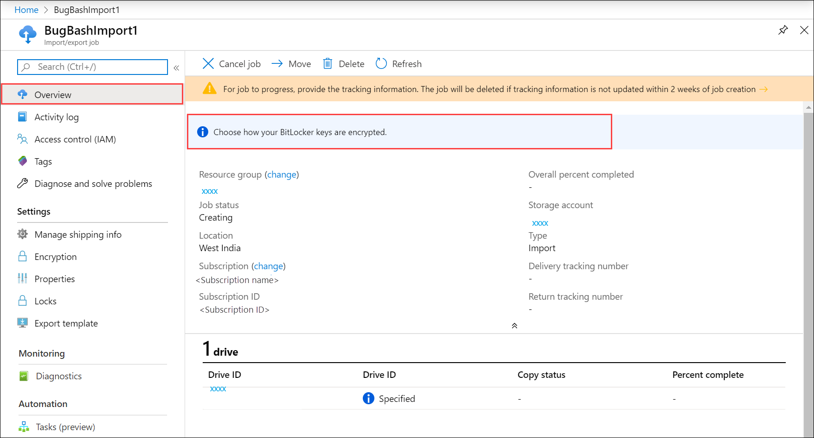
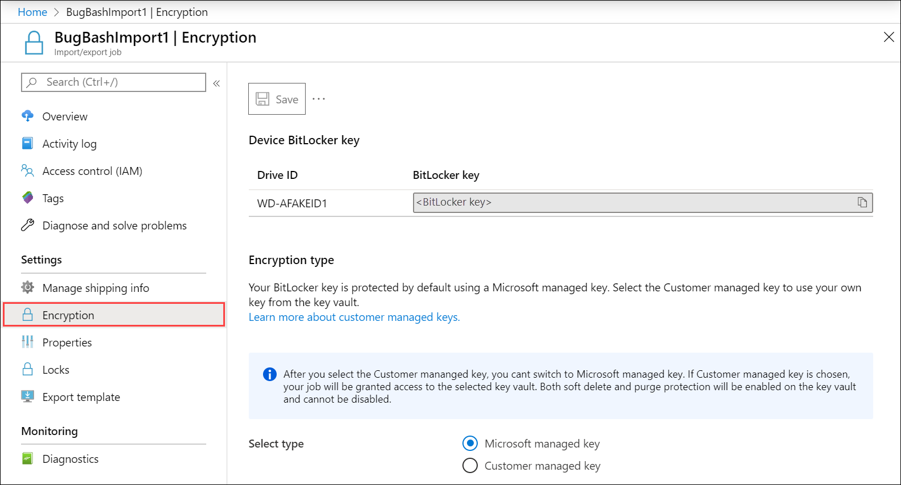
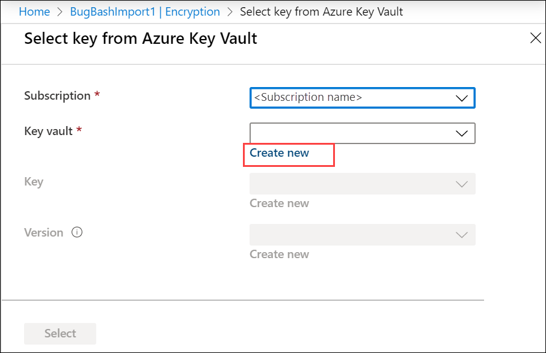
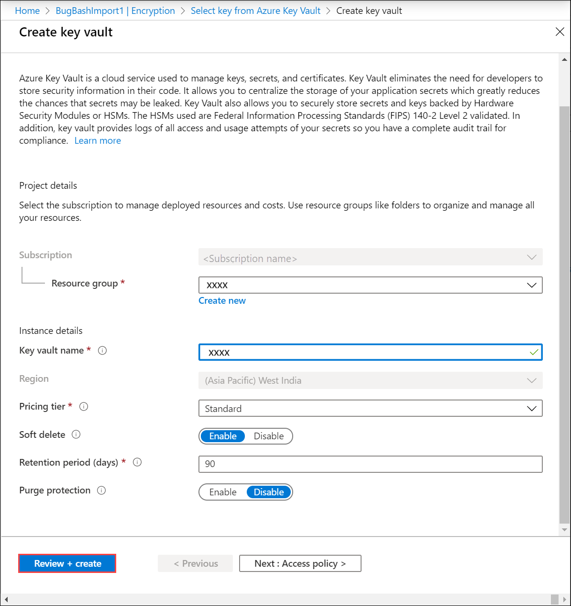
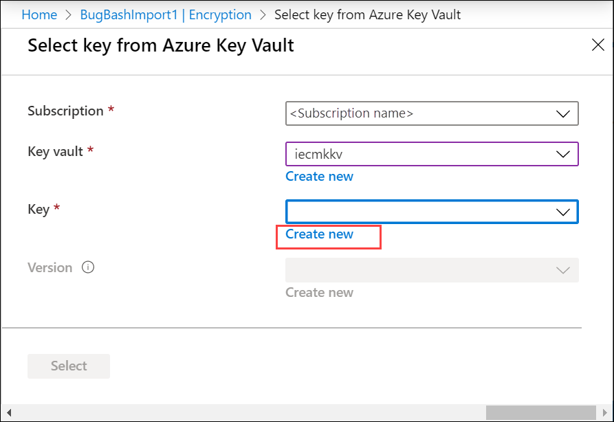
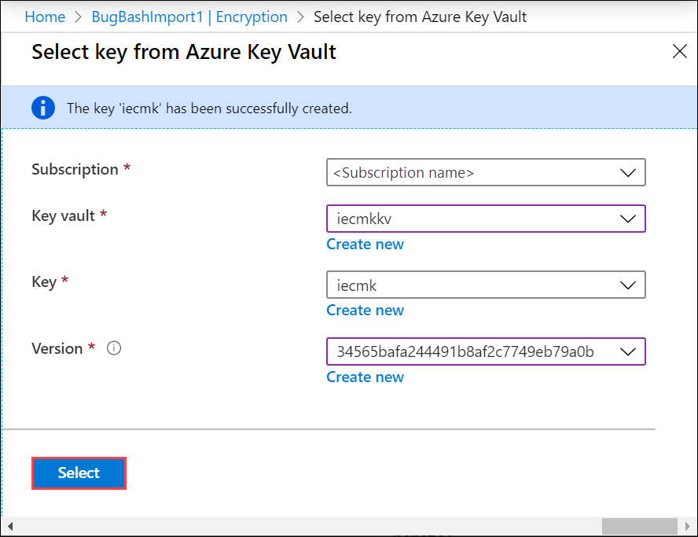

# Use customer-managed keys in Azure Key Vault for Import/Export service

Azure Import/Export protects the BitLocker keys used to lock the drives via an encryption key. By default, BitLocker keys are encrypted with Microsoft-managed keys. For additional control over encryption keys, you can also provide customer-managed keys.

Customer-managed keys must be created and stored in an Azure Key Vault. For more information about Azure Key Vault, see [What is Azure Key Vault?](../key-vault/general/overview.md)

This article shows how to use customer-managed keys with Import/Export service in the [Azure portal](https://portal.azure.com/).

## Prerequisites

Before you begin, make sure:

1. You have created an import or an export job as per the instructions in:

    - [Create an import job for blobs](storage-import-export-data-to-blobs.md).
    - [Create an import job for files](storage-import-export-data-to-files.md).
    - [Create an export job for blobs](storage-import-export-data-from-blobs.md)

2. You have an existing Azure Key Vault with a key in it that you can use to protect your BitLocker key. To learn how to create a key vault using the Azure portal, see [Quickstart: Create an Azure Key Vault using the Azure portal](../key-vault/general/quick-create-portal.md).

    - **Soft delete** and **Do not purge** are set on your existing Key Vault. These properties are not enabled by default. To enable these properties, see the sections titled **Enabling soft-delete** and **Enabling Purge Protection** in one of the following articles:

        - [How to use soft-delete with PowerShell](../key-vault/general/key-vault-recovery.md).
        - [How to use soft-delete with CLI](../key-vault/general/key-vault-recovery.md).
    - The existing key vault should have an RSA key of 2048 size or more. For more information about keys, see [About keys](../key-vault/keys/about-keys.md).
    - Key vault must be in the same region as the storage account for your data.  
    - If you don't have an existing Azure Key Vault, you can also create it inline as described in the following section.

## Enable keys

Configuring customer-managed key for your Import/Export service is optional. By default, the Import/Export service uses a Microsoft managed key to protect your BitLocker key. To enable customer-managed keys in the Azure portal, follow these steps:

1. Go to the **Overview** blade for your Import job.
2. In the right-pane, select **Choose how your BitLocker keys are encrypted**.

    

3. In the **Encryption** blade, you can view and copy the device BitLocker key. Under **Encryption type**, you can choose how you want to protect your BitLocker key. By default, a Microsoft managed key is used.

    

4. You have the option to specify a customer managed key. After you have selected the customer managed key, **Select key vault and a key**.

    

5. In the **Select key from Azure Key Vault** blade, the subscription is automatically populated. For **Key vault**, you can select an existing key vault from the dropdown list.

    

6. You can also select **Create new** to create a new key vault. In the **Create key vault blade**, enter the resource group and the key vault name. Accept all other defaults. Select **Review + Create**.

    

7. Review the information associated with your key vault and select **Create**. Wait for a couple minutes for the key vault creation to complete.

    

8. In the **Select key from Azure Key Vault**, you can select a key in the existing key vault.

9. If you created a new key vault, select **Create new** to create a key. RSA key size can be 2048 or greater.

    

    If the soft delete and purge protection are not enabled when you create the key vault, key vault will be updated to have soft delete and purge protection enabled.

10. Provide the name for your key, accept the other defaults, and select **Create**.

    

11. Select the **Version** and then choose **Select**. You are notified that a key is created in your key vault.

    

In the **Encryption** blade, you can see the key vault and the key selected for your customer managed key.

> [!IMPORTANT]
> You can only disable Microsoft managed keys and move to customer managed keys at any stage of the import/export job. However, you cannot disable the customer managed key once you have created it.

## Troubleshoot customer managed key errors

If you receive any errors related to your customer managed key, use the following table to troubleshoot:

| Error code     |Details     | Recoverable?    |
|----------------|------------|-----------------|
| CmkErrorAccessRevoked | Access to the customer managed key is revoked.                                                       | Yes, check if: <ol><li>Key vault still has the MSI in the access policy.</li><li>Access policy has Get, Wrap, and Unwrap permissions enabled.</li><li>If key vault is in a VNet behind the firewall, check if **Allow Microsoft Trusted Services** is enabled.</li><li>Check if the MSI of the job resource was reset to `None` using APIs. If yes, then Set the value back to `Identity = SystemAssigned`. This recreates the identity for the job resource. Once the new identity has been created, enable `Get`, `Wrap`, and `Unwrap` permissions to the new identity in the key vault's access policy</li></ol>                                                                                            |
| CmkErrorKeyDisabled      | The customer managed key is disabled.                                         | Yes, by enabling the key version     |
| CmkErrorKeyNotFound      | Cannot find the customer managed key. | Yes, if the key has been deleted but it is still within the purge duration, using [Undo Key vault key removal](/powershell/module/az.keyvault/undo-azkeyvaultkeyremoval). Else, <ol><li>Yes, if the customer has the key backed-up and restores it.</li><li>No, otherwise.</li></ol>
| CmkErrorVaultNotFound |Cannot find the key vault of the customer managed key. |   If the key vault has been deleted:<ol><li>Yes, if it is in the purge-protection duration, using the steps at [Recover a key vault](../key-vault/general/soft-delete-overview.md#key-vault-recovery).</li><li>No, if it is beyond the purge-protection duration.</li></ol> Else if the key vault was migrated to a different tenant, yes, it can be recovered using one of the below steps:<ol><li>Revert the key vault back to the old tenant.</li><li>Set `Identity = None` and then set the value back to `Identity = SystemAssigned`. This deletes and recreates the identity once the new identity has been created. Enable `Get`, `Wrap`, and `Unwrap` permissions to the new identity in the key vault's Access policy.</li></ol>|

## Next steps

- [What is Azure Key Vault](../key-vault/general/overview.md)?