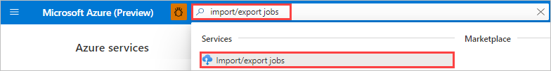
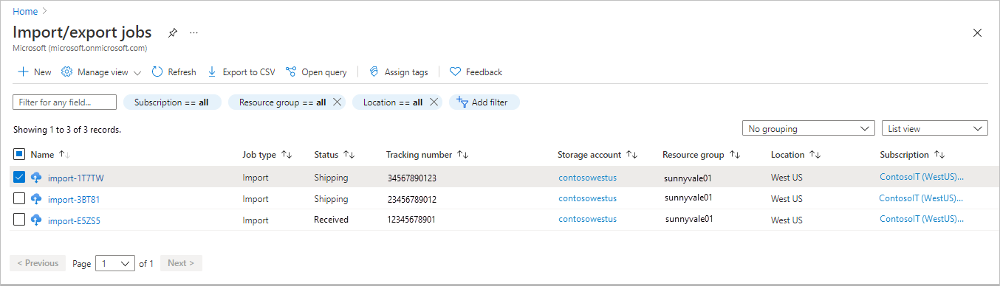
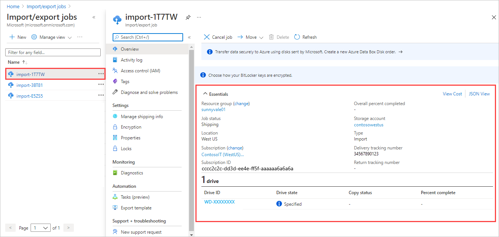
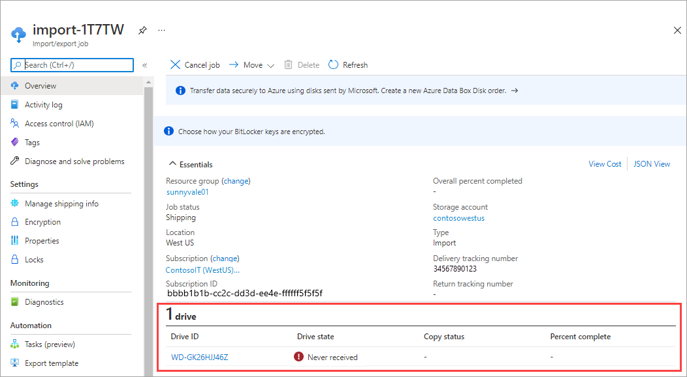

# View the status of Azure Import/Export jobs

This article provides information on how to view the drive and job status for Azure Import/Export jobs. Azure Import/Export service is used to securely transfer large amounts of data to Azure Blobs and Azure Files. The service is also used to export data from Azure Blob storage.  

## View job and drive status
You can track the status of your import or export jobs on the **Import/Export** tab in the Azure portal.
1. Log on to https://portal.azure.com/.
2. Search for **import/export jobs**.

    

 3. A list of your Import/Export jobs appears on the page.

    

4. Select and click a job to view job details.

   
  
## View job status

XXX

### [Portal (Preview)](#tab/azure-portal-preview)

If you create your job in the Preview portal, you see one of the following job statuses depending on where your drive is in the process.

| Job status                        | Description                                                                                    |
|:----------------------------------|:-----------------------------------------------------------------------------------------------|
| Awaiting shipment information     | After a job is created, its state is set to **Awaiting shipment information**. While the job is in this state, the Import/Export service assumes the drives haven't been shipped to the datacenter. To proceed further, the customer needs to provide the shipment information for the job. A job may remain in this state for up to two weeks, after which the service automatically deletes it. |
| Shipped                           | After you ship your package, you should update the tracking information in the Azure portal. Doing so changes the job state to **Shipped**. The job remains in the **Shipped** state for up to two weeks. When a job reaches **Shipped** state, it can no longer be canceled. |
| Received                          | After all drives are received at the datacenter, the job state is set to **Received**. The job status may change 1 to 3 business days after the carrier delivers the device, when order processing completes in the datacenter. |
| Data copy in progress             | Once processing begins for at least one drive, the job state is set to **Data copy in progress**. For more information, go to [View drive status](#view-drive-status). |
| Data copy completed with errors   | The job moves to **Data copy completed with errors** state when the service has experienced errors while copying data in at least one of the drives. |
| Data copy completed with warnings | The job moves to **Data copy completed with warnings** state when the service has completed the data copy but some warnings were encountered during the process. |
| Data copy failed                  | Data copy failed due to issues encountered while copying data to or from at least one of the drives. |
| Preparing to ship                 | After all drives have completed processing, the job is placed in **Preparing to ship** state until the drives are shipped back to you. |
| Shipped to customer               | After all drives have been shipped back to you, the job status changes to **Shipped to customer**. |
| Completed                         | After all drives are shipped back to you, if the job has completed without errors, then the job is set to **Completed**. The job is automatically deleted after 90 days in the **Completed** state. |
| Canceled                          | The job has been canceled. |

### [Portal (Classic)](#tab/azure-portal-classic)

If you create your job using the Classic method, you see one of the following job statuses depending on where your drive is in the process.<!--Check Anam's table for status updates.-->

| Job status | Description |
|:--- |:--- |
| Creating | After a job is created, its state is set to **Creating**. While the job is in the **Creating** state, the Import/Export service assumes the drives haven't been shipped to the data center. A job may remain in this state for up to two weeks, after which it's automatically deleted by the service. |
| Shipping | After you ship your package, you should update the tracking information in the Azure portal. Doing so turns the job into **Shipping** state. The job remains in the **Shipping** state for up to two weeks. When a job reaches Shipping state, it can no longer be canceled.
| Received | After all drives are received at the data center, the job state is set to **Received**. The job status may change 1 to 3 business days after the carrier delivers the device, when order processing completes in the datacenter. |
| Transferring | Once at least one drive has begun processing, the job state is set to **Transferring**. For more information, go to [Drive States](#view-drive-status). |
| Packaging | After all drives have completed processing, the job is placed in **Packaging** state until the drives are shipped back to you. |
| Completed | After all drives are shipped back to you, if the job has completed without errors, then the job is set to **Completed**. The job is automatically deleted after 90 days in the **Completed** state. |
| Closed | After all drives are shipped back to you, if there were any errors during the job processing, the job is set to **Closed**. The job is automatically deleted after 90 days in the **Closed** state. |
| Canceled                          | The job has been canceled. |

## View drive status

XXX

### [Portal (Preview)](#tab/azure-portal-preview)

The table below describes the life cycle of an individual drive as it transitions through an import or export job. The current state of each drive in a job is seen in the Azure Preview portal.<!--Move sentence to section introduction.-->

The following table describes each state that each drive in a job may pass through when the drive is successfully processed.

| Drive status                       | Description                                 |
|:-----------------------------------|:--------------------------------------------|
| Data copy not started              | Data copy has not yet started on the drive. |
| %age completed                 | Data copy is in progress for the drive, and this percentage is complete. |
| Data copy completed                | The service successfully transferred all the data from or to the drive with no errors. |
| Data copy completed with errors    | The service came across errors while copying data from or to the drive. |
| Data copy completed with warnings  | The service completed copying data from or to the drive, but some warnings were raised in the process. |

<!--Add a screenshot from the Preview portal?-->

The following table describes the drive Failure states and the actions to take in each state.

| Drive status                      | Description   |
|:----------------------------------|:------------------------------------------|
| Disk not received at datacenter   | A drive moves to this state when the disks are not received at the datacenter.<!--Clearer wording? "A drive moves to this state when the disk associated with a journal file was not received at the datacenter."--> |
| Issues faced while processing the job. [Contact Microsoft Support](storage-import-export-contact-microsoft-support.md) for more information. |
| Manifest file error               | Errors in the manifest file or format. |
| Export blob list format invalid   | For an export job, the blob list file is not in the required format. An XML file with valid blob paths and prefixes is required. See [Valid blob path prefixes](../databox/data-box-deploy-export-ordered.md#valid-blob-path-prefixes) for more information.<!--Possible issues: 1) This links to Create XML file in Data Box, as does the "Export from blob list file (XML format)" section (shared) in the Import/Export tutorial. (Breadcrumbs needed in the IE TOC.) 2) In Import/Export, only blobs can be exported. "Create XML file" includes both blob and file exports.--> |
| Blob access forbidden             | For an export job, access to the export blob list in the storage account is forbidden. This might be due to an invalid storage account key or container SAS. |
| Unsupported disk                  | Disk not supported by Azure Import/Export service. For more information, see [Supported disk types](storage-import-export-requirements.md#supported-disks). |
| Disk corrupted                    | Data on the disk is corrupted. |
| BitLocker unlock volume failed    | Attempt to unlock the BitLocker volume failed. |
| BitLocker volume not found        | Disk doesn't contain a BitLocker-enabled volume. |
| BitLocker key invalid             | Customer-provided BitLocker key is not valid. |
| Hardware error                    | Disk has reported a media failure. |
| NTFS volume not found             | The first data volume on the disk is not in NTFS format. |
| Storage account not accessible    | Customer storage account is not accessible, and the data copy can't proceed. |
| Unsupported data                  | The data copied to the disk doesn't conform to Azure conventions *ADD LINK*, or the data cannot be exported because it's not supported on NTFS volumes *ADD LINK*.|

### [Portal (Classic)](#tab/azure-portal-classic)

The table below describes the life cycle of an individual drive as it transitions through an import or export job. The current state of each drive in a job is seen in the Azure portal when you create an import/export job in the Classic experience.

The following table describes each state that each drive in a job may pass through when the drive is successfully processed.

| Drive State | Description |
|:--- |:--- |
| Specified | For an import job, when the job is created from the Azure portal, the initial state for a drive is **Specified**. For an export job, since no drive is specified when the job is created, the initial drive state is **Received**. |
| Received | The drive transitions to the **Received** state when the Import/Export service has processed the drives that were received from the shipping company for an import job. For an export job, the initial drive state is the **Received** state. |
| NeverReceived | The drive moves to the **NeverReceived** state when the package for a job arrives but the package doesn't contain the drive. A drive also moves into this state if the datacenter hasn't yet received the package, and the service received the shipping information at least two weeks ago. |
| Transferring | A drive moves to the **Transferring** state when the service begins to transfer data from the drive to Azure Storage. |
| Completed | A drive moves to the **Completed** state when the service has successfully transferred all the data with no errors.
| CompletedMoreInfo | A drive moves to the **CompletedMoreInfo** state when the service has experienced issues while copying data from or to the drive. The information can include errors, warnings, or informational messages about overwriting blobs.
| ShippedBack | A drive moves to the **ShippedBack** state when it has been shipped from the datacenter back to the return address. |

This image from the Azure portal displays the drive state of an example job:

The following table describes the drive failure states and the actions taken for each state.

| Drive State | Event | Resolution / Next step |
|:--- |:--- |:--- |
| Never received | A drive that's marked as **NeverReceived** (because it wasn't received as part of the job's shipment) arrives in another shipment. | The operations team moves the drive to **Received**. |
| N/A | A drive that isn't part of any job arrives at the datacenter as part of another job. | The drive is marked as an extra drive. It's returned to you when the job associated with the original package is completed. |

---

## Time to process job
The amount of time it takes to process an import/export job varies based on a number of factors such as:

-  Shipping time
-  Load at the datacenter
-  Job type and size of the data being copied
-  Number of disks in a job. 

Import/Export service doesn't have an SLA, but the service strives to complete the copy in 7 to 10 days after the disks are received. 
In addition to the status posted on Azure portal, you can use REST APIs to track the job progress. Use the percent complete parameter in the [List Jobs](/previous-versions/azure/dn529083(v=azure.100)) operation API call to view  the percentage copy progress.

## Next steps

* [Transfer data with AzCopy command-line utility](../storage/common/storage-use-azcopy-v10.md)
* [Azure Import Export REST API sample](https://github.com/Azure-Samples/storage-dotnet-import-export-job-management/)