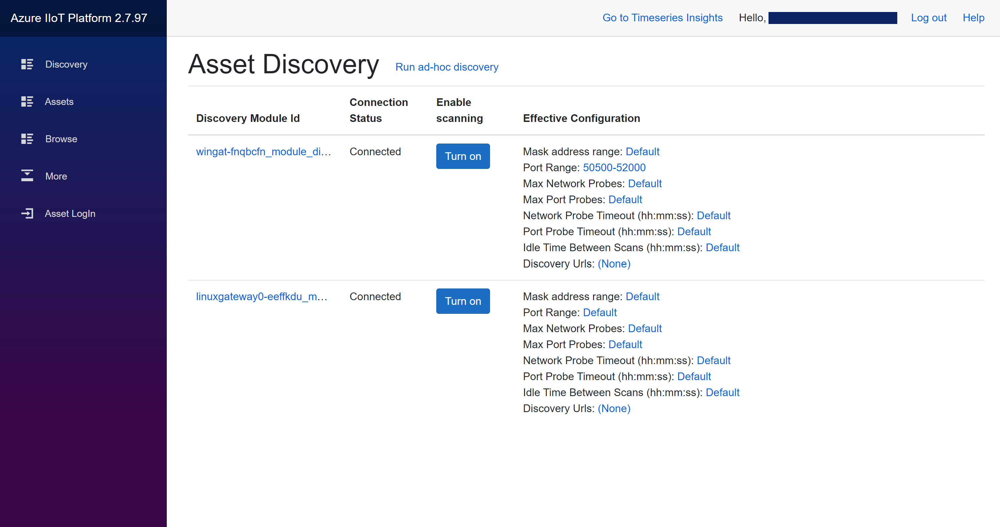
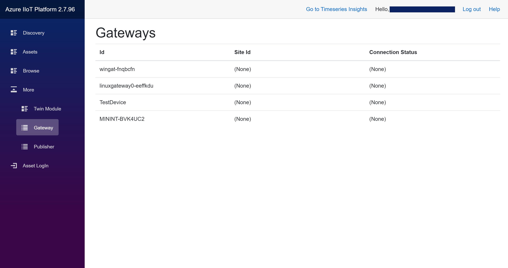
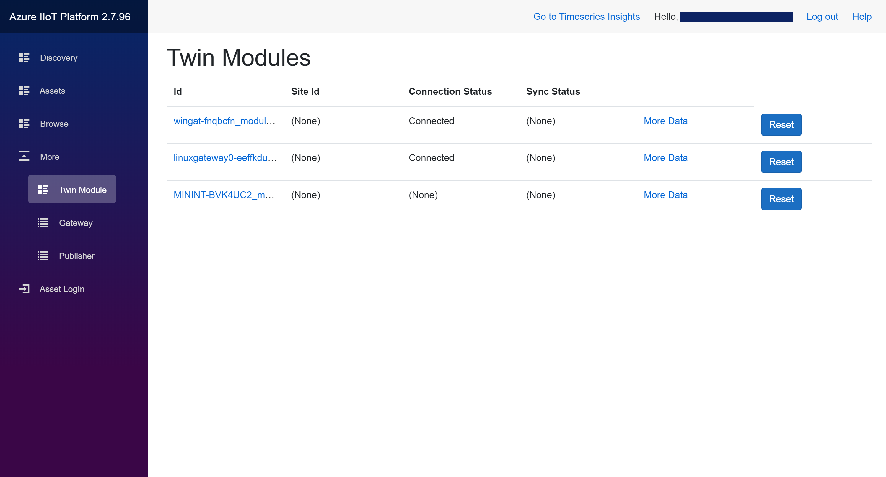
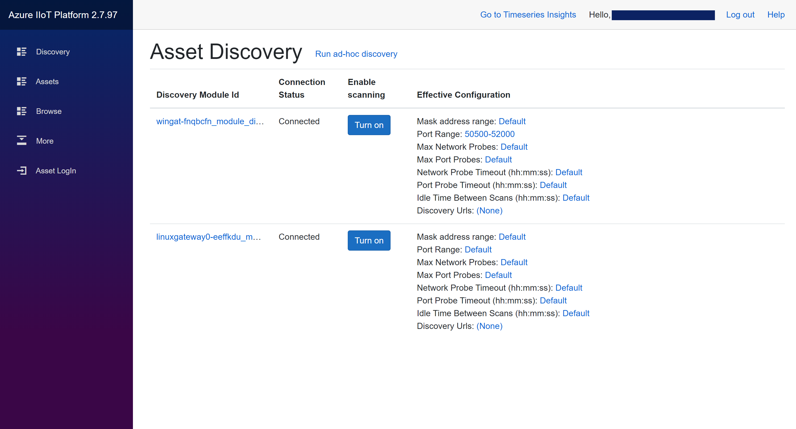
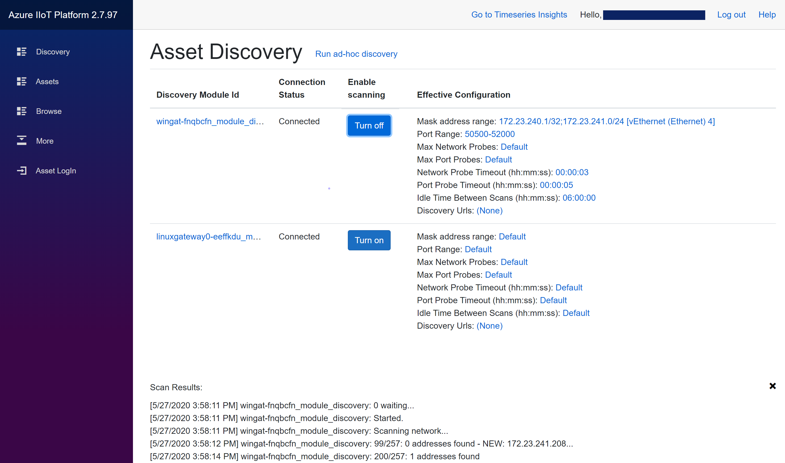
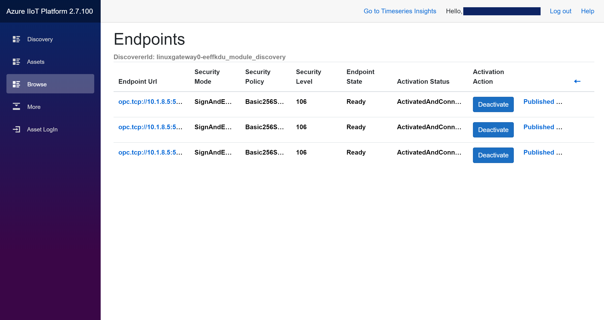
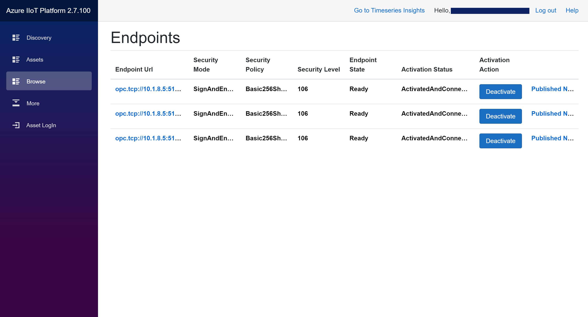

# Tutorial: Discover and register assets using the Engineering Tool

In this tutorial, you learn how to:

> [!div class="checklist"]
> * Discover your assets in a connected network
> * Explore the OPC UA address space of the OPC UA asset

## Prerequisites

This tutorial makes use of the Industrial IoT Engineering Tool. In order to use the Engineering Tool, you must deploy the Azure Industrial IoT Platform using the deployment script. Once the deployment succeeded, you can see in the output where the deployed application can be found online.

Copy the URL and open the engineering tool in the browser. You will see the following page.

When clicking on *Gateway* a list of all registered IoT Edge gateways will be shown. Further Information like the Gateway Id, the Site Id, and the connection status is available.  

The Gateway Id is the IoT Edge device id in IoT Hub.

When clicking on *Twin Module* a list of all registered twin modules will be shown. Further Information like the Gateway Id, the Site Id, and the connection and sync status is available.  

## Discover Assets

To discover OPC UA server assets in the connected networks (factories, etc.) you will use the IoT Edge discovery module deployed into IoT Edge gateways. The discovery module supports network scanning which will be used to find all OPC UA assets and upload the results to the Onboarding Service which creates the endpoint and asset identities in IoT Hub.

1. When clicking on **Discovery** a list opens, which shows all currently deployed discovery modules, their Connection Status, the Scan status, and the Scan configuration.

   

   > [!NOTE] For windows based edge deployments you need to manually tune the default 'Scan Mask' address range by adding 10.1.8.0/24. This is the network used by the separate VM where the simulation OPC UA Servers run, see below.

   The linux based edge deployments are capable to automatically discover the outer network so no action is needed.

   In production scenarios, you will need to add the address range of the local network having the local industrial assets to be discovered.

2. You can turn on and off network scanning, by clicking the button in the Scanning column. Choose the discovery whose identifier starts with "win" and turn scanning on.

   

   When the scan completes you can click on the discovery module (in this case "wingat-fnqbcfn_module_discoverer") and see the Endpoints belonging to the discovered OPC UA server assets.

   

3. The *Assets* menu shows a list of **all discovered and registered** OPC UA server assets with their Application Name, their Uri and site to which the asset belongs to.

   

## Explore the OPC UA address space of the Asset

While clicking on one specific OPC UA Server Asset showed the Endpoints belonging to only that asset, the Endpoints listed under *Browse* are all currently registered and available Endpoints.

Activate an endpoint of your choice using the Activate slider. The endpoint link can now be used to explore the server address space.  You can navigate into nodes and out using the Breadcrumbs or the back arrow.

# Next steps

Now that you have learned how to discover your assets, the next step is publishing your data:

> [!div class="nextstepaction"]
> [Publish data using the Engineering Tool](tut-IIoT-subscribe-data-eng-tool.md)