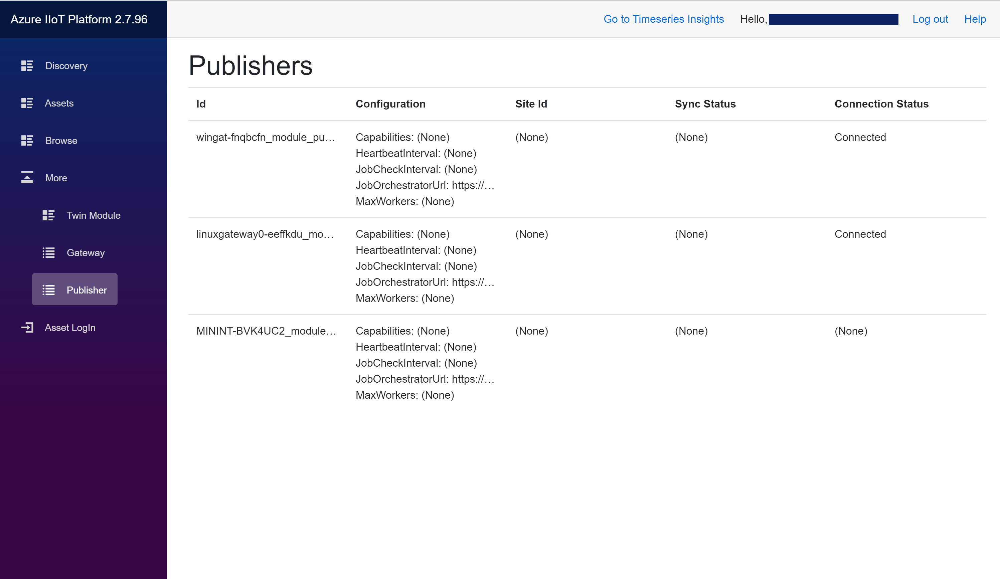
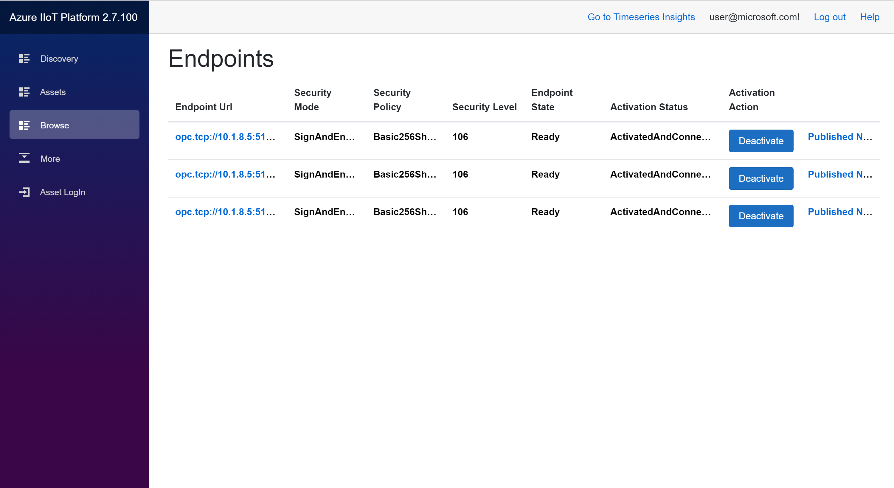
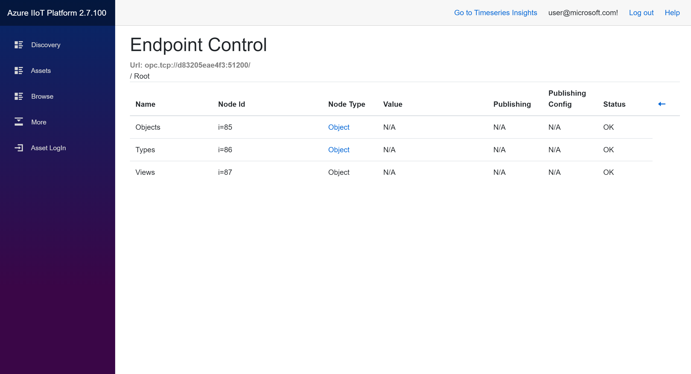
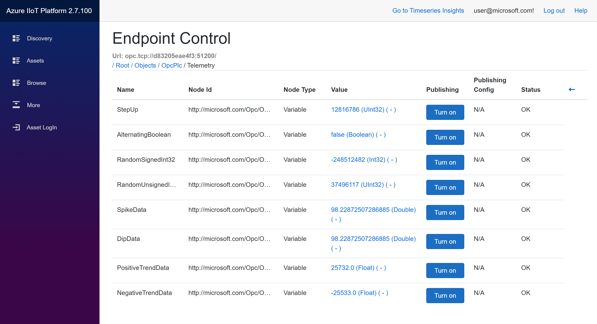
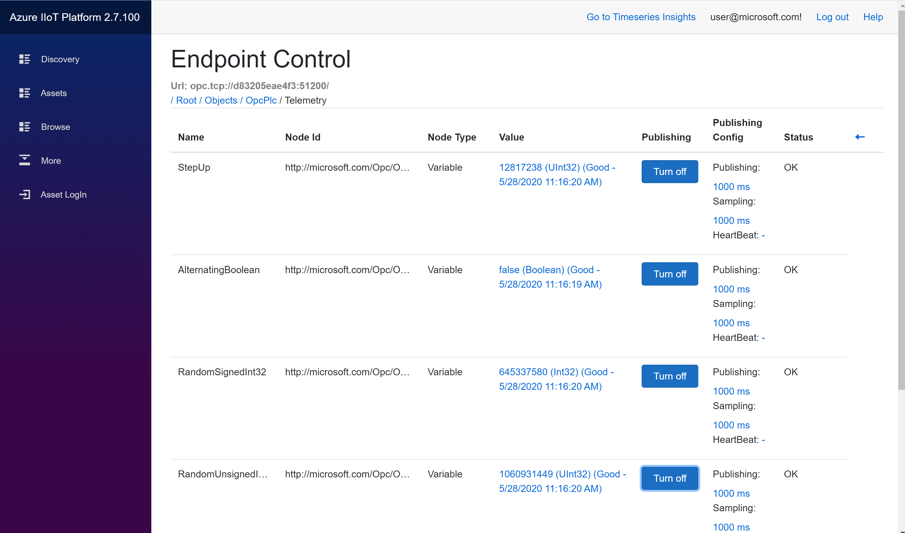

# Tutorial: Subscribe to data using the Engineering tool

In this tutorial, you learn how to:

> [!div class="checklist"]
> * Choose the OPC Publisher to publish data from
> * Configure the data-points to be published

## Prerequisites

Follow the instructions on how to [discover and browse assets using the engineering tool](tut-IIoT-discover-register-assets-eng-tool.md).

## List publishers

To publish data the platform makes use of the deployed OPC Publisher modules. The OPC Publisher module receives publish instructions ("jobs") and executes these long running jobs. A publish job specifies the server and its nodes (Variables/events) that should be monitored and whose samples should be sent to Azure IoT Hub.

All Publishers deployed to your gateways are listed in under *Publisher*.

## Subscribe to variables in the Simulation

Next section will guide you on the configuration of the data-points to be published from the edge module to the Azure IIoT platform.

1. Step 1 - in the browse tab of the engineering tool, select the endpoint from which the data needs to be published. Make sure the endpoint is in an ActivatedAndConnected, meaning that the OPC UA Twin module has an active session to the target server. Only this way browsing and selecting the right data-points is possible.

    Select the endpoint following the endpoint url to the desired server

    

2. Step 2 - When clicking on the endpoint url, the Endpoint Control opens, displaying the content of the root node of the OPC UA Server. Typically Objects, Types and Views well known objects will be displayed. The process data-points exposed by the OPC UA Server, that we typically want to publish, are located under the Objects node. Browse further by clicking on the Node's link (the Node Type).

   

3. Step 3 - Browse further by clicking on the Node's link (the Node Type) to the desired process data variables in the address space. The variable nodes will display the actual value in the table. The variables can be selected for publishing by clicking the Turn on button.

   

4. Step 4 - Make the selection of the variables to be published. This will initiate a job for the publisher and telemetry data associated to the selected will start flowing from the edge into the Azure IIoT platform. the variable's value will reflect now it's changes realtime in the view.

    

# Next steps

> [!div class="nextstepaction"]
>