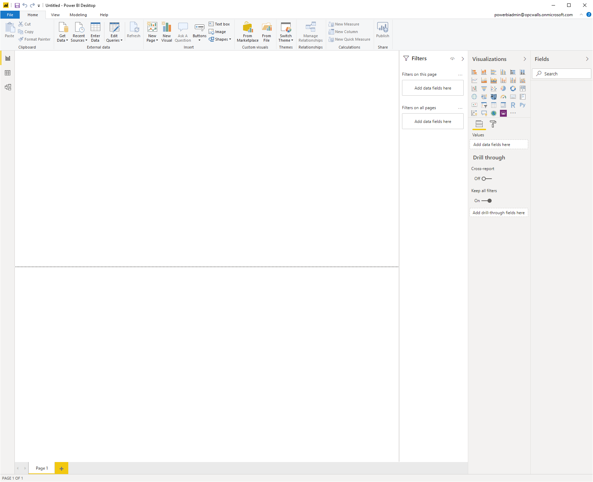
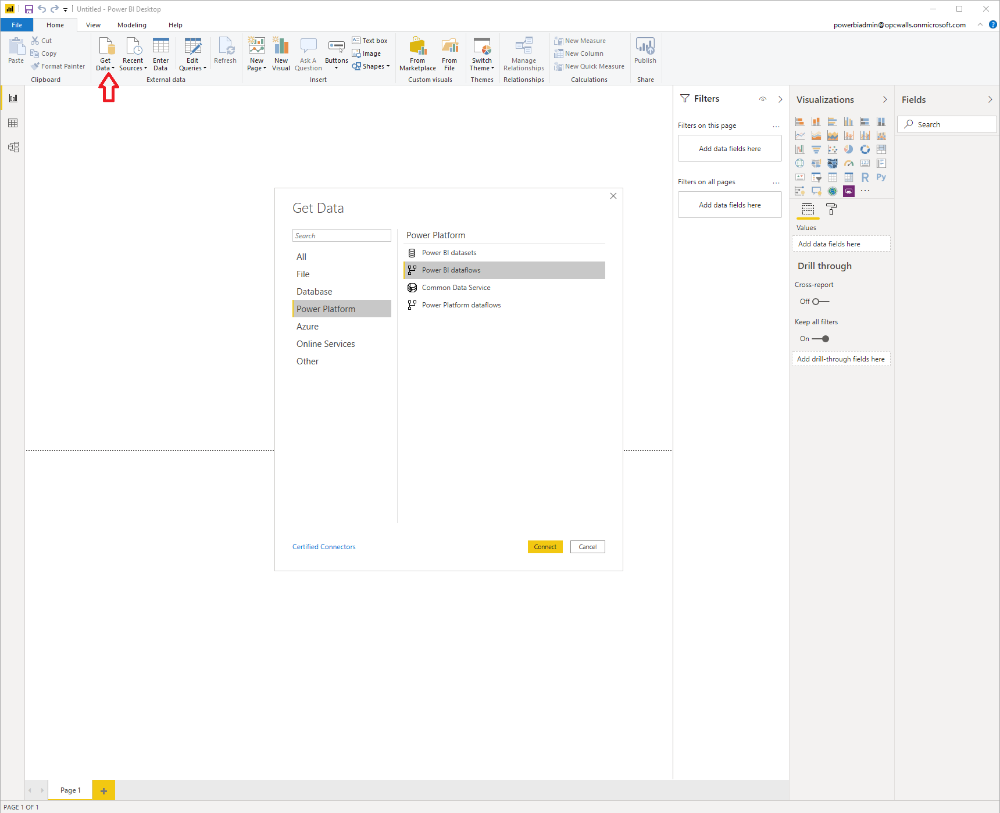

# Tutorial: Visualize OPC UA PubSub data in PowerBI

In this tutorial, you learn how to access OPC UA telemetry from your Azure Datalake in Power BI:

> [!div class="checklist"]
> * Setup PowerBI
> * Visualize data in PubSub format in PowerBI

## Prerequisites

To get started with this tutorial, [data must be published to the IoT Hub using the engineering tool](tut-subscribe-data-eng-tool.md).

## Setting up Power BI

For the integration of CDM formatted data in PowerBI there is process that must be followed, which is described in the following articles:

[Dataflows and Azure Data Lake integration (Preview)](https://docs.microsoft.com/en-us/power-bi/service-dataflows-azure-data-lake-integration)

[Connect Azure Data Lake Storage Gen2 for dataflow storage](https://docs.microsoft.com/en-us/power-bi/service-dataflows-connect-azure-data-lake-storage-gen2)

[Configure workspace dataflow settings (Preview)](https://docs.microsoft.com/en-us/power-bi/service-dataflows-configure-workspace-storage-settings)

[Add a CDM folder to Power BI as a dataflow (Preview)](https://docs.microsoft.com/en-us/power-bi/service-dataflows-add-cdm-folder)

Once the dataflow was added as described in the previous tutorial, you need to run [Power BI Desktop](https://docs.microsoft.com/en-us/power-bi/desktop-quickstart-connect-to-data#prerequisites) app on the local machine, and sign it with the Power BI user previously used.

Now you can proceed to explore the OPC UA data stored in the CDM format in your Azure Data Lake.

## Visualize Data in Power BI

In order to visualize and analyze the Azure IIoT Telemetry data (stored in CDM format in the Azure Data Lake) in power BI. There are several steps that need to be taken:

1. Step 1 - Open the "Power BI Desktop"
   
    

2. Step 2 - Click on the "Get Data" button, then select "Power Platform", then "Power BI dataflows" and "Connect"
   
    

3. Step 3 - lookup for the dataflow defined in the previous section. The list with the data partitions associated to the published node will appear. Select the data partitions to be imported in the Power BI and click "Load"
   
    

4. Step 4 - the data can be visualized now when switching to the tables tab and can be used in reports.

    

Once the Power BI project is completed you can publish it in the PowerBi workspace for further processing.