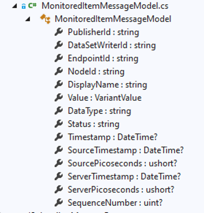
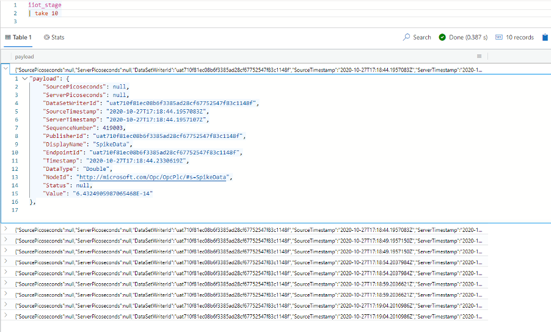
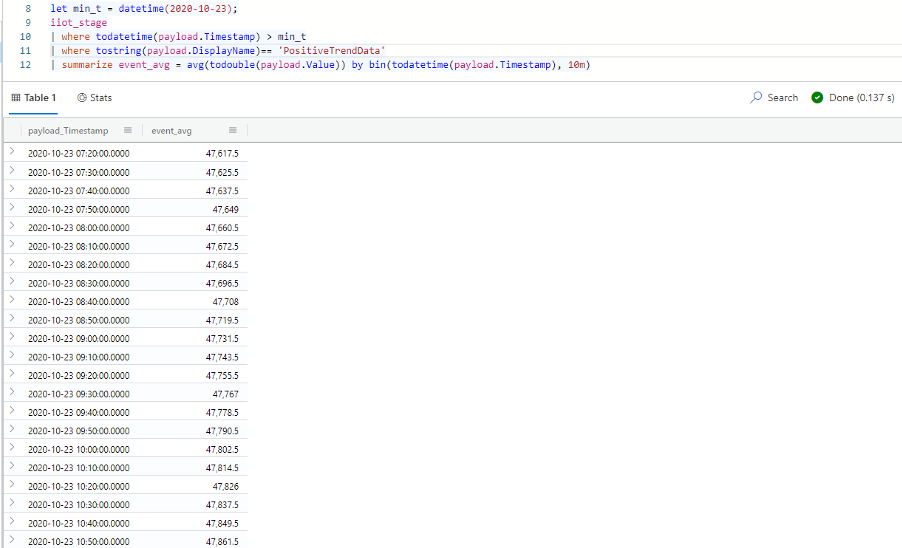
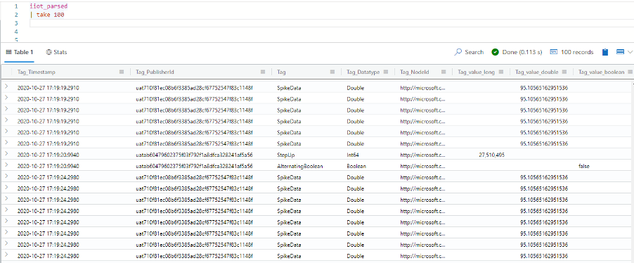
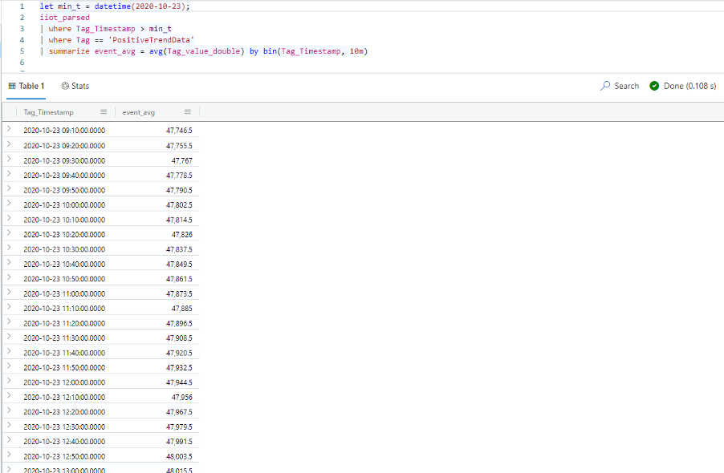
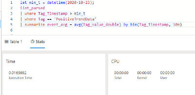
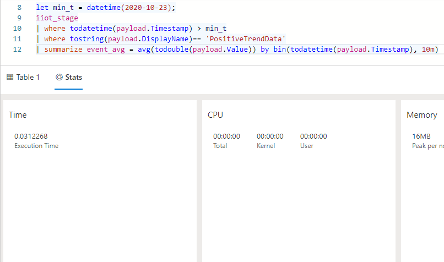

# Tutorial: Pull Azure Industrial IoT data into ADX

The Azure Industrial IoT (IIoT) Platform combines edge modules and cloud microservices with many Azure PaaS services to provide capabilities for industrial asset discovery and to collect data from these assets using OPC UA. [Azure Data Explorer (ADX)](/azure/data-explorer) is a natural destination for IIoT data with data analytics features that enables running flexible queries on the ingested data from the OPC UA servers connected to the IoT Hub through the OPC Publisher. Although an ADX cluster can ingest data directly from the IoT Hub, the IIoT platform does further processing of the data to make it more useful before putting it on the Event Hubs provided when a full deployment of the microservices is used (refer to the IIoT platform architecture).

In this tutorial, you learn how to:

> [!div class="checklist"]
> * Create a table in ADX
> * Connect the Event Hub to the ADX Cluster
> * Analyze the data in ADX

## How to make the data available in the ADX cluster to query it effectively 

If we look at the message format from the Event Hubs (as defined by the class Microsoft.Azure.IIoT.OpcUa.Subscriber.Models.MonitoredItemMessageModel), we can see a hint to the structure that we need for the ADX table schema.



Below are the steps that we'll need to make the data available in the ADX cluster and to query the data effectively.  
1. Create an ADX cluster. If you don't have an ADX cluster provisioned with the IIoT platform already, or if you would like to use a different cluster then follow the steps [here](/azure/data-explorer/create-cluster-database-portal#create-a-cluster). 
2. Enable streaming ingestion on the ADX cluster as explained [here](/azure/data-explorer/ingest-data-streaming#enable-streaming-ingestion-on-your-cluster). 
3. Create an ADX database by following the steps [here](/azure/data-explorer/create-cluster-database-portal#create-a-database).

For the following step, we'll use the [ADX web interface](/azure/data-explorer/web-query-data) to run the necessary queries. Make sure to add your cluster to the web interface as explained in the link.  
 
4. Create a table in ADX to put the ingested data in.  Although the MonitoredItemMessageModel class can be used to define the schema of the ADX table, it's recommended to ingest the data first into a staging table with one column of type [Dynamic](/azure/data-explorer/kusto/query/scalar-data-types/dynamic). This gives us more flexibility in handling the data and processing into other tables (potentially combining it with other data sources) that serve the needs for multiple use cases. The following ADX query creates the staging table ‘iiot_stage’ with one column ‘payload’,

```
.create table ['iiot_stage']  (['payload']:dynamic)
```

We also need to add a json ingestion mapping to instruct the cluster to put the entire Json message from the Event hub into staging table,

```
.create table ['iiot_stage'] ingestion json mapping 'iiot_stage_mapping' '[{"column":"payload","path":"$","datatype":"dynamic"}]'
```

5. Our table is now ready to receive data from the Event Hubs. 
6. Use the instructions [here](/azure/data-explorer/ingest-data-event-hub#connect-to-the-event-hub) to connect the Event Hubs to the ADX cluster and start ingesting the data into our staging table. We only need to create the connection as we already have an Event Hubs provisioned by the IIoT platform.  
7. Once the connection is verified, data will start flowing to our table and after a short delay we can start examining the data in our table. Use the following query in the ADX web interface to look at a data sample of 10 rows. We can see here how the data in the payload resembles the MonitoredItemMessageModel class mentioned earlier.



8. Let us now run some analytics on this data by parsing the Dynamic data in the ‘payload’ column directly. In this example, we'll compute the average of the telemetry identified by the “DisplayName”: “PositiveTrendData”, over time windows of 10 minutes, on all the records ingested since a specific time point (defined by  the variable min_t)
let min_t = datetime(2020-10-23);
iiot_stage 
| where todatetime(payload.Timestamp) > min_t
| where tostring(payload.DisplayName)== 'PositiveTrendData'
| summarize event_avg = avg(todouble(payload.Value)) by bin(todatetime(payload.Timestamp), 10 m)
 
Since our ‘payload’ column contains a dynamic data type, we need to carry out data conversion at query time so that our calculations are carried out on the correct data types.



As we mentioned earlier, ingesting the OPC UA data into a staging table with one ‘Dynamic’ column gives us flexibility. However, having to run data type conversions at query time can result in delays in executing the queries particularly if the data volume is large and if there are many concurrent queries. At this stage, we can create another table with the data types already determined, so that we avoid the query-time data type conversions.
 
9. Create a new table for the parsed data that consists of a limited selection from the content of the dynamic ‘payload’ in the staging table. We've created a value column for each of the expected data types expected in our telemetry.

```
.create table ['iiot_parsed']  
    (['Tag_Timestamp']: datetime ,  
    ['Tag_PublisherId']:string ,  
    ['Tag']:string ,
    ['Tag_Datatype']:string ,  
    ['Tag_NodeId']:string,  
    ['Tag_value_long']:long ,  
    ['Tag_value_double']:double,  
    ['Tag_value_boolean']:bool)
```

10. Create a function (at the database level) to project the required data from the staging table. Here we select the ‘Timestamp’, ‘PublisherId’, ‘DisplayName’, ‘Datatype’ and ‘NodeId’ items from the ‘payload’ column and project these as ‘Tag_Timestamp’, ‘Tag_PublisherId’, ‘Tag’, ‘Tag_Datatype’, ‘Tag_NodeId’. The ‘Value’ item is projected as three different parts based on the ‘DataType’.

```
.create-or-alter function fn_InflightParseIIoTEvent()
{
iiot_stage
| extend Tag_Timestamp =  todatetime(payload.Timestamp)
| extend Tag_PublisherId = tostring(payload.PublisherId)
| extend Tag = tostring(payload.DisplayName)
| extend Tag_Datatype = tostring(payload.DataType)
| extend Tag_NodeId = tostring(payload.NodeId)
| extend Tag_value_long = case(Tag_Datatype == "Int64", tolong(payload.Value), long(null))
| extend Tag_value_double = case(Tag_Datatype == "Double", todouble(payload.Value), double(null))
| extend Tag_value_boolean = case(Tag_Datatype == "Boolean", tobool(payload.Value), bool(null))
| project Tag_Timestamp, Tag_PublisherId, Tag, Tag_Datatype, Tag_NodeId, Tag_value_long, Tag_value_double, Tag_value_boolean
}
```

For more information on mapping data types in ADX, see [here](/azure/data-explorer/kusto/query/scalar-data-types/dynamic), and for functions in ADX you can start [here](/azure/data-explorer/kusto/query/schema-entities/stored-functions).
 
11. Apply the function from the previous step to the parsed table using an update policy. Update [policy](/azure/data-explorer/kusto/management/updatepolicy) instructs ADX to automatically append data to a target table whenever new data is inserted into the source table, based on a transformation query that runs on the data inserted into the source table. We can use the following query to assign the parsed table as the destination and the stage table as the source for the update policy defined by the function we created in the previous step.

```
.alter table iiot_parsed policy update
@'[{"IsEnabled": true, "Source": "iiot_stage", "Query": "fn_InflightParseIIoTEvent()", "IsTransactional": true, "PropagateIngestionProperties": true}]'
```

As soon as the above query is executed, data will start flowing and populating the destination table ‘iiot_parsed’. We can look at the data in ‘iiot_parsed as follows’.



12. Let us look now at how we can repeat the analytics that we did in a previous step; compute the average of the telemetry identified by “DisplayName”: “PositiveTrendData”, over time windows of 10 minutes, on all the records ingested since a specific time point (defined by  the variable min_t). As we now have the values of the ‘PositveTrendData’ tag stored in a column of double data type, we expect an improvement in the query performance.



13. Let us finally compare the query performance in both cases. We can find the time taken to execute the query using the ‘Stats’ in the ADX UI (which can be located above the query results).  





We can see that the query that uses the parsed table is roughly twice as fast as that for the staging table. In this example, we have a small dataset and there are no concurrent queries running so the effect on the query execution time it isn't great, however for a realistic workload there would be a large impact on the performance. This is why it's important to consider separating the different data types into different columns.

> [!NOTE] 
> The Update Policy only works on the data that is ingested into the staging table after the policy was set up and doesn't apply to any pre-existing data. This needs to be taken into consideration when, for example, we need to change the update policy. Full details can be found in the ADX documentation.

## Next steps
Now that you've learned how to change the default values of the configuration, you can 

> [!div class="nextstepaction"]
> [Configure Industrial IoT components](tutorial-configure-industrial-iot-components.md)

> [!div class="nextstepaction"]
> [Visualize and analyze the data using Time Series Insights](tutorial-visualize-data-time-series-insights.md)