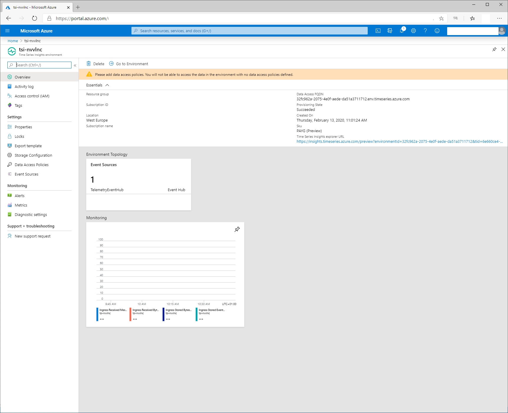
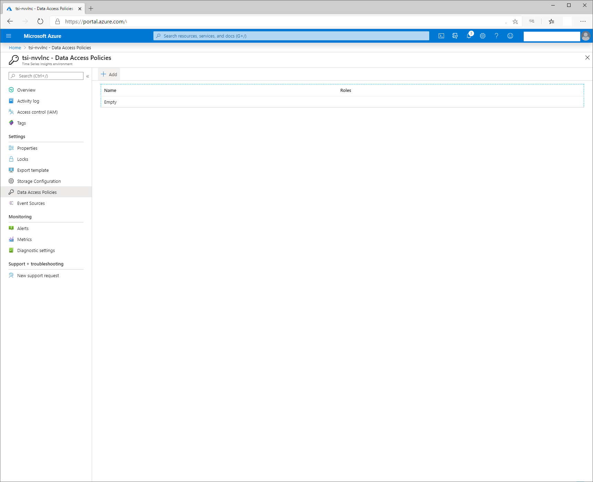
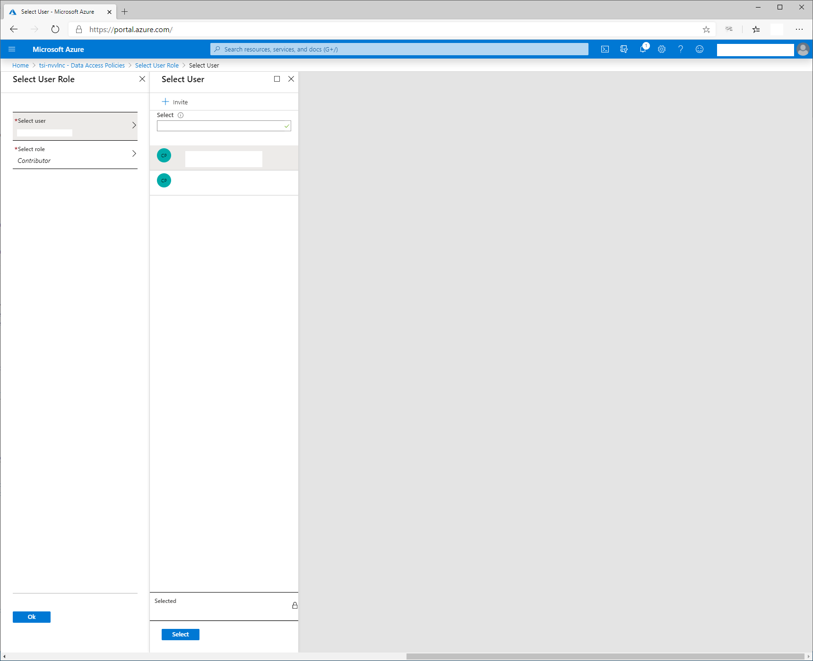
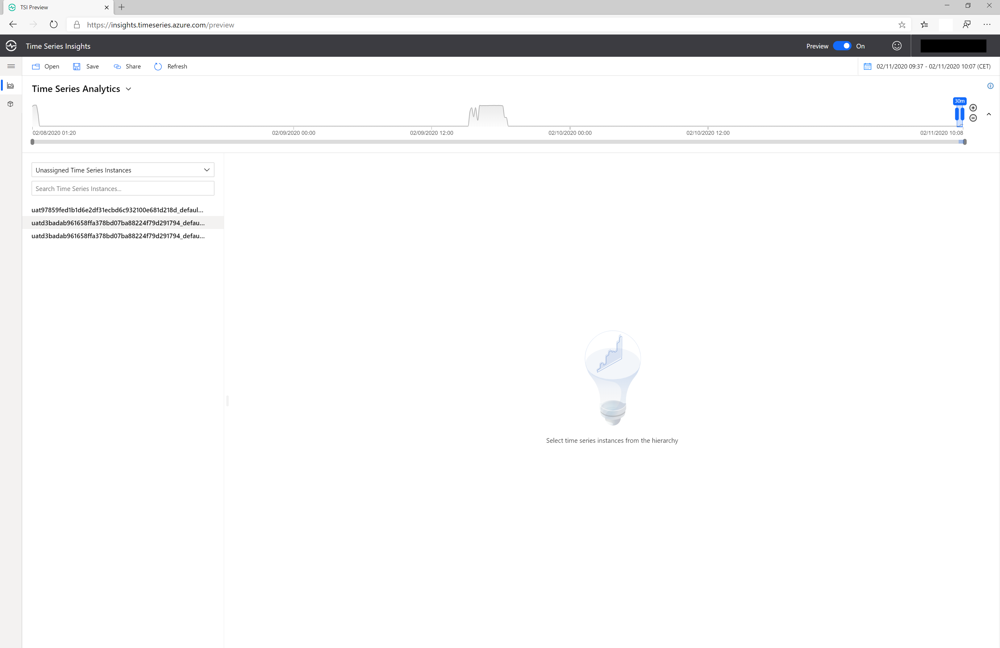
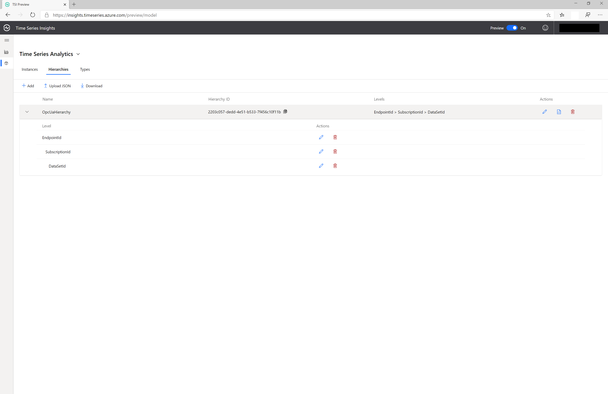
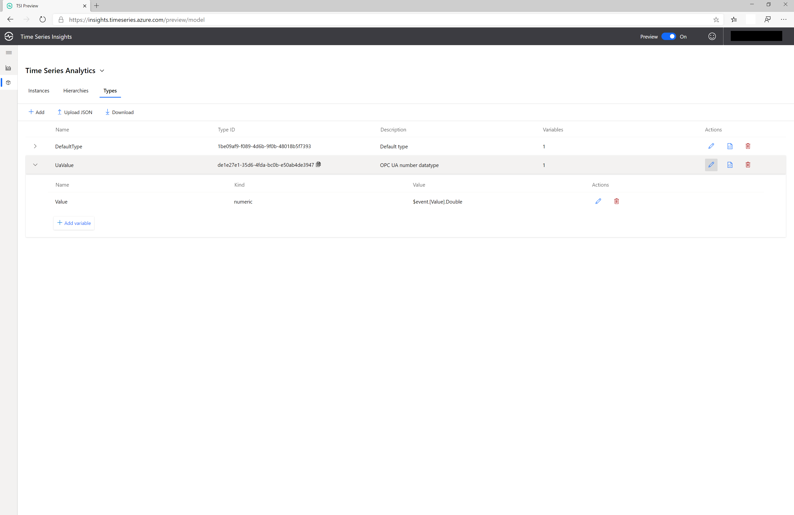
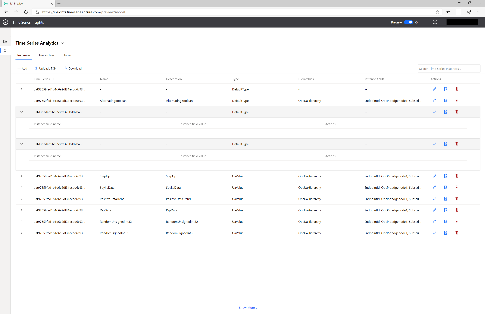
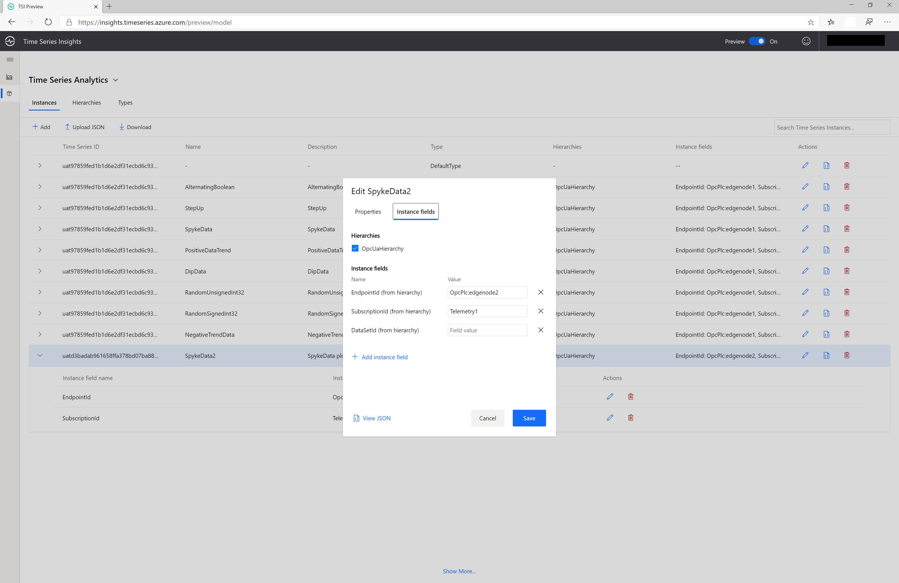
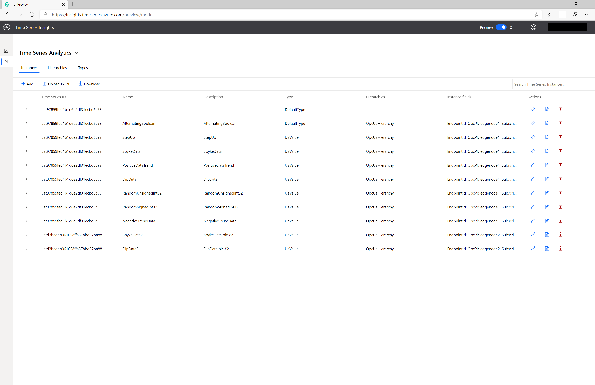
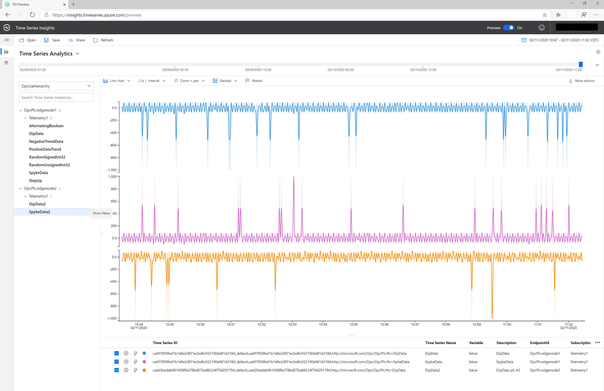

# Tutorial: Visualize data with Time Series Insights (TSI)

The OPC Publisher module connects to OPC UA servers and publishes data from these servers to IoT Hub. The Telemetry processor in the Industrial IoT platform processes these events and forwards contextualized samples to TSI and other consumers.  

This how-to guide shows you how to visualize and analyze the OPC UA Telemetry using this Time Series Insights environment.

In this tutorial, you learn how to:

> [!div class="checklist"]
> * All tutorials include a list summarizing the steps to completion
> * Each of these bullet points align to a key H2
> * Use these green checkboxes in a tutorial

## Prerequisite

* Deploy the IIoT Platform to get a Time Series Insights Environment automatically created
* Data is being published to IoT Hub

## Time Series Insights explorer

The Time Series Insights explorer is a web app you can use to visualize your telemetry. To retrieve the url of the application, open the `.env` file saved as a result of the deployment.  Open a browser to the Url in the `PCS_TSI_URL` variable.  

Before using the Time Series Insights explorer, you must grant access to the TSI data to the users entitled to visualize the data. On a new deployment no data access policies are set by default, therefore nobody can see the data. The data access policies need to be set in the Azure portal, in the Time Series Insights Environment deployed in the IIoT's platform deployed resource group, as follows:

   

Select the Data Access Policies:

   

Assign the required users:

   

In the TSI Explorer, note the Unassigned Time Series Instances. A TSI Instance corresponds to the time/value series for a specific data-point originated from a published node in an OPC server. The TSI Instance, respectively the OPC UA Data point, is uniquely identified by the EndpointId, SubscriptionId, and NodeId. The TSI instances models are automatically detected and display in the explorer based on the telemetry data ingested from the IIoT platform telemetry processor's event hub.

   

The telemetry data can be visualized in the chart by right-clicking the TSI instance and selecting the Value. The time frame to be used in chart can be adjusted from the upper right corner. Value of multiple instances can be visualized on the same time basis selection.

For more information, see [Quickstart: Explore the Azure Time Series Insights Preview](../time-series-insights/quickstart-explore-tsi.md)

## Define and apply a new Model

Since the telemetry instances are now just in raw format, they need to be contextualized with the appropriate 

For detailed information on TSI models, see [Time Series Model in Azure Time Series Insights Preview](../time-series-insights/concepts-model-overview.md)

1. Step 1 - In the model tab of the Explorer, define a new hierarchy for the telemetry data ingested. A hierarchy is the logical tree structure meant to enable the user to insert the meta-information required for a more intuitive navigation through the TSI instances. a user can create/delete/modify hierarchy templates that can be later on instantiated for the various TSI instances.

   

2. Step 2 - define a new type for the values. In our example, we only handle numeric data-types

   

3. Step 3 - select the new TSI instance that requires to be categorized in the previously defined hierarchy

   

4. Step 4 - fill in the instances properties - name, description, data value, and the hierarchy fields in order to match the logical structure 

   

5. Step 5 - repeat step 5 for all uncategorized TSI instances

   

6. Step 6 - back in the TSI Explorer's main page, walk through the categorized instances hierarchy and select the values for the data-points to be analyzed

   

## Connect Time Series Insights to Power BI

You can also connect the Time Series Insights environment to Power BI.  For more information, see [How to connect TSI to Power BI](../time-series-insights/how-to-connect-power-bi.md) and [Visualize data from TSI in Power BI](../time-series-insights/concepts-power-bi.md).

## Next steps
Now that you've learned how to visualize data in TSI, you can check out the Industrial IoT GitHub repository:

> [!div class="nextstepaction"]
> [IIoT Platform GitHub repository](https://github.com/Azure/iot-edge-opc-publisher)