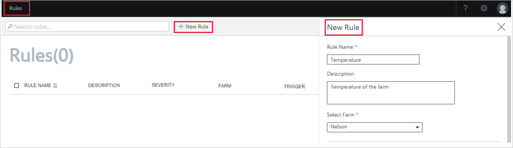
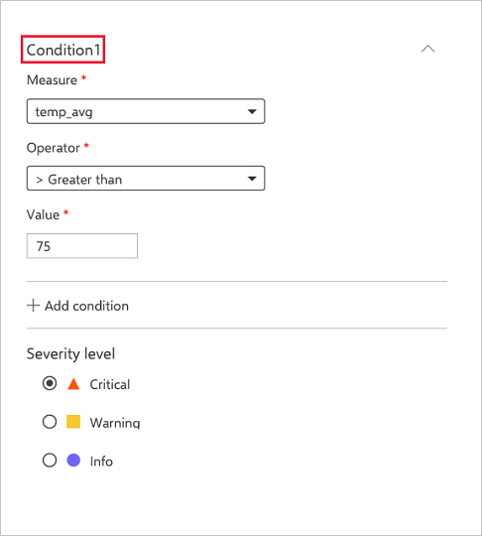
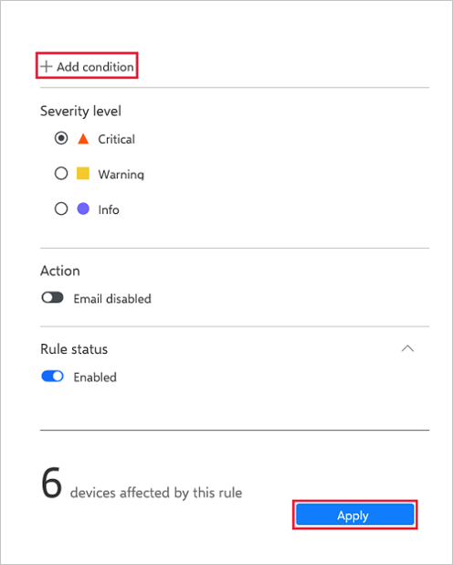
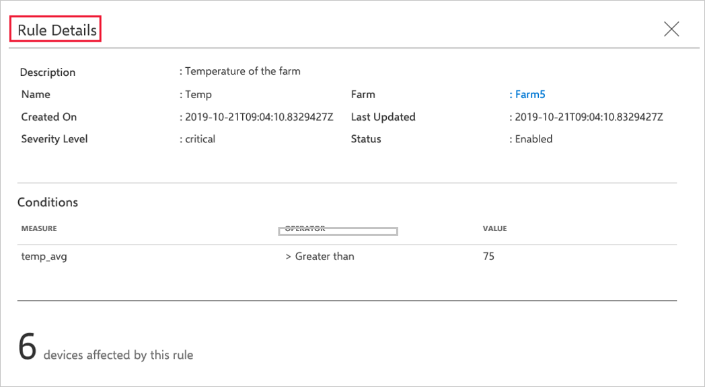
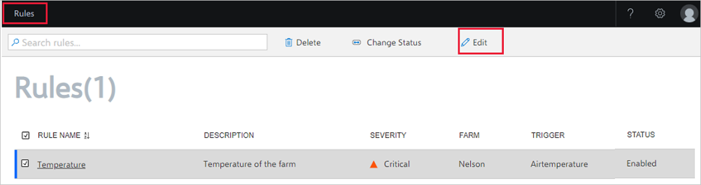
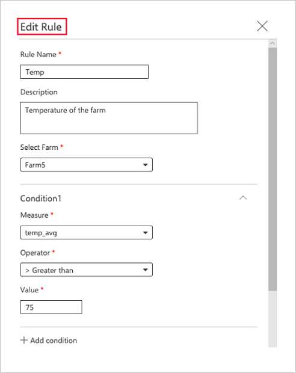
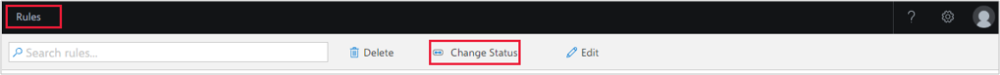
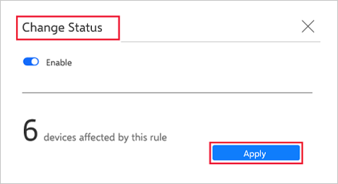
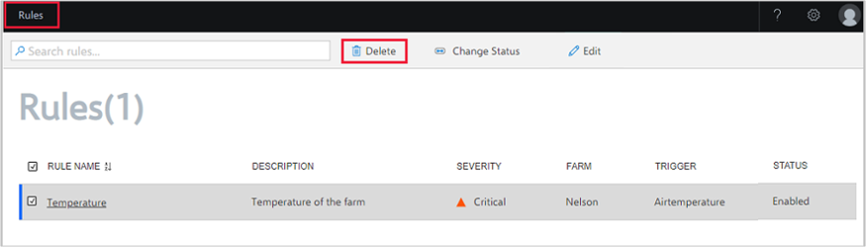
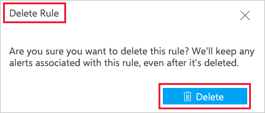

# Configure rules and manage alerts

Azure FarmBeats allows you to create rules based on the business logic, in addition to the sensor data that flows from the sensors and devices deployed in your farm. The rules trigger alerts in the system whenever sensor values cross a threshold value. By viewing and analyzing the alerts created after the threshold values, you can quickly act on any issues and get required solutions.

## Create rule

1. On the home page, go to **Rules**.
2. Select **New Rule**. The New Rule window displays.

    

3. Enter the **Rule Name** and **Rule Description** and then select a farm from the **Select Farm** drop-down menu.
4. Type your farm name to select the farm and **Conditions** section appears on the same window.  

    

5. In **Conditions**, enter the values for **Measure**, **Operator** and **Value**.
6. Type the measure name in the **Measure** drop-down menu.
7. Select **+Add Condition** to add more conditions to the rule.
8. Select the **Severity level**.
9. In **Action**, switch on the **Email enabled** toggle button to enable email alerts.

    

10. Enter the **Email addresses** to which you want to send the email alert, along with the **Email Subject** and **Additional Notes**.  
11. In the **Rule Status**, switch on the **Enabled** toggle button to enable or disable the rule.
    You can view the number of devices that will be affected by the rule.
12. Select **Apply** to create the rule.

## View rule

The **Farm** page displays the list of available rules. Select a **Rule Name**. A window displays the following details that are applicable for the selected rule:
 - Rule name
 - Link to the farm to which the rule is associated
 - Created date
 - Last updated date
 - Severity level
 - Rule status
 - List of conditions  
 - Number of devices affected by the rule

    

## Edit rule

To edit a rule, follow these steps:

1. On the home page, select **Rules** from the left navigation menu.
   The rules window displays.
2. Select the rule for which you want to edit.

    

3. Select **Edit** from the action bar, the **Edit Rule** window displays.

    

4. Change the **Rule Name**, and **Rule Description** and then select a farm from the **Select Farm** drop-down menu.
5. Type your farm name to select the farm and **Conditions** appears in the same window.  
6. In **Conditions**, edit **Measure**, **Operator** and **Value**.
7. Type the measure name in the **Measure** drop-down menu.
8. Select **+Add Condition** to add/edit conditions to the rules.

    

9.  Select the **Severity Level**.  
10. In **Action**, switch on the **Email enabled** toggle button to enable email alerts.
11. Edit the **Email addresses** that you want to send the email alert, along with the **Email Subject** and **Additional Notes**.  
12. In the **Rule Status**, switch on the **Enabled** toggle button to enable or disable the rule.
You can view the number of devices that will be affected by this rule.
13. Select **Apply** to edit the rule.

## Change rule status

To change the status of a rule, follow these steps:

1. On the home page, select **Rules** from the left navigation menu. The rules window displays.
2. Select the rule for which you want to change the status.

    

3. Select **Change Status** from the action bar. The **Change Status** window displays.

    

3. Change the rule status using the **Change Status** toggle button.
   You can view the number of devices that will be affected by the Rule.
4. Select **Apply** to change the rule status.

## Delete rule

To delete a rule, follow these steps:

1. On the home page, select **Rules** from the left navigation menu. The rules window displays.
2. Select the rule for which you want to delete.

    

3. Select **Delete** from the action bar.

    

4. The **Delete Rule** dialog box displays. Select **Delete**.
