# Configure rules and manage alerts in FarmBeats

FarmBeats allows you to create rules based on the business logic, in addition to the sensor data that flows from the sensors and devices deployed in your farm. The rules trigger alerts in the system whenever sensor values cross a threshold value.

## Create Rule

1. On the home page, go to **Rules**.
2. Click **New Rule**, the New Rule window displays.

  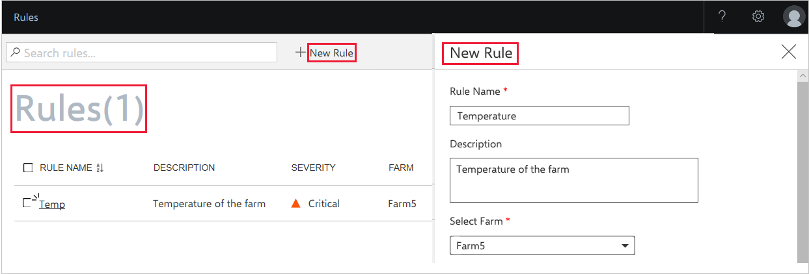

3. Enter the **Rule Name** and **Rule Description** and then select a farm from **Select Farm** drop-down menu.
4. Type your farm name to select the farm and the **Conditions** section will be enabled in the same window.  

  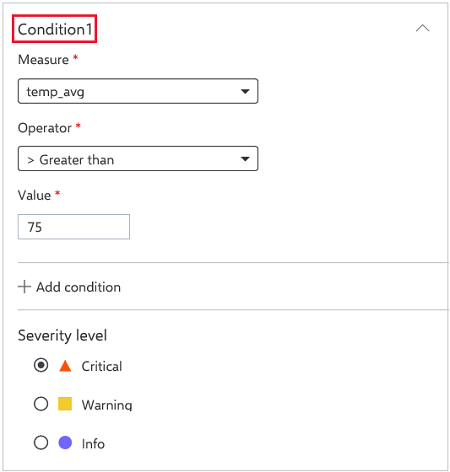

5. In **Conditions** section, enter the values for **Measure**, **Operator** and **Value**.
6. Type the measure name in the **Measure** drop-down menu.
7. Click **+Add Condition** to add more conditions to the rule.
8. Select the **Severity level**.
9. In the **Action** section, switch on **Email enabled** toggle button to enable email alerts.

  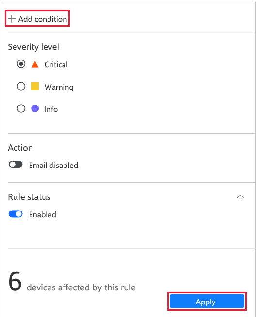

10. Enter the **Email addresses** that you want to send the email alert along with the **Email Subject** and **Additional Notes**.  
11. In the **Rule Status**, switch on **Enabled** toggle button to enable or disable the Rule
    You can view the number of devices that will be affected by the rule.
12. Click **Apply** to create the rule.

## View rule

The **Farm** list page displays the available rules. Select a **Rule Name** check box, the window displays the following details applicable for that rule:

1. Rule Name
2. Link to the Farm to which the Rule is associated
3. Created Date
4. Last Updated Date
5. Severity Level
6. Rule Status
7. List of Conditions  
8. Number of Devices affected by the Rule

  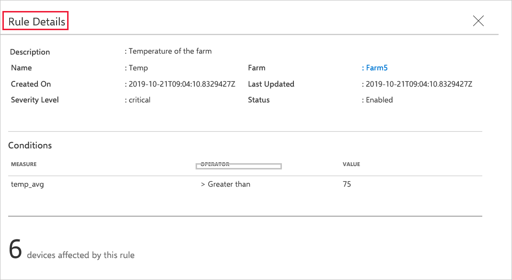

## Edit rule

To edit the rule, follow these steps:

1. On the home page, select **Rules** from the left navigation menu.
   The rules window displays.
2. Select the checkbox for the **Rule** that you want to edit.

  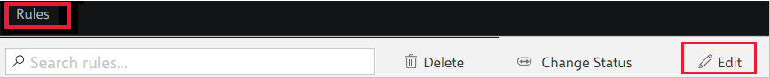

3. Click **Edit** from the action bar, the **Edit Rule** window displays.

  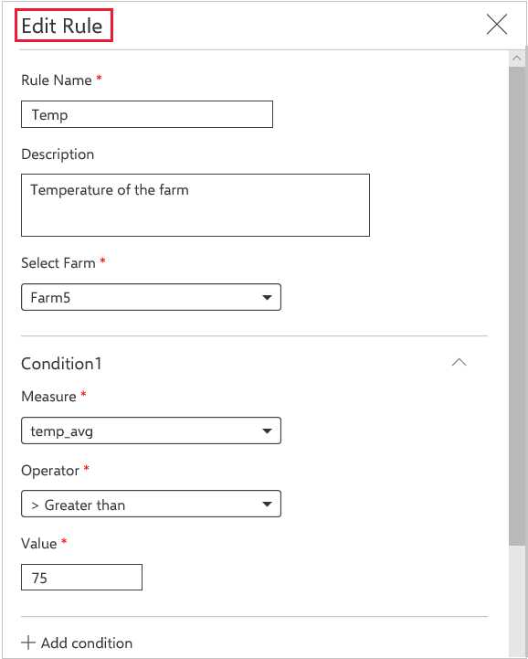

4. Change the **Rule Name**, and **Rule Description** and then select a farm from **Select Farm** drop-down menu.
5. Type your farm name to select the farm and the **Conditions** section will be enabled in the same window.  
6. In the **Conditions** section, edit **Measure**, **Operator** and **Value**.
7. Type the measure name in the **Measure** drop-down menu.
8. Click **+Add Condition** to add/edit conditions to the rules.

  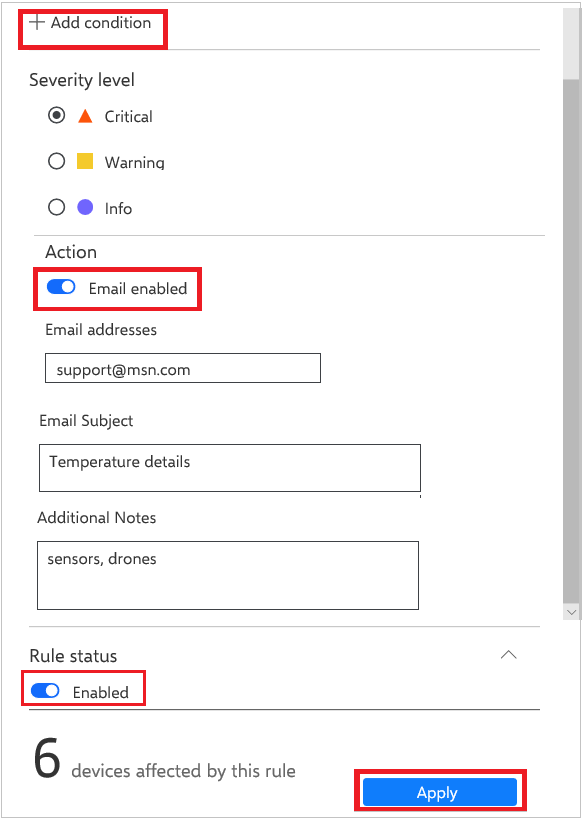

9.  Select the **Severity Level**.  
10. In the **Action** section, switch on **Email enabled** toggle button to enable email alerts.
11. Edit the **Email addresses** that you want to send the email alert along with the **Email Subject** and **Additional Notes**.  
12. In the **Rule Status**, switch on **Enabled** toggle button to enable or disable the Rule
    You can view the number of devices that will be affected by this rule.
13. Click **Apply** to edit the rule.

## Change status for rule

To change the status of a rule, follow these steps:

1. On the home page, select **Rules** from the left navigation menu. The rules window displays.
2. Select the checkbox for the **Rule** that you want to change the status.

  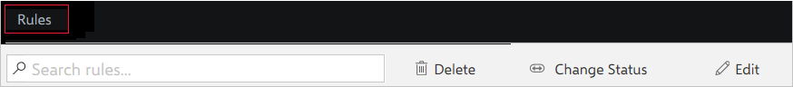

3. Click **Change Status** from the action bar. The **Change Status** window displays.

  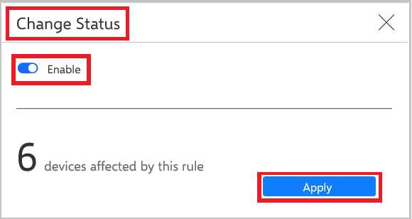

3. Change the rule status using the **Change Status** toggle button.
   You can view the number of devices that will be affected by the Rule.
4. Click **Apply** to change the rule.

## Delete rule

To delete a rule, follow these steps:

1. On the home page, select **Rules** from the left navigation menu. The rules window displays.
2. Select the checkbox for the **Rule** that you want to delete.

  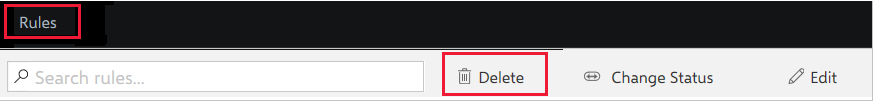

3. Click **Delete** from the action bar.

  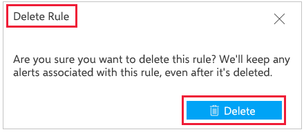

4. The **Delete Rule** dialog box displays. Click **Delete**.
