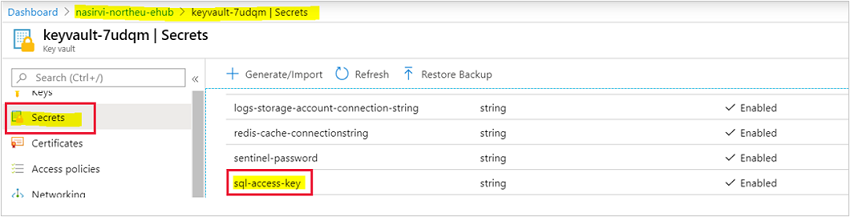
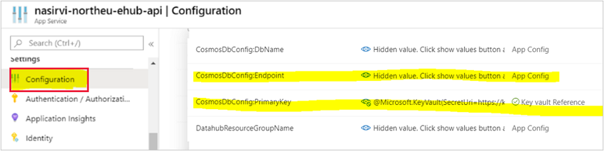
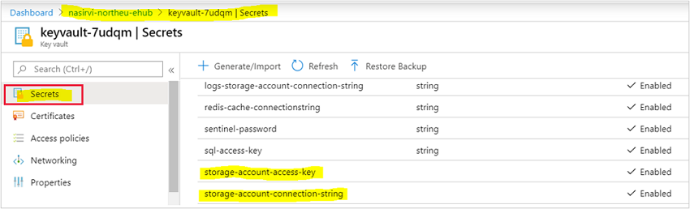

# Disaster recovery for FarmBeats

Data recovery protects you from losing your data in an event like collapse of Azure region. In such an event, you can start failover, and recover the data stored in your FarmBeats deployment.

Data recovery is not a default feature in Azure FarmBeats. You can configure this feature manually by configuring the required Azure resources that are used by FarmBeats to store data in an Azure paired region. Use Active – Passive approach to enable recovery.

The following sections provide information about how you can configure data recovery in Azure FarmBeats:

- [Enable data redundancy](#enable-data-redundancy)
- [Restore service from online backup](#restore-service-from-online-backup)

## Enable data redundancy

FarmBeats stores data in three Azure first party services, which are **Azure storage**, **Cosmos DB** and **Time Series Insights**. Use the following steps to enable data redundancy for these services to a paired Azure region:

1.	**Azure Storage** - Follow this guideline to enable data redundancy for each storage account in your FarmBeats deployment.
2.	**Azure Cosmos DB** - Follow this guideline to enable data redundancy for the Azure Cosmos DB account used for your FarmBeats deployment.
3.	**Azure Time Series Insights (TSI)** - TSI currently doesn't offer data redundancy. To recover Time Series Insights data, go to your sensor/weather partner and push the data again to FarmBeats deployment.

## Restore service from online backup

You can initiate failover and recover data stored for which, each of the above-mentioned data stores for your FarmBeats deployment. Once you've recovered the data for Azure Storage and Azure Cosmos DB, create another FarmBeats deployment in the Azure paired region and then configure the new deployment to use data from restored data stores (i.e. Azure Storage and Azure Cosmos DB) by using the below steps:

1. [Configure Azure Cosmos DB](#configure-azure-cosmos-db)
2. [Configure Storage Account](#configure-storage-account)

### Configure Azure Cosmos DB

Copy the access key of the restored Azure Cosmos DB and update the new FarmBeats Datahub Key Vault.

  

> [!NOTE]
> Copy the URL of restored Azure Cosmos DB and update it in the new FarmBeats Datahub App Service Configuration. You can now delete Azure Cosmos DB account in the new FarmBeats deployment.

  

### Configure Storage Account

Copy the access key of the restored storage account and update it in the new FarmBeats Datahub Key Vault.

>[!NOTE]
> Ensure to Update Storage Account name in the new FarmBeats Batch VM config file.

Similarly, if you have enabled data recovery for your Accelerator storage account,  follow the step 2 to update the accelerator Storage Account access key and name, in the new FarmBeats instance.
