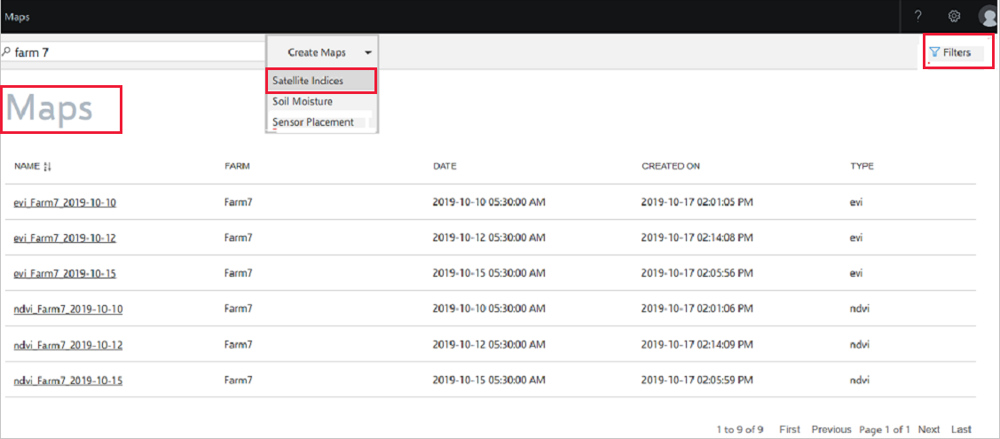
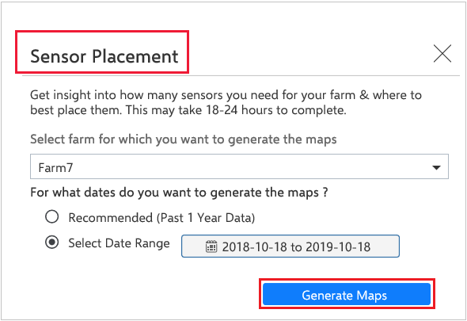
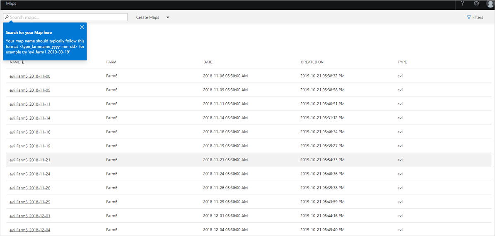
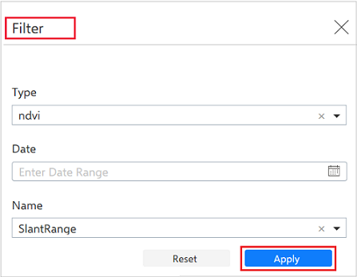
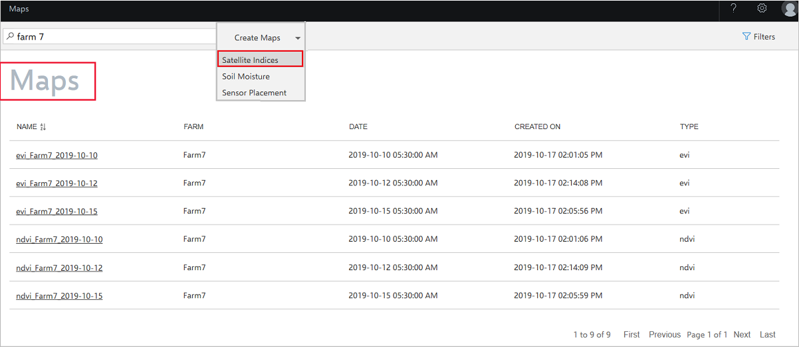
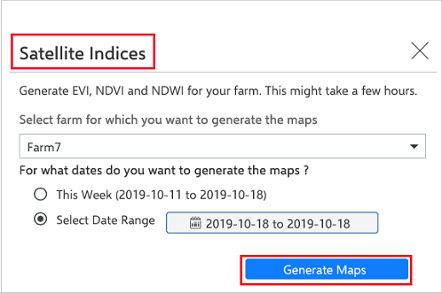
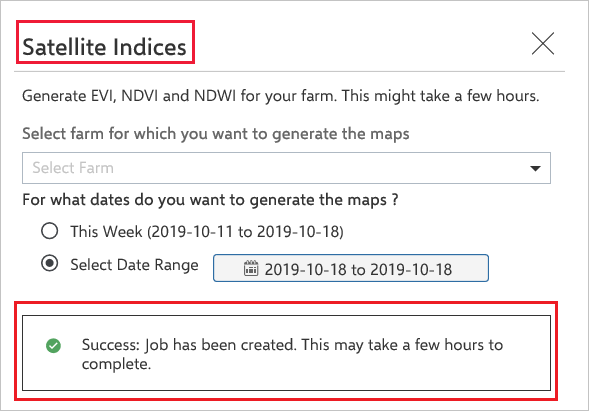
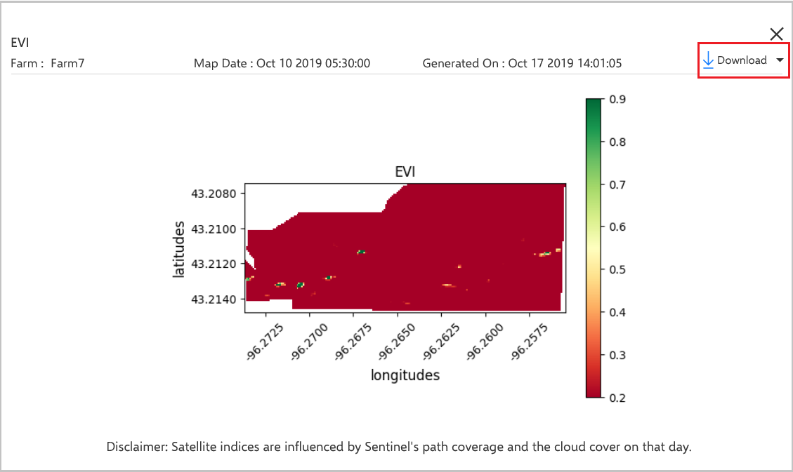
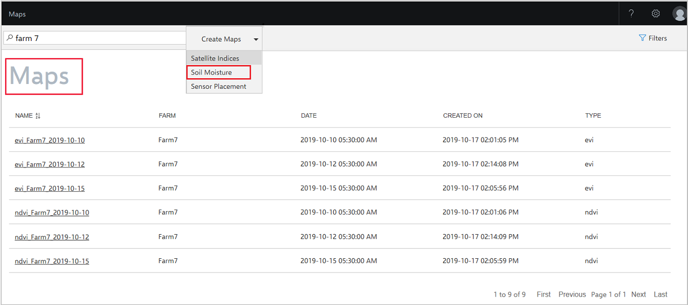

# Generate maps

Using Azure FarmBeats, you can generate the following maps by using satellite imagery and sensor data inputs. Maps help you to see the geographical location of your farm and identify the appropriate location for your devices.

  - **Sensor Placement map**: Provides recommendations on how many sensors to use and where to place them on a farm.
  - **Satellite Indices map**: Shows the vegetation index and water index for a farm.
  - **Soil Moisture heatmap**: Shows soil moisture distribution by fusing satellite data and sensor data.

## Sensor Placement map

A FarmBeats Sensor Placement map assists you with the placement of soil moisture sensors. The map output consists of a list of coordinates for sensor deployment. The inputs from these sensors are used along with satellite imagery to generate the Soil Moisture heatmap.

This map is derived by segmenting the canopy as seen over multiple dates throughout the year. Even bare soil and buildings are part of the canopy. You can remove sensors that aren't required on the location. This map is for guidance, and you can alter the position and numbers slightly based on your custom knowledge. Adding sensors won't regress soil moisture heatmap results, but there's a possibility of deterioration in heatmap accuracy if the sensor number is reduced.

## Before you begin

Meet the following prerequisites before you attempt to generate a Sensor Placement map:

- The farm size must be more than one acre.
- The number of cloud-free Sentinel scenes must be more than six for the selected date range.
- At least six cloud-free Sentinel scenes must have a Normalized Difference Vegetation Index (NDVI) greater than or equal to 0.3.

    > [!NOTE]
    > Sentinel allows only two concurrent threads per user. As a result, jobs get queued and might take longer to complete.

### Dependencies on Sentinel

The following dependencies pertain to Sentinel:

- We depend on Sentinel performance for downloading satellite images. Check Sentinel performance status and maintenance [activities](https://scihub.copernicus.eu/twiki/do/view/SciHubNews/WebHome).
- Sentinel allows only two concurrent [downloads threads](https://sentinels.copernicus.eu/web/sentinel/sentinel-data-access/typologies-and-services) per user.
- Precision map generation is affected by [Sentinel coverage and revisit frequency]( https://sentinel.esa.int/web/sentinel/user-guides/sentinel-2-msi/revisit-coverage).

## Create a Sensor Placement map
This section details the procedures for creating Sensor Placement maps.

> [!NOTE]
> You can initiate a Sensor Placement map from the **Maps** page or from the **Generate Precision Maps** drop-down menu on the **Farm Details** page.

Follow these steps.

1. On the home page, go to **Maps** from the left navigation menu.
2. Select **Create Maps**, and select **Sensor Placement** from the drop-down menu.

    

3. After you select **Sensor Placement**, the **Sensor Placement** window appears.

    

4. Select a farm from the **Farm** drop-down menu.
   To search and select your farm, you can either scroll in the drop-down list or enter the name of the farm in the text box.
5. To generate a map for the last year, select **Recommended**.
6. To generate a map for a custom date range, select the option **Select Date Range**. Enter the start and end date for which you want to generate the Sensor Placement map.
7. Select **Generate Maps**.
 A confirmation message with job details appears.

  For information on job status, see the section **View Jobs**. If the job status shows *Failed*, a detailed error message appears on the tooltip of the *Failed* status. In this case, repeat the previous steps and try again.

  If the issue persists, see the [Troubleshoot](troubleshoot-azure-farmbeats.md) section or contact the [Azure FarmBeats forum for support](https://aka.ms/FarmBeatsMSDN) with relevant logs.

### View and download a Sensor Placement map

Follow these steps.

1. On the home page, go to **Maps** from the left navigation menu.

    

2. Select **Filter** from the left navigation of the window.
  The **Filter** window displays search criteria.

    

3. Select **Type**, **Date**, and **Name** values from the drop-down menus. Then select **Apply** to search for the map you want to view.
  The date on which the job was created is shown in the format type_farmname_YYYY-MM-DD.
4. Scroll through the list of maps available by using the navigation bars at the end of the page.
5. Select the map you want to view. A pop-up window displays the preview for the selected map.
6. Select **Download**, and download the GeoJSON file of sensor coordinates.

    

## Satellite Indices map

The following sections explain the procedures involved in creating and viewing a Satellite Indices map.

> [!NOTE]
> You can initiate a Satellite Indices map from the **Maps** page or from the **Generate Precision Maps** drop-down menu on the **Farm Details** page.

FarmBeats provides you with the ability to generate NDVI, Enhanced Vegetation Index (EVI), and Normalized Difference Water Index (NDWI) maps for farms. These indices help determine how the crop is currently growing, or has grown in the past, and the representative water levels in the ground.

> [!NOTE]
> A Sentinel image is required for the days for which the map is generated.

## Create a Satellite Indices map

Follow these steps.

1. On the home page, go to **Maps** from the left navigation menu.
2. Select **Create Maps**, and select **Satellite Indices** from the drop-down menu.

    

3. After you select **Satellite Indices**, the **Satellite Indices** window appears.

    

4. Select a farm from the drop-down menu.
   To search and select your farm, you can either scroll in the drop-down list or enter the name of the farm.   
5. To generate a map for the last week, select **This Week**.
6. To generate a map for a custom date range, select the option **Select Date Range**. Enter the start and end date for which you want to generate the Satellite Indices map.
7. Select **Generate Maps**.
    A confirmation message with job details appears.

    

    For information on job status, see the section **View Jobs**. If the job status shows *Failed*, a detailed error message appears on the tooltip of the *Failed* status. In this case, repeat the previous steps and try again.

    If the issue persists, see the [Troubleshoot](troubleshoot-azure-farmbeats.md) section or contact the [Azure FarmBeats forum for support](https://aka.ms/FarmBeatsMSDN) with relevant logs.

### View and download a map

Follow these steps.

1. On the home page, go to **Maps** from the left navigation menu.

    

2. Select **Filter** from the left navigation of the window. The **Filter** window displays search criteria.

    

3. Select **Type**, **Date**, and **Name** values from the drop-down menus. Then select **Apply** to search for the map you want to view.
  The date on which the job was created is shown in the format type_farmname_YYYY-MM-DD.

4. Scroll through the list of maps available by using the navigation bars at the end of the page.
5. For each combination of **Farm Name** and **Date**, the following three maps are available:
    - NDVI
    - EVI
    - NDWI
6. Select the map you want to view. A pop-up window displays the preview for the selected map.
7. Select **Download** from the drop-down menu to select the download format. The map is downloaded and stored in your local folder on your computer.

    

## Soil Moisture heatmap

Soil moisture is the water that's held in the spaces between soil particles. The Soil Moisture heatmap helps you understand the soil moisture data at any depth, at high resolution within your farm. To generate an accurate and usable Soil Moisture heatmap, a uniform deployment of sensors is required. All the sensors must be from the same provider. Different providers have differences in the way soil moisture is measured along with differences in calibration. The heatmap is generated for a particular depth by using the sensors deployed at that depth.

### Before you begin

Meet the following prerequisites before you attempt to generate a Soil Moisture heatmap:

- At least three soil moisture sensors must be deployed. Don't try to create a Soil Moisture heatmap before sensors are deployed and associated with the farm.
- Generating a Soil Moisture heatmap is influenced by Sentinel's path coverage, cloud cover, and cloud shadow. At least one cloud-free Sentinel Scene must be available for the last 120 days, from the day for which the Soil Moisture heatmap was requested.
- At least half of the sensors deployed on the farm must be online and have data streaming to the datahub.
- The heatmap must be generated by using sensor measures from the same provider.

## Create a Soil Moisture heatmap

Follow these steps.

1. On the home page, go to **Maps** from the left navigation menu to view the **Maps** page.
2. Select **Create Maps**, and select **Soil Moisture** from the drop-down menu.

    

3. After you select **Soil Moisture**, the **Soil Moisture** window appears.

    

4. Select a farm from the **Farm** drop-down menu.
   To search and select your farm, you can either scroll from the drop-down list or enter the name of the farm in the **Select farm** drop-down menu.
5. On the **Select Soil Moisture Sensor Measure** drop-down menu, select the soil moisture sensor measure (depth) for which you want to generate the map.
To find the sensor measure, go to **Sensors**, and select any soil moisture sensor. Then, under the **Sensor Properties** section, use the value in **Measure Name**.
6. To generate a map for **Today** or **This Week**, select one of the options.
7. To generate a map for a custom date range, select the option **Select Date Range**. Enter the start and end date for which you want to generate the Soil Moisture heatmap.
8. Select **Generate Maps**.
 A confirmation message with job details appears.

   

    For information on job status, see the section **View Jobs**. If the job status shows *Failed*, a detailed error message appears on the tooltip of the *Failed* status. In this case, repeat the previous steps and try again.

    If the issue persists, see the [Troubleshoot](troubleshoot-azure-farmbeats.md) section or contact the [Azure FarmBeats forum for support](https://aka.ms/FarmBeatsMSDN) with relevant logs.

### View and download a map

Follow these steps.

1. On the home page, go to **Maps** from the left navigation menu.

    

2. Select **Filter** from the left navigation of the window. The **Filter** window displays from where you can search for maps.

    

3.  Select **Type**, **Date**, and **Name** values from the drop-down menus. Then select **Apply** to search for the map you want to view. The date on which the job was created is shown in the format type_farmname_YYYY-MM-DD.
4. Select the **Sort** icon next to the table headers to sort according to **Farm**, **Date**, **Created On**, **Job ID**, and **Job Type**.
5. Scroll through the list of maps available by using the navigation buttons at the end of the page.
6. Select the map you want to view. A pop-up window displays the preview for the selected map.
7. Select **Download** from the drop-down menu to select the download format. The map is downloaded and stored in the specified folder.

    
