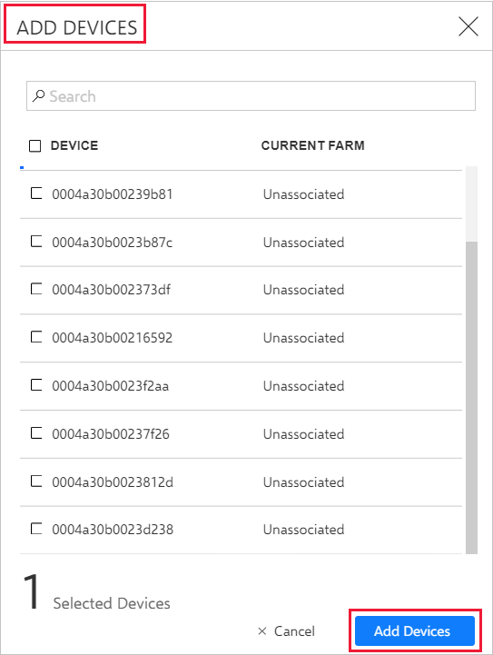
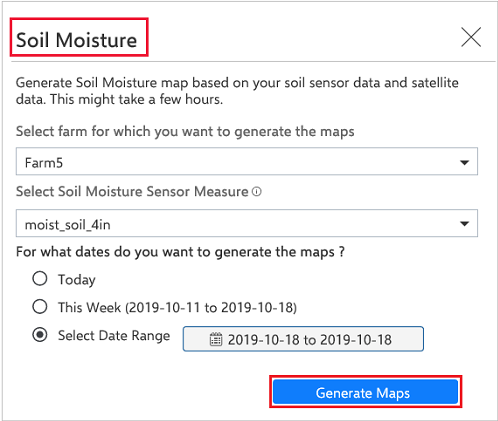
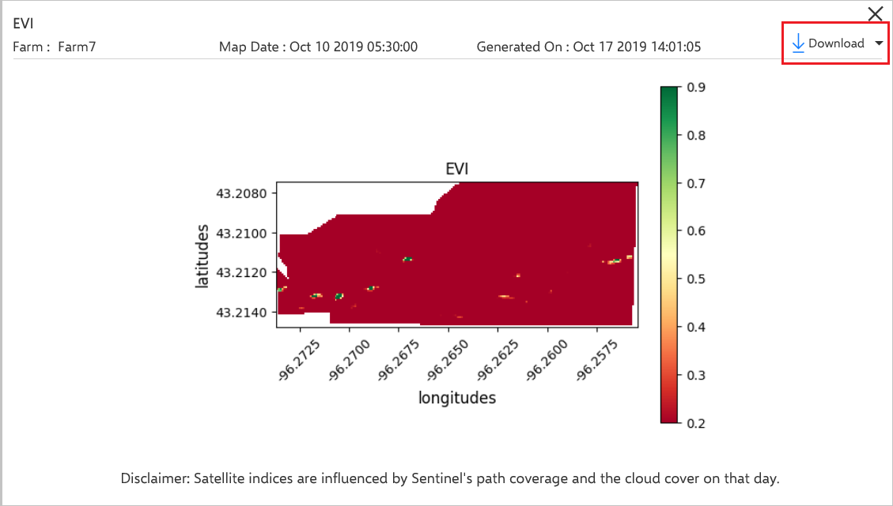

# Generate Soil Moisture Heatmap

Soil moisture is the water that is held in the spaces between soil particles. Soil Moisture Heatmap helps you understand the moisture data at any depth, and at high resolution within your farms. To generate an accurate and usable soil moisture heatmap, a uniform deployment of sensors from the same provider is required. Different providers will have differences in the way soil moisture is measured along with differences in calibration. The Heatmap is generated for a particular depth using the sensors deployed at that depth.

This article describes the process of generating a Soil Moisture Heatmap for your farm, using the Azure FarmBeats Accelerator. In this article, you will learn how to:

- [Create Farms](#create-a-farm)
- [Assign sensors to Farms](#get-soil-moisture-sensor-data-from-partner)
- [Generate Soil Moisture Heatmap](#generate-soil-moisture-heatmap)

## Before you begin

Ensure the following:  

- An Azure subscription.
- A running instance of Azure FarmBeats.
- A minimum three soil moisture sensors are available for the farm.

## Create a farm

A farm is a geographical area of interest for which you want to create a soil moisture heatmap. You can create a farm using the [Farms API](https://aka.ms/FarmBeatsDatahubSwagger) or in the [FarmsBeats Accelerator UI](manage-farms-in-azure-farmbeats.md#create-farms)

## Deploy sensors

You should physically deploy soil moisture sensors on the farm. You can purchase soil moisture sensors from any of our approved partners - [Davis Instruments](https://www.davisinstruments.com/product/enviromonitor-gateway/) and [Teralytic](https://teralytic.com/). You should coordinate with your sensor provider to do the physical setup on your farm.

## Get soil moisture sensor data from partner

As sensors start streaming, the data into the partner data dashboard, they enable the data into Azure FarmBeats. This can be done from the partner application.

For example, if you have purchased Davis sensors, you will log into your weather link account, and provide the required credentials to enable the data streaming into Azure FarmBeats. To get the required credentials, follow the instructions from [Get sensor data](get-sensor-data-from-sensor-partner.md#get-sensor-data-from-sensor-partners).

Once you enter your credentials and select **Submit** on the partner application, you can have the data flowing into Azure FarmBeats.

### Assign soil moisture sensors to the farm

Once you have linked your sensor account into Azure FarmBeats, you need to assign the soil moisture sensors to the farm of interest.

1.	In the home page, select **Farms** from the menu, the **Farms** list page is displayed.
2.	Select **MyFarm** > **Add Devices**.
3.	The **Add Devices** window displays. Select any device that is linked to the soil moisture sensors for your farm.

    

4. Select **Add Devices**.     

## Generate Soil Moisture Heatmap

This step is to create a job or a long running operation that will generate Soil Moisture Heatmap for your farm.

1.	On the home page, go to **Farms** from the left navigation menu to view the farms page.
2.	Select **MyFarm**.
3.	In the **Farm Details** page, select **Generate Precision Map**.
4.	From the drop-down menu, select **Soil Moisture**.
5.	In the **Soil Moisture** window, select **This Week**.
6.	In the **Select Soil Moisture** **Sensor Measure**, enter the measure you want to use for the map.
    To find the sensor measure, in **Sensors**, select any soil moisture sensor. In **Sensor Properties**, use the **Measure Name** value.

    

7.	Select **Generate Maps**.
    A confirmation message with job details is displayed. For more information, see Job Status in Jobs.

    >[!NOTE]
    > The job takes around three to four hours to complete.

### Download the Soil Moisture Heatmap

Use the following steps:

1. In the **Jobs** page, check the **Job Status** for the job you created in the last procedure.
2. When the job status shows **Succeeded**, select **Maps** on the menu.
3. Search for the map by the day it was created in the format <soil-moisture_MyFarm_YYYY-MM-DD>.
4. Select a map in the **Name** column, a pop-up window displays with the preview of the selected map.
5. Select **Download**. The map is downloaded and stored to the local folder of your computer.

    

## Next steps

Now that you’ve successfully generated a Soil Moisture Heatmap, learn how to [generate sensor placement](generate-maps-in-azure-farmbeats.md#sensor-placement-map) and [ingest historical telemetry data](ingest-historical-telemetry-data-in-azure-farmbeats.md). 
