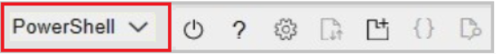
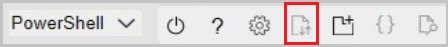
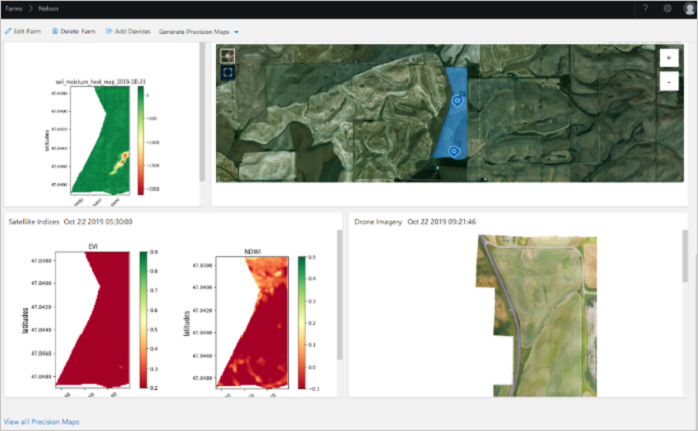
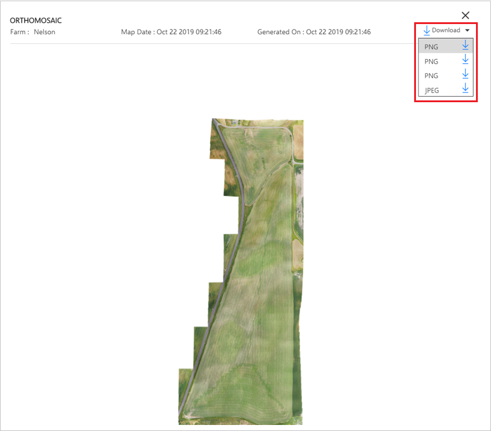
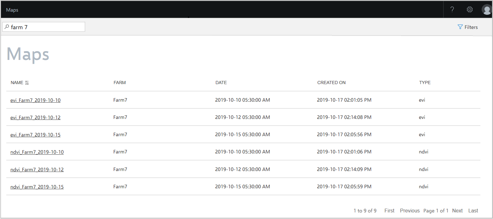

# Get drone imagery from drone partners

This article describes how you can bring in orthomosaic data from your drone imagery partners to Azure FarmBeats Datahub. An orthomosaic is an aerial illustration or image that's geometrically corrected and stitched from data collected by a drone.

Currently, the following imagery partners are supported.

  

Integrating drone imagery data with Azure FarmBeats helps you get orthomosaic data from the drone flights you conduct on your farm into the datahub. After the data is available, you can view it in the FarmBeats Accelerator. The data can be used for data fusion and artificial intelligence and machine learning model building.

## Before you begin

  - Make sure that you installed Azure FarmBeats. For information on how to install FarmBeats, see [Install Azure FarmBeats](install-azure-farmbeats.md).
  - Ensure that you have the farm for which you want drone imagery defined in your FarmBeats system.

## Enable drone imagery integration with FarmBeats

Provide the following information to your device provider to enable integration with FarmBeats:
 - API endpoint
 - Tenant ID
 - Client ID
 - Client secret

Follow these steps.

1. Download this script, and extract it to your local drive. Two files are inside the zip file.
2. Sign in to the [Azure portal](https://portal.azure.com/) and open Azure Cloud Shell. This option is available on the toolbar in the upper-right corner of the portal.

    

3. Make sure the environment is set to **PowerShell**.

    

4. Upload the two files that you downloaded from step 1 in your Cloud Shell instance.

    

5. Go to the directory where the files were uploaded. By default, they're uploaded to the home directory under the username.
6. Run the following script:

    ```azurepowershell-interactive

    ./generateCredentials.ps1

    ```

7. Follow the onscreen instructions to capture the values of API Endpoint, Tenant ID, Client ID, Client Secret, and EventHub Connection String.

    After you enter the required credentials into the partner's drone software system, you can import all farms from the FarmBeats system. Then you can use the farm details to do your flight path planning and drone image collection.

    After the raw images are processed by the drone providers' software, the drone software system uploads the stitched orthomosaic and other processed images into the datahub.

## View drone imagery

After the data is sent to the FarmBeats datahub, you can query the Scene Store by using FarmBeats Datahub APIs.

Alternatively, you can view the latest drone image on the **Farm Details** page. To view the image, follow the steps.

1. Select the farm to which your imagery was uploaded. The **Farm** details page appears.
2. Scroll down to the latest **Precision Maps** section.
3. View the image in the **Drone Imagery** section.

    

## Download drone imagery

When you select the Drone Imagery section, a pop-up opens to show a high-resolution image of the drone orthomosaic.



## View all drone maps

Files and images uploaded by the drone provider appear in the **Maps** section. Select the **Maps** section, filter by **Farm**, and select the appropriate files to view and download.

  

## Next steps

Learn how to use FarmBeats Datahub [APIs](rest-api-in-azure-farmbeats.md) to get your drone imagery.
