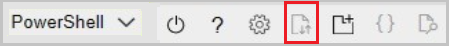

# Get sensor data from sensor partners

Azure FarmBeats helps you to bring streaming data from your IoT devices and sensors into Data hub. Currently, the following Sensor device partners are supported:

  

Integrating Device data with Azure FarmBeats helps you get ground data from the IoT Sensors deployed in your farm to the Data hub. The data, once available can be visualized through the FarmBeats Accelerator and can be used for data fusion and AI/ML model building using FarmBeats.

To start sensor data streaming, ensure the following:

-  You have installed FarmBeats from Azure Marketplace.
-  You have decided on the sensors and devices that you want to install on your farm.
-  If you are planning to use soil moisture sensors, you can use FarmBeats Soil Moisture Sensor Placement map to get a recommendation on the number of       sensors and where exactly should place the sensors. For more information, see [Generate Maps](generate-maps.md).

- Purchase and deploy device/sensors from your device partner in your farm. Make sure you can access the sensor data via your device partners’ solution.

### Enable device integration with FarmBeats   

Once you have started the streaming of sensor data, you can start the process of
getting the data into your FarmBeats system. You need to provide the following information to your device provider to enable the integration to FarmBeats:  

 - API Endpoint  
 - Tenant ID  
 - Client ID  
 - Client Secret  
 - EventHub Connection String

The above information is provided to you by your system integrator. For any issues while enabling the device integrations, contact your system integrator.

Alternatively, you can generate the credentials by running this script from the Azure Cloud Shell. Follow the below steps:

1. Download the [ZIP file](https://aka.ms/farmbeatspartnerscript) and extract to your local drive. You will find two files inside the ZIP file.
2. Sign in to https://portal.azure.com/ and open Cloud Shell (This option is available on the top right bar of the portal)  

    

3. Ensure the environment is set to **PowerShell** - by default it is set to Bash.

    

4. Upload the two files (from step 1 above) in your Cloud Shell.

    

5. Go to the directory where the files were uploaded (by default it gets uploaded to the home directory> username).
6. Run the following script:

    ```azurepowershell-interactive 

    PS> ./generateCredentials.ps1   

    ```
7. Follow the onscreen instructions to capture the values. (API Endpoint, Tenant ID, Client ID, Client Secret and EventHub Connection String).

**Integrate device data using the generated credentials**

Visit the device partner portal, to link FarmBeats using the set of credentials you generated in the previous section.

 - API Endpoint  
 - EventHub Connection String  
 - Client ID  
 - Client Secret  
 - Tenant ID  

 The device provider confirms a successful integration. Upon confirmation, you can view all the devices and sensors on Azure FarmBeats.

## View devices and sensors

Use the following section to view the devices and sensors in your farm.

### View devices

Currently FarmBeats supports the following devices:

- **Node**: a device to which one or more sensors are attached to.
- **Gateway**: a device to which one or more sensors are attached to.

Use the following steps:

1. On the home page, select **Devices** from the menu.
  The Devices page displays the device type, model, status, the farm it’s placed in, and the last updated date for metadata. By default, the farm column is set to NULL. You can choose to assign a device to a farm. For more information, see [Assign devices](#assign-devices).
2. Select the device to view the device properties, telemetry and child devices connected to the device.  

    

### View sensors

Use the following steps:

1. On the home page, select **Sensors** from the menu.
  The Sensors page displays details about type of sensor, the farm it's connected to, the parent device, port name, port type and the last updated status.
2. Select the sensor to view sensor properties, active alerts and telemetry from the sensor.

    

## Assign devices  

Once you have the sensor data flowing in, you can assign it to the farm in which you have deployed the sensors.

1. On the home page, select **Farms** from the menu, the **Farms** list page is displayed.  
2. Select the Farm to which you want to assign the device and select **Add Devices**.  
3. The **Add Devices** window displays. Select the device you want to assign to the farm.

    

4. Select **Add Devices**. Alternatively, go to the **Devices** menu, select the devices you want to assign to a farm and select **Associate Devices**.  
5. In the **Associate Devices** window, select the farm from drop-down and select **Apply to All** to associate the farm to all the selected devices.

    

6. To associate each device to a different farm, select the drop-down in the **Assign to Farm** column and select a farm for each device row.  
7. Select **Assign** to complete device assignment.

### Visualize sensor data

Use the following steps:

1. On the home page, select **Farms** from the menu to view the **Farms** page.  
2. Select the **Farm** for which you want to see the sensor data.  
3. On the **Farm** dashboard, you can view telemetry data. You can choose to view live telemetry or use **Custom Range** to view in a specific date range.

    

## Delete sensor

Follow these steps:

1. On the home page, select **Sensors** from the menu to view the **Sensors** page.  
2. Select the device you want to delete and select **Delete** from confirmation window.

    

A confirmation message shows that the sensor is successfully deleted.  

## Delete devices

Follow these steps:

1. On the home page, select **Devices** from the menu to view the devices page.  
2. Select the device you want to delete and select **Delete** from the confirmation window.

    

## Next steps

You now have sensor data flowing into your Azure FarmBeats instance. Now, learn how to [generate maps](generate-maps.md#generate-maps) for your farms.
