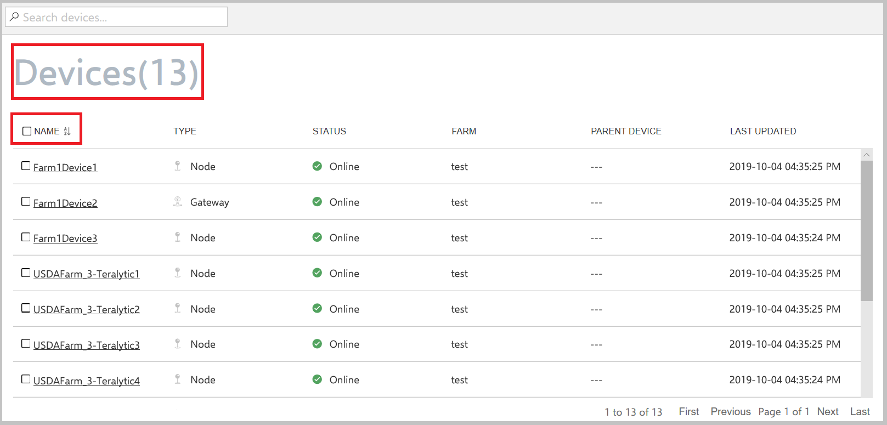
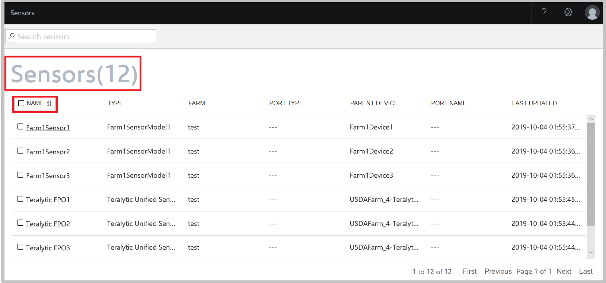
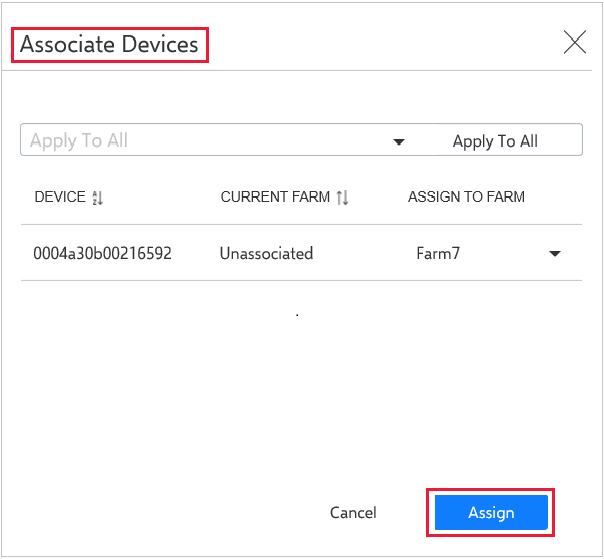
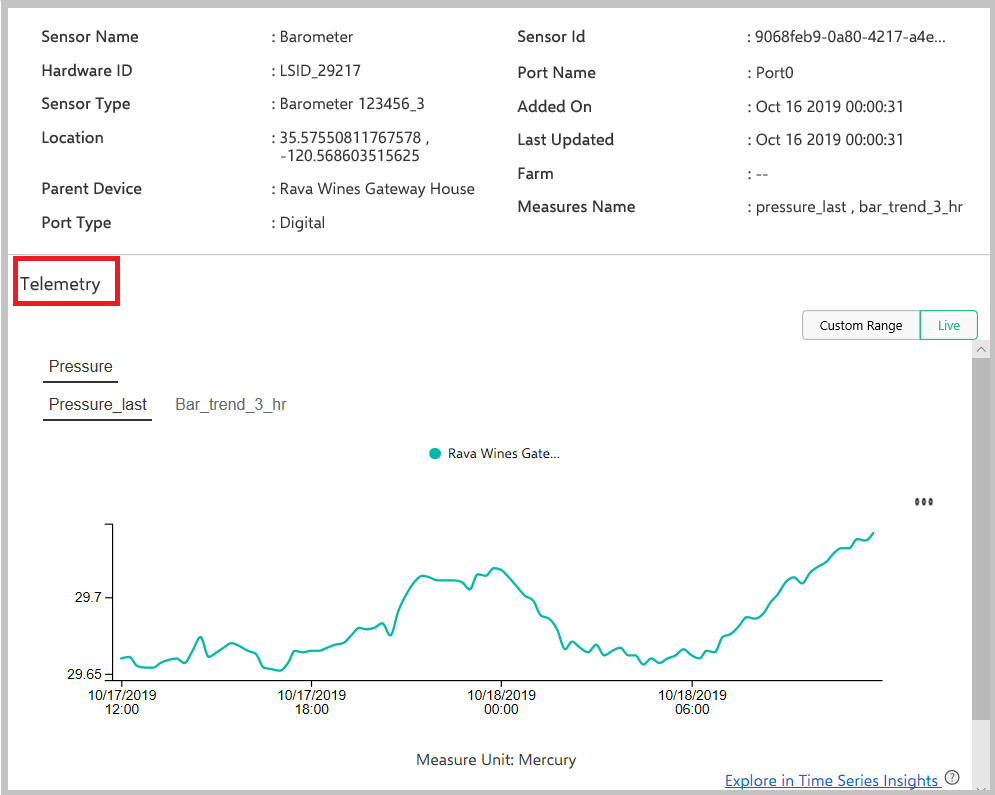
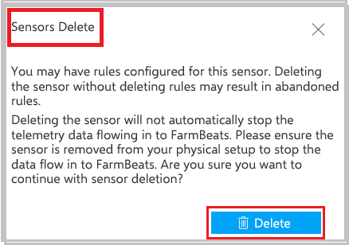
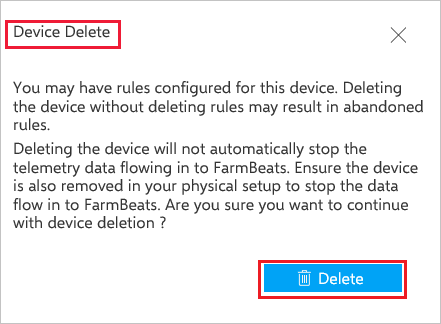

# Get sensor data from sensor partners

Azure FarmBeats helps you to bring streaming data from your IoT devices and sensors into Datahub. Currently, the following sensor device partners are supported.

  

Integrating device data with Azure FarmBeats helps you get ground data from the IoT sensors deployed in your farm to the data hub. The data, once available, can be visualized through the FarmBeats accelerator. The data can be used for data fusion and machine learning/artificial intelligence (ML/AI) model building by using FarmBeats.

To start sensor data streaming, ensure the following:

-  You installed FarmBeats in Azure Marketplace.
-  You decided on the sensors and devices that you want to install on your farm.
-  If you plan on using soil moisture sensors, use the FarmBeats Soil Moisture Sensor Placement map to get a recommendation on the number of sensors and where exactly you should place them. For more information, see [Generate maps](generate-maps-in-azure-farmbeats.md).
- You purchase and deploy devices or sensors from your device partner on your farm. Make sure you can access the sensor data via your device partners' solution.

## Enable device integration with FarmBeats

After you start the streaming of sensor data, you can begin the process of getting the data into your FarmBeats system. Provide the following information to your device provider to enable the integration to FarmBeats:

 - API endpoint
 - Tenant ID
 - Client ID
 - Client secret
 - EventHub connection string

Follow the below steps to  generate the above information:

> [!NOTE]
> These steps are required to be completed on Azure to access the Azure
> subscription where FarmBeats is deployed.

1. Sign in to https://portal.azure.com/.

2. **If you are on FarmBeats version 1.2.7 or later, skip steps a, b and c, and go to step 3.** You can check FarmBeats version by selecting the **Settings** icon on the top-right corner of the FarmBeats UI.

      a.  Go to **Microsoft Entra ID** > **App Registrations**

      b. Select the **App Registration** that was created as part of your FarmBeats deployment. It will have the same name as your FarmBeats datahub.

      c. Select **Expose an API** > select **Add a client application** and enter **04b07795-8ddb-461a-bbee-02f9e1bf7b46** and check **Authorize Scope**. This will give access to the Azure CLI (Cloud Shell) to perform the below steps:

3. Open Cloud Shell. This option is available on the toolbar in the upper-right corner of the Azure portal.

    

4. Ensure the environment is set to **PowerShell**. By default, it's set to Bash.

    

5. Go to your home directory.

    ```azurepowershell-interactive
    cd
    ```

6. Run the following command. This connects an authenticated account to use for Microsoft Entra ID requests

    ```azurepowershell-interactive
    Connect-AzureAD
    ```

7. Run the following command. This will download a script to your home directory.

    ```azurepowershell-interactive

    wget –q https://aka.ms/farmbeatspartnerscriptv3 -O ./generatePartnerCredentials.ps1

    ```

8. Run the following script. The script asks for the Tenant ID, which can be obtained from **Microsoft Entra ID** > **Overview** page.

    ```azurepowershell-interactive

    ./generatePartnerCredentials.ps1

    ```

> [!NOTE]
> 1. The Datahub API Endpoint name must be in lower case.
> 2. If you are copying the farmbeats website name url for Datahub API Endpoint, make sure there is no trailing slash (/).

9. Follow the onscreen instructions to capture the values for **API Endpoint**, **Tenant ID**, **Client ID**, **Client Secret**, and **EventHub Connection String**.

### Integrate device data by using the generated credentials

Now you have the following information generated from the previous section.
 - API endpoint
 - EventHub connection string
 - Client ID
 - Client secret
 - Tenant ID

You will need to provide this to your device partner for linking FarmBeats. Go to the device partner portal for doing the same. For example, in case you are using devices from Davis Instruments, Teralytic or Pessl Instruments (Metos.at) go to the corresponding pages as mentioned below:

1. [Davis Instruments](https://weatherlink.github.io/azure-farmbeats/setup)

2. [Teralytic](https://app.teralytic.com/)

3. [Pessl Instruments](https://ng.fieldclimate.com/user-api-services)

The device provider confirms a successful integration. Upon confirmation, you can view all the devices and sensors on Azure FarmBeats.

## View devices and sensors

Use the following section to view the devices and sensors for your farm.

### View devices

Currently, FarmBeats supports the following devices:

- **Node**: A device to which one or more sensors are attached.
- **Gateway**: A device to which one or more nodes are attached.

Follow these steps:

1. On the home page, select **Devices** from the menu.
  The **Devices** page displays the device type, model, status, the farm it's placed in, and the last updated date for metadata. By default, the farm column is set to *NULL*. You can choose to assign a device to a farm. For more information, see [Assign devices](#assign-devices).
2. Select the device to view the device properties, telemetry, and child devices connected to the device.

    

### View sensors

Follow these steps:

1. On the home page, select **Sensors** from the menu.
  The **Sensors** page displays details about the type of sensor, the farm it's connected to, parent device, port name, port type, and the last updated status.
2. Select the sensor to view sensor properties, active alerts, and telemetry from the sensor.

    

## Assign devices

After the sensor data is flowing in, you can assign it to the farm where you deployed the sensors.

1. On the home page, select **Farms** from the menu. The **Farms** list page appears.
2. Select the farm to which you want to assign the device, and select **Add Devices**.
3. The **Add Devices** window appears. Select the device you want to assign to the farm.

    

4. Select **Add Devices**. Alternatively, go to the **Devices** menu, select the devices you want to assign to a farm, and select **Associate Devices**.
5. In the **Associate Devices** window, select the farm from the drop-down list, and select **Apply to All** to associate the farm to all the selected devices.

    

6. To associate each device to a different farm, select the drop-down arrow in the **Assign to Farm** column, and select a farm for each device row.

7. Select **Assign** to complete the device assignment.

### Visualize sensor data

Follow these steps:

1. On the home page, select **Farms** from the menu to view the **Farms** page.
2. Select the **Farm** for which you want to see the sensor data.
3. On the **Farm** dashboard, you can view telemetry data. You can view live telemetry or use **Custom Range** to see a specific date range.

    

## Delete a sensor

Follow these steps:

1. On the home page, select **Sensors** from the menu to view the **Sensors** page.
2. Select the device you want to delete, and select **Delete** in the confirmation window.

    

A confirmation message shows that the sensor is successfully deleted.

## Delete devices

Follow these steps:

1. On the home page, select **Devices** from the menu to view the **Devices** page.
2. Select the device you want to delete, and select **Delete** in the confirmation window.

    

## Next steps

You now have sensor data flowing into your Azure FarmBeats instance. Now, learn how to [generate maps](generate-maps-in-azure-farmbeats.md#generate-maps) for your farms.
