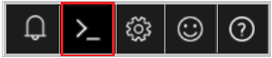
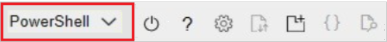

# Ingest historical telemetry data

This article describes how to ingest historical sensor data into Azure FarmBeats.

Ingesting historical data from Internet of Things (IoT) resources such as devices and sensors is a common scenario in FarmBeats. You create metadata for devices and sensors and then ingest the historical data to FarmBeats in a canonical format.

## Before you begin

Before you proceed with this article, ensure that you've installed FarmBeats and collected historical data from your IoT devices. You also need to enable partner access as mentioned in the following steps.

## Enable partner access

You need to enable partner integration to your Azure FarmBeats instance. This step creates a client that has access to your Azure FarmBeats instance as your device partner and provides you with the following values that are required in the subsequent steps:

- API endpoint: This is the Datahub URL, for example, https://\<datahub>.azurewebsites.net
- Tenant ID
- Client ID
- Client secret
- EventHub connection string

Follow these steps:

> [!NOTE]
> You must be an administrator to do the following steps.

1. Sign in to https://portal.azure.com/.

2. **If you are on FarmBeats version 1.2.7 or later, skip steps a, b and c, and go to step 3.** You can check FarmBeats version by selecting the **Settings** icon on the top-right corner of the FarmBeats UI.

      a.  Go to **Azure Active Directory** > **App Registrations**

      b. Select the **App Registration** that was created as part of your FarmBeats deployment. It will have the same name as your FarmBeats datahub.

      c. Select **Expose an API** > select **Add a client application** and enter **04b07795-8ddb-461a-bbee-02f9e1bf7b46** and check **Authorize Scope**. This will give access to the Azure CLI (Cloud Shell) to perform the below steps:

3. Open Cloud Shell. This option is available on the toolbar in the upper-right corner of the Azure portal.

    

4. Ensure the environment is set to **PowerShell**. By default, it's set to Bash.

    

5. Go to your home directory.

    ```azurepowershell-interactive 
    cd
    ```

6. Run the following command. This will download a script to your home directory.

    ```azurepowershell-interactive 

    wget –q https://aka.ms/farmbeatspartnerscriptv3 -O ./generatePartnerCredentials.ps1

    ```

7. Run the following script. The script asks for the Tenant ID, which can be obtained from **Azure Active Directory** > **Overview** page.

    ```azurepowershell-interactive 

    ./generatePartnerCredentials.ps1

    ```

8. Follow the onscreen instructions to capture the values for **API Endpoint**, **Tenant ID**, **Client ID**, **Client Secret**, and **EventHub Connection String**.


## Create device or sensor metadata

 Now that you have the required credentials, you can define the device and sensors. To do this, create the metadata by calling FarmBeats APIs. Make sure to call the APIs as the client app that you have created in the above section.

 FarmBeats Datahub has the following APIs that enable creation and management of device or sensor metadata.

 > [!NOTE]
 > As a partner you have access only to read, create and update the metadata; **delete option is restricted to the partner.**

- /**DeviceModel**: DeviceModel corresponds to the metadata of the device, such as the manufacturer and the type of device, which is either a gateway or a node.
- /**Device**: Device corresponds to a physical device present on the farm.
- /**SensorModel**: SensorModel corresponds to the metadata of the sensor, such as the manufacturer, the type of sensor, which is either analog or digital, and the sensor measurement, such as ambient temperature and pressure.
- /**Sensor**: Sensor corresponds to a physical sensor that records values. A sensor is typically connected to a device with a device ID.


|        DeviceModel   |  Suggestions   |
| ------- | -------             |
|     Type (node, gateway)        |          Type of the Device - Node or Gateway      |
|          Manufacturer            |         Name of the manufacturer    |
|  ProductCode                    |  Device product code or model name or number. For example, EnviroMonitor#6800.  |
|            Ports          |     Port name and type, which is digital or analog.
|     Name                 |  Name to identify the resource. For example, the model name or product name.
      Description     | Provide a meaningful description of the model.
|    Properties          |    Additional properties from the manufacturer.   |
|    **Device**             |                      |
|   DeviceModelId     |     ID of the associated device model.  |
|  HardwareId	       | Unique ID for the device, such as the MAC address.
|  ReportingInterval        |   Reporting interval in seconds.
|  Location            |  Device latitude (-90 to +90), longitude (-180 to 180), and elevation (in meters).
|ParentDeviceId       |    ID of the parent device to which this device is connected. For example, a node that's connected to a gateway. A node has parentDeviceId as the gateway.  |
|    Name            | A name to identify the resource. Device partners must send a name that's consistent with the device name on the partner side. If the partner device name is user defined, then the same user-defined name should be propagated to FarmBeats.|
|     Description       |      Provide a meaningful description. |
|     Properties    |  Additional properties from the manufacturer.
|     **SensorModel**        |          |
|       Type (analog, digital)          |      The type of sensor, whether it's analog or digital.       |
|          Manufacturer            |       The manufacturer of the sensor.     |
|     ProductCode| Product code or model name or number. For example, RS-CO2-N01. |
|       SensorMeasures > Name	    | Name of the sensor measure. Only lowercase is supported. For measurements from different depths, specify the depth. For example, soil_moisture_15cm. This name must be consistent with the telemetry data.  |
|          SensorMeasures > DataType	   |Telemetry data type. Currently, double is supported.|
|    SensorMeasures > Type	  |Measurement type of the sensor telemetry data. The system-defined types are AmbientTemperature, CO2, Depth, ElectricalConductivity, LeafWetness, Length, LiquidLevel, Nitrate, O2, PH, Phosphate, PointInTime, Potassium, Pressure, RainGauge, RelativeHumidity, Salinity, SoilMoisture, SoilTemperature, SolarRadiation, State, TimeDuration, UVRadiation, UVIndex, Volume, WindDirection, WindRun, WindSpeed, Evapotranspiration, PAR. To add more, refer to the /ExtendedType API.|
|        SensorMeasures > Unit	            | Unit of sensor telemetry data. The system-defined units are NoUnit, Celsius, Fahrenheit, Kelvin, Rankine, Pascal, Mercury, PSI, MilliMeter, CentiMeter, Meter, Inch, Feet, Mile, KiloMeter, MilesPerHour, MilesPerSecond, KMPerHour, KMPerSecond, MetersPerHour, MetersPerSecond, Degree, WattsPerSquareMeter, KiloWattsPerSquareMeter, MilliWattsPerSquareCentiMeter, MilliJoulesPerSquareCentiMeter, VolumetricWaterContent, Percentage, PartsPerMillion, MicroMol, MicroMolesPerLiter, SiemensPerSquareMeterPerMole, MilliSiemensPerCentiMeter, Centibar, DeciSiemensPerMeter, KiloPascal, VolumetricIonContent, Liter, MilliLiter, Seconds, UnixTimestamp, MicroMolPerMeterSquaredPerSecond, InchesPerHour To add more, refer to the /ExtendedType API.|
|    SensorMeasures > AggregationType	 |  Values can be none, average, maximum, minimum, or StandardDeviation.  |
|          Name            | Name to identify a resource. For example, the model name or product name.  |
|    Description        | Provide a meaningful description of the model.|
|   Properties       |  Additional properties from the manufacturer.|
|    **Sensor**      |          |
| HardwareId          |   Unique ID for the sensor set by the manufacturer.|
|  SensorModelId     |    ID of the associated sensor model.|
| Location          |  Sensor latitude (-90 to +90), longitude (-180 to 180), and elevation (in meters).|
|   Port > Name	       |  Name and type of the port that the sensor is connected to on the device. This needs to be the same name as defined in the device model.|
|    DeviceID  |    ID of the device that the sensor is connected to. |
| Name	          |   Name to identify resource. For example, sensor name or product name and model number or product code.|
|    Description	  | Provide a meaningful description.|
|    Properties        |Additional properties from the manufacturer.|

For more information about objects, see [Swagger](https://aka.ms/FarmBeatsDatahubSwagger).

### API request to create metadata

To make an API request, you combine the HTTP (POST) method, the URL to the API service, and the URI to a resource to query, submit data to, create, or delete a request. Then you add one or more HTTP request headers. The URL to the API service is the API endpoint, that is, the Datahub URL (https://\<yourdatahub>.azurewebsites.net).

### Authentication

FarmBeats Datahub uses bearer authentication, which needs the following credentials that were generated in the previous section:

- Client ID
- Client secret
- Tenant ID

Using these credentials, the caller can request an access token. The token must be sent in the subsequent API requests, in the header section, as follows:

```
headers = *{"Authorization": "Bearer " + access_token, …}*
```

The following sample Python code gives the access token, which can be used for subsequent API calls to FarmBeats: 

```python
import requests
import json
import msal

# Your service principal App ID
CLIENT_ID = "<CLIENT_ID>"
# Your service principal password
CLIENT_SECRET = "<CLIENT_SECRET>"
# Tenant ID for your Azure subscription
TENANT_ID = "<TENANT_ID>"

AUTHORITY_HOST = 'https://login.microsoftonline.com'
AUTHORITY = AUTHORITY_HOST + '/' + TENANT_ID

ENDPOINT = "https://<yourfarmbeatswebsitename-api>.azurewebsites.net"
SCOPE = ENDPOINT + "/.default"

context = msal.ConfidentialClientApplication(CLIENT_ID, authority=AUTHORITY, client_credential=CLIENT_SECRET)
token_response = context.acquire_token_for_client(SCOPE)
# We should get an access token here
access_token = token_response.get('access_token')
```

**HTTP request headers**

Here are the most common request headers that must be specified when you make an API call to FarmBeats Datahub:

- **Content-Type**: application/json
- **Authorization**: Bearer <Access-Token>
- **Accept**: application/json

### Input payload to create metadata

DeviceModel


```json
{
  "type": "Node",
  "manufacturer": "string",
  "productCode": "string",
  "ports": [
    {
      "name": "string",
      "type": "Analog"
    }
  ],
  "name": "string",
  "description": "string",
  "properties": {
    "additionalProp1": {},
    "additionalProp2": {},
    "additionalProp3": {}
  }
}
```

Device

```json
{
  "deviceModelId": "string",
  "hardwareId": "string",
  "farmId": "string",
  "reportingInterval": 0,
  "location": {
    "latitude": 0,
    "longitude": 0,
    "elevation": 0
  },
  "parentDeviceId": "string",
  "name": "string",
  "description": "string",
  "properties": {
    "additionalProp1": {},
    "additionalProp2": {},
    "additionalProp3": {}
  }
}
```

SensorModel

```json
{
  "type": "Analog",
  "manufacturer": "string",
  "productCode": "string",
  "sensorMeasures": [
    {
      "name": "string",
      "dataType": "Double",
      "type": "string",
      "unit": "string",
      "aggregationType": "None",
      "depth": 0,
      "description": "string"
    }
  ],
  "name": "string",
  "description": "string",
  "properties": {
    "additionalProp1": {},
    "additionalProp2": {},
    "additionalProp3": {}
  }
}

```
Sensor

```json
{
  "hardwareId": "string",
  "sensorModelId": "string",
  "location": {
    "latitude": 0,
    "longitude": 0,
    "elevation": 0
  },
  "depth": 0,
  "port": {
    "name": "string",
    "type": "Analog"
  },
  "deviceId": "string",
  "name": "string",
  "description": "string",
  "properties": {
    "additionalProp1": {},
    "additionalProp2": {},
    "additionalProp3": {}
  }
}
```

The following sample request creates a device. This request has input JSON as payload with the request body.

```bash
curl -X POST "https://<datahub>.azurewebsites.net/Device" -H
"accept: application/json" -H  "Content-Type: application/json" -H
"Authorization: Bearer <Access-Token>" -d "{  \"deviceModelId\": \"ID123\",  \"hardwareId\": \"MHDN123\",
\"reportingInterval\": 900,  \"name\": \"Device123\",
\"description\": \"Test Device 123\"}" *
```

Below is a sample code in Python. The access token used in this sample is the same that is received during the authentication.

```python
import requests
import json

# Got access token - Calling the Device Model API

headers = {
    "Authorization": "Bearer " + access_token,
    "Content-Type" : "application/json"
    }
payload = '{"type" : "Node", "productCode" : "TestCode", "ports": [{"name": "port1","type": "Analog"}], "name" : "DummyDevice"}'
response = requests.post(ENDPOINT + "/DeviceModel", data=payload, headers=headers)
```

> [!NOTE]
> The APIs return unique IDs for each instance created. You must retain the IDs to send the corresponding telemetry messages.

### Send telemetry

Now that you've created the devices and sensors in FarmBeats, you can send the associated telemetry messages.

### Create a telemetry client

You must send the telemetry to Azure Event Hubs for processing. Azure Event Hubs is a service that enables real-time data (telemetry) ingestion from connected devices and applications. To send telemetry data to FarmBeats, create a client that sends messages to an event hub in FarmBeats. For more information about sending telemetry, see [Azure Event Hubs](https://docs.microsoft.com/azure/event-hubs/event-hubs-dotnet-standard-getstarted-send).

### Send a telemetry message as the client

After you have a connection established as an Event Hubs client, you can send messages to the event hub as JSON.

Here's sample Python code that sends telemetry as a client to a specified event hub:

```python
import azure
from azure.eventhub import EventHubClient, Sender, EventData, Receiver, Offset
EVENTHUBCONNECTIONSTRING = "<EventHub Connection String provided by customer>"
EVENTHUBNAME = "<EventHub Name provided by customer>"

write_client = EventHubClient.from_connection_string(EVENTHUBCONNECTIONSTRING, eventhub=EVENTHUBNAME, debug=False)
sender = write_client.add_sender(partition="0")
write_client.run()
for i in range(5):
    telemetry = "<Canonical Telemetry message>"
    print("Sending telemetry: " + telemetry)
    sender.send(EventData(telemetry))
write_client.stop()

```

Convert the historical sensor data format to a canonical format that Azure FarmBeats understands. The canonical message format is as follows:

```json
{
"deviceid": "<id of the Device created>",
"timestamp": "<timestamp in ISO 8601 format>",
"version" : "1",
"sensors": [
    {
      "id": "<id of the sensor created>",
      "sensordata": [
        {
          "timestamp": "< timestamp in ISO 8601 format >",
          "<sensor measure name (as defined in the Sensor Model)>": <value>
        },
        {
          "timestamp": "<timestamp in ISO 8601 format>",
          "<sensor measure name (as defined in the Sensor Model)>": <value>
        }
      ]
    }
 ]
}
```

After you add the corresponding devices and sensors, obtain the device ID and the sensor ID in the telemetry message, as described in the previous section.

Here's an example of a telemetry message:


 ```json
{
  "deviceid": "7f9b4b92-ba45-4a1d-a6ae-c6eda3a5bd12",
  "timestamp": "2019-06-22T06:55:02.7279559Z",
  "version": "1",
  "sensors": [
    {
      "id": "d8e7beb4-72de-4eed-9e00-45e09043a0b3",
      "sensordata": [
        {
          "timestamp": "2019-06-22T06:55:02.7279559Z",
          "hum_max": 15
        },
        {
          "timestamp": "2019-06-22T06:55:02.7279559Z",
          "hum_min": 42
        }
      ]
    },
    {
      "id": "d8e7beb4-72de-4eed-9e00-45e09043a0b3",
      "sensordata": [
        {
          "timestamp": "2019-06-22T06:55:02.7279559Z",
          "hum_max": 20
        },
        {
          "timestamp": "2019-06-22T06:55:02.7279559Z",
          "hum_min": 89
        }
      ]
    }
  ]
}
```

## Troubleshooting

### Can't view telemetry data after ingesting historical/streaming data from your sensors

**Symptom**: Devices or sensors are deployed, and you've created the devices/sensors on FarmBeats and ingested telemetry to the EventHub, but you can't get or view telemetry data on FarmBeats.

**Corrective action**:

1. Ensure you have done the appropriate partner registration - you can check this by going to your datahub swagger, navigate to /Partner API, Do a Get and check if the partner is registered. If not, follow the [steps here](get-sensor-data-from-sensor-partner.md#enable-device-integration-with-farmbeats) to add partner.

2. Ensure that you have created the metadata (DeviceModel, Device, SensorModel, Sensor) using the partner client credentials.

3. Ensure that you have used the correct Telemetry message format (as specified below):

```json
{
"deviceid": "<id of the Device created>",
"timestamp": "<timestamp in ISO 8601 format>",
"version" : "1",
"sensors": [
    {
      "id": "<id of the sensor created>",
      "sensordata": [
        {
          "timestamp": "< timestamp in ISO 8601 format >",
          "<sensor measure name (as defined in the Sensor Model)>": <value>
        },
        {
          "timestamp": "<timestamp in ISO 8601 format>",
          "<sensor measure name (as defined in the Sensor Model)>": <value>
        }
      ]
    }
 ]
}
```

## Next steps

For more information about REST API-based integration details, see [REST API](rest-api-in-azure-farmbeats.md).
