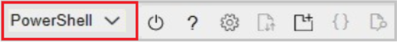
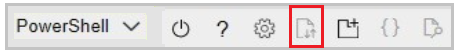

# Ingest historical telemetry data

This article describes how to ingest historical sensor data into Azure FarmBeats.

Ingesting historical data from Internet of Things (IoT) for resources such as devices and sensors is a common scenario in FarmBeats. You create metadata for devices and sensors, and then ingest the historical data to FarmBeats in a canonical format.

## Before you begin

Before you proceed with this article, make sure that you’ve installed FarmBeats, and collected historical data from IoT.

## Enable partner access

You need to enable partner integration to your Azure FarmBeats instance. This step creates a client that will have access to your Azure FarmBeats as your device partner, and provides you the following values that are required in the subsequent steps.

- API Endpoint – This is the data hub URL, for example, https://<datahub>.azurewebsites.net
- Tenant ID
- Client ID
- Client Secret
- EventHub Connection String

Follow the below steps to generate these:

>[!NOTE]
> You must be an administrator to do the following steps.

1. Download this [script](https://aka.ms/farmbeatspartnerscript) and extract it in on your local drive. You will find two files inside the ZIP file.
2. Sign in to [Azure portal](https://portal.azure.com/) and open Cloud Shell (This option is available on the top-right bar of the portal)  

    

3. Ensure the environment is set to **PowerShell**.

    

4. Upload the two files that you downloaded (from step 1 above) in your Cloud Shell.  

    

5. Go to the directory where the files were uploaded (By default it gets uploaded to the home directory /home/username/.
6. Run the script by using the command:  

    ```azurepowershell-interactive
    PS> ./generateCredentials.ps1
    ```

7. Follow the onscreen instructions to complete the procedure.

## Create device/sensor metadata

 Now that you have the required credentials, you can define the device and sensors by creating the metadata using FarmBeats APIs.

 FarmBeats Data hub has the following APIs that enable creation and management of device/sensor metadata.   

- /**DeviceModel** - Device Model corresponds to the metadata of the device such as the manufacturer, type of the device either gateway or node.  
- /**Device** - Device corresponds to a physical device present in the farm.  
- /**SensorModel** - Sensor Model corresponds to the metadata of the sensor such as the manufacturer, type of the sensor either analog or digital, sensor measure such as ambient temperature, or pressure.
- /**Sensor** - Sensor corresponds to a physical sensor that records values. A sensor is typically connected to a device with a device ID.  


|        Device Mode   |  Suggestions   |
| ------- | -------             |
|     Type (Node, Gateway)        |          1 Star      |
|          Manufacturer            |         2 Star     |
|  ProductCode                    |  Device product code Or model name/number. For example, EnviroMonitor#6800.  |
|            Ports          |     Port name and type (digital/analog)
|     Name                 |  Name to identify resource. For example, model name/product name.
      Description     | Provide a meaningful description of the model
|    Properties          |    Additional properties from the manufacturer   |
|    **Device**             |                      |
|   DeviceModelId     |     ID of the associated device model  |
|  HardwareId	       | Unique ID for the device such as MAC address etc.,
|  ReportingInterval        |   Reporting interval in seconds
|  Location            |  Device latitude (-90 to +90)/Longitude (-180 to 180)/Elevation (in meters)   
|ParentDeviceId       |    ID of the parent device to which this device is connected. For example, a node connected to a gateway. A node will have parentDeviceId as the gateway.  |
|    Name            | A name to identify the resource. Device partners must send a name that is consistent with the device name on the partner side. If the partner device name is user-defined, then the same user-defined name should be propagated to FarmBeats.|
|     Description       |      Provide a meaningful description  |
|     Properties    |  Additional properties from the manufacturer
|     **Sensor Model**        |          |
|       Type (Analog, Digital)          |      type of sensor whether analog or digital       |
|          Manufacturer            |       the manufacturer of the sensor     |
|     ProductCode| Product code or model name/number. For example, RS-CO2-N01. |
|       SensorMeasures > Name	    | Name of the sensor measure. Only lower case is supported. For measure from different depths, specify the depth. For example, soil_moisture_15cm. This name has to be consistent with the telemetry data  |
|          SensorMeasures > DataType	   |Telemetry data type. Currently double is supported|
|    SensorMeasures > Type	  |Measurement type of the sensor telemetry data. Following are the system-defined types: AmbientTemperature, CO2, Depth, ElectricalConductivity, LeafWetness, Length, LiquidLevel, Nitrate, O2, PH, Phosphate, PointInTime, Potassium, Pressure, RainGauge, RelativeHumidity, Salinity, SoilMoisture, SoilTemperature, SolarRadiation, State, TimeDuration, UVRadiation, UVIndex, Volume, WindDirection, WindRun, WindSpeed, Evapotranspiration, PAR. To add more, refer to /ExtendedType API.|
|        SensorMeasures > Unit	            | Unit of sensor telemetry data. Following are the system-defined units: NoUnit, Celsius, Fahrenheit, Kelvin, Rankine, Pascal, Mercury, PSI, MilliMeter, CentiMeter, Meter, Inch, Feet, Mile, KiloMeter, MilesPerHour, MilesPerSecond, KMPerHour, KMPerSecond, MetersPerHour, MetersPerSecond, Degree, WattsPerSquareMeter, KiloWattsPerSquareMeter, MilliWattsPerSquareCentiMeter, MilliJoulesPerSquareCentiMeter, VolumetricWaterContent, Percentage, PartsPerMillion, MicroMol, MicroMolesPerLiter, SiemensPerSquareMeterPerMole, MilliSiemensPerCentiMeter, Centibar, DeciSiemensPerMeter, KiloPascal, VolumetricIonContent, Liter, MilliLiter, Seconds, UnixTimestamp, MicroMolPerMeterSquaredPerSecond, InchesPerHour To add more, refer to /ExtendedType API.|
|    SensorMeasures > aggregationType	 |  Values can be none, average, maximum, minimum, or StandardDeviation  |
|          Name            | Name to identify resource. For example, model name/product name.  |
|    Description        | Provide a meaningful description of the model  |
|   Properties       |  Additional properties from the manufacturer  |
|    **Sensor**      |          |
| HardwareId          |   Unique ID for the sensor set by manufacturer |
|  SensorModelId     |    ID of the associated sensor model   |
| location          |  Sensor latitude (-90 to +90)/Longitude (-180 to 180)/Elevation (in meters)|
|   Port > name	       |  Name and type of the port that the sensor is connected to on the device. This needs to be same name as defined in the device model. |
|    DeviceID  |    ID of the device that the sensor is connected to     |
| Name	          |   Name to identify resource. For example, sensor name/product name and model number/product code.|
|    Description	  | Provide a meaningful description |
|    Properties        |Additional properties from the manufacturer |

For more information about objects, see [Swagger](https://aka.ms/FarmBeatsDatahubSwagger).

**API request to create metadata**

To make an API request, you combine the HTTP (POST) method, the URL to the API service, the URI to a resource to query, submit data to create or delete a request and add one or more HTTP request headers. The URL to the API service is the API Endpoint i.e. the data hub URL (https://<yourdatahub>.azurewebsites.net)  

**Authentication**:

FarmBeats Data hub uses bearer authentication, which needs the following credentials that we generated in the above section.

- Client ID
- Client Secret
- Tenant ID  

Using the above credentials, the caller can request for an access token, which needs to be sent in the subsequent API requests in the header section as follows:

headers = *{"Authorization": "Bearer " + access_token, …}*

**HTTP Request Headers**:

Here are the most common request headers that need to be specified when making an API call to FarmBeats Data hub:

- Content-Type: application/json
- Authorization: Bearer <Access-Token>
- Accept: application/json

**Input Payload to create metadata**:

**DeviceModel**


```json
{
  "type": "Node",
  "manufacturer": "string",
  "productCode": "string",
  "ports": [
    {
      "name": "string",
      "type": "Analog"
    }
  ],
  "name": "string",
  "description": "string",
  "properties": {
    "additionalProp1": {},
    "additionalProp2": {},
    "additionalProp3": {}
  }
}

Device
```json
{
  "deviceModelId": "string",
  "hardwareId": "string",
  "farmId": "string",
  "reportingInterval": 0,
  "location": {
    "latitude": 0,
    "longitude": 0,
    "elevation": 0
  },
  "parentDeviceId": "string",
  "name": "string",
  "description": "string",
  "properties": {
    "additionalProp1": {},
    "additionalProp2": {},
    "additionalProp3": {}
  }
}
```

SensorModel

```json
{
  "type": "Analog",
  "manufacturer": "string",
  "productCode": "string",
  "sensorMeasures": [
    {
      "name": "string",
      "dataType": "Double",
      "type": "string",
      "unit": "string",
      "aggregationType": "None",
      "depth": 0,
      "description": "string"
    }
  ],
  "name": "string",
  "description": "string",
  "properties": {
    "additionalProp1": {},
    "additionalProp2": {},
    "additionalProp3": {}
  }
}

```
Sensor

```json
{
  "hardwareId": "string",
  "sensorModelId": "string",
  "location": {
    "latitude": 0,
    "longitude": 0,
    "elevation": 0
  },
  "depth": 0,
  "port": {
    "name": "string",
    "type": "Analog"
  },
  "deviceId": "string",
  "name": "string",
  "description": "string",
  "properties": {
    "additionalProp1": {},
    "additionalProp2": {},
    "additionalProp3": {}
  }
}

```
The below sample request is to create a device (This has an input json as payload with the request body).  

```
curl -X POST "https://<datahub>.azurewebsites.net/Device" -H  
"accept: application/json" -H  "Content-Type: application/json" -H
"Authorization: Bearer <Access-Token>" -d "
{  \"deviceModelId\": \"ID123\",  \"hardwareId\": \"MHDN123\",  
\"reportingInterval\": 900,  \"name\": \"Device123\",  
\"description\": \"Test Device 123\",}"*
```

> [!NOTE]
> The APIs return unique IDs for each instance created. You must retain the IDs for sending the corresponding telemetry messages.

**Send telemetry**

Now that you have created the devices and sensors in FarmBeats, you can send the associated telemetry messages.  

**Create telemetry client**

You must send the Telemetry to Azure Event Hub for processing. Azure EventHub is a service that enables real-time data (telemetry) ingestion from connected devices and applications. To send telemetry data to FarmBeats, you need to create a client that sends messages to an Event Hub in FarmBeats. For more information about sending telemetry, see [Azure event hubs](https://docs.microsoft.com/azure/event-hubs/event-hubs-dotnet-standard-getstarted-send).

**Send telemetry message as the client**

Once you have a connection established as an EventHub client, you can send messages to the EventHub as a json.  
Convert the historical sensor data format to a canonical format that Azure FarmBeats understands. The canonical message format is as below:  


 ```
  {   
      “deviceid”: “<id of the Device created>”,   
      "timestamp": "<timestamp in ISO 8601 format>",     
      "version" : "1",   
      "sensors":
      [     
      {        
          "id": "<id of the sensor created>”       
          "sensordata": [         
          {            
              "timestamp": "< timestamp in ISO 8601 format >",           
              "<sensor measure name (as defined in the Sensor Model)>": value          
    },          
    {            
    "timestamp": "<timestamp in ISO 8601 format>",           
     "<sensor measure name (as defined in the Sensor Model)>": value          
    }        
    ]      
    }  
    }
```


After adding the corresponding devices and sensors, obtain the deviceid and the sensorid in the telemetry message, as described in the previous section

Example Telemetry message:


 ```json
{
  "deviceid": "7f9b4b92-ba45-4a1d-a6ae-c6eda3a5bd12",
  "timestamp": "2019-06-22T06:55:02.7279559Z",
  "version": "1",
  "sensors": [
    {
      "id": "d8e7beb4-72de-4eed-9e00-45e09043a0b3",
      "sensordata": [
        {
          "timestamp": "2019-06-22T06:55:02.7279559Z",
          "hum_max": 15
        },
        {
          "timestamp": "2019-06-22T06:55:02.7279559Z",
          "hum_min": 42
        }
      ]
    },
    {
      "id": "d8e7beb4-72de-4eed-9e00-45e09043a0b3",
      "sensordata": [
        {
          "timestamp": "2019-06-22T06:55:02.7279559Z",
          "hum_max": 20
        },
        {
          "timestamp": "2019-06-22T06:55:02.7279559Z",
          "hum_min": 89
        }
      ]
    }
  ]
}
```


## Next steps

For more information about Rest API-based integration details, see [REST API](references-for-farmbeats.md#rest-api).
