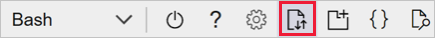

# Install Azure FarmBeats

This article describes how to install Azure FarmBeats in your Azure subscription.

Azure FarmBeats is a business-to-business offering available in Azure Marketplace. It enables aggregation of agriculture data sets across providers and generation of actionable insights. Azure FarmBeats does this by enabling you to build artificial intelligence (AI) or machine learning (ML) models based on fused data sets. The two main components of Azure FarmBeats are:

- **Datahub**: An API layer that enables aggregation, normalization, and contextualization of various agriculture data sets across different providers.

- **Accelerator**: A sample web application that is built on top of Datahub. It jump-starts your model development and visualization. The accelerator uses Azure FarmBeats APIs to demonstrate visualization of ingested sensor data as charts and visualization of model output as maps.

## Before you start
### Components installed

When you install Azure FarmBeats, the following resources are provisioned in your Azure subscription:

| Azure Resources Installed  | Azure FarmBeats component  |
|---------|---------|
| Application Insights   |      Datahub & Accelerator      |
| App Service     |     Datahub & Accelerator     |
| App Service Plan   | Datahub & Accelerator  |
| API Connection    |  Datahub       |
| Azure Cache for Redis       | Datahub      |
| Azure Cosmos DB   |  Datahub       |
| Azure Data Factory V2       |     Datahub & Accelerator      |
| Azure Batch account    | Datahub   |
| Azure Key Vault |  Datahub & Accelerator        |
| Azure Maps Account       |     Accelerator    |
| Event Hub Namespace    |     Datahub      |
| Logic App      |  Datahub       |
| Storage Account      |     Datahub & Accelerator      |
| Time Series Insights     |    Datahub    |

### Costs incurred

The cost of Azure FarmBeats is an aggregate of the cost of the underlying Azure services. Pricing information for Azure services can be calculated using the [Pricing Calculator](https://azure.microsoft.com/pricing/calculator). The actual cost of the total installation will vary based on the usage. The steady state cost for the two components is:

* Datahub - less than $10 per day
* Accelerator - less than $2 per day

### Regions supported

Currently, Azure FarmBeats is supported in public cloud environments in the following regions:
* Australia East
* Central US
* East US
* East US 2
* West US
* West US 2
* North Europe
* West Europe
* Southeast Asia

### Time taken

The entire setup of Azure FarmBeats, including the preparation and installation will take less than an hour.

## Prerequisites    

Before you start the actual installation of Azure FarmBeats, you'll need to complete the following steps:

### Create Sentinel account
Your Azure FarmBeats setup enables you to get free satellite imagery from European Space Agency's [Sentinel-2](https://scihub.copernicus.eu/) satellite mission for your farm. To configure this setup, you require a Sentinel Account.

Follow the steps to create a free account with Sentinel:

1. Go to the official [sign-up](https://scihub.copernicus.eu/dhus/#/self-registration) page.
2. Provide the required details (first name, last name, username, password, and email ID) and complete the form.
3. A verification link will be sent to the registered email ID. Select the link provided in the email and complete the verification.

Your registration process is complete once you complete the verification. Make a note of your **Sentinel Username** and **Sentinel Password**.

### Decide Subscription and Region

You'll need the Azure subscription ID and the region where you want to install Azure FarmBeats. Choose one of the regions listed in the [Regions supported](#regions-supported) section.

Make a note of the **Azure Subscription ID** and the **Azure Region**.

### Verify Permissions

You'll need to verify if you have sufficient privileges and permissions in the Azure tenant you're looking to install Azure FarmBeats.

You can verify your access permissions in the Azure portal by following the instructions on [role based access control](https://docs.microsoft.com/azure/role-based-access-control/check-access)

For installing Azure FarmBeats, you need the following permissions:
- Tenant - Read Access
- Subscription - Contributor or owner
- Resource group - Owner.

In addition, Azure FarmBeats requires Azure Active Directory application registrations. There are two ways to complete the required Azure AD setup:

**Case 1**: You have **write** permissions in the Azure Tenant you are installing to. This case means you have the necessary permissions to create the AAD app registration dynamically during the install.

You can proceed directly to the [Complete the Marketplace sign-up](#complete-azure-marketplace-sign-up) section.


**Case 2**: You do NOT have **write** permissions in the Azure tenant. This case is common when you are trying to install Azure FarmBeats in your company's Azure subscription and your **write** access is restricted to only the resource group you own.
In this case, request your IT administrator to follow the below steps to automatically generate and complete the Azure AD app registration in the Azure portal.

1. Download and extract the [AAD app generator script](https://aka.ms/FarmBeatsAADScript) to your local machine.
2. Sign in to the Azure portal and select your subscription and Azure AD tenant.
3. Launch Cloud Shell from the toolbar at the top of the Azure portal.

    

4. Choose PowerShell as the preferred shell experience. First time users will be prompted to select a subscription and create a storage account. Complete the setup as instructed.
5. Upload the script (from step 1) to Cloud Shell, and note the location of the uploaded file.

    > [!NOTE]
    > By default, the file is uploaded to your home directory.

6. Go to the home directory by using the 'cd' command and run the following script:

      ```azurepowershell-interactive
            ./create_aad_script.ps1
      ```
7. Enter the **Datahub website** name and the **Accelerator website** name. Make a note of the output of the script and share it with the person installing Azure FarmBeats.

Once your IT administrator provides you with the required details, make a note of the **AAD Client ID, AAD Client Secret, Datahub website name & Accelerator website name**.

   > [!NOTE]
   > If you are following instructions from Case 2, do not forget to add the AAD Client ID & AAD Client Secret as separate parameters in the [Parameters file](#prepare-parameters-file)

Now, you have all the information required to proceed to the next section.

### Complete Azure Marketplace sign-up

You have to complete the sign-up to the Azure FarmBeats offer in Azure marketplace before you can start the cloud-shell based installation process. Follow the below steps to complete the sign-up:

1.	Sign in to the Azure portal. Select your account in the top-right corner and switch to the Azure AD tenant where you want to install Azure FarmBeats.

2.	Go to Azure Marketplace within the portal and search for **Azure FarmBeats** in the Marketplace

3.	A new window with an overview of Azure FarmBeats appears. Select the **Create**.

4.	A new window appears. Complete the sign-up process by choosing the correct subscription, resource group, and location to which you want to install Azure FarmBeats.

5.	Once the entered details are validated, SELECT **OK**. The Terms of use page appears. Review the terms and select **Create** to complete the sign-up process.

This step completes the sign-up process in Azure Marketplace. You are now ready to start the Parameters file preparation.

### Prepare Parameters file
The final step in the prerequisites phase is creating a JSON file that will serve as input during the Cloud Shell installation. The parameters in the JSON file will have to be replaced with appropriate values.

A sample JSON file is provided below. Download the sample and update the required details.

```json
{  
    "sku":"both",
    "subscriptionId":"da9xxxec-dxxf-4xxc-xxx21-xxx3ee7xxxxx",
    "datahubResourceGroup":"dummy-test-dh1",
    "location":"westus2",
    "datahubWebsiteName":"dummy-test-dh1",
    "acceleratorResourceGroup":"dummy-test-acc1",
    "acceleratorWebsiteName":"dummy-test-acc1",
    "sentinelUsername":"dummy-dev",
    "notificationEmailAddress":"dummy@yourorg.com",
    "updateIfExists":true
}
```

You can refer to the below parameter table to understand more on each of the parameters.

| Parameter | Value|
|--- | ---|
|sku  | Provides the user a choice to install both Datahub and Accelerator or just the Datahub. To install only Datahub, use "datahub". To install Datahub and Accelerator, use "both"|
|subscriptionId | Specifies the Azure subscription to install Azure FarmBeats|
|datahubResourceGroup| Specifies the resource group name for your Datahub resources. Enter the resource group name that you created in the Azure Marketplace here|
|location |The location/ Azure Region where you want to install Azure FarmBeats|
|datahubWebsiteName  | The unique URL prefix for your Datahub web application |
|acceleratorResourceGroup  | Specifies the resource group name for your Accelerator resources|
|acceleratorWebsiteName |The unique URL prefix for your Accelerator web application|
|sentinelUsername | The username to get Sentinel satellite imagery|
|notificationEmailAddress  | The email address to receive the notifications for any alerts that you configure within your Datahub|
|updateIfExists| (Optional) A parameter to include in the Parameters file only if you want to upgrade an existing Azure FarmBeats instance. For an upgrade, other details, such as the resource group names and locations need to be the same|
|aadAppClientId | (Optional) A parameter to include in the Parameters file only if you are using a pre-created AAD app. Refer to Case 2 in [Verify Permissions](#verify-permissions) section for more details |
|aadAppClientSecret  | (Optional) (Optional) A parameter to include in the Parameters file only if you are using a pre-created AAD app. Refer to Case 2 in [Verify Permissions](#verify-permissions) section for more details|

Based on the above table and the sample JSON file, create your parameters JSON file and save it in your local computer.

## Install

The actual installation of Azure FarmBeats resources happens in Cloud Shell browser-based command-line interface by using the Bash environment. Follow the instructions below to install Azure FarmBeats:

1. Sign in to the Azure portal. Select the Azure subscription and tenant you want to install Azure FarmBeats.
2. Launch **Cloud Shell** from the toolbar on the top-right corner of the Azure portal.
3. Choose Bash as the preferred shell experience. Select the **Upload** button (highlighted in the below image), and upload the prepared parameters JSON file.

      

4. **Copy** the below command and **replace the \<username>** with the correct value so that the command points to the correct path of the uploaded file.

    ```bash
          wget -O farmbeats-installer.sh https://aka.ms/AzureFarmbeatsInstallerScript && bash farmbeats-installer.sh /home/<username>/input.json
    ```
5. Run the modified command to start the installation process. You will be prompted to:
 - Agree to the **Azure FarmBeats license** terms. Enter "Y" to proceed to the next step if you agree to the Terms of use. Enter "N" to terminate the installation, if you do not agree to the terms of use.

 - Next, you will be prompted to enter an access token for the installation. Copy the generated code and login to the [device login page](https://microsoft.com/devicelogin) with your **Azure credentials**.

 - Once the sign-in is successfully completed, the installer will prompt for your Sentinel account password. Enter your **Sentinel account password**.

6. The Parameters file is validated and the installation of the Azure resources starts. The installation takes about **25 minutes** to complete.    
> [!NOTE]
> Inactive Cloud Shell sessions expire after **20 minutes**. Please keep the Cloud Shell session active while the installer is deploying the Azure resources. If the session times out, you will have to restart the install process.

Once the installation is complete, you will receive the following output links:
* **Datahub URL**: The Swagger link for accessing the Datahub APIs.
* **Accelerator URL**: The web application for exploring the Azure FarmBeats Accelerator.
* **Installer log file**: The log file that contains details of the installation. This log file can be used for troubleshooting the installation, if necessary.

You can verify the completion of your Azure FarmBeats installation by doing the following checks:

**Datahub**
1. Log in to the Accelerator URL provided (in the format **https://\<yourdatahub-website-name>.azurewebsites.net/swagger**) with your Azure credentials.
2. You should be able to see the different FarmBeats API objects and perform REST operations on the APIs.

**Accelerator**
1. Log in to the Accelerator URL provided (in the format **https://\<youraccelerator-website-name>.azurewebsites.net/swagger**) with your Azure credentials.
2. You should be able to see the Accelerator User Interface with an option to create Farms in your browser.

Your ability to perform the above operations indicates a successful installation of Azure FarmBeats.

## Upgrade
In the Public Preview version, to upgrade an existing installation of Azure FarmBeats, you will have to run the Installation command in Cloud Shell again, with an additional “**updateIfExists**” parameter in the Parameters file set to “**true**”. Refer the last line of the below JSON sample for the update parameter.

```json
{
    "sku":"both",
    "subscriptionId":"da9xxxec-dxxf-4xxc-xxx21-xxx3ee7xxxxx",
    "datahubResourceGroup":"dummy-test-dh1",
    "location":"westus2",
    "datahubWebsiteName":"dummy-test-dh1",
    "acceleratorResourceGroup":" dummy-test-acc1",
    "acceleratorWebsiteName":" dummy-test-acc1",
    "sentinelUsername":"dummy-dev",
    "notificationEmailAddress":"dummy@yourorg.com",
    "updateIfExists":true
}
```
The command updates the existing Azure FarmBeats installation to the latest version, and provides you with the output links.

## Uninstall

To uninstall Azure FarmBeats Datahub or Accelerator, complete the following steps:

1.	Log in to the Azure portal and **delete the resource groups** in which these components are installed.

2.	Go to Azure Active Directory & **delete the Azure AD application** linked to the Azure FarmBeats installation. This will remove the Azure FarmBeats installation from your Azure subscription.

## Next steps
You have learned how to install Azure FarmBeats in your Azure subscription. Now, learn how to [add users](manage-users-in-azure-farmbeats.md#manage-users) to your Azure FarmBeats instance.
