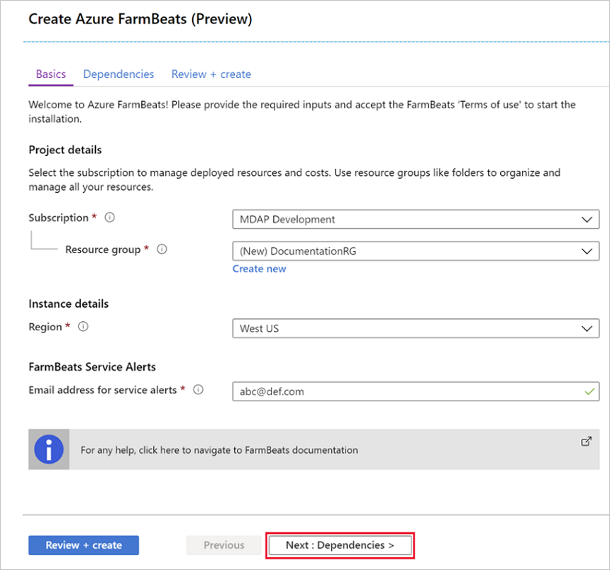
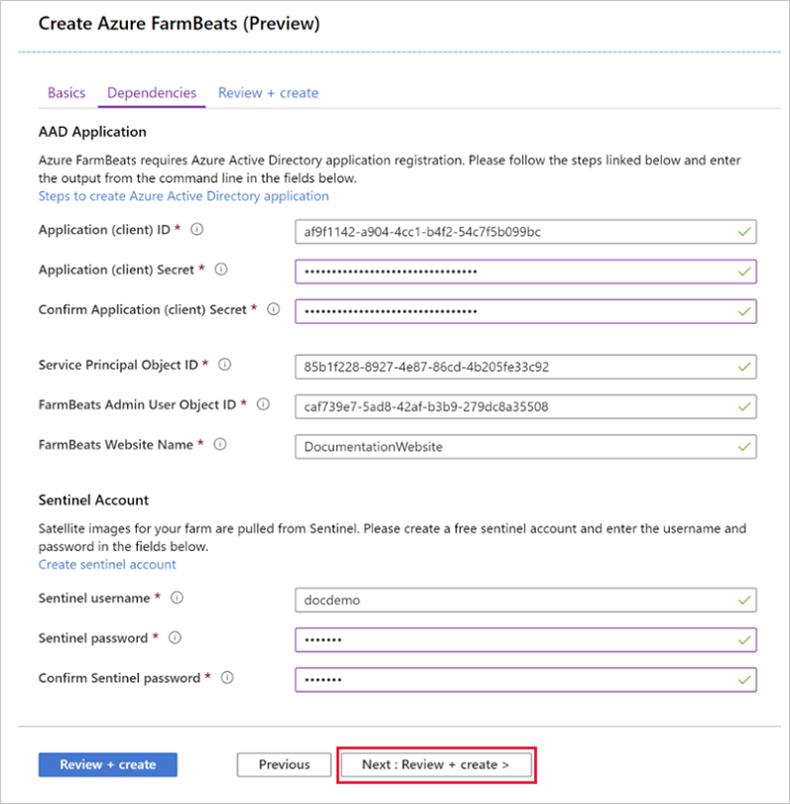

# Install Azure FarmBeats

This article describes how to install Azure FarmBeats in your Azure subscription.

Azure FarmBeats is a business-to-business offering available in Azure Marketplace. It enables aggregation of agriculture data sets across providers and generation of actionable insights. Azure FarmBeats does so by enabling you to build artificial intelligence (AI) or machine learning (ML) models based on fused data sets. The two main components of Azure FarmBeats are:

> [!NOTE]
> Azure FarmBeats is on path to be retired. We have built a new agriculture focused service, it's name is Azure Data Manager for Agriculture and it's now available as a preview service. For more information see public documentation [**here**](../../data-manager-for-agri/overview-azure-data-manager-for-agriculture.md) or write to us at madma@microsoft.com. 

- **Data hub**: An API layer that enables aggregation, normalization, and contextualization of various agriculture data sets across different providers.

- **Accelerator**: Web application that is built on top of Data hub. It jump-starts your model development and visualization. The accelerator uses Azure FarmBeats APIs to demonstrate visualization of ingested sensor data as charts and visualization of model output as maps.

## General information

### Components installed

When you install Azure FarmBeats, the following resources are provisioned in your Azure subscription:

| Azure Resources Installed  | Azure FarmBeats component  |
|---------|---------|
| Application Insights   |      Data hub & Accelerator      |
| App Service     |     Data hub & Accelerator     |
| App Service Plan   | Data hub & Accelerator  |
| API Connection    |  Data hub       |
| Azure Cache for Redis       | Data hub      |
| Azure Cosmos DB   |  Data hub       |
| Azure Data Factory V2       |     Data hub & Accelerator      |
| Azure Batch account    | Data hub   |
| Azure Key Vault |  Data hub & Accelerator        |
| Azure Maps Account       |     Accelerator    |
| Event Hub Namespace    |     Data hub      |
| Logic App      |  Data hub       |
| Storage Account      |     Data hub & Accelerator      |
| Time Series Insights     |    Data hub    |

### Costs incurred

The cost of Azure FarmBeats is an aggregate of the cost of the underlying Azure services. Pricing information for Azure services can be calculated using the [Pricing Calculator](https://azure.microsoft.com/pricing/calculator). The actual cost of the total installation will vary based on the usage. The steady state cost for the two components is:

- Data hub - less than $10 per day
- Accelerator - less than $2 per day

### Regions supported

Currently, Azure FarmBeats is supported in public cloud environments in the following regions:

- Australia East
- Central US
- East US
- East US 2
- West US
- West US 2
- North Europe
- West Europe
- East Asia
- SouthEast Asia

### Time taken

The entire setup of Azure FarmBeats, including the preparation and installation will take less than an hour.

## Prerequisites

You'll need to complete the following steps before you start the actual installation of Azure FarmBeats:

### Verify Permissions

You'll need the following permissions in the Azure tenant to install Azure FarmBeats:

- Tenant - Microsoft Entra app creator
- Subscription - Owner
- Resource Group in which FarmBeats is being installed - Owner

The first two permissions are needed for [creating the Microsoft Entra application](#create-an-aad-application) step. If needed, you can get someone with the appropriate permissions to create the Microsoft Entra application.

The person running the FarmBeats install from marketplace needs to be an owner of the Resource Group in which FarmBeats is being installed. For subscription owners, this happens automatically when Resource Group is created. For others, please pre-create the Resource Group and ask the Subscription owner to make you an owner of the Resource Group.

You can verify your access permissions in the Azure portal by following the instructions on [Azure role-based access control](../../role-based-access-control/check-access.md).

### Decide Subscription and Region

You'll need the Azure subscription ID and the region where you want to install Azure FarmBeats. Choose one of the regions listed in the [Regions supported](#regions-supported) section.

Make a note of the **Azure Subscription ID** and the **Azure Region**.

<a name='create-an-aad-application'></a>

### Create a Microsoft Entra application

Azure FarmBeats require Microsoft Entra application creation and registration. To successfully run the Microsoft Entra creation script, the following permissions are needed:

- Tenant - Microsoft Entra app creator
- Subscription - Owner

Run the following steps in a Cloud Shell instance using the PowerShell environment. First-time users will be prompted to select a subscription and create a storage account. Complete the setup as instructed.

1. Download the Microsoft Entra app generator script

    ```azurepowershell-interactive
        wget -q https://aka.ms/FarmBeatsAADScript -O ./create_aad_script.ps1
    ```

2. By default, the file is downloaded to your home directory. Navigate to the directory.

    ```azurepowershell-interactive
        cd
    ```

3. Run the Microsoft Entra ID script

    ```azurepowershell-interactive
        ./create_aad_script.ps1
    ```

4. The script asks for the following three inputs:

    - **FarmBeats Website Name** is the unique URL prefix for your FarmBeats web application. In case the prefix is already taken, the script will error out. Once installed, your FarmBeats deployment will be accessible from https://\<FarmBeats-website-name>.azurewebsites.net and the swagger APIs will be at https://\<FarmBeats-website-name>-api.azurewebsites.net

    - **Azure login ID**: Provide Azure login ID for the user who you want to be added as admin of FarmBeats. This user can then grant access to access FarmBeats web application to other users. The login ID is generally of the form john.doe@domain.com. Azure UPN is also supported.

    - **Subscription ID**: This is the ID of the subscription in which you want to install Azure FarmBeats

5. The Microsoft Entra ID script takes around 2 minutes to run and outputs values on screen as well as to a json file in the same directory. If you had someone else run the script, ask them to share this output with you.

### Create Sentinel account

Your Azure FarmBeats setup enables you to get satellite imagery from European Space Agency's [Sentinel-2](https://scihub.copernicus.eu/) satellite mission for your farm. To configure this setup, you require a Sentinel account.

Follow the steps to create a free account with Sentinel:

1. Go to the official [sign-up](https://aka.ms/SentinelRegistration) page.
2. Provide the required details (first name, last name, username, password, and email ID) and complete the form.
3. A verification link is sent to the registered email ID. Select the link provided in the email and complete the verification.

Your registration process is complete. Make a note of your **Sentinel Username** and **Sentinel Password**, once the verification is also completed.

## Install

You're now ready to install FarmBeats. Follow the steps below to start the installation:

1. Sign in to the Azure portal. Select your account in the top-right corner and switch to the Microsoft Entra tenant where you want to install Azure FarmBeats.

2. Go to Azure Marketplace within the portal and search for **Azure FarmBeats** in the Marketplace.

3. A new window with an overview of Azure FarmBeats appears. Select **Create**.

4. A new window appears. Complete the sign-up process by choosing the correct subscription, resource group, and location to which you want to install Azure FarmBeats.

5. Provide the email address that should receive any service alerts related to Azure FarmBeats in the **FarmBeats Service Alerts** section. Select **Next** at the bottom of the page to move to the **Dependencies** Tab.

    

6. Copy the individual entries from the output of [Microsoft Entra ID script](#create-an-aad-application) to the inputs in the Microsoft Entra application section.

7. Enter the [Sentinel account](#create-sentinel-account) user name and password in the Sentinel Account section. Select **Next** to move to the **Review + Create** tab.

    

8. Once the entered details are validated, select **OK**. The Terms of use page appear. Review the terms and select **Create** to start the installation. You'll be redirected to the page where you can follow the installation progress.

Once the installation is complete, you can verify the installation and start using FarmBeats portal by navigating to the website name you provided during installation: https://\<FarmBeats-website-name>.azurewebsites.net. You should see FarmBeats user interface with an option to create Farms.

**Data hub** can be found at https://\<FarmBeats-website-name>-api.azurewebsites.net/swagger. Here you'll see the different FarmBeats API objects and perform REST operations on the APIs.

## Upgrade

To upgrade FarmBeats to the latest version, run the following steps in a Cloud Shell instance using the PowerShell environment. The user will need to be the owner of the subscription in which FarmBeats is installed.

First-time users will be prompted to select a subscription and create a storage account. Complete the setup as instructed.

1. Download the upgrade script

    ```azurepowershell-interactive
        wget –q https://aka.ms/FarmBeatsUpgradeScript -O ./upgrade-farmbeats.ps1
    ```

2. By default, the file is downloaded to your home directory. Navigate to the directory.

    ```azurepowershell-interactive
        cd
    ```

3. Run the upgrade script

    ```azurepowershell-interactive
        ./upgrade-farmbeats.ps1 -InputFilePath [Path to input.json file]
    ```

The path to input.json file is optional. If not specified, the script will ask for all the required inputs. The upgrade should finish in around 30 minutes.

## Uninstall

To uninstall Azure FarmBeats Data hub or Accelerator, complete the following steps:

1. Log in to the Azure portal and **delete the resource groups** in which these components are installed.

2. Go to Microsoft Entra ID and **delete the Microsoft Entra application** linked to the Azure FarmBeats installation.

## Next steps

You've learned how to install Azure FarmBeats in your Azure subscription. Now, learn how to [add users](manage-users-in-azure-farmbeats.md#manage-users) to your Azure FarmBeats instance.
