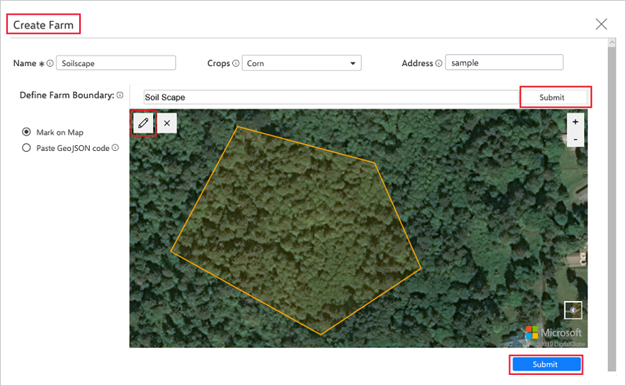
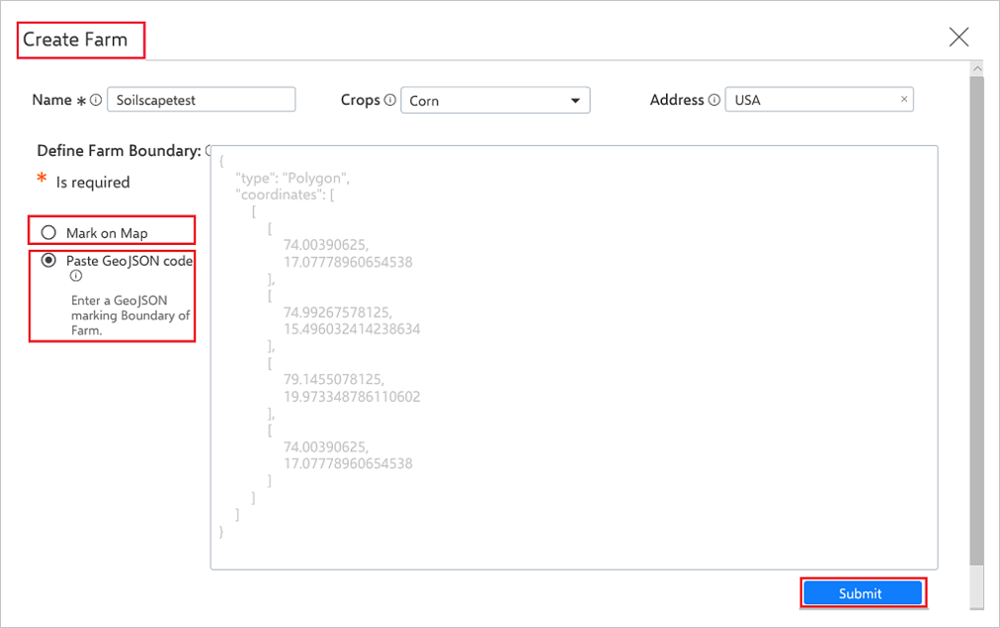
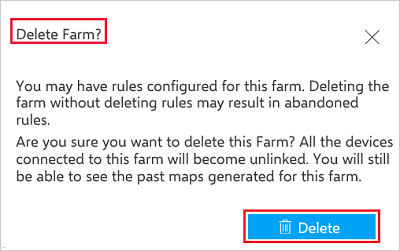

# Manage farms

You can manage your farms in Azure FarmBeats. This article provides the information about how to create farms, install devices, sensors, and drones that helps you manage your farms.

## Create farms

Use the following steps:

1. Login to the Farm Accelerator, the **Farms** page displays.
    The **Farms** page displays the list of farms in case they have already been created in subscription.

    Here is the sample image:

    

2. Select **Create Farm** and provide **Name**, **Crops** and **Address**.
3. In the **Define Farm Boundary**, (mandatory field) select either **Mark on Map** or **Paste GeoJSON code**.

Here are the two ways to define a farm boundary:

1. **Mark on Map**: Use the map control tool to draw and mark the boundary of the farm. To mark the boundaries,   and mark the exact boundaries.

    

2. **Paste GeoJson Code**: The GeoJSON is a format for encoding geographical data structures, using JavaScript Object Notation (JSON). This option displays a text box where a GeoJSON string can be entered to mark the farm boundaries. You can also create GeoJSON code from GeoJSON.io.
Use the tooltips to help fill in the information.

    

3.	Select **Submit** to create a farm. A new farm is created and displayed in the **Farms** page.

## View farm

The Farm list page displays a list of created farms. Select a farm to view the list of:

 - **Device count** — displays the number and status of devices deployed within the farm.
 - **Map** — map of the farm with the devices deployed in the farm.
 - **Telemetry** — displays the telemetry from the sensors deployed in the farm.
 - **Latest Precision Maps** — displays the latest Satellite Indices map (EVI, NDWI), Soil Moisture Heatmap and Sensor Placement map.

## Edit farm

The **Farms** page displays a list of created farms.

1.	Select a farm to view and edit the farm.
2.	Select **Edit Farm** to edit the farm information. In the **Farm Details** window, you can edit **Name**, **Crops**, **Address**, and define **Farm Boundary** fields.

    

3. Select **Submit** to save the details edited.

## Delete farm

The **Farms** page displays a list of farms created. Use the following steps to delete a farm:

1.	Select a farm from the list to delete farm details.
2.	Select **Delete Farm** to delete the farm.

    

    > [!NOTE]
    > When you delete a farm, the devices and maps associated with the farm aren’t deleted. Any farm information associated with the device and maps won’t be relevant. You can continue to view devices, telemetry and maps from the FarmBeats service.

## Next steps

Now that you have created your farm, learn how to [get sensor data](get-sensor-data-from-sensor-partner.md) flowing into your farm.
