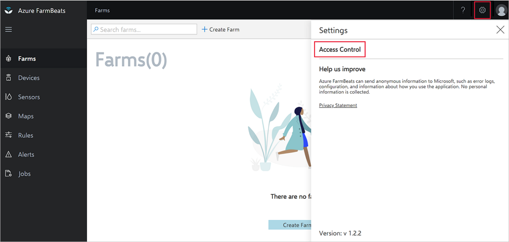
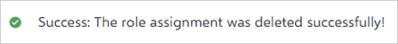
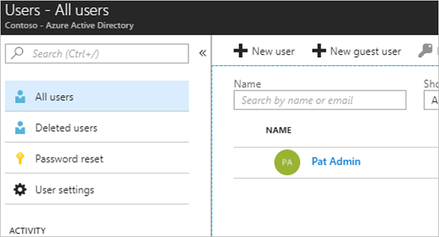

# Manage users

Azure FarmBeats includes user management for people who are part of your Microsoft Entra instance. You can add users to your Azure FarmBeats instance to access the APIs, view the generated maps, and access sensor telemetry from the farm.

## Prerequisites

- Azure FarmBeats installation is required. For more information, see [Install Azure FarmBeats](install-azure-farmbeats.md).
- The email IDs of the users you want to add or remove from your Azure FarmBeats instance.

## Manage Azure FarmBeats users

Azure FarmBeats uses Microsoft Entra ID for authentication, access control, and roles. You can add users in the Microsoft Entra tenant as users in Azure FarmBeats.

> [!NOTE]
> If a user is not a Microsoft Entra tenant user, follow the instructions in the **Add Microsoft Entra users** section to complete the setup.

Azure FarmBeats supports two types of user roles:

 - **Admin**: Complete access to Azure FarmBeats Datahub APIs. Users in this role can query all Azure FarmBeats Datahub objects and perform all operations from the FarmBeats Accelerator.
 - **Read-Only**: Read-only access to FarmBeats Datahub APIs. Users can view the Datahub APIs, the Accelerator Dashboards, and the maps. Users with read-only access can't perform operations such as generating maps, associating devices, or creating farms.

## Add users to Azure FarmBeats

To add users to Azure FarmBeats:

1. Sign in to Accelerator, and then select the **Settings** icon.
2. Select **Access Control**.

    

3. Enter the email ID of the user you want to grant access to.
4. Select the desired role, **Admin** or **Read-Only**.
5. Select **Add Role**.

The added user can now access Azure FarmBeats (both Datahub and Accelerator).

## Delete users from Azure FarmBeats

To remove users from the Azure FarmBeats system:

1. Sign in to Accelerator, and then select the **Settings** icon.
2. Select **Access Control**.
3. Select **Delete**.

   The user is deleted from the system. You'll receive the following confirmation message:

   

## Add Microsoft Entra users

> [!NOTE]
> Azure FarmBeats users need to exist in the Microsoft Entra tenant before you assign them to applications and roles. If a user doesn't exist in the Microsoft Entra tenant, follow the instructions in this section. Skip the instructions, if a user already exists in the Microsoft Entra tenant.

Follow the steps to add users to Microsoft Entra ID:

1. Sign in to the [Azure portal](https://portal.azure.com/).
2. At the top right, select your account, and then switch to the Microsoft Entra tenant that's associated with FarmBeats.
3. Select **Microsoft Entra ID** > **Users**.

    A list of Microsoft Entra users is displayed.

4. To add a user to the directory, select **New user**. To add an external user, select **New guest user**.

    

5. Select the new user's name, and then complete the required fields for that user.
6. Select **Create**.

For information about managing Microsoft Entra users, see [Add or delete users in Microsoft Entra ID](../../active-directory/fundamentals/add-users-azure-active-directory.md).

## Next steps

You have successfully added users to your Azure FarmBeats instance. Now, learn how to [create and manage farms](manage-farms-in-azure-farmbeats.md#create-farms).
