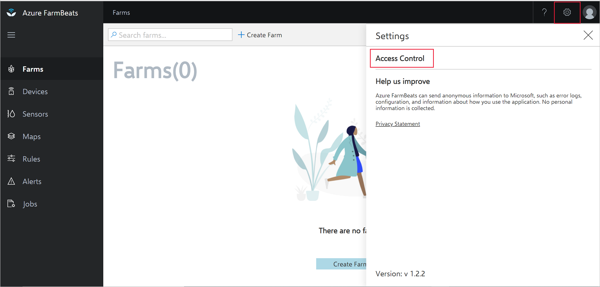
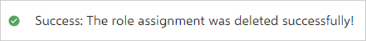
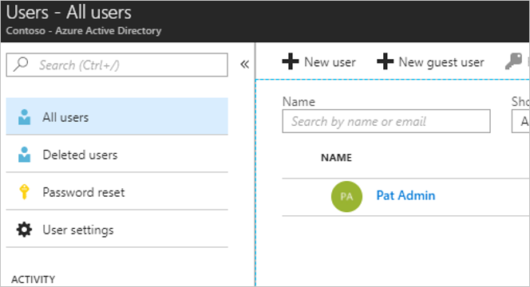

# Manage users

Azure FarmBeats includes user management for people who are part of your Azure Active Directory (Azure AD). You will be able to add users to your Azure FarmBeats instance to access the APIs, view the generated maps and sensor telemetry from the farm

## Prerequisites

- An Azure FarmBeats deployment is required. See [Deploy FarmBeats](prepare-for-deployment.md) to know more on how to setup Azure FarmBeats.
- The email ID of the users you want to add or remove from your Azure FarmBeats instance.

## Manage Azure FarmBeats users

Azure FarmBeats uses Azure AD for authentication, access control and roles. Users in the Azure AD tenant can be added as users in Azure FarmBeats.

> [!NOTE]
> If the user you are trying to add is not present in the Azure AD tenant, follow the instructions in the **Add Azure AD users** section to complete the setup, before proceeding to set them up as Azure FarmBeats users.

**Roles**

There are two kinds of user roles supported in Azure FarmBeats today:

 - **Admin** — All access to Azure FarmBeats Data hub APIs. Users in this role can query all  Azure FarmBeats Data hub objects, perform all operations from the FarmBeats Accelerator.
 - **Read-Only** — Read-only access to FarmBeats Data hub APIs. Users can view the Data hub APIs, the Accelerator Dashboards and the maps. A user with “Read-only” role will NOT be able to perform any operations like generate maps, associate devices or create farms.

## Add user to Azure FarmBeats

To add a user to Azure FarmBeats, 
1.	Sign in to the Accelerator and click on the Settings   icon
2.	Click on Access Control

    

3.	Enter the email ID of the user you want to give access to
4.	Select the desired role – Admin or Read-Only
5.	Click on Add Role

The added user(s) will now be able to access Azure FarmBeats (both Data hub and Accelerator).

## Delete user from Azure FarmBeats

To remove a user from the Azure FarmBeats system, you can
1.	Sign in to the Accelerator and click on the Settings icon
2.	Click on Access Control
3.	Click on the Delete Icon near the email ID of the user you want to remove

The user is removed from the system. You will receive the following message to confirm the successful operation

## Add Azure AD users

> [!NOTE]
> You will need to do the following steps, only if the user you are trying to provide access to Azure FarmBeats is not present in the Azure AD tenant. If the user is already present, the below steps need not be performed

FarmBeats users need to exist in the Azure AD   tenant before you can assign them to applications and roles. To add users to Azure AD, use the following steps:
1.	Sign in to the [Azure portal](https://portal.azure.com/).
2.	Select your account in the top-right corner, and switch to the Azure AD tenant associated to FarmBeats
3.	Select **Azure Active Directory > Users**. You see a list of users in your directory.
4.	To add users to the directory, select **New user**. For external users, select **New guest user**.

    

5.	Complete the required fields for the new user. Select **Create**.

Visit [Azure AD](https://docs.microsoft.com/azure/active-directory/fundamentals/add-users-azure-active-directory/) documentation for more details on how to manage users within Azure AD.

## Next steps

You have deployed Azure FarmBeats. Now, learn how to [create farms](manage-farms.md#create-farms).

