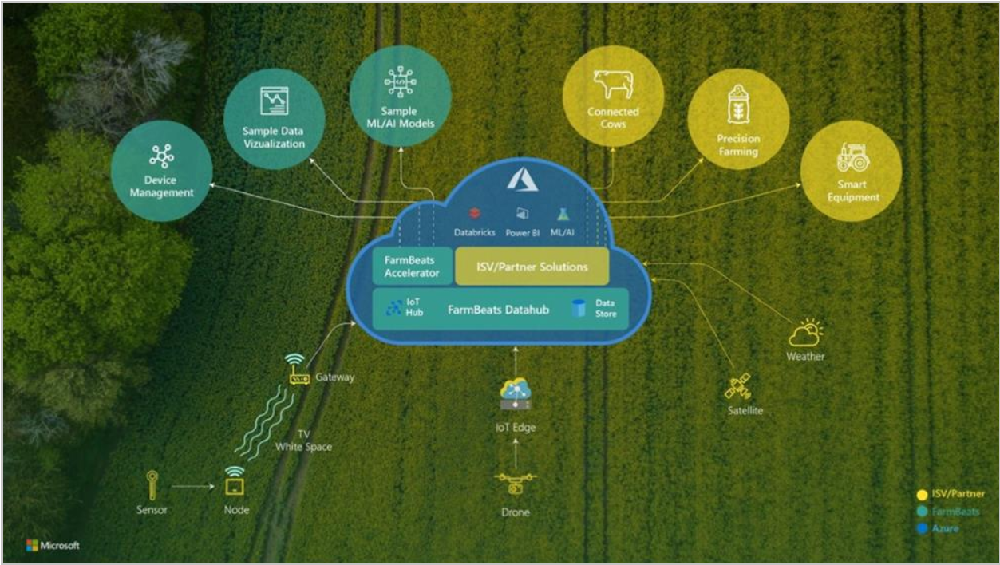

# Overview of Azure FarmBeats (Preview)

Azure FarmBeats is a business-to-business offering available in Azure Marketplace. It enables aggregation of agriculture data sets across providers. Azure FarmBeats enables you to build artificial intelligence (AI) or machine learning (ML) models based on fused data sets. By using Azure FarmBeats, agriculture businesses can focus on core value-adds instead of the undifferentiated heavy lifting of data engineering.

> [!NOTE]
> Azure FarmBeats is currently in public preview. For more information, see [Supplemental Terms of Use for Microsoft Azure Previews](https://azure.microsoft.com/support/legal/preview-supplemental-terms/). Azure FarmBeats is provided without a service level agreement. Use the [Azure FarmBeats Forum](https://aka.ms/FarmBeatsMSDN ) for support.

With the preview of Azure FarmBeats you can:

- Assess farm health using vegetation index and water index based on satellite imagery.
- Get recommendations on how many soil moisture sensors to use and where to place them.
- Track farm conditions by visualizing ground data collected by sensors from various vendors.
- Get soil moisture map based on the fusion of satellite and sensor data.
- Gain actionable insights by building AI/ML models on top of aggregated datasets.
- Build or augment your digital agriculture solution by providing farm health advisories.

## Datahub

The Azure FarmBeats Datahub is an API layer, which enables aggregation, normalization, and contextualization of various agriculture datasets across providers. You can use Azure FarmBeats to get:
- **Sensor data** from two sensor providers [Davis Instruments](https://www.davisinstruments.com/product/enviromonitor-gateway/), [Teralytic](https://teralytic.com/), [Pessl Instruments](https://metos.at/)
- **Satellite imagery** from European Space Agency's [Sentinel-2](https://sentinel.esa.int/web/sentinel/home) satellite mission
- **Drone imagery** from three drone imagery providers [senseFly](https://www.sensefly.com/) , [SlantRange](https://slantrange.com/) , [DJI](https://dji.com/)

Datahub is designed as an extensible API platform. We are working with many more providers to integrate with Azure FarmBeats, so you have more choice while building your solution.

## Accelerator

The Azure FarmBeats Accelerator is a sample web application, that is built on top of Datahub. The Accelerator jump-starts your user interface and model development. The Azure FarmBeats accelerator uses Azure FarmBeats' APIs. It visualizes ingested sensor data as charts and  model outputs as maps. For example, you can use the accelerator to create a farm quickly and get a vegetation index map or a sensor placement map for that farm easily.

## Role-based Access Control (RBAC)

An administrator can define access rules for Azure FarmBeats using one of the predefined roles. Roles determine what areas of the application a user has access to and what actions they can perform. There are two kinds of roles in Azure FarmBeats - for users and for partners.

### User Roles

An [administrator can add and manage users](manage-users-in-azure-farmbeats.md) and define their access levels based on two user roles: Admin and Read-Only.

### Partner Roles

An administrator can add multiple partners as data providers to Azure FarmBeats. The following summarize the available partner roles in FarmBeats and their permissions:

| Partner Type    |   Actions  | Scope |
| ---- | -------- | -------- |
| Sensor Partner  |   Create, Read, Update     Read, Update | DeviceModel, Device, SensorModel, Sensor     ExtendedType |
| Imagery Partner  |   Create, Read, Update     Read, Update     Read | Scene, SceneFile     ExtendedType     Farm |
| Weather Partner*      (* Coming soon) |   Create, Read, Update     Read, Update     Read | WeatherDataModel, WeatherDataLocation, JobType     ExtendedType     Farm |

## Resources

Azure FarmBeats is offered at no additional charge and you pay only for the Azure resources you use. You can use the below resources to know more about the offering:

- Stay informed about the latest Azure FarmBeats news by visiting our [Azure FarmBeats blog](https://aka.ms/farmbeatsblog).
- Seek help by posting a question on our [Azure FarmBeats support forum](https://aka.ms/farmbeatssupport).
- Provide feedback by posting or voting for a feature idea on our [Azure FarmBeats feedback forum](https://aka.ms/farmbeatsfeedback).

## Next steps

> [!div class="nextstepaction"]
> [Install Azure FarmBeats](install-azure-farmbeats.md)
