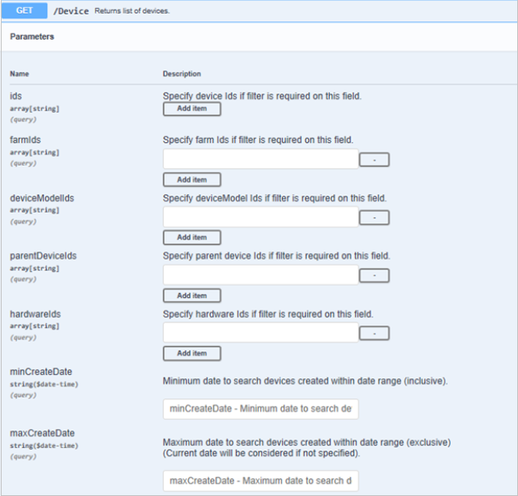

# References

Below are a collection of notes and instructions that outline the Azure FarmBeats APIs.

## REST API

The Azure FarmBeats APIs provide agricultural business with a standardized RESTful interface with JSON-based responses and this it will help you leverage Azure FarmBeats capabilities:

- API's to get sensor, camera, drone, weather, satellite, and curated ground data.
- Normalization/contextualization of data across common data providers.
- Schematized access and query capabilities on all ingested data.
- Automatic generation of metadata that can be queried, based on agronomic features.  
- Automatically generated time sequence aggregates for rapid model building.
- Integrated Azure Data Factory (ADF) engine to easily build custom data processing pipelines.

## Application development

The APIs contain Swagger technical documentation. See [Swagger](https://aka.ms/FarmBeatsDatahubSwagger) for information on all the APIs and their corresponding requests/responses.

This is a summary of all objects/resources in FarmBeats Data hub:

Farm | Farm corresponds to a physical location of interest within the FarmBeats system. Each Farm has a Farm name and a unique farm ID.
--- | ---|
Device  | Device corresponds to a physical device present in the farm. Each device has a unique device ID. Device is typically provisioned to a farm with a farm ID.
DeviceModel  | DeviceModel corresponds to the meta-data of the device such as the Manufacturer, Type of the device either Gateway or Node.
Sensor  | Sensor corresponds to a physical sensor that records values. A sensor is typically connected to a device with a device ID.
SensorModel  | SensorModel corresponds to the meta-data of the sensor such as the Manufacturer, Type of the sensor either Analog or Digital, Sensor Measure such as Ambient Temperature, Pressure etc.
Telemetry  | Telemetry provides the ability to read telemetry messages for a particular sensor and time range.
Job  | Job corresponds to any workflow of activities, which are executed in the FarmBeats system to get a desired output. Each job is associated with a job ID and job type.
JobType  | JobType corresponds to different job types supported by the system. This includes system defined & user-defined job types.
ExtendedType  | ExtendedType corresponds to the list of system & user-defined types in the system. This helps setup a new Sensor or Scene or Scenefile type in the FarmBeats system.
Partner  | Partner corresponds to the sensor/ imagery integration partner for FarmBeats
Scene  | Scene corresponds to any generated output in the context of a Farm. Each Scene has a scene ID, scene source, scene type and farm ID associated with it. Each scene ID can have multiple scene files associated with it.
SceneFile |SceneFile corresponds to all files, which are generated for single scene. A single scene ID can have multiple SceneFile IDs associated with it.
Rule  |Rule corresponds to a condition for farm-related data to trigger an alert. Each rule will be in the context of a farm's data.
Alert  | Alert corresponds to a notification, which gets generated when a rule condition is met. Each alert will be in the context of a rule.
RoleDefinition  | RoleDefinition defines allowed and disallowed actions for a role.
RoleAssignment  |RoleAssignment corresponds to the assignment of a role to a user or a service principal.

**Data format**

JSON (JavaScript Object Notation) is a common, language-independent data format that provides a simple text representation of arbitrary data structures. For more information, see json.org.

## Authentication and authorization

HTTP requests to the REST API are protected with Azure Active Directory (Azure AD).
To make an authenticated request to the REST APIs, client code requires authentication with valid credentials before you can call the API. Authentication is coordinated between the various actors by Azure AD, and provides your client with an access token as proof of the authentication. The token is then sent in the HTTP Authorization header of REST API requests. To learn more about Azure AD authentication, see [Azure Active Directory](https://portal.azure.com) for developers.

The access token needs to be sent in subsequent API requests in the header section as:

```
headers = {"Authorization": "Bearer " + **access_token**}
```

**HTTP request headers**

Here are the most common request headers that need to be specified when making an API call to Azure FarmBeats Data hub:


**Header** | **Description and example**
--- | ---
Content-Type  | The request format (Content-Type: application/<format>) For Azure FarmBeats Data hub APIs format is json. Content-Type: application/json
Authorization  | Specifies the access token required to make an API call. **Authorization: Bearer <Access-Token>**
Accept | The response format. For Azure FarmBeats Data hub APIs the format is json **Accept: application/json**

**API requests**

To make a REST API request, you combine the HTTP (GET, POST, PUT, or DELETE) method, the URL to the API service, the URI to a resource to query, submit data to, update, or delete, and one or more HTTP request headers.

The URL to the API service is your Data hub URL https://\<yourdatahub-website-name>.azurewebsites.net
Optionally, you can include query parameters on GET calls to filter, limit the size of, and sort the data in the responses.

The below sample request is to get the list of devices:

```azurepowershell-interactive
curl -X GET "https://microsoft-farmbeats.azurewebsites.net/Device" -H "Content-Type: application/json" -H "Authorization: Bearer <Access-Token>”
```

Most GET, POST, and PUT calls require a JSON request body.

The below sample request is to create a Device (This has an input json with the request body).

```json
curl -X POST "https://microsoft-farmbeats.azurewebsites.net/Device" -H  "accept: application/json" -H  "Content-Type: application/json" -H "Authorization: Bearer <Access-Token>" -d "{  \"deviceModelId\": \"ID123\",  \"hardwareId\": \"MHDN123\",  \"reportingInterval\": 900,  \"name\": \"Device123\",  \"description\": \"Test Device 123\",}"
```

**Query parameters**

For REST **GET** calls, you can filter, limit the size of, and sort the data in an API response by including one or more query parameters on the request URI. For the query parameters, refer to the API documentation and see the individual GET calls.
For example, when querying the list of devices (GET call on /Device), the following query parameters can be specified:  



**Error handling**

Azure FarmBeats Data hub API's return the standard HTTP errors. The most common error codes are as follows:

 |Error Code             | Description |
 |---                    | --- |
 |200                    | Success |
 |201                    | Create (Post) Success |
 |400                    | Bad Request. There is an error in the request |
 |401                    | Unauthorized. The caller of the API is not authorized to access the resource |
 |404                    | Resource Not Found |
 |5XX                    | Internal Server error. The error codes starting with 5XX means there is some error on the server. Refer to server logs and the following section for more details. |


In addition to the standard HTTP errors, Azure FarmBeats Data hub APIs also return internal errors in the below format:

    ```
    {
      "message": "<More information on the error>",
      "status": "<error code>”,
      "code": "<InternalErrorCode>",
      "moreInfo": "<Details of the error>"
    }
    ```

Example: When creating a Farm, a mandatory field “Name” was not specified in the input payload. The resulting error message would be:

    ```json
    {
      "message": "Model validation failed",
      "status": 400,
      "code": "ModelValidationFailed",
      "moreInfo": "[\"The Name field is required.\"]"
    }
    ```

## Adding users or app registrations to Azure Active Directory

Azure FarmBeats APIs can be accessed by a user or an app registration in the Azure Active Directory. To create an app registration on your Azure Active Directory, do the below steps:  

1. Go to [Azure portal](https://portal.azure.com) **Azure Active Directory, App registrations**, > **New registration**. Alternatively, you can use an existing account.
2. For a new account, ensure to complete the following:

    - Enter a name
    - Select **Accounts in this organizational directory only (Single tenant)**
    - The default values in the rest of the fields
    - Select **Register**

3. From the new/existing app registration, **Overview**, complete the following

    - Capture the **Client ID** and **Tenant ID**.
    - Go to **Certificates and Secrets** to generate a new client secret and capture the **Client-Secret**.
    - Go back to Overview and Click the link next to **Manage Application in local directory**
    - Go to **Properties** to capture the **Object ID**

4. Go to your [Data hub Swagger](https://<yourdatahub>.azurewebsites.net/swagger/index.html) and perform the following steps:
    - Navigate to **RoleAssignment API**
    - Perform a **POST** to create a RoleAssignment for the **Object ID** you just created. – The input json is:

  > [!NOTE]
  > For more information on adding users and AD registration, see [Azure Active Directory](https://docs.microsoft.com/azure/active-directory/develop/howto-create-service-principal-portal) .

After completing the above steps, your app registration (client) can call the Azure FarmBeats APIs using an access token via Bearer Authentication.  

Use the access token to send it in subsequent API requests in the header section as:

```
headers = {"Authorization": "Bearer " + **access_token**, "Content-Type" : "application/json" }
```
