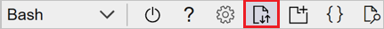
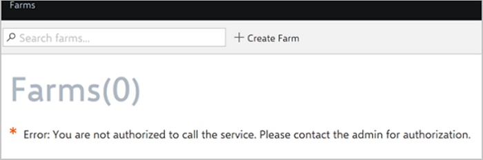
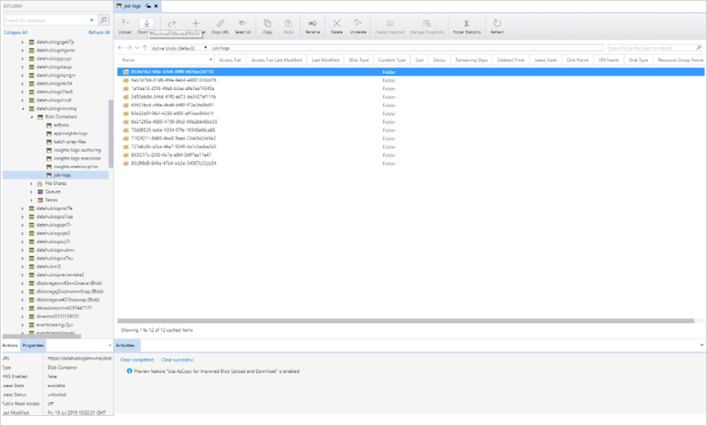

# Troubleshoot

This article provides solutions to common Azure FarmBeats issues.

For additional help, contact us at farmbeatssupport@microsoft.com. Be sure to include the **deployer.log** file in your email.

To download the **deployer.log** file, do the following:

1. Sign-in to **Azure portal** and select your subscription and Azure AD tenant.
2. Launch Cloud Shell from the top navigation of the Azure portal.
3. Select **Bash** as the preferred Cloud Shell experience.
4. Select the highlighted icon and then, in the drop-down list, select **Download**.

    

5. In the next pane, enter the path to your **deployer.log** file. For example, enter **farmbeats-deployer.log**.

## Sensor telemetry

### Can't view telemetry data

**Symptom**: Devices or sensors are deployed, and you've linked FarmBeats with your device partner, but you can't get or view telemetry data on FarmBeats.

**Corrective action**:

1. Go to your FarmBeats Datahub resource group.   
2. Select the **Event Hub** (DatafeedEventHubNamespace), and then check for the number of incoming messages.
3. Do either of the following:   
   - If there are *no incoming messages*, contact your device partner.  
   - If there are *incoming messages*, contact farmbeatssupport@microsoft.com. Attach your Datahub and Accelerator logs and captured telemetry.

To understand how to download logs, go to the ["Collect logs manually"](#collect-logs-manually) section.  

### Can't view telemetry data after ingesting historical/streaming data from your sensors

**Symptom**: Devices or sensors are deployed, and you've created the devices/sensors on FarmBeats and ingested telemetry to the EventHub, but you can't get or view telemetry data on FarmBeats.

**Corrective action**:

1. Ensure you have done the partner registration correctly - you can check this by going to your datahub swagger, navigate to /Partner API, Do a Get and check if the partner is registered. If not, please follow the [steps here](get-sensor-data-from-sensor-partner.md#enable-device-integration-with-farmbeats) to add partner.
2. Ensure that you have used the correct Telemetry message format:

```json
{
"deviceid": "<id of the Device created>",
"timestamp": "<timestamp in ISO 8601 format>",
"version" : "1",
"sensors": [
    {
      "id": "<id of the sensor created>",
      "sensordata": [
        {
          "timestamp": "< timestamp in ISO 8601 format >",
          "<sensor measure name (as defined in the Sensor Model)>": <value>
        },
        {
          "timestamp": "<timestamp in ISO 8601 format>",
          "<sensor measure name (as defined in the Sensor Model)>": <value>
        }
      ]
    }
 ]
}
```

### Don't have the Azure Event Hubs connection string

**Corrective action**:

1. In Datahub Swagger, go to the Partner API.
2. Select **Get** > **Try it out** > **Execute**.
3. Note the partner ID of the sensor partner you're interested in.
4. Go back to the Partner API, and select **Get/\<ID>**.
5. Specify the partner ID from step 3, and then select **Execute**.

   The API response should have the Event Hubs connection string.

### Device appears offline

**Symptoms**: Devices are installed, and you've linked FarmBeats with your device partner. The devices are online and sending telemetry data, but they appear offline.

**Corrective action**: The reporting interval isn't configured for this device. To set the reporting interval, contact your device manufacturer. 

### Error deleting a device

While you're deleting a device, you might encounter one of the following common error scenarios:  

**Message**: "Device is referenced in sensors: There are one or more sensors associated with the device. Delete the sensors and then delete the device."  

**Meaning**: The device is associated with multiple sensors that are deployed in the farm.   

**Corrective action**:  

1. Delete the sensors that are associated with the device through Accelerator.  
2. If you want to associate the sensors with a different device, ask your device partner to do the same.  
3. Delete the device by using a `DELETE API` call, and set the force parameter as *true*.  

**Message**: "Device is referenced in devices as ParentDeviceId: There are one or more devices that are associated with this device as child devices. Delete them, and then delete this device."  

**Meaning**: Your device has other devices associated with it.  

**Corrective action**

1. Delete the devices that are associated with this specific device.  
2. Delete the specific device.  

    > [!NOTE]
    > You can't delete a device if sensors are associated with it. For more information about how to delete associated sensors, see the "Delete sensor" section in [Get sensor data from sensor partners](get-sensor-data-from-sensor-partner.md).


## Issues with jobs

### FarmBeats internal error

**Message**: "FarmBeats internal error, see troubleshooting guide for more details."

**Corrective action**:
This issue might result from a temporary failure in the data pipeline. Create the job again. If the error persists, add the error message in a post on the FarmBeats forum, or contact FarmBeatsSupport@microsoft.com.

## Accelerator troubleshooting

### Access control

**Issue**: You receive an error while you're adding a role assignment.

**Message**: "No matching users found."

**Corrective action**: Check the email ID for which you're trying to add a role assignment. The email ID must be an exact match of the ID that's registered for that user in the Active Directory. If the error persists, add the error message in a post on the FarmBeats forum, or contact FarmBeatsSupport@microsoft.com.

### Unable to log in to Accelerator

**Message**: "Error: You are not authorized to call the service. Contact the admin for authorization."

**Corrective action**: Ask the admin to authorize you to access the FarmBeats deployment. This can be done by doing a POST of the RoleAssignment APIs or through the Access Control in the **Settings** pane in Accelerator.  

If you've already been granted access and are facing this error, try again by refreshing the page. If the error persists, add the error message in a post on the FarmBeats forum, or contact FarmBeatsSupport@microsoft.com.



### Accelerator issues  

**Issue**: You've received an Accelerator error of undetermined cause.

**Message**: "Error: An unknown error occurred."

**Corrective action**: This error occurs if you leave the page idle for too long. Refresh the page.  

If the error persists, add the error message in a post on the FarmBeats forum, or contact FarmBeatsSupport@microsoft.com.

**Issue**: FarmBeats Accelerator isn't showing the latest version, even after you've upgraded FarmBeatsDeployment.

**Corrective action**: This error occurs because of service worker persistence in the browser. Do the following:
1. Close all browser tabs that have Accelerator open, and close the browser window.
2. Start a new instance of the browser, and reload the Accelerator URI. This action loads the new version of Accelerator.

## Sentinel: Imagery-related issues

### Wrong username or password

**Job failure message**: "Full authentication is required to access this resource."

**Corrective action**:

Do one of the following:
- Rerun the installer for upgrading Datahub with the correct username and password.
- Rerun the failed job, or run a satellite indices job for a date range of 5 to 7 days, and then check to see whether the job is successful.

### Sentinel hub: Wrong URL or site not accessible 

**Job failure message**: "Oops, something went wrong. The page you were trying to access is (temporarily) unavailable." 

**Corrective action**:
1. Open [Sentinel](https://scihub.copernicus.eu/dhus/) in your browser to see whether the website is accessible. 
2. If the website isn't accessible, check to see whether any firewall, company network, or other blocking software is preventing access to the website, and then take the necessary steps to allow the Sentinel URL. 
3. Rerun the failed job, or run a satellite indices job for a date range of 5 to 7 days, and then check to see whether the job is successful.  

### Sentinel server: Down for maintenance

**Job failure message**: "The Copernicus Open Access Hub will be back soon! Sorry for the inconvenience, we're performing some maintenance at the moment. We'll be back online shortly!" 

**Corrective action**:

This issue can occur if any maintenance activities are being done on the Sentinel server.

1. If any job or pipeline fails because maintenance is being performed, resubmit the job after some time. 

   For information about any planned or unplanned Sentinel maintenance activities, go to the [Copernicus Open Access Hub News](https://scihub.copernicus.eu/news/) site.  
2. Rerun the failed job, or run a satellite indices job for a date range of 5 to 7 days, and then check to see whether the job is successful.

### Sentinel: Maximum number of connections reached

**Job failure message**: "Maximum number of two concurrent flows achieved by the user '\<username>'."

**Meaning**: If a job fails because the maximum number of connections has been reached, the same Sentinel account is being used in another software deployment.

**Corrective action**:
Try either of the following:
* Create a new Sentinel account, and then rerun the installer to upgrade Datahub by using a new Sentinel username and password.  
* Rerun the failed job or run a satellite indices job for a date range of 5 to 7 days, and then check to see whether the job is successful.

### Sentinel server: Refused connection 

**Job failure message**: "Server refused connection at: http://172.30.175.69:8983/solr/dhus." 

**Corrective action**: This issue can occur if any maintenance activities are being done on the Sentinel server. 
1. If any job or pipeline fails because maintenance is being performed, resubmit the job after some time. 

   For information about any planned or unplanned Sentinel maintenance activities, go to the [Copernicus Open Access Hub News](https://scihub.copernicus.eu/news/) site.  
2. Rerun the failed job, or run a satellite indices job for a date range of 5 to 7 days, and then check to see whether the job is successful.

## Collect logs manually

[Install and deploy Azure Storage Explorer]( https://docs.microsoft.com/azure/vs-azure-tools-storage-manage-with-storage-explorer?tabs=windows).

### Collect Azure Data Factory job logs in Datahub
1. Sign in to the [Azure portal](https://portal.azure.com).
2. In the **Search** box, search for the FarmBeats Datahub resource group.

    > [!NOTE]
    > Select the Datahub resource group that you specified during FarmBeats installation.

3. On the **Resource Group** dashboard, search for the *datahublogs\** storage account. For example, search for **datahublogsmvxmq**.  
4. In the **Name** column, select the storage account to view the **Storage Account** dashboard.
5. In the **datahubblogs\*** pane, select **Open in Explorer** to view the **Open Azure Storage Explorer** application.
6. In the left pane, select **Blob Containers**, and then select **job-logs**.
7. In the **job-logs** pane, select **Download**.
8. Download the logs to a local folder on your machine.
9. Email the downloaded .zip file to farmbeatssupport@microsoft.com.

    

### Collect Azure Data Factory job logs in Accelerator

1. Sign in to the [Azure portal](https://portal.azure.com).
2. In the **Search** box, search for the FarmBeats Accelerator resource group.

    > [!NOTE]
    > Select the Accelerator resource group that you specified during FarmBeats installation.

3. On the **Resource Group** dashboard, search for the *storage\** storage account. For example, search for **storagedop4k\***.
4. Select the storage account in the **Name** column to view the **Storage Account** dashboard.
5. In the **storage\*** pane, select **Open in Explorer** to open the Azure Storage Explorer application.
6. In the left pane, select **Blob Containers**, and then select **job-logs**.
7. In the **job-logs** pane, select **Download**.
8. Download the logs to a local folder on your machine.
9. Email the downloaded .zip file to farmbeatssupport@microsoft.com.


### Collect Datahub app service logs

1. Sign in to the [Azure portal](https://portal.azure.com).
2. In the **Search** box, search for the FarmBeats Datahub resource group.

    > [!NOTE]
    > Select the Datahub resource group that you specified during FarmBeats installation.

3. In the resource group, search for the *datahublogs\** storage account. For example, search for **fordatahublogsmvxmq\***.
4. Select the storage account in the **Name** column to view the **Storage Account** dashboard.
5. In the **datahubblogs\*** pane, select **Open in Explorer** to open the Azure Storage Explorer application.
6. In the left pane, select **Blob Containers**, and then select **appinsights-logs**.
7. In the **appinsights-logs** pane, select **Download**.
8. Download the logs to a local folder on your machine.
9. Email the downloaded .zip file to farmbeatssupport@microsoft.com.

### Collect Accelerator app service logs

1. Sign in to the [Azure portal](https://portal.azure.com).
2. In the **Search** box, search for the FarmBeats Accelerator resource group.

    > [!NOTE]
    > Select the FarmBeats Accelerator resource group that was provided during FarmBeats installation.

3. In the resource group, search for the *storage\** storage account. For example, search for **storagedop4k\***.
4. Select the storage account in the **Name** column to view the **Storage Account** dashboard.
5. In the **storage\*** pane, select **Open in Explorer** to open the Azure Storage Explorer application.
6. In the left pane, select **Blob Containers**, and then select **appinsights-logs**.
7. In the **appinsights-logs** pane, select **Download**.
8. Download the logs to a local folder on your machine.
9. Email the downloaded folder to farmbeatssupport@microsoft.com.

## Known issues

## Batch-related issues

**Error message**: "The regional account quota of Batch Accounts for the specified subscription has been reached."

**Corrective action**: Increase the quota, or delete the unused batch accounts and rerun the deployment.

### Azure Active Directory (Azure AD)-related issues

**Error message**: "Could not update required settings to Azure AD App d41axx40-xx21-4fbd-8xxf-97xxx9e2xxc0: Insufficient privileges to complete the operation. Ensure that above settings are configured properly for the Azure AD App."

**Meaning**: The Azure AD app registration configuration wasn't completed properly.  

**Corrective action**: Ask the IT admin (the person with tenant read access) to use our [script](https://github.com/Azure-Samples/active-directory-dotnet-webapp-openidconnect/tree/master/AppCreationScripts) for creating the Azure AD app registration. This script automatically takes care of the configuration steps as well.

**Error message**: "Could not create new Active Directory Application '\<application name\>' in this tenant: Another object with the same value for property identifier URIs already exists."

**Meaning**: An Azure AD app registration with the same name already exists.

**Corrective action**: Delete the existing Azure AD app registration, or reuse it for installation. If you're reusing the existing Azure AD app registration, pass the application ID and client secret to the installer and redeploy.

## Issues with the input.json file

**Error**: There's an error reading input from the *input.json* file.

**Corrective action**: This issue usually arises because of an error in specifying the correct *input.json* file path or name to the installer. Make appropriate corrections, and retry the deployment.

**Error**: There's an error parsing values in the *input.json* file.

**Corrective action**: This issue mostly arises due to incorrect values within the *input.json* file. Make appropriate corrections, and retry the deployment.

## High CPU usage

**Error**: You get an email alert that refers to a **High CPU Usage Alert**. 

**Corrective action**: 
1. Go to your FarmBeats Datahub resource group.
2. Select the **App service**.  
3. Go to the scale up [App Service pricing page](https://azure.microsoft.com/pricing/details/app-service/windows/), and then select an appropriate pricing tier.

## Next steps

If you're still facing FarmBeats issues, contact our [Support Forum](https://social.msdn.microsoft.com/Forums/home?forum=ProjectFarmBeats).
