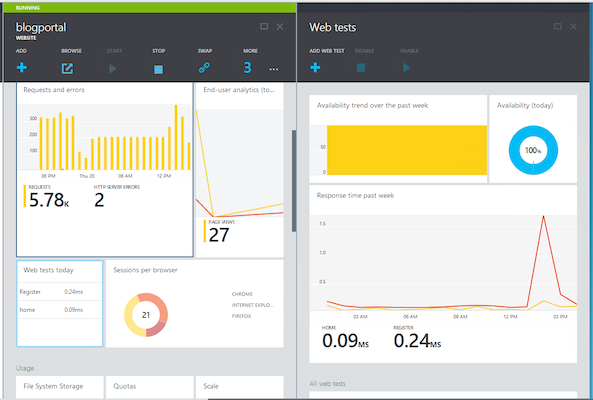
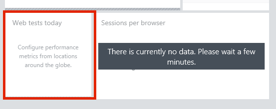
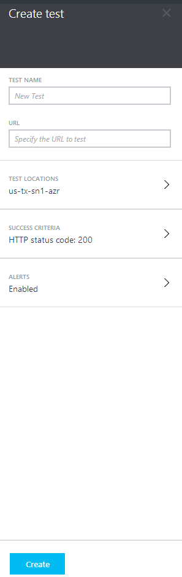
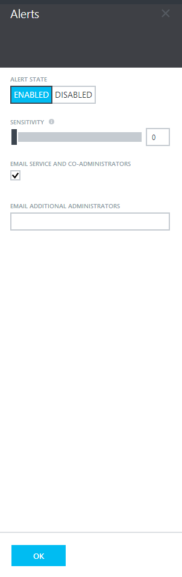
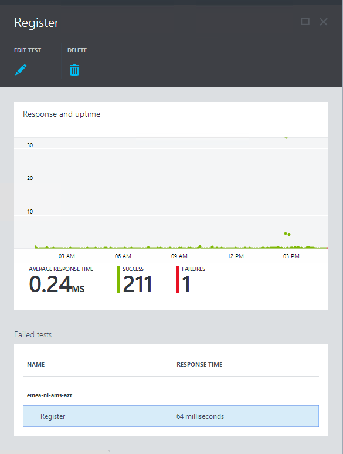
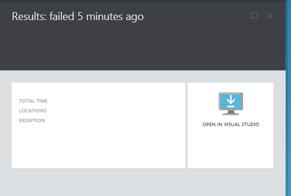

<properties pageTitle="How to create web test" description="Learn how to create web tests in Azure." authors="awills" manager="kamrani"/>

<tags ms.service="application-insights" ms.workload="tbd" ms.tgt_pltfrm="ibiza" ms.devlang="na" ms.topic="article" ms.date="2015-01-17" ms.author="awills"/>

# Web tests for Microsoft Azure Websites
Is your Azure Website still running? Is it responding properly, and fast enough? Tests your website at regular intervals by configuring a Web test. If the site goes down or responds slowly or incorrectly, you'll receive an email alert. And you'll get graphs showing its availability and responsiveness over time.  

*Want to test any other website? Use [Application Insights web tests][availability] for non-Azure web apps.*

You can set up availability monitoring for any Azure Website that is using a Basic or Standard plan.  You can create up to 3 Web tests and run each of these tests from up to 3 geographic locations. You don't have to alter the website in any way.

You can also pause web tests during deployments or known outages so your overall availability isn't affected.  Overall availability is calculated over all the web tests including the different locations selected.

## How to set up a web test
1. To configure a web test, first ensure your website is either **Basic** or **Standard**.
2. Then, choose the **Web Test** part on the **Web site** blade:  
    
3. In the **Create web test** blade, name the web test and specify the URL to run the test against.  
    
4. Then choose up to 3 out of the 8 locations
5. Specify the criteria for success including HTTP status code checks or string contains on the site itself.
6. Then choose alert settings including the sensitivity and who to email.  
    
    - High sensitivity will create an alert whenever a test failure is detected in just 1 location.
    - Medium sensitivity requires at least half of the locations have seen a failure in 10 minutes.
    - Low sensitivity requires that the test at all locations have failed within 15 minutes.

Once you are done click in the **Create** button. After your web test can been created, it will execute every 5 mins from the location(s) specified, so it may take a little while for the data to show up.

### What are the locations about?
We send a request to the website from those locations, in the same way that users will access the site from different parts of the world. If your site becomes unavailable in the USA but still available in Europe, you'll know that the problem is a network issue, rather than in your server.

### Using Success Criteria
Typically you'll want to test that the HTTP status code equals 200, which signals that the server recognized the URI and returned a page.

You cannot use wildcards in the content match string, but you can test any plain text.

## Uh oh - my site is down!
If your web test doesn't pass the success criteria then it will be marked as a failed test and reduce the overall availability for your web site. Failed tests (As well as successful tests) are shown on a scatter chat on the specific web test blade.  

Failed tests can be analyzed to determine why they failed.  Drill into a failed web test and download and open Visual Studio Web Test Result File to analyze and understand why the test failed.

## Get more Application Insights

* [Monitor usage][azure-usage] to find out how many users you have, how often they visit, and how the pages perform on their browsers
* [Monitor performance][azure-perf] to diagnose issues with your code's dependencies

[azure-perf]: ../insights-perf-analytics/
[azure-usage]: ../insights-usage-analytics/
[azure-availability]: ../insights-create-web-tests/
[availability]: ../app-insights-monitor-web-app-availability/
