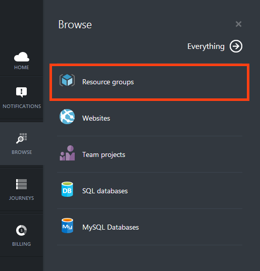
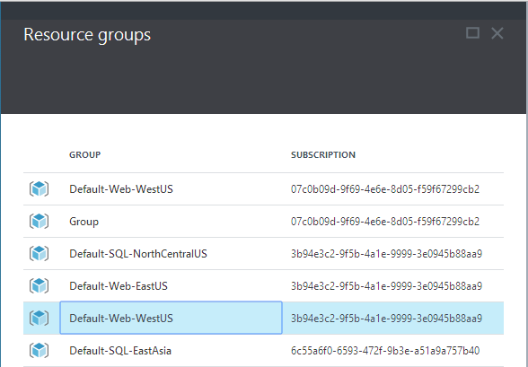
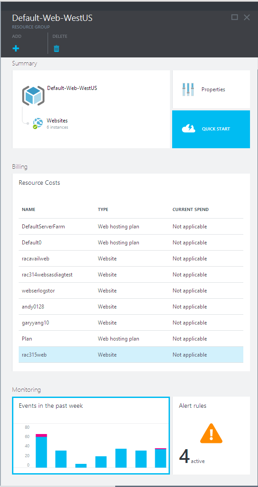
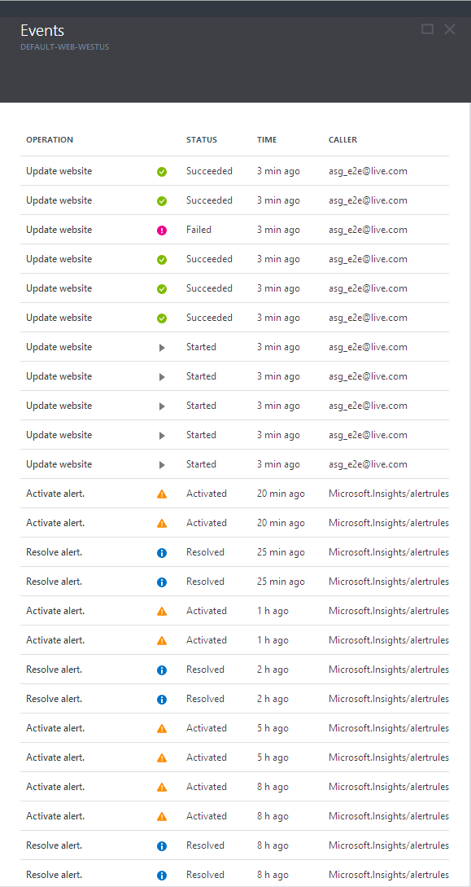
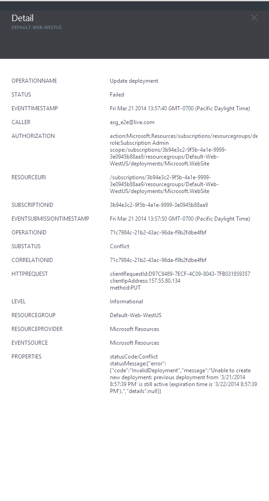

<properties title="" pageTitle="How to debug with events" description="Learn how to see events in Azure." authors="HaniKN-MSFT" manager="kamrani" editor="" services="application-insights" documentationCenter="" metaKeywords=""/>

<tags ms.service="application-insights" ms.workload="tbd" ms.tgt_pltfrm="ibiza" ms.devlang="na" ms.topic="article" ms.date="11/24/2014" ms.author="hanikn" />

# Monitor the events impacting your Azure resources or resource groups

1. Sign in to the [Azure Portal Preview](https://portal.azure.com/).
2. Click on the **Browse** button on the left-hand-side navigation bar (also known as the **jump bar**).  
    
3. Then choose any resource (depending on which events you are interested in). For illustration purposes, the screenshots in this document include the Event for resource groups.
4. On the **Resource groups** blade, click on the name of the resource group. This will navigate you to the resource group blade.  
    
5. The resource group blade includes a part called **Events in the past week**. Each of the bars on that part, represent the number of events that have happened on each of days of the past week. Each of bars can have two different colors: blue and pink. Pink represents **Failed** events on that day, and blue represents all other events.  
    
6. Now, click on the **Events in the past week** part. You will see, a new blade called the **Events** blade that include all of the events in the past week that impacted your resource group.
    
7. Click on one of the events.  
      
    A new blade will open that includes a lot of details about the event. For **Failed** events, this page usually includes a **Substatus** and a **Properties** section that include useful details for debugging purposes.

