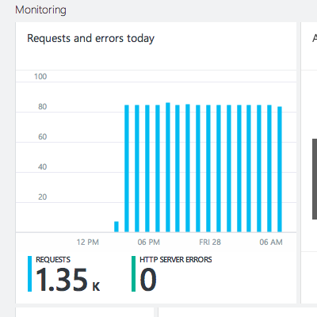
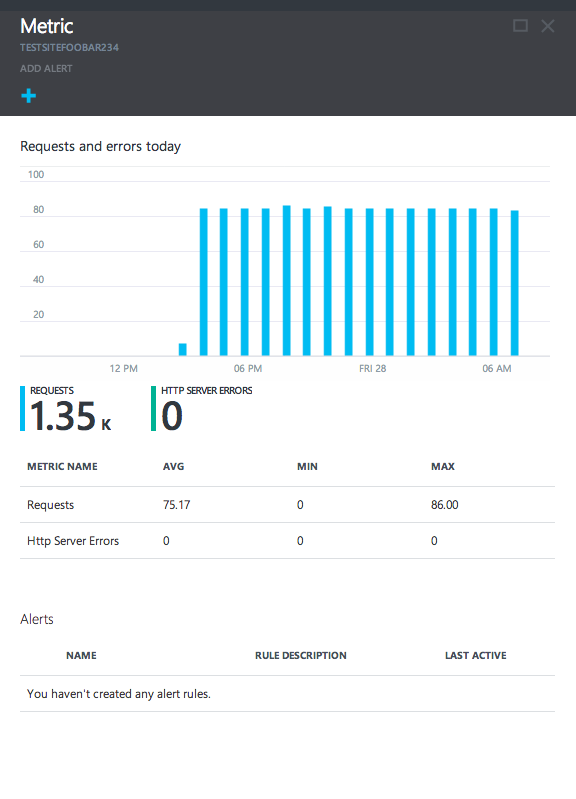
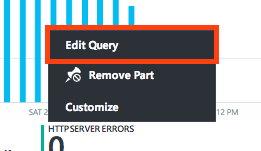
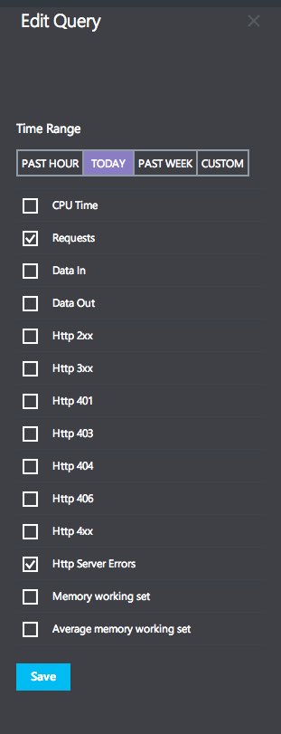
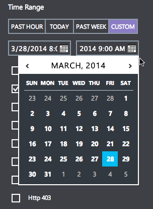
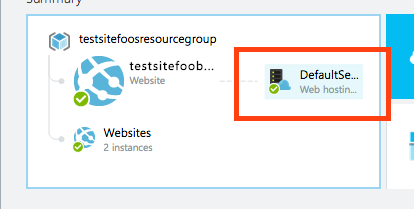
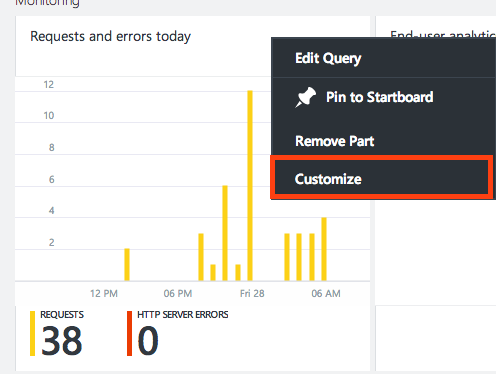
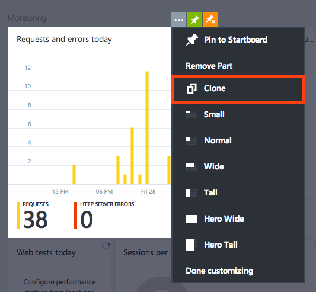
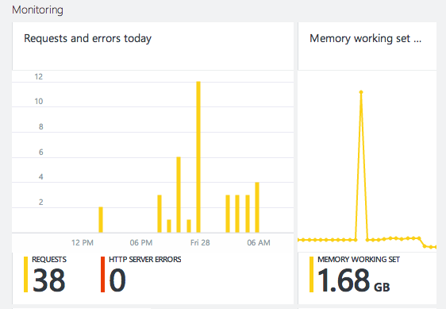

<properties title="" pageTitle="How to customize monitoring" description="Learn how to customize monitoring charts in Azure." authors="alancameronwills" manager="kamrani" editor="" services="application-insights" documentationCenter="" metaKeywords=""/>

<tags ms.service="application-insights" ms.workload="tbd" ms.tgt_pltfrm="ibiza" ms.devlang="na" ms.topic="article" ms.date="2014-11-04" ms.author="awills" />

# Customizing monitoring

Your Azure application has a variety of metrics you can monitor, and you can chart them over a time period you choose.

1. In the [Azure Portal Preview](https://portal.azure.com/), click **Browse**, then a resource you're interested in monitoring.
2. The **Monitoring** lens contains the most important metrics for each Azure resource. For example, Web sites has Requests, Errors, [Web tests](http://go.microsoft.com/fwlink/?LinkID=394528&clcid=0x409), and [Analytics](http://go.microsoft.com/fwlink/?LinkID=394529&clcid=0x409). Clicking on the **Requests and errors today** part will show you the **Metric** blade.  
    
3. The **Metric** blade shows you details about metrics that you select. At the top of the blade is a graph, below that a table that shows you aggregation of those metrics, such as average, minimum and maximum. Below that is a list of the alerts youve defined, filtered to the metrics that appear on the blade. This way, if you have a lot of alerts, youll only see the relevant ones here. You can still see all of the alerts for your web site by clicking on the **Alert rules** part on the **Web site** blade.  
    
4. To customize the metrics that appear, right click on the chart and select **Edit Query**:  
    
5. On the Edit Query blade you can do two things: change the time range and chose different metics.  
    
6. Changing the time range is as easy as selecting a different range (such as **Past Hour**) and clicking **Save** at the bottom of the blade. New in the Portal Preview, you can choose **Custom**:  
    
7. Custom allows you to choose any period of time over the past 2 weeks, for example, you can see the whole two weeks, or, just 1 hour from yesterday. Type in the text box to enter a different hour.
8. Below the time range, you chan choose any number of metrics to show on the chart. You can see some new Metrics: **Memory working set** and **Average memory working set**.

9. When you click Save your changes will persist until you leave the Web site blade. When you come back later, you'll see the original metric and time range again.

## Monitoring for new resources

New in the Azure Portal Preview is the ability to monitor performance metrics for a variety of new Resources, including:
- Web hosting plans
- Redis cache
- DocumentDB account

Web hosting plans are a little more complicated than other resources, because the represent the performance of the instances that your **websites** run on. To access Web hosting plan metrics, click on the Web hosting plan icon in the Summary lens for your website.

There you can see a chart in the **Monitoring** lens that behaves just like the chart in the Web site blade, except you can see the new metrics:

- CPU Percentage
- Memory Percentage
- HTTP Queue Depth
- Disk Queue Depth

## Creating side-by-side charts

With the powerful user customization in the Azure Portal Preview you can create side-by-side charts for customization.

1. First, right click on the chart you want to start from and select **Customize**  
    
2. Then click **Clone** on the **...** menu to copy the part  
    
3. Finally, click **Done** on the toolbar at the top of the screen. You can now treat this part like a normal metric part. If you right click and change the metric that is displayed, you can see two different metrics side-by-side at the same time:  
    

Note, that the chart time range and chosen metrics will reset when you leave the portal.

