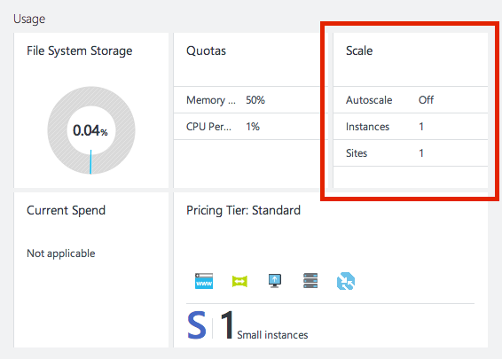
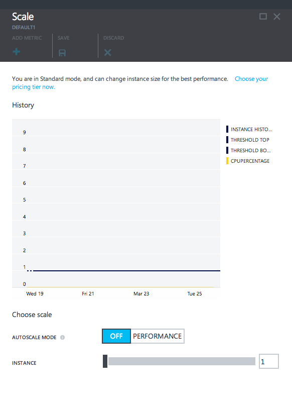
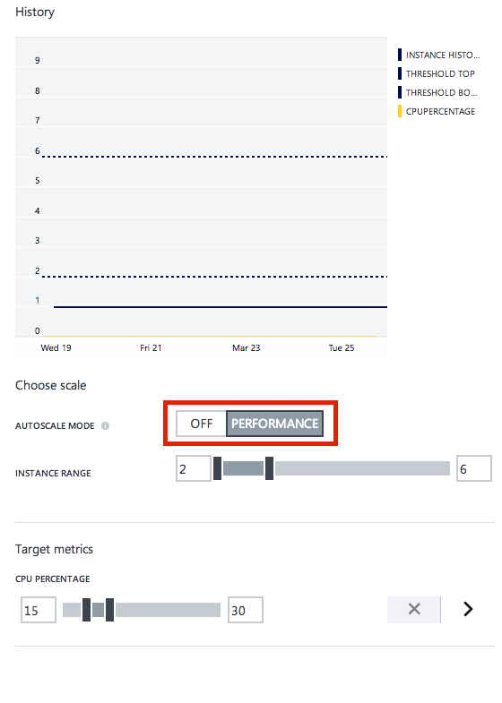
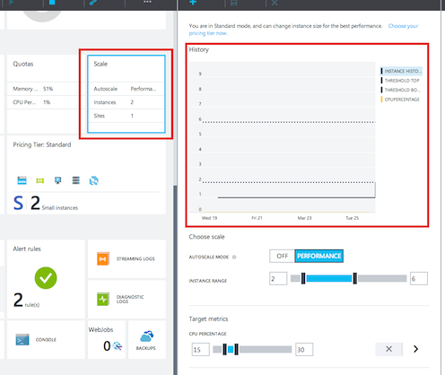
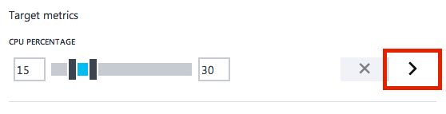
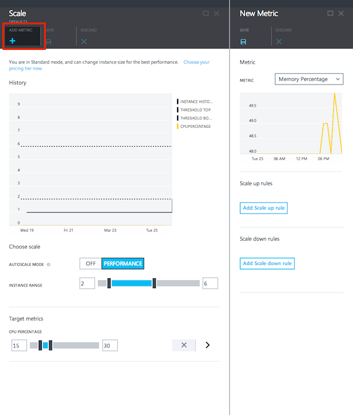
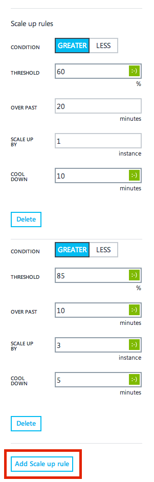

<properties 
	pageTitle="How to scale a website" 
	description="Learn how to scale your hosting plan in Azure." 
	authors="stepsic-microsoft-com" 
	manager="kamrani" 
	editor="" 
	services="application-insights" 
	documentationCenter=""/>

<tags 
	ms.service="application-insights" 
	ms.workload="tbd" 
	ms.tgt_pltfrm="ibiza" 
	ms.devlang="na" 
	ms.topic="article" 
	ms.date="2014-11-04" 
	ms.author="stepsic"/>

# How to Scale a Website

In the Azure Portal Preview, you can manually set the instance count of your Web Hosting Plan, or, you can set parameters to have it automatically scale. Before you configure scaling for your Web Hosting Plan, you should consider that scaling is affected by instance size. Larger sizes have more cores and memory, and so they will have better performance for the same number of instances.

Scale affects an entire Web Hosting Plan. When you create a Website you have the option to create a new Web Hosting Plan or an existing Web Hosting Plan. Once you have a Web Hosting Plan, all of the sites will share the same instances, so they all scale together.

## Scaling a Web Hosting Plan

1. In the [Azure Portal Preview](https://portal.azure.com/), click **Browse**, then **Web Sites**, and then click the name of the Web Site to open the blade.
2. The **Scale** part on **Operations** lens of the Web Site blade will tell you the status of the Web Hosting Plan: **Off** for when you are scaling manually, **Performance** for when you are scaling by one or more performance metrics, and **Schedule** for when you have enabled multiple autoscale profiles.  
    
3. Clicking on the part will take you to the **Scale** blade. At the top of the scale blade you can see a history of autoscale actions for your Web Hosting Plan.  

    
4. You can manually adjust the number of virtual machines that run your Web Hosting Plan with the **Instance** slider.
5. If you want the number of instances to automatically adjust based on load, select **Performance** under **Autoscale Mode**. At this time you cannot select **Schedule** in the Azure Portal Preview.  
     
6. Once you select Performance, there are two changes:
    - **Instance Range** now allows you to choose a maximum and minimum instance count. Autoscale will always keep you in this range, irrespective of load.
    - You can define the performance metrics in the **Target Metrics** section
7. The **CPU Percentage** section allows you to set a target for the average CPU across all of the instances in your Web Hosting Plan. A scale up will happen when the average CPU exceeds the maximum you define.

With auto scale enabled, you'll see **Performance** in the part on the Website blade, and, you'll see your scale history in the chart:

 

Note that in the Azure Portal Preview, you cannot change the number of instances of a Shared Web Hosting Plan.

## Advanced scaling

New in the Azure Portal Preview, you can scale based on metrics other than CPU Percentage, and can even have a complex set of scale up and scale down rules.

### Scaling based on other performance metrics
In addition to CPU, you can scale based on:

- Average Memory - If the average percentage of Memory used on the instances goes above or below specified thresholds, instances are added or removed.
- HTTP Queue Depth or Disk Queue Depth - If the number of messages in either queue the of HTTP requests or the Disk goes above or below a specified threshold, instances are added or removed.

There are two different ways to scale by another metric. If you want to only scale by a single metric, select the chevron next to the **CPU Percentage** slider. This will open the Metric Details blade:

To scale by more than one metric at a time, you can click **Add Metric** in the command bar:

The Metric Detail blade contains all of the controls that you need to set up your optimal scale profile. At the top, choose the new metric that you want to scale by.

### Scaling with multiple steps

Below the graph of the metric are two sections: **Scale up rules** and **Scale down rules**. Your service will scale up if **any** of the scale up rules are met. Conversely, your service will scale down if **all** of the scale down rules are met.

For each rule you choose:

- Condition - either Greater than or Less than
- Threshold - the number that this metric has to pass to trigger the action
- Over Past - the number of minutes that this metric is averaged over
- Scale up or down by - the size of the scale action
- Cool down - how long this rule should wait after the previous scale action to scale again

With multiple scale rules, you can be more agressive about scaling up (or down) as performance changes. For example, you can define two scale rules:

1. Scale up by 1 instance if CPU percentage is above 60%
2. Scale up by 3 instances if CPU percentage is above 85%

With this additional rule, if your load exceeds 85% before a scale action, you will get two additional instances instead of one. 